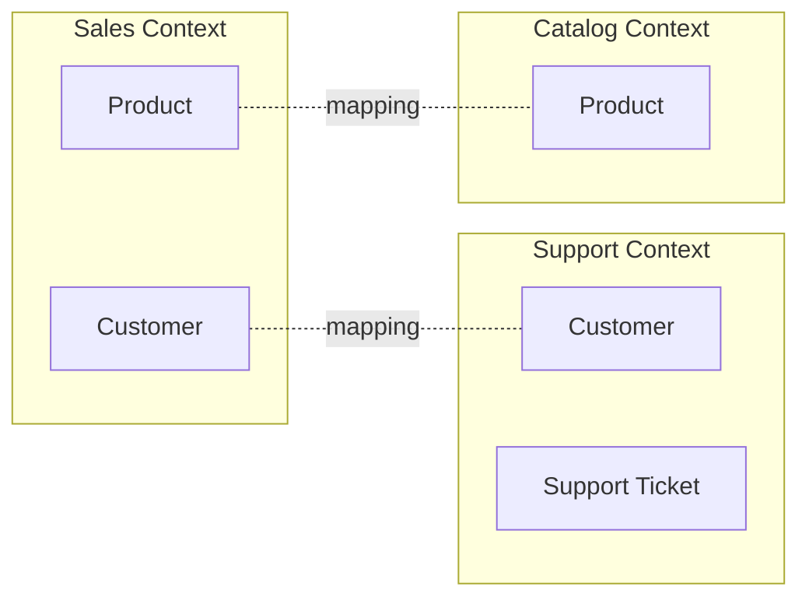

# Bounded Context

## 要約

境界づけられたコンテキストは、あるモデルや言葉が有効に通じる範囲を明確にするDDDの中心概念です。
同じ言葉でも部署や業務領域が違えば意味が変わるため、ひとつの巨大な統一モデルにするとかえって混乱します。

コンテキストを分けることは、単なるシステム分割ではなく、言葉、責務、チーム、データの境界を揃える設計判断です。
マイクロサービスやモジュール分割を考える前に、まずモデルの境界として読むと理解しやすいです。

## 読むときの観点

- 同じ用語が領域ごとに違う意味を持っていないかを見る。
- コンテキスト境界とチーム境界の関係を考える。
- 境界を越える翻訳や連携の責務を意識する。
- システム分割より先に、モデルの有効範囲を考える。

## 原文の翻訳

**境界づけられたコンテキスト**は、ドメイン駆動設計における中心的なパターンです。
これは DDD の戦略的設計の中心であり、大きなモデルと大きなチームをどう扱うかに関わります。
DDD は、大きなモデルを複数の境界づけられたコンテキストへ分割し、それらの相互関係を明示することで扱います。

DDD は、対象ドメインのモデルにもとづいてソフトウェアを設計することです。
モデルは、ソフトウェア開発者とドメイン専門家のコミュニケーションを助ける**ユビキタス言語**として機能します。
また、ソフトウェアそのものをどう設計するか、つまりオブジェクトや関数へどのように分解するかの概念的な土台にもなります。
モデルが有効であるためには、統一されている必要があります。
つまり、内部的に一貫しており、その中に矛盾がない必要があります。

より大きなドメインをモデル化しようとすると、単一の統一モデルを作ることは次第に難しくなります。
大きな組織の別々の部分では、異なる人々の集団が、微妙に異なる語彙を使います。
**モデリングの精密さはすぐにこの問題にぶつかり**、多くの場合、大きな混乱を生みます。
典型的には、その混乱はドメインの中心概念に集中します。

キャリアの初期に、私は電力会社と仕事をしたことがあります。
そこでは "meter" という言葉が、組織の部門によって微妙に異なる意味を持っていました。
それは送電網と場所の接続を指すのか、送電網と顧客の接続を指すのか、それとも故障時に交換されうる物理的なメーターそのものを指すのか。
こうした微妙な多義語は会話の中ではうまくならせるかもしれませんが、コンピュータの精密な世界ではそうはいきません。

私は何度も何度も、"Customer" や "Product" のような多義語で同じ混乱が繰り返されるのを見てきました。

若いころの私たちは、ビジネス全体の統一モデルを作るように助言されていました。
しかし DDD は、大きなシステムにおいて**「ドメインモデルの完全な統一は、実現可能でも費用対効果が高いものでもない」**ということを私たちが学んできたと認識します。
この考えは Eric Evans の『Domain-Driven Design』でも述べられています。
そこで DDD は、大きなシステムを複数の境界づけられたコンテキストへ分割します。
それぞれのコンテキストは統一されたモデルを持つことができ、これは本質的には複数の正準モデルを構造化する方法です。

境界づけられたコンテキストには、無関係な概念があります。
たとえば、サポートチケットは顧客サポートのコンテキストにだけ存在するかもしれません。
一方で、製品や顧客のように共有される概念もあります。
異なるコンテキストでは、共通する概念についてまったく異なるモデルを持つことがあります。
統合のためには、**こうした多義的な概念の間を対応づける仕組み**が必要です。
DDD のいくつかのパターンは、コンテキスト間の関係の代替案を探ります。

コンテキストの境界を引く要因はいくつもあります。
通常、支配的なのは**人間の文化**です。
モデルはユビキタス言語として機能するため、言葉が変わるところでは異なるモデルが必要になります。
また、同じドメインコンテキストの中にも複数のコンテキストが見つかることがあります。
たとえば、単一アプリケーション内でのインメモリモデルとリレーショナルデータベースモデルの分離です。
この境界は、モデルを表現する方法の違いによって設定されます。

DDD の戦略的設計はさらに、**境界づけられたコンテキスト同士の関係**を表すさまざまな方法を説明します。
通常、これらはコンテキストマップを使って描く価値があります。

### さらに読む

DDD の正典と言える情報源は Eric Evans の本です。
ソフトウェア文献の中で最も読みやすい本というわけではありませんが、かなりの投資に十分応えてくれる本のひとつです。
境界づけられたコンテキストは、第 IV 部「戦略的設計」の冒頭に登場します。

Vaughn Vernon の『Implementing Domain-Driven Design』は、最初から戦略的設計に焦点を当てています。
第2章では、ドメインをどのように境界づけられたコンテキストへ分けるかが詳しく語られています。
第3章は、コンテキストマップを描くうえで最良の情報源です。

Verraes と Wirfs-Brock は、境界づけられたコンテキストを線引きする際の微妙な点について語っています。
特に、コンテキストが分割を必要とする理由が、ドメイン概念だけでなく、歴史や人間関係にも同じくらい関わる場合について述べています。

私は、古くてもなお有効なソフトウェアの本が好きです。
そうした本の中で私のお気に入りのひとつが William Kent の『Data and Reality』です。
私は今でも、彼が Oil Wells の多義性について短く説明した箇所を覚えています。

Eric Evans は、境界づけられたコンテキストを明示的に使うことで、bubble context を用いてレガシーシステムに新しい機能を接ぎ木できると説明しています。
その例は、関連する境界づけられたコンテキストが似ていながらも異なるモデルを持つこと、そしてそれらの間をどのように対応づけられるかを示しています。
