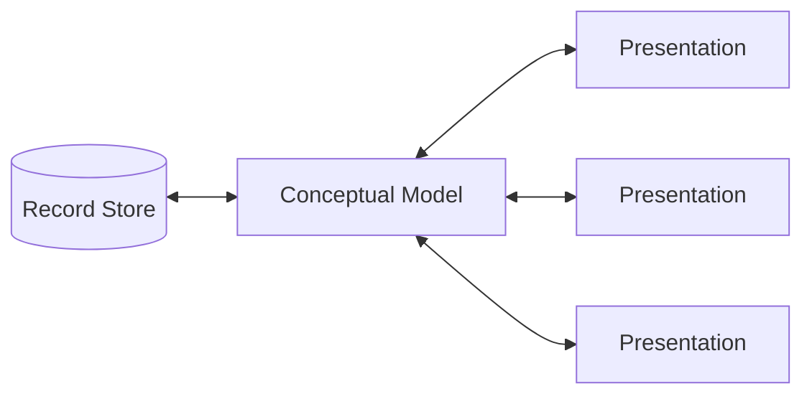
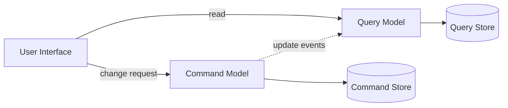

# CQRS

## 要約

CQRSは、状態を変更する操作と状態を参照する操作を分けて設計する考え方です。
単純なCRUDでは同じモデルを読み書きに使うことが多いですが、複雑なシステムでは読み取りと書き込みで求められる形が大きく異なることがあります。

CQRSは強力ですが、構成が複雑になりやすいため、どこにでも使うものではありません。
読むときは、読み取りモデルと書き込みモデルを分けることで何が解け、何が増えるのかを比べるのが大切です。

## 読むときの観点

- コマンドとクエリの責務を分ける理由を見る。
- 読み取り最適化と書き込み整合性の違いを整理する。
- イベントソーシングとCQRSを同一視しない。
- 複雑さに見合う問題があるかを考える。

## 原文の翻訳

CQRS は Command Query Responsibility Segregation の略です。これは、私が最初に Greg Young による説明で知ったパターンです。中心にある考え方は、**情報を更新するために使うモデルと、情報を読むために使うモデルを別にできる**ということです。状況によっては、この分離には価値があります。しかし注意が必要です。多くのシステムでは、CQRS は危険な複雑さを追加します。

情報システムとやり取りするときに、人々が使う主流の考え方は、それを CRUD データストアとして扱うことです。つまり、何らかのレコード構造を頭の中のモデルとして持ち、新しいレコードを作成し、レコードを読み、既存のレコードを更新し、不要になったらレコードを削除します。最も単純な場合、私たちのやり取りは、これらのレコードを保存し、取り出すことに尽きます。

要求がより高度になるにつれて、私たちは徐々にそのモデルから離れていきます。レコードストアとは異なる見方で情報を見たくなることがあります。たとえば、複数のレコードをひとつに畳み込んだり、別々の場所にある情報を組み合わせて仮想的なレコードを作ったりします。更新側では、特定のデータの組み合わせだけを保存できるようにする検証ルールが必要になるかもしれません。あるいは、入力されたデータとは異なる、保存すべきデータを推論することさえあります。

こうしたことが起こると、情報の複数の表現が見えてきます。ユーザーが情報とやり取りするときには、それぞれが異なる表現である、さまざまな情報の提示を使います。開発者は通常、モデルの中心的な要素を操作するために、自分たちの概念モデルを作ります。Domain Model を使っているなら、それは通常、ドメインの概念的表現です。

通常は、永続化ストレージも概念モデルにできるだけ近づけます。

このような複数の表現レイヤの構造はかなり複雑になりえます。しかし、このやり方を採る場合でも、人々はそれを単一の概念的表現へ解決します。その概念的表現が、すべての提示の間にある概念的な統合点として機能します。

CQRS が導入する変更は、この概念モデルを、更新用と表示用の別々のモデルへ分割することです。Command Query Separation の語彙にならって、それぞれを Command と Query と呼びます。その理由は、多くの問題、特により複雑なドメインでは、コマンドとクエリに同じ概念モデルを使うと、どちらもうまく扱えない複雑なモデルになってしまうからです。

別々のモデルという場合、最も一般的には異なるオブジェクトモデルを意味します。それらは、おそらく別々の論理プロセスで動き、場合によっては別々のハードウェア上で動きます。Web の例で言えば、ユーザーはクエリモデルを使って描画されたWebページを見ます。ユーザーが変更を開始すると、その変更は処理のために別のコマンドモデルへ送られます。その結果として生じた変更は、更新後の状態を描画するためにクエリモデルへ伝えられます。

ここにはかなりのバリエーションの余地があります。インメモリのモデルは同じデータベースを共有しているかもしれません。その場合、データベースが2つのモデル間の通信として機能します。しかし、別々のデータベースを使うこともあります。この場合、クエリ側のデータベースは実質的にリアルタイムの Reporting Database になります。このときは、2つのモデル、またはそれぞれのデータベースの間に、何らかの通信機構が必要です。

2つのモデルは、別々のオブジェクトモデルではないかもしれません。同じオブジェクトが、コマンド側とクエリ側で異なるインターフェースを持つ、という形もありえます。これはリレーショナルデータベースのビューに少し似ています。しかし、私が CQRS について耳にするときは、通常、それらは明確に別々のモデルです。

CQRS は、いくつかの他のアーキテクチャパターンと自然に合います。

- CRUD を通じてやり取りする単一の表現から離れると、タスクベースの UI へ移行しやすくなります。
- CQRS は、イベントベースのプログラミングモデルとうまく合います。CQRS システムでは、別々のサービスへ分割され、それらが Event Collaboration で通信する形をよく見ます。これにより、それらのサービスは Event Sourcing を活用しやすくなります。
- 別々のモデルを持つと、それらのモデルをどの程度強く一貫させるべきかという問いが生まれます。その結果、eventual consistency を使う可能性が高くなります。
- 多くのドメインでは、ロジックの大半は更新時に必要になります。そのため、クエリ側のモデルを単純にするために Eager Read Derivation を使うのが理にかなうことがあります。
- 書き込みモデルがすべての更新に対してイベントを生成するなら、読み取りモデルを Event Poster として構成できます。そうすると、それらを Memory Image にでき、多くのデータベース操作を避けられます。
- CQRS は複雑なドメインに向いています。そうしたドメインは、Domain-Driven Design からも恩恵を受ける種類のものです。

### いつ使うべきか

どんなパターンでもそうですが、CQRS は役に立つ場所もあれば、そうでない場所もあります。多くのシステムは CRUD のメンタルモデルにうまく合うため、そのスタイルで作るべきです。CQRS は関係者全員にとって大きな発想の飛躍なので、その飛躍に見合う利益がない限り取り組むべきではありません。CQRS の成功例に出会ったことはありますが、これまで私が見てきた事例の大半はあまり良いものではありませんでした。CQRS は、ソフトウェアシステムを深刻な困難に追い込む大きな力として現れることがあります。

特に、CQRS はシステム全体ではなく、システムの特定部分だけに使うべきです。DDD の用語で言えば、**特定の Bounded Context にだけ使う**べきです。この考え方では、それぞれの Bounded Context が、自分自身をどうモデル化するかについて独自の判断を必要とします。

今のところ、私は2つの方向で利点を見ています。第一に、少数の複雑なドメインは CQRS を使うことで扱いやすくなるかもしれません。ただし、CQRS に適しているケースは明らかに少数派だと強調しておきます。通常、コマンド側とクエリ側には十分な重なりがあるため、モデルを共有するほうが簡単です。CQRS に合わないドメインで CQRS を使うと、複雑さが増え、生産性が下がり、リスクが高まります。

もうひとつの主な利点は、高性能アプリケーションの扱いにあります。CQRS では、読み取りと書き込みの負荷を分離できるため、それぞれを独立してスケールできます。アプリケーションで読み取りと書き込みの間に大きな偏りがあるなら、これは非常に便利です。そこまでの偏りがなくても、両側に異なる最適化戦略を適用できます。たとえば、読み取りと更新で異なるデータベースアクセス技術を使うことができます。

ドメインが CQRS に向いていなくても、複雑さや性能問題を生む要求の厳しいクエリがあるなら、Reporting Database を使えることを覚えておいてください。CQRS はすべてのクエリに別モデルを使います。Reporting Database では、ほとんどのクエリには主システムを使い続け、要求の厳しいものだけを Reporting Database へ逃がします。

こうした利点はありますが、CQRS の利用には非常に慎重であるべきです。多くの情報システムは、情報ベースが読まれるのと同じ方法で更新されるという考え方によく合います。そのようなシステムへ CQRS を追加すると、大きな複雑さを加えることがあります。実力のあるチームの手にあっても、CQRS がプロジェクトに正当化しにくい量のリスクを追加し、生産性を大きく引き下げた例を私は確かに見てきました。

したがって、CQRS は道具箱に入れておく価値のあるパターンではあります。しかし、**うまく使うのは難しく、扱いを間違えると重要な部分を簡単に切り落としてしまう**ことに注意してください。

### さらに読む

- Greg Young は、私がこのアプローチについて話しているのを最初に聞いた人物です。彼によるまとめの中では、私はこの要約が最も好きです。
- Udi Dahan も CQRS の支持者であり、この技法について詳しい説明を書いています。
- このアプローチについて議論するための活発なメーリングリストがあります。
