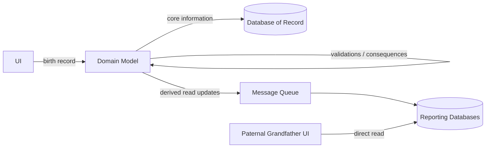

# Eager Read Derivation

## 要約

Eager Read Derivation は、読み取り要求が来てから派生ロジックを実行するのではなく、更新時に読み取り用のデータをあらかじめ作っておく設計です。
読み取り側は主データベースではなく、要求の形に合わせて構成された Reporting Database を直接参照します。

この考え方は、高いトランザクション量と多数の利用者を扱う分散システムで特に魅力的になります。
一方で、非同期メッセージングと組み合わせると、更新直後の読み取りに古い結果が見える不整合の時間窓が生まれる点に注意が必要です。

## 読むときの観点

- 読み取り時ではなく、更新時に派生情報を作る発想を見る。
- Domain Model のロジックを検証、結果、派生に分けて考える。
- Reporting Database が読み取り要求の形に合わせて設計される点を押さえる。
- 性能とスケーラビリティの代わりに、結果整合性を受け入れる場面を考える。

## 原文の翻訳

QCon San Francisco で聞いた興味深い講演のひとつに、Greg Young が最近のシステムで使った特定のアーキテクチャについて話したものがありました。
Greg は Domain Driven Design の熱心な支持者です。
この事例では、高いトランザクション率を処理し、多数のユーザーへデータを提供しなければならないシステムで DDD を使う必要がありました。
彼の設計には興味深い点がいくつもあり、特に Event Sourcing の使い方が印象的でした。
しかしこの投稿では、そのうちのひとつ、私が **Eager Read Derivation** と呼ぶものだけに焦点を当てます。

Domain Model を使うのは、それが複雑なドメインロジックを含んでいるからです。
このドメインロジックは、次のように分類すると役に立つことがあります。

- validations: 入力が意味をなしているか、オブジェクトが次のアクションに適した状態にあるかを確認する。
- consequences: 世界の状態を変える何らかのアクションを開始する。
- derivations: すでに持っている情報にもとづいて、何らかの情報を導き出す。

こうした種類のドメインロジックは、更新と読み取りで異なる形で適用されます。
系譜を扱うシステムを想像してみましょう。
出生記録という更新を受け取ります。

```text
name: Bilbo Baggins
father: Bungo Baggins
mother: Belladonna Took
```

このデータを送信すると、ドメインモデルはいくつかの validation を行います。
たとえば、父親と母親が同じではないことを確認します。
また、いくつかの consequence を実行するかもしれません。
たとえば、Bungo に未処理の遺贈があり、Bilbo がそれを受け取る資格を持つ、というようなものです。
derivation を行うこともありますが、たいていは validation や consequence を支えるために限られます。
たとえば、家系図に循環がないことを検証するには、Bilbo の祖先の一覧が必要になります。

データを読むときには、通常は derivation logic だけが関係します。
Bilbo の父方の祖父を表示する要求があるとしましょう。
これにはドメインロジックが必要です。
つまり、父方の祖父とは父親の父親である、という知識です。
ほとんどのシステムでは、読み取り要求を受け取った時点でこの read derivation logic を実行します。
本質的には、読み取り要求を受け取り、データベースを呼び出して生データを取り出し、必要な derivation logic を実行し、その結果を返します。
ただし、この処理を減らすためにキャッシュが関わることもあります。

Eager Read Derivation は、これとはかなり異なることを行います。
ここでは、読み取りは主データベースにまったく触れません。
その代わりに、読み取り要求と同じ形に構造化された、ひとつ以上の Reporting Database を持ちます。
すべての読み取り要求は Reporting Database へ直接向かい、そこから直接データを読み出して返します。
そこには **ドメインロジックは関与しません**。

出生記録の例と次の図で、もう一度説明します。



1. UI から出生記録が入ってきます。
2. ドメインモデルが、すべての validation と consequence logic を実行します。
3. ドメインモデルが、中核となる情報を記録用のデータベースへ更新します。
4. ドメインモデルが、すべての読み取りに必要な derivation logic を実行し、Reporting Database を構築するための更新メッセージをメッセージキューに載せます。これには各 UI 表示のためのものも含まれます。それぞれの Reporting Database は、これらのメッセージから必要なデータを選び、自分のデータを更新します。
5. 父方の祖父を表示する UI から読み取り要求が入ると、Reporting Database にある父方の祖父テーブルを直接読むことで応答します。

Greg の事例では、これらすべてが非同期メッセージで行われていました。
すべての入力はイベントとして捕捉され、Event Sourcing が使われていました。
ドメインモデルは入力キューからメッセージを処理し、Reporting Database をロードするために、出力イベントを出力キューへ投稿していました。
これらをすべて非同期に行うことは、全体的な性能とスケーラビリティに役立ちます。

ただし、それは不整合の時間窓があることを意味します。
更新を行い、すぐに読み取りを行った場合、メッセージが処理されるよりも速くクリックしてしまったために、その更新結果が見えないことがあります。
この非同期方式は結果整合的ですが、強整合ではありません。
しかしこれは避けがたい性質です。
分散システムでは、**整合性か可用性のどちらかは得られても、両方は得られない**のです。

もちろん、Eager Read Derivation を、非分散で強整合な形で行うこともできます。
ただし、私がすぐ思い出せる範囲では、そのような事例を見たことはありません。
Eager Read Derivation は、高い需要に応える分散システムを扱うときに、主に魅力的になるのだと思います。

eager evaluation を行うこと自体は、ほとんど新しいことではありません。
この技法は私よりも古く、おそらく Ron Jeffries よりも古いかもしれません。
また、多くの高トラフィックな Web サイトは、派生データを持つデータベースを常に構築しています。
それでも、この技法は本来考慮されるべきほど頻繁には検討されていないように思います。
そして私は、Greg が自分の設計でそれを積極的に使っていたところが気に入りました。
