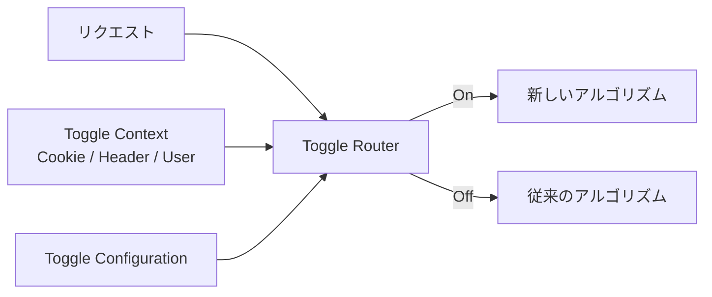
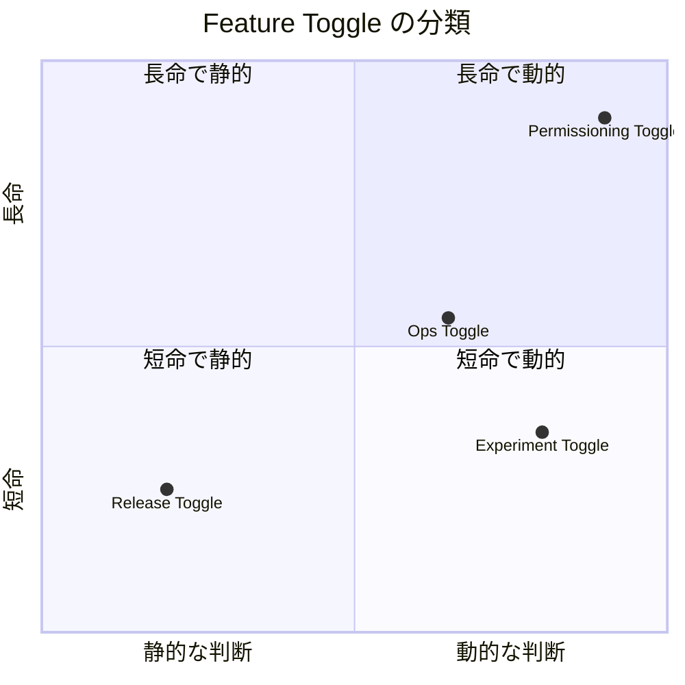
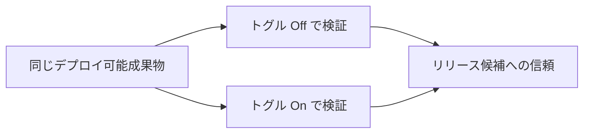

# Feature Toggles

## 要約

フィーチャートグルは、コードを変更せずにシステムの振る舞いを変えられるようにする手法です。
デプロイとリリースを分離し、未完成機能の隠蔽、カナリアリリース、A/Bテスト、運用時の緊急停止などを扱いやすくします。

一方で、トグルは条件分岐、構成管理、テスト組み合わせを増やします。
設計上は、トグルの種類、寿命、所有者、削除タイミングを明確にし、必要がなくなったものを積極的に取り除くことが大切です。

## 読むときの観点

- デプロイとリリースを分けることで何が楽になるかを見る。
- トグルには短命なものと長命なものがある。
- トグルの種類によって、構成管理、変更頻度、管理者が変わる。
- トグル管理は技術機能だけでなく、運用ルールと削除規律も含む。
- 削除されないトグルは設計負債になりやすい。

## 原文の翻訳

フィーチャートグル、しばしば Feature Flag とも呼ばれるものは、コードを変更せずにチームがシステムの振る舞いを変えられるようにする強力な手法である。用途にはいくつかの種類があり、トグルを実装し管理するときには、**その分類を考慮することが重要**だ。トグルは複雑さを持ち込む。

賢明なトグル実装のやり方と、トグル構成を管理するための適切なツールを使えば、その複雑さを抑え込める。しかし同時に、システム内のトグル数を制限することも目指すべきだ。

「Feature Toggling」は、新しい機能をユーザーへ素早く、しかし安全に届ける助けになる一連のパターンである。この記事ではまず、Feature Toggle が役に立つ典型的な場面を短い物語で見ていく。その後で詳細に入り、Feature Toggle をうまく使うための具体的なパターンとプラクティスを扱う。

Feature Toggle は Feature Flag、Feature Bit、Feature Flipper と呼ばれることもある。これらは同じ一連の技法を指す同義語だ。この記事では、feature toggle と feature flag を区別せずに使う。

### トグルの物語

場面を想像してほしい。あなたは、精巧な都市計画シミュレーションゲームを作る複数チームのうちのひとつにいる。あなたのチームはコアとなるシミュレーションエンジンを担当している。Spline Reticulation アルゴリズムの効率を上げる仕事を任された。この変更には実装のかなり大きな作り直しが必要で、数週間かかりそうだ。その間にも、チームの他のメンバーはコードベースの関連領域で進行中の作業を続ける必要がある。

過去に長命なブランチのマージでつらい経験をしたため、できればこの作業でブランチを切りたくない。そこで、チーム全体は trunk で作業を続け、Spline Reticulation 改善を担当する開発者は Feature Toggle を使って、自分たちの作業がチームの他のメンバーに影響したりコードベースを不安定にしたりしないようにすることにした。

#### Feature Flag の誕生

アルゴリズムを担当するペアが最初に入れた変更は次のようなものだ。

変更前:

```js
function reticulateSplines(){
  // current implementation lives here
}
```

この記事の例はすべて JavaScript ES2015 を使っている。

変更後:

```js
function reticulateSplines(){
  var useNewAlgorithm = false;
  // useNewAlgorithm = true; // UNCOMMENT IF YOU ARE WORKING ON THE NEW SR ALGORITHM
  if( useNewAlgorithm ){
    return enhancedSplineReticulation();
  }else{
    return oldFashionedSplineReticulation();
  }
}

function oldFashionedSplineReticulation(){
  // current implementation lives here
}

function enhancedSplineReticulation(){
  // TODO: implement better SR algorithm
}
```

このペアは現在のアルゴリズム実装を `oldFashionedSplineReticulation` 関数に移し、`reticulateSplines` を Toggle Point に変えた。これで、新しいアルゴリズムに取り組む人は `useNewAlgorithm = true` の行をコメント解除することで「新しいアルゴリズムを使う」機能を有効にできる。

#### フラグを動的にする

数時間が過ぎ、このペアは新しいアルゴリズムをシミュレーションエンジンの統合テストに通す準備ができた。同じ統合テスト実行の中で、古いアルゴリズムも動かしたい。機能を動的に有効化、無効化できる必要がある。つまり、`useNewAlgorithm = true` の行をコメントしたり外したりする不器用な仕組みから先へ進むときだ。

```js
function reticulateSplines(){
  if( featureIsEnabled("use-new-SR-algorithm") ){
    return enhancedSplineReticulation();
  }else{
    return oldFashionedSplineReticulation();
  }
}
```

ここで `featureIsEnabled` 関数を導入した。これは、どちらのコードパスを有効にするかを動的に制御するための Toggle Router である。Toggle Router の実装方法はたくさんあり、単純なインメモリストアから、立派な UI を持つ高度な分散システムまで幅がある。ここではまず、とても単純な仕組みから始める。

```js
function createToggleRouter(featureConfig){
  return {
    setFeature(featureName,isEnabled){
      featureConfig[featureName] = isEnabled;
    },
    featureIsEnabled(featureName){
      return featureConfig[featureName];
    }
  };
}
```

ここでは ES2015 のメソッド省略記法を使っている。

デフォルト構成、おそらく構成ファイルから読み込んだもの、をもとに新しい Toggle Router を作れるし、機能を動的にオン、オフすることもできる。これにより、自動テストはトグルされた機能の両側を検証できる。

```js
describe( 'spline reticulation', function(){
  let toggleRouter;
  let simulationEngine;

  beforeEach(function(){
    toggleRouter = createToggleRouter();
    simulationEngine = createSimulationEngine({toggleRouter:toggleRouter});
  });
  it('works correctly with old algorithm', function(){
    // Given
    toggleRouter.setFeature("use-new-SR-algorithm",false);

    // When
    const result = simulationEngine.doSomethingWhichInvolvesSplineReticulation();

    // Then
    verifySplineReticulation(result);
  });

  it('works correctly with new algorithm', function(){
    // Given
    toggleRouter.setFeature("use-new-SR-algorithm",true);
    // When
    const result = simulationEngine.doSomethingWhichInvolvesSplineReticulation();

    // Then
    verifySplineReticulation(result);
  });
});
```

#### リリースの準備

さらに時間が経ち、チームは新しいアルゴリズムが機能として完成したと考えている。それを確認するために、より高いレベルの自動テストを変更し、機能をオフにした場合とオンにした場合の両方でシステムを動かすようにしてきた。Spline Reticulation はシステムの振る舞いの中でも重要な部分なので、すべてが期待どおり動くことを確認するために、手動の探索的テストも行いたい。

一般利用に耐えるとまだ検証されていない機能を手動でテストするには、本番環境で一般ユーザーには機能をオフにしたまま、社内ユーザーにはオンにできる必要がある。この目的を達成する方法はいくつもある。

- Toggle Router に Toggle Configuration に基づく判断をさせ、その構成を環境ごとに変える。新機能は本番前環境でだけオンにする。
- 何らかの管理 UI により、実行時に Toggle Configuration を変更できるようにする。その管理 UI を使って、テスト環境で新機能をオンにする。
- Toggle Router に、リクエストごとの動的なトグル判断を教える。この判断は Toggle Context を考慮する。たとえば、特別な Cookie や HTTP ヘッダーを見る。通常、Toggle Context はリクエストを行うユーザーを識別するための代用として使われる。

これらの考え方は後で詳しく見るので、ここで知らない概念が出てきても心配しなくてよい。



チームは、リクエストごとの Toggle Router を選ぶことにした。柔軟性が高いからだ。特に、別のテスト環境を用意せずに新しいアルゴリズムをテストできることを評価している。本番環境でアルゴリズムをオンにしつつ、特別な Cookie で検出される社内ユーザーだけに有効化できる。チームは自分たちのブラウザでその Cookie を有効にし、新機能が期待どおり動くかを確認できる。

#### カナリアリリース

これまでの探索的テストを見る限り、新しい Spline Reticulation アルゴリズムは良さそうだ。しかし、ゲームのシミュレーションエンジンにとって非常に重要な部分なので、すべてのユーザーに機能をオンにすることにはまだ抵抗がある。そこでチームは Feature Flag の基盤を使ってカナリアリリースを行うことにした。全ユーザーのうち小さな割合、「カナリア」コホートにだけ新機能をオンにする。

チームは Toggle Router を拡張し、ユーザーコホートという概念を持たせる。コホートとは、ある機能を常にオンまたはオフとして一貫して体験するユーザーのグループである。カナリアユーザーのコホートは、ユーザー基盤の 1% をランダムにサンプリングして作る。たとえば、ユーザー ID の剰余を使うかもしれない。このカナリアコホートでは一貫して機能がオンになり、残り 99% のユーザーは古いアルゴリズムを使い続ける。

両方のグループについて、ユーザーエンゲージメントや総収益などの主要なビジネス指標を監視し、新しいアルゴリズムがユーザー行動に悪影響を与えないことへの信頼を得る。悪い影響がないと確信できたら、チームは Toggle Configuration を変更して、全ユーザーに対して機能をオンにする。

#### A/B テスト

チームのプロダクトマネージャーはこの方法を知って、とても興味を持った。彼女は、同じような仕組みを A/B テストに使うことを提案する。犯罪率アルゴリズムに汚染レベルを考慮させると、ゲームの面白さが増すのか減るのか、長く議論されてきた。チームはいまや、その議論をデータで決着させる能力を持っている。アイデアの本質を捉える安価な実装を投入し、Feature Flag で制御する計画だ。

機能は十分に大きなユーザーコホートに対してオンにし、そのユーザーたちの振る舞いを「コントロール」コホートと比較して調べる。この方法により、チームは意見の分かれるプロダクト上の議論を、HiPPO ではなくデータに基づいて解決できる。

この短いシナリオの目的は、Feature Toggling の基本概念だけでなく、この中核能力がどれほど多くの用途を持ちうるかを示すことだ。いくつかの用途を見たので、もう少し深く掘り下げよう。トグルの異なる分類を見て、それぞれ何が違うのかを確認する。保守しやすいトグルコードの書き方を扱い、最後に、feature-toggled system の落とし穴を避けるためのプラクティスを共有する。

### トグルの分類

ここまで、Feature Toggle が提供する基本的な能力を見てきた。つまり、ひとつのデプロイ可能単位の中に代替コードパスを同梱し、実行時にどちらを使うか選ぶ能力である。上のシナリオは、この能力がさまざまな文脈でさまざまな使い方をされることも示している。すべての Feature Toggle を同じ箱に入れたくなるかもしれないが、それは危険な道だ。

異なる分類のトグルに働く設計上の力はかなり違う。すべてを同じ方法で管理すると、後で苦しむことになる。

Feature Toggle は、ふたつの大きな軸で分類できる。Feature Toggle がどれくらい長く生きるか、そしてトグル判断がどれくらい動的でなければならないかである。他にも考慮すべき要素はある。たとえば誰が Feature Toggle を管理するか。しかし、寿命と動的さは、トグルの管理方法を導く大きな要因だと考えている。

このふたつの軸を通して、いくつかのトグル分類を見ていこう。



#### Release Toggle

Release Toggle により、未完成でテストされていないコードパスを、決してオンにされないかもしれない潜在コードとして本番へ送り込める。

これは Continuous Delivery を実践するチームが trunk-based development を可能にするために使う Feature Flag である。進行中の機能を共有統合ブランチ、たとえば master や trunk にチェックインしつつ、そのブランチをいつでも本番へデプロイできるようにする。Release Toggle により、未完成でテストされていないコードパスを、オンにされない可能性のある潜在コードとして本番へ出荷できる。

プロダクトマネージャーも、同じ考え方のプロダクト中心版を使って、半分しか完成していないプロダクト機能がエンドユーザーに見えないようにできる。たとえば EC サイトのプロダクトマネージャーは、配送予定日機能がひとつの配送パートナーにしか対応していないうちはユーザーに見せたくないかもしれない。すべての配送パートナーに対応するまで待ちたい、という判断だ。

機能が完全に実装されテスト済みであっても、プロダクトマネージャーが公開したくない理由は他にもありうる。たとえば、機能リリースをマーケティングキャンペーンと連動させる場合だ。このように Release Toggle を使うことは、Continuous Delivery の原則である**「機能リリースとコードデプロイを分離する」**ことを実装する最も一般的な方法である。

Release Toggle は性質上、一時的なものだ。一般には 1、2 週間を大きく超えて残すべきではない。ただし、プロダクト中心のトグルはもう少し長く残す必要があるかもしれない。Release Toggle のトグル判断は通常、かなり静的である。あるリリースバージョンに対するトグル判断はすべて同じになり、トグル構成を変更した新しいリリースをロールアウトしてその判断を変えることも、たいていはまったく問題ない。

#### Experiment Toggle

Experiment Toggle は、多変量テストや A/B テストを行うために使われる。システムの各ユーザーはコホートに割り当てられ、実行時に Toggle Router は、そのユーザーがどのコホートに属するかに基づき、一貫してどちらかのコードパスへ送る。異なるコホートの集計された振る舞いを追跡することで、異なるコードパスの効果を比較できる。

この技法は、EC システムの購入フローや、ボタンの Call To Action 文言のようなものを、データ駆動で最適化するためによく使われる。

Experiment Toggle は、統計的に有意な結果を得るのに十分な期間、同じ構成で残しておく必要がある。トラフィックのパターンによって、それは数時間かもしれないし数週間かもしれない。それ以上長くすることは、あまり役に立たない可能性が高い。システムへの他の変更が、実験結果を無効にしてしまうリスクがあるからだ。Experiment Toggle は性質上、非常に動的である。到着する各リクエストは別のユーザーに代わっている可能性が高く、そのため直前のリクエストとは異なるルートに送られるかもしれない。

#### Ops Toggle

このフラグは、システムの振る舞いに関する運用面を制御するために使われる。たとえば、性能面の影響がはっきりしない新機能をロールアウトするときに Ops Toggle を導入し、必要であれば本番でその機能を素早く無効化したり劣化運転に切り替えたりできるようにする。

ほとんどの Ops Toggle は比較的短命である。新機能の運用面について信頼が得られたら、そのフラグは引退させるべきだ。しかし、システムには少数の長命な「Kill Switch」があることも珍しくない。これにより本番環境の運用者は、システムが異常に高い負荷を受けているときに、重要でない機能を段階的に落とせる。

たとえば高負荷時には、ホームページ上の Recommendations パネルを無効にしたいかもしれない。このパネルは生成コストが比較的高い。私が相談を受けたあるオンライン小売業者は、需要の高い製品ローンチの直前に、Web サイトの主な購入フローにある多数の非重要機能を意図的に無効化できる Ops Toggle を維持していた。この種の長命な Ops Toggle は、手動管理の Circuit Breaker と見なすこともできる。

すでに述べたように、これらのフラグの多くは短期間だけ置かれる。しかし、いくつかの重要な制御は、運用者のためにほぼ無期限に残されるかもしれない。これらのフラグの目的は、運用者が本番の問題に素早く反応できるようにすることなので、非常に素早く再構成できる必要がある。Ops Toggle を切り替えるために新しいリリースをロールアウトしなければならないとしたら、運用担当者は喜ばないだろう。

#### Permissioning Toggle

社内ユーザーの集団に新機能をオンにすることは Champagne Brunch である。自分たちのシャンパンを早めに飲む機会だ。

このフラグは、特定のユーザーが受け取る機能やプロダクト体験を変えるために使われる。たとえば、有料顧客にだけオンにする「プレミアム」機能の集合があるかもしれない。あるいは、社内ユーザーだけが使える「アルファ」機能の集合と、社内ユーザーに加えてベータユーザーも使える「ベータ」機能の集合があるかもしれない。

私は、社内ユーザーやベータユーザーの集団に新機能をオンにするこの技法を Champagne Brunch と呼んでいる。自分たちのシャンパンを飲む、早い機会である。

Champagne Brunch は、多くの点で Canary Release と似ている。違いは、Canary Release された機能がランダムに選ばれたユーザーコホートに公開されるのに対し、Champagne Brunch の機能は特定のユーザー集合に公開されることだ。

プレミアムユーザーにだけ公開される機能を管理する方法として使われる場合、Permissioning Toggle は他の Feature Toggle の分類と比べて非常に長命になることがある。年単位の寿命だ。権限はユーザー固有なので、Permissioning Toggle のトグル判断は常にリクエストごとになり、非常に動的なトグルになる。

#### トグルの分類を管理する

トグルの分類スキームを得たので、動的さと寿命というふたつの軸が、異なる分類の Feature Flag の扱いにどう影響するかを議論できる。

##### 静的トグルと動的トグル

実行時にルーティング判断を行うトグルには、より高度な Toggle Router と、その Router のためのより複雑な構成が必然的に必要になる。

単純な静的ルーティング判断では、トグル構成は各機能のオン、オフだけでよい。Toggle Router は、その静的なオン、オフ状態を Toggle Point へ伝える責任だけを持つ。先ほど述べたように、他の分類のトグルはより動的であり、より高度な Toggle Router を要求する。たとえば Experiment Toggle の Router は、特定のユーザーに対して動的にルーティング判断を行う。ユーザー ID に基づく一貫したコホート化アルゴリズムのようなものを使うかもしれない。

この Toggle Router は、構成から静的なトグル状態を読むのではなく、実験コホートとコントロールコホートをどれくらいの大きさにするかといった、何らかのコホート構成を読む必要がある。その構成がコホート化アルゴリズムへの入力として使われる。

このトグル構成の管理方法については、後でさらに詳しく掘り下げる。

##### 長命なトグルと一時的なトグル

トグルの分類は、本質的に一時的なものと、何年も残る可能性がある長命なものにも分けられる。この違いは、ある機能の Toggle Point をどう実装するかに強く影響するはずだ。数日後に削除される Release Toggle を追加するなら、Toggle Router に対して単純な if/else チェックを行う Toggle Point で済ませられるだろう。先ほどの spline reticulation の例がそれだ。

```js
function reticulateSplines(){
  if( featureIsEnabled("use-new-SR-algorithm") ){
    return enhancedSplineReticulation();
  }else{
    return oldFashionedSplineReticulation();
  }
}
```

しかし、非常に長く残ると予想される Toggle Point を持つ新しい Permissioning Toggle を作るなら、if/else チェックを無造作にばらまいて実装したくはない。より保守しやすい実装技法を使う必要がある。

### 実装技法

Feature Flag は、かなり散らかった Toggle Point コードを生みがちであり、その Toggle Point はコードベース全体に増殖しがちでもある。コードベース内のどんな Feature Flag についても、この傾向を抑えておくことが重要だ。フラグが長命になる場合には特に重要である。この問題を減らすのに役立つ実装パターンとプラクティスがいくつかある。

#### 判断点と判断ロジックを切り離す

Feature Toggle でよくある間違いは、トグル判断が行われる場所、つまり Toggle Point と、その判断の背後にあるロジック、つまり Toggle Router を**結合してしまうこと**だ。例を見てみよう。私たちは EC システムの次世代版に取り組んでいる。新機能のひとつは、注文確認メール、別名請求メールの中のリンクをクリックするだけでユーザーが注文をキャンセルできるようにするものだ。次世代機能全体のロールアウト管理に Feature Flag を使っている。

最初の Feature Flag 実装は次のようになっている。

`invoiceEmailer.js`

```js
const features = fetchFeatureTogglesFromSomewhere();

function generateInvoiceEmail(){
  const baseEmail = buildEmailForInvoice(this.invoice);
  if( features.isEnabled("next-gen-ecomm") ){
    return addOrderCancellationContentToEmail(baseEmail);
  }else{
    return baseEmail;
  }
}
```

請求メールを生成する間、`InvoiceEmailler` は `next-gen-ecomm` 機能が有効かどうかを確認する。有効であれば、メールに注文キャンセル用の追加コンテンツを入れる。

これは一見、妥当な方法に見える。しかし非常にもろい。請求メールに注文キャンセル機能を含めるかどうかの判断が、かなり広い範囲を示す `next-gen-ecomm` 機能へ直接結びつけられている。しかも magic string まで使っている。

なぜ請求メールのコードが、注文キャンセルの内容が次世代機能セットの一部であることを知っていなければならないのか。注文キャンセルを出さずに次世代機能の一部だけをオンにしたくなったらどうなるのか。その逆はどうか。注文キャンセルだけを特定ユーザーへロールアウトしたくなったらどうするのか。この種の「トグルのスコープ」の変更は、機能開発の途中でよく起こる。

さらに、こうした Toggle Point はコードベース全体に増殖しがちであることも覚えておいてほしい。現在のやり方では、トグル判断ロジックが Toggle Point の一部になっているため、その判断ロジックを変えるには、コードベースに広がったすべての Toggle Point を探し回る必要がある。

ありがたいことに、ソフトウェアのどんな問題も間接層をひとつ追加すれば解ける。トグル判断点を、その判断の背後にあるロジックから次のように切り離せる。

`featureDecisions.js`

```js
function createFeatureDecisions(features){
  return {
    includeOrderCancellationInEmail(){
      return features.isEnabled("next-gen-ecomm");
    }
    // ... additional decision functions also live here ...
  };
}
```

`invoiceEmailer.js`

```js
const features = fetchFeatureTogglesFromSomewhere();
const featureDecisions = createFeatureDecisions(features);

function generateInvoiceEmail(){
  const baseEmail = buildEmailForInvoice(this.invoice);
  if( featureDecisions.includeOrderCancellationInEmail() ){
    return addOrderCancellationContentToEmail(baseEmail);
  }else{
    return baseEmail;
  }
}
```

ここで `FeatureDecisions` オブジェクトを導入した。これは Feature Toggle の判断ロジックを集める場所として働く。コード内の具体的なトグル判断ごとに、このオブジェクト上に判断メソッドを作る。今回でいえば、「請求メールに注文キャンセル機能を含めるべきか」という判断が `includeOrderCancellationInEmail` 判断メソッドとして表現されている。

現時点の判断「ロジック」は、`next-gen-ecomm` 機能の状態を見るだけの単純な透過処理だ。しかし、これでロジックが進化しても管理する場所はひとつになる。その具体的なトグル判断のロジックを変えたいときには、行くべき場所がひとつだけになる。たとえば、どの Feature Flag が判断を制御するかという、判断のスコープを変えたいかもしれない。

あるいは、判断の理由を変える必要が出るかもしれない。静的なトグル構成に駆動されるのではなく、A/B 実験に駆動されるようにしたり、注文キャンセル基盤の一部障害のような運用上の関心に駆動されるようにしたりする場合だ。いずれの場合でも、請求メール送信側は、そのトグル判断がどのように、またなぜ行われているのかを知らずにいられる。

#### 判断の反転

前の例では、請求メール送信側が Feature Flag 基盤に問い合わせ、自分がどう振る舞うべきかを尋ねていた。これは、請求メール送信側が Feature Flag という追加の概念を知る必要があり、さらに追加のモジュールに結合することを意味する。その結果、請求メール送信側を単独で扱ったり考えたりすることが難しくなる。テストもしにくくなる。

Feature Flag は、時間とともにシステム内でどんどん広がる傾向がある。そのため、グローバル依存として Feature Flag システムに結合するモジュールがますます増えていくことになる。理想的な状況ではない。

ソフトウェア設計では、このような結合の問題を Inversion of Control の適用によって解けることがよくある。この場合もそうだ。請求メール送信側を Feature Flag 基盤から切り離すには、次のようにできる。

`invoiceEmailer.js`

```js
function createInvoiceEmailler(config){
  return {
    generateInvoiceEmail(){
      const baseEmail = buildEmailForInvoice(this.invoice);
      if( config.includeOrderCancellationInEmail ){
        return addOrderCancellationContentToEmail(email);
      }else{
        return baseEmail;
      }
    },

    // ... other invoice emailer methods ...
  };
}
```

`featureAwareFactory.js`

```js
function createFeatureAwareFactoryBasedOn(featureDecisions){
  return {
    invoiceEmailler(){
      return createInvoiceEmailler({
        includeOrderCancellationInEmail: featureDecisions.includeOrderCancellationInEmail()
      });
    },

    // ... other factory methods ...
  };
}
```

これで、`InvoiceEmailler` が `FeatureDecisions` に手を伸ばすのではなく、構築時に `config` オブジェクト経由で判断を注入される。`InvoiceEmailler` は Feature Flag についてまったく知らない。ただ、自分の振る舞いの一部が実行時に構成可能であることだけを知っている。

これにより `InvoiceEmailler` の振る舞いのテストも簡単になる。テスト時に異なる構成オプションを渡すだけで、注文キャンセルコンテンツを含む場合と含まない場合の両方のメール生成をテストできる。

```js
describe( 'invoice emailling', function(){
  it( 'includes order cancellation content when configured to do so', function(){
    // Given
    const emailler = createInvoiceEmailler({includeOrderCancellationInEmail:true});

    // When
    const email = emailler.generateInvoiceEmail();

    // Then
    verifyEmailContainsOrderCancellationContent(email);
  };
  it( 'does not includes order cancellation content when configured to not do so', function(){
    // Given
    const emailler = createInvoiceEmailler({includeOrderCancellationInEmail:false});

    // When
    const email = emailler.generateInvoiceEmail();

    // Then
    verifyEmailDoesNotContainOrderCancellationContent(email);
  };
});
```

また、判断を注入されたオブジェクトの生成を集中させるために `FeatureAwareFactory` も導入した。これは一般的な Dependency Injection パターンの適用である。コードベースで DI システムを使っているなら、おそらくそのシステムを使ってこの方法を実装するだろう。

#### 条件分岐を避ける

ここまでの例では、Toggle Point は if 文で実装されていた。単純で短命なトグルなら、それで意味があるかもしれない。しかし、ひとつの機能に複数の Toggle Point が必要な場所や、Toggle Point が長命になると予想される場所では、点在する条件分岐は勧められない。より保守しやすい代替案は、何らかの Strategy パターンを使って代替コードパスを実装することだ。

`invoiceEmailler.js`

```js
function createInvoiceEmailler(additionalContentEnhancer){
  return {
    generateInvoiceEmail(){
      const baseEmail = buildEmailForInvoice(this.invoice);
      return additionalContentEnhancer(baseEmail);
    },
    // ... other invoice emailer methods ...

  };
}
```

`featureAwareFactory.js`

```js
function identityFn(x){ return x; }
function createFeatureAwareFactoryBasedOn(featureDecisions){
  return {
    invoiceEmailler(){
      if( featureDecisions.includeOrderCancellationInEmail() ){
        return createInvoiceEmailler(addOrderCancellationContentToEmail);
      }else{
        return createInvoiceEmailler(identityFn);
      }
    },

    // ... other factory methods ...
  };
}
```

ここでは、請求メール送信側をコンテンツ強化関数で構成できるようにすることで Strategy パターンを適用している。`FeatureAwareFactory` は、`FeatureDecision` に導かれて、請求メール送信側を作るときに戦略を選ぶ。注文キャンセルをメールに入れるべきなら、その内容をメールに追加する enhancer 関数を渡す。そうでなければ、何もせずメールをそのまま返す `identityFn` enhancer を渡す。

### Toggle Configuration

#### 動的ルーティングと動的構成

先ほど、Feature Flag を大きくふたつに分けた。あるコードデプロイに対してトグルのルーティング判断が本質的に静的なものと、実行時に動的に判断が変わるものだ。ここで重要なのは、フラグの判断が実行時に変化する方法にはふたつあるという点である。第一に、Ops Toggle のようなものは、システム障害に応じてオンからオフへ動的に再構成されるかもしれない。

第二に、Permissioning Toggle や Experiment Toggle のような分類のトグルは、どのユーザーがリクエストしているかといったリクエストコンテキストに基づき、リクエストごとに動的なルーティング判断を行う。前者は再構成によって動的であり、後者は本質的に動的である。これら本質的に動的なトグルは、非常に動的な判断を行うかもしれないが、構成自体はかなり静的で、再デプロイでしか変えられないこともある。

Experiment Toggle はこの種の Feature Flag の例である。実験のパラメータを実行時に変更できる必要は実際にはあまりない。むしろ、そうすると実験が統計的に無効になりやすい。

#### 静的構成を好む

Feature Flag の性質が許すなら、トグル構成はソース管理と再デプロイによって管理するほうが望ましい。ソース管理でトグル構成を管理すると、infrastructure as code のようなものにソース管理を使う場合と同じ利点が得られる。

トグル構成を、トグル対象のコードベースのそばに置ける。これは非常に大きな利点である。**トグル構成が Continuous Delivery パイプラインを通っていく**からだ。これにより CD の利点、つまり環境をまたいで一貫した方法で検証される再現可能なビルドを十分に活かせる。Feature Flag のテスト負担も大きく減る。

トグル状態がリリースに焼き込まれていて変更されないなら、少なくとも動的でないフラグについては、リリースがトグルオフとオンの両方でどう振る舞うかを確認する必要が少なくなる。トグル構成がソース管理で隣り合わせに置かれるもうひとつの利点は、過去のリリースにおけるトグルの状態を簡単に見られ、必要なら過去のリリースを簡単に再現できることだ。

#### トグル構成を管理する方法

静的構成が望ましいとはいえ、Ops Toggle のように、より動的な方法が必要な場合もある。トグル構成を管理する選択肢を見ていこう。単純だが動的さに欠ける方法から、高度に洗練されているが多くの追加複雑性を伴う方法まである。

#### Hardcoded Toggle Configuration

最も基本的な技法、おそらく基本的すぎて Feature Flag と見なされないかもしれない技法は、コードブロックを単にコメントしたりコメント解除したりすることだ。たとえば次のようになる。

```js
function reticulateSplines(){
  //return oldFashionedSplineReticulation();
  return enhancedSplineReticulation();
}
```

コメントによる方法より少し洗練されているのは、利用可能な場合にプリプロセッサの `#ifdef` 機能を使うことだ。

この種のハードコーディングは、トグルの動的な再構成を許さない。そのため、フラグを再構成するにはコードをデプロイする、というパターンを受け入れられる Feature Flag にだけ適している。

#### Parameterized Toggle Configuration

ハードコードされた構成が提供するビルド時構成では、多くのユースケースに対して柔軟性が足りない。多くのテストシナリオもそうだ。アプリやサービスを再ビルドせずに Feature Flag を再構成できるようにする単純な方法は、コマンドライン引数や環境変数によって Toggle Configuration を指定することである。

これは、Feature Toggling や Feature Flagging という名前で呼ばれるずっと前から存在する、単純で由緒あるトグル方法だ。しかし制約もある。多数のプロセスにまたがって構成を調整するのは扱いにくくなりうる。トグル構成の変更には、再デプロイ、少なくともプロセス再起動が必要になる。おそらく、トグルを再構成する人にはサーバーへの特権アクセスも必要になる。

#### Toggle Configuration File

別の選択肢は、何らかの構造化ファイルから Toggle Configuration を読むことだ。この方法での Toggle Configuration は、より一般的なアプリケーション構成ファイルの一部として始まることがかなり多い。

Toggle Configuration ファイルを使うと、アプリケーションコード自体を再ビルドするのではなく、そのファイルを変更するだけで Feature Flag を再構成できる。ただし、多くの場合、機能を切り替えるためにアプリを再ビルドする必要はなくても、フラグを再構成するにはまだ再デプロイが必要になるだろう。

#### アプリケーション DB 内の Toggle Configuration

一定の規模に達すると、静的ファイルでトグル構成を管理するのは面倒になりうる。ファイルによる構成変更は比較的扱いづらい。サーバー群全体の一貫性を保証するのは課題になり、変更を一貫して反映することはさらに難しい。これに対応して、多くの組織は Toggle Configuration を何らかの中央ストアに移す。多くの場合、それは既存のアプリケーション DB である。

通常これは、システム運用者、テスター、プロダクトマネージャーが Feature Flag とその構成を表示、変更できる何らかの管理 UI の構築を伴う。

#### Distributed Toggle Configuration

トグル構成の保存先として、システムアーキテクチャにすでに含まれている汎用 DB を使うことは非常に一般的だ。Feature Flag が導入され、広がり始めたときに向かう先として自然だからだ。しかし現在では、アプリケーション構成管理により適した、特化型の階層的キー・バリューストアがある。Zookeeper、etcd、Consul のようなサービスだ。

これらのサービスは分散クラスタを構成し、そのクラスタにつながるすべてのノードに環境構成の共有ソースを提供する。構成は必要なときに動的に変更でき、クラスタ内のすべてのノードはその変更を自動的に知らされる。これはとても便利な追加機能だ。

これらのシステムを使って Toggle Configuration を管理すると、サーバー群の各ノード上にある Toggle Router が、サーバー群全体で調整された Toggle Configuration に基づいて判断できる。

これらのシステムの中には、たとえば Consul のように、Toggle Configuration を管理する基本的な方法を提供する管理 UI を備えたものもある。しかし、どこかの時点で、トグル構成を管理する小さなカスタムアプリが作られることが多い。

#### 構成の上書き

ここまでの議論では、すべての構成が単一の仕組みから提供されると仮定してきた。多くのシステムの現実はもっと洗練されており、さまざまなソースから来る構成の上書きレイヤーがある。Toggle Configuration では、デフォルト構成に加え、環境固有の上書きを持つことがかなり一般的である。その上書きは、追加の構成ファイルのような単純なものから、Zookeeper クラスタのような高度なものまでありうる。

環境固有の上書きは、同じビットと構成がデリバリーパイプラインの最後まで流れるという Continuous Delivery の理想に反することに注意してほしい。実務上、環境固有の上書きを使う判断になることはよくある。しかし、デプロイ可能単位と構成の両方をできるだけ環境に依存しないものにしようと努めると、より単純で安全なパイプラインにつながる。feature-toggled system のテストについて話すとき、この話題にもう一度戻る。

##### リクエストごとの上書き

環境固有の構成上書きに代わる方法として、特別な Cookie、クエリパラメータ、HTTP ヘッダーを使い、トグルのオン、オフ状態をリクエストごとに上書きできるようにする方法がある。これは構成全体を上書きする方法に比べて、いくつか利点がある。サービスがロードバランスされていても、どのサービスインスタンスに当たったかに関係なく上書きが適用されると確信できる。

また、本番環境で Feature Flag を上書きしても他のユーザーに影響せず、上書きを誤って残してしまう可能性も低くなる。リクエストごとの上書き機構が永続 Cookie を使うなら、システムをテストする人は、自分のブラウザで一貫して適用され続けるカスタムのトグル上書きセットを設定できる。

このリクエストごとの方法の欠点は、好奇心の強い、あるいは悪意あるエンドユーザーが、自分で Feature Toggle の状態を変更するリスクを持ち込むことだ。十分に粘り強い相手には、まだリリースされていない機能が公開アクセス可能になる、という考えに不安を覚える組織もあるだろう。この懸念を緩和する選択肢のひとつは、上書き構成に暗号署名することだ。しかしいずれにせよ、この方法は Feature Toggling システムの複雑さと攻撃面を増やす。

Cookie ベースの上書きについては、私は別の記事でこの技法を詳しく説明し、また自分と Thoughtworks の同僚がオープンソース化した Ruby 実装についても説明している。

### Feature Flag 付きシステムで働く

Feature Toggling は間違いなく役立つ技法だが、追加の複雑さも持ち込む。feature-flagged system で作業するときに生活を楽にしてくれる技法がいくつかある。

#### 現在の Feature Toggle 構成を公開する

デプロイされた成果物にビルド番号やバージョン番号を埋め込み、どこかでそのメタデータを公開して、開発者、テスター、運用者が特定の環境でどのコードが動いているかを分かるようにしておくことは、昔から有用なプラクティスだ。同じ考え方を Feature Flag にも適用すべきである。Feature Flag を使うどんなシステムも、運用者が現在のトグル構成の状態を知る方法を公開すべきだ。

HTTP 指向の SOA システムでは、これは何らかのメタデータ API エンドポイントによって実現されることが多い。たとえば Spring Boot の Actuator エンドポイントがある。

#### 構造化された Toggle Configuration ファイルを活用する

ベースとなる Toggle Configuration は、ソース管理される何らかの構造化された人間可読ファイル、多くの場合 YAML 形式、に保存するのが一般的である。このファイルからは追加の利点を得られる。各トグルに人間が読める説明を含めることは、驚くほど役に立つ。特に、コアのデリバリーチーム以外の人が管理するトグルではそうだ。

本番障害の最中に Ops Toggle を有効にするか判断しようとしているとき、`basic-rec-algo` という表示と、「単純な推薦アルゴリズムを使う。これは高速でバックエンドシステムへの負荷を下げるが、標準アルゴリズムより精度はかなり低い」という説明のどちらを見たいだろうか。チームによっては、作成日、主担当開発者の連絡先、短命を意図したトグルの有効期限といった追加メタデータをトグル構成ファイルに含めることもある。

#### トグルごとに違う管理をする

先に議論したように、Feature Toggle には異なる特徴を持つさまざまな分類がある。これらの違いは受け入れるべきであり、技術的な仕組みとしては同じ機構で制御されているとしても、異なるトグルは異なる方法で管理すべきだ。

以前の EC サイトの例に戻ろう。ホームページに Recommended Products セクションがある。最初は、開発中のため、そのセクションを Release Toggle の背後に置くかもしれない。次に、収益向上に役立つかを検証するため、Experiment Toggle の背後へ移すかもしれない。最後に、極端な負荷の下でオフにできるように、Ops Toggle の背後へ移すかもしれない。

先ほどの、判断ロジックを Toggle Point から切り離すという助言に従っていれば、これらのトグル分類の違いは Toggle Point コードにまったく影響しなかったはずだ。

しかし Feature Flag 管理の観点では、この移行は確実に影響を持つべきである。Release Toggle から Experiment Toggle へ移行する一環として、トグルの構成方法は変わり、おそらく別の場所へ移る。ソース管理内の YAML ファイルではなく、管理 UI に入るかもしれない。構成を管理するのも開発者ではなくプロダクト担当者になるだろう。

同じように、Experiment Toggle から Ops Toggle への移行は、トグルがどのように構成されるか、その構成がどこに置かれるか、誰が構成を管理するかについて、また別の変更を意味する。

#### Feature Toggle は検証の複雑さを持ち込む

Feature Flag 付きシステムでは、Continuous Delivery のプロセス、とりわけテストが複雑になる。成果物が CD パイプラインを通るとき、同じ成果物について複数のコードパスをテストしなければならないことがよくある。理由を説明するために、あるシステムを出荷すると想像してほしい。そのシステムは、トグルがオンなら新しい最適化済み税計算アルゴリズムを使い、そうでなければ既存アルゴリズムを使い続ける。

あるデプロイ可能成果物が CD パイプラインを通っている時点では、そのトグルが本番で将来オンになるのかオフになるのかを知ることはできない。そもそもそれが Feature Flag の要点だからだ。そのため、本番で有効になりうるすべてのコードパスを検証するには、トグルをオンにした状態とオフにした状態の両方で成果物をテストしなければならない。



ひとつのトグルだけでも、少なくとも一部のテストを倍にする必要が生まれることが分かる。複数のトグルがあると、可能なトグル状態は組み合わせ爆発を起こす。これらすべての状態で振る舞いを検証するのは、とてつもない作業になる。このため、テストに関心のある人々が Feature Flag に健全な懐疑心を持つことがある。

幸い、状況はテスターが最初に想像するほど悪くはない。Feature Flag 付きのリリース候補はいくつかのトグル構成でテストする必要があるが、**すべての組み合わせをテストする必要はない**。ほとんどの Feature Flag は互いに相互作用せず、ほとんどのリリースでは複数の Feature Flag 構成が同時に変わることはない。

よい慣例は、Feature Flag がオフのときに既存またはレガシーの振る舞いを有効にし、オンのときに新しい、または将来の振る舞いを有効にすることだ。

では、チームはどの Feature Toggle 構成をテストすべきだろうか。最も重要なのは、本番で有効になると予想しているトグル構成をテストすることだ。つまり、現在の本番トグル構成に、オンでリリースする予定のトグルを加えたものだ。それらのリリース予定トグルをオフにしたフォールバック構成もテストするのが賢明である。将来のリリースで予期しない回帰を避けるため、すべてのトグルをオンにした状態で一部のテストを行うチームも多い。

この助言は、機能がオフのときには既存またはレガシーの振る舞いが有効になり、オンのときには新しい、または将来の振る舞いが有効になる、というトグル意味論の慣例に従っている場合にだけ意味を持つことに注意してほしい。

Feature Flag システムが実行時構成をサポートしていない場合、テスト中にトグルを切り替えるにはプロセスを再起動しなければならないかもしれない。もっと悪ければ、成果物をテスト環境へ再デプロイしなければならない。これは検証プロセスのサイクルタイムに非常に有害であり、CI/CD が提供する非常に重要なフィードバックループにも影響する。この問題を避けるために、Feature Flag を動的にインメモリ再構成できるエンドポイントを公開することを検討するとよい。

Experiment Toggle のようなものを使っている場合、この種の上書き機能はさらに必要になる。トグルの両側を動かすことがより面倒だからだ。

特定のサービスインスタンスを動的に再構成できるこの能力は、非常に鋭い道具である。不適切に使うと、共有環境で多くの痛みと混乱を引き起こす。この機能は、自動テストによってのみ使われるべきであり、場合によっては手動の探索的テストやデバッグの一部として使われる程度にすべきだ。

本番環境で使う、より汎用的なトグル制御機構が必要なら、上の Toggle Configuration セクションで議論したような本物の分散構成システムを使って作るのがよい。

#### トグルをどこに置くか

##### エッジのトグル

リクエストごとのコンテキストを必要とするトグル分類、Experiment Toggle や Permissioning Toggle では、システムのエッジサービスに Toggle Point を置くのが理にかなっている。つまり、エンドユーザーに機能を提示する公開 Web アプリだ。ここはユーザーの個々のリクエストが最初にドメインへ入る場所であり、したがって Toggle Router がユーザーとリクエストに基づいてトグル判断を行うためのコンテキストを最も多く持てる場所である。

システムのエッジに Toggle Point を置く副次的な利点は、扱いにくい条件付きトグルロジックをシステムの中核から外しておけることだ。多くの場合、次の Rails の例のように、HTML をレンダリングしている場所に Toggle Point を直接置ける。

`someFile.erb`

```erb
<%= if featureDecisions.showRecommendationsSection? %>
  <%= render 'recommendations_section' %>
<% end %>
```

まだローンチの準備ができていない、新しいユーザー向け機能へのアクセスを制御している場合にも、エッジに Toggle Point を置くのは意味がある。この文脈では、UI 要素を単に表示、非表示にするトグルによって、再びアクセスを制御できる。たとえば、アプリケーションに Facebook でログインする機能を作っているが、まだユーザーへロールアウトする準備ができていないとする。

この機能の実装には、アーキテクチャのさまざまな部分の変更が含まれるかもしれない。しかし、機能の露出は、「Facebook でログイン」ボタンを隠す UI レイヤーの単純な Feature Toggle で制御できる。

興味深いのは、この種の Feature Flag の一部では、未リリース機能そのものの大部分が実際には公開されているかもしれない、という点だ。ただし、ユーザーには見つけられない URL に置かれている。

##### コアのトグル

アーキテクチャのより深い部分に置かなければならない、低レベルなトグルもある。これらのトグルは通常、技術的な性質を持ち、ある機能が内部的にどのように実装されるかを制御する。例としては、サードパーティ API の前段に新しいキャッシュ基盤を使うか、それともその API へ直接リクエストを送るかを制御する Release Toggle がある。

このような場合、トグル判断を、その機能がトグルされるサービス内に局所化することだけが合理的な選択である。

#### Feature Toggle の保有コストを管理する

Feature Flag は、特に導入された直後に急速に増える傾向がある。便利で作るのが安いため、多く作られがちだ。しかしトグルには保有コストがある。コードに新しい抽象や条件ロジックを導入する必要がある。大きなテスト負担も持ち込む。

Knight Capital Group の 4 億 6,000 万ドルの失敗は、Feature Flag を正しく管理しないと何が起きうるかについての警告となる事例である。他にも要因はあったが、教訓として重要だ。

賢明なチームは、**Feature Toggle を保有コストを伴う在庫**と見なし、その在庫をできるだけ低く保とうとする。

賢明なチームは、コードベース内の Feature Toggle を保有コストを伴う在庫と見なし、その在庫をできるだけ低く保とうとする。Feature Flag の数を管理可能に保つには、チームは不要になった Feature Flag を積極的に削除しなければならない。Release Toggle を最初に導入するとき、必ずその削除タスクもチームのバックログに追加するというルールを持つチームもある。他のチームはトグルに「有効期限」を設定する。

中には、Feature Flag が有効期限後も残っていたらテストを失敗させる、あるいはアプリケーションの起動すら拒否する「時限爆弾」を作るところまで行うチームもある。在庫を減らすために Lean の考え方を適用し、システムがある時点で持ってよい Feature Flag の数に上限を設けることもできる。その上限に達したら、新しいトグルを追加したい人は、まず既存のフラグを削除する作業をしなければならない。
