# GUI Architectures

## 要約

GUIアーキテクチャでは、画面表示、ユーザー操作、ドメインロジックをどのように分けるかが中心になります。
MVC、MVP、Presentation Model などのパターンは、UIの複雑さを制御するための異なる分割方法として読めます。

フロントエンド開発でも、状態管理やコンポーネント分割を考えるときに同じ問題が現れます。
この記事は古いUI技術に限定される話ではなく、画面とロジックの境界を考えるための設計メモとして使えます。

## 読むときの観点

- UIの表示責務と業務判断を混ぜない。
- テストしやすい単位をどこに置くかを見る。
- パターン名よりも、依存関係の向きに注目する。
- 現代のフロントエンド設計にも置き換えて考える。

## 原文の翻訳

グラフィカルユーザーインターフェースは、ユーザーとソフトウェアシステムのあいだに豊かな相互作用をもたらす。その豊かさは管理するには複雑なので、思慮深いアーキテクチャによってその複雑さを閉じ込めることが重要である。Forms and Controls パターンは単純な流れのシステムではうまく働くが、より大きな複雑さの重みに耐えられなくなると、多くの人は「Model-View-Controller」、つまり MVC に向かう。

残念ながら MVC は、アーキテクチャパターンのなかでも特に誤解されやすいもののひとつだ。その名前を使っているシステムにも重要な違いがいくつもあり、Application Model、Model-View-Presenter、Presentation Model、MVVM などの名前で説明されることもある。MVC を考える最もよい方法は、**プレゼンテーションとドメインロジックの分離**、そしてイベント、つまり Observer パターンによるプレゼンテーション状態の同期を含む一連の原則として捉えることだ。

この記事は、2000年代半ばに私が書いていた「Further Enterprise Application Architecture development」の一部である。残念なことに、その後はあまりに多くのことに注意を取られ、この素材にさらに取り組む時間がなかったし、近い将来にも多くの時間が取れるとは思えない。そのため、この素材はかなりドラフトの形に近く、再び取り組む時間ができるまでは修正や更新を行う予定はない。

グラフィカルユーザーインターフェースは、ユーザーとしても開発者としても、私たちのソフトウェアの風景の中でおなじみの存在になった。設計の観点から見ると、これはシステム設計における特有の問題群を表している。その問題群が、互いに異なりつつもよく似た、いくつもの解決策を生み出してきた。

私の関心は、リッチクライアント開発でアプリケーション開発者が使える、共通で有用なパターンを見つけ出すことにある。私はプロジェクトレビューの中でさまざまな設計を見てきたし、より永続的な形で書かれた設計もいくつも見てきた。そうした設計の中には有用なパターンが含まれているが、それを記述するのはしばしば簡単ではない。Model-View-Controller を例に取ろう。これはよくパターンと呼ばれるが、かなり多くの異なる考えを含んでいるため、私はこれをひとつのパターンとして考えることがあまり有用だとは思っていない。

異なる場所で MVC について読んだ人々は、そこから異なる考えを取り出し、それらを「MVC」と説明する。それだけでも十分に混乱を招くが、さらに Semantic Diffusion によって MVC への誤解が広がる効果も加わる。

このエッセイでは、いくつかの興味深いアーキテクチャを探り、それらの最も興味深い特徴についての私の解釈を説明したい。そうすることで、私が説明するパターンを理解するための文脈を提供できればと思っている。

ある程度まで、このエッセイは、UI設計における考えが長年にわたり複数のアーキテクチャを通じてどのようにたどられてきたかを示す、知的歴史のようなものとして読める。しかし、ここで注意を述べておかなければならない。アーキテクチャを理解するのは容易ではない。特に、それらの多くが変化し、消えていく場合はなおさらである。考えの広がりをたどるのはさらに難しい。人々は同じアーキテクチャから異なるものを読み取るからだ。とりわけ、私はここで説明するアーキテクチャを網羅的に調べたわけではない。

私がしたことは、それらの設計についての一般的な説明を参照することだった。もしその説明が何かを落としていれば、私はその点についてまったく無知である。したがって、私の説明を権威あるものとして受け取らないでほしい。さらに、特に関連が薄いと思ったものについては、省略したり単純化したりしている。私の主な関心は、これらの設計の歴史ではなく、**背後にあるパターン**にあることを覚えておいてほしい。

ここには少し例外がある。MVC を調べるために、動作する Smalltalk-80 にアクセスできたからだ。これについても網羅的に調べたとは言わないが、一般的な説明には出てこないことを明らかにしてくれた。そのため、ここで扱う他のアーキテクチャについての説明に対しても、いっそう慎重になっている。もしあなたがこれらのアーキテクチャのひとつに詳しく、私が重要な点を間違えていたり欠落させていたりするのを見つけたなら、知らせてもらえるとうれしい。

また、この領域をより網羅的に調査することは、学術研究の対象としてもよいものになると思っている。

### Forms and Controls

この探索は、単純でなじみ深いアーキテクチャから始めよう。これには一般的な名前がないので、このエッセイでは「Forms and Controls」と呼ぶことにする。これはなじみ深いアーキテクチャである。1990年代のクライアントサーバー開発環境、つまり Visual Basic、Delphi、PowerBuilder のようなツールが推奨していたのがこの形だったからだ。今でも広く使われているが、私のような設計好きからはしばしば酷評もされている。

これを、そして以降のアーキテクチャも、共通の例を使って見ていく。私が住んでいるニューイングランドには、大気中のアイスクリーム粒子量を監視する政府のプログラムがある。濃度が低すぎる場合、それは私たちが十分なアイスクリームを食べていないことを示し、経済と公共秩序に重大なリスクをもたらす。（私は、この種の本によく出てくる例と同じくらいには現実味のある例を使うのが好きだ。）

私たちのアイスクリーム健康状態を監視するため、政府はニューイングランド各州に監視ステーションを設置した。複雑な大気モデルを使って、部門は各監視ステーションの目標値を設定する。職員は時折評価に出向き、さまざまなステーションを訪れて、実際のアイスクリーム粒子濃度を記録する。この UI では、ステーションを選び、日付と実測値を入力できる。するとシステムは、目標値との差異を計算して表示する。

システムは、差異が目標値を10%以上下回る場合は赤、5%以上上回る場合は緑で強調表示する。

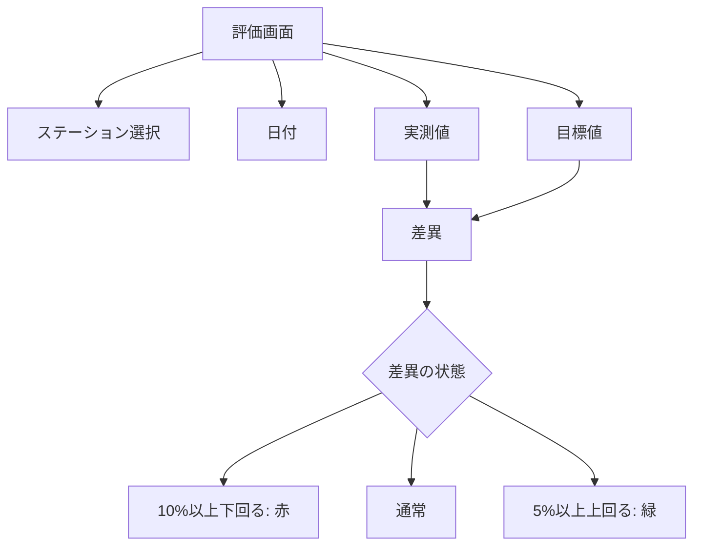

図1: 例として使う UI。

この画面を見ると、組み立てる際に重要な分割があることが分かる。フォームはアプリケーション固有だが、そこでは汎用的なコントロールを使う。ほとんどの GUI 環境には、アプリケーションでそのまま使える共通コントロールが大量に用意されている。新しいコントロールを自分たちで作ることもできるし、そうするのがよい場合も多い。しかしそれでも、汎用的で再利用可能なコントロールと、固有のフォームとのあいだには区別がある。特別に書かれたコントロールでさえ、複数のフォームで再利用できる。

フォームには主に2つの責務がある。

- 画面レイアウト: 画面上のコントロールの配置と、それら相互の階層構造を定義する。
- フォームロジック: コントロールそのものに簡単にはプログラムできない振る舞い。

ほとんどの GUI 開発環境では、フォーム内の空間にコントロールをドラッグアンドドロップできるグラフィカルエディタで、開発者が画面レイアウトを定義できる。これにより、フォームレイアウトの多くは処理される。この方法なら、フォーム上に気持ちよくコントロールを配置するのは簡単だ（ただし、それが常に最良の方法とは限らない。この点には後で戻る）。

コントロールはデータを表示する。この例では測定値に関するデータである。このデータはほぼ常にどこか別の場所から来る。ここでは、多くのクライアントサーバーツールが前提としていた環境である SQL データベースを想定しよう。多くの状況では、関係するデータのコピーが3つある。

- ひとつのコピーはデータベースそのものにある。このコピーはデータの永続的な記録なので、私はこれをレコード状態と呼ぶ。レコード状態は通常、共有され、さまざまな仕組みを通じて複数の人から見える。
- さらに別のコピーは、アプリケーション内のメモリ上の Record Set の中にある。多くのクライアントサーバー環境は、これを容易にするツールを提供していた。このデータはアプリケーションとデータベースの特定のセッションだけに関係するので、私はこれをセッション状態と呼ぶ。本質的には、ユーザーがデータベースへ保存、つまりコミットするまで作業する、一時的なローカル版のデータである。その時点でレコード状態へマージされる。
- 最後のコピーは GUI コンポーネントそのものの中にある。厳密には、これは画面上でそれらが見ているデータなので、私はこれを画面状態と呼ぶ。UI にとって重要なのは、画面状態とセッション状態をどのように同期させるかである。

ここではレコード状態とセッション状態を調整する問題は扱わない。この点については『Patterns of Enterprise Application Architecture』でさまざまな技法を説明した。

画面状態とセッション状態を同期させ続けることは重要な仕事である。これを容易にするためのツールが Data Binding だった。考え方は、コントロールのデータか、その背後にあるレコードセットのどちらかが変更されると、その変更がすぐにもう一方へ伝播されるというものだ。したがって、画面上の実測値を変更すると、テキストフィールドコントロールは、背後にあるレコードセットの正しい列を実質的に更新する。

一般に、データバインディングは扱いが難しくなる。コントロールへの変更がレコードセットを変更し、それがコントロールを更新し、それがまたレコードセットを更新する、という循環を避けなければならないからだ。利用の流れはこうした循環を避ける助けになる。画面が開かれるときにはセッション状態から画面へロードし、その後は画面状態への変更をセッション状態へ戻す。画面が開いた後にセッション状態が直接更新されることは珍しい。

その結果、データバインディングは完全な双方向ではないかもしれない。初期ロードと、その後にコントロールからセッション状態へ変更を伝播することに限られる場合がある。

Data Binding は、クライアントサーバーアプリケーションの機能の多くをかなりうまく扱う。実測値を変更すれば列が更新される。選択中のステーションを変えるだけでも、レコードセット内の現在選択行が変わり、それによって他のコントロールが再表示される。

こうした振る舞いの多くは、フレームワークの作り手によって組み込まれている。彼らは共通のニーズを見て、それを満たしやすくしている。特にこれは、通常プロパティと呼ばれる値をコントロールに設定することで行われる。コントロールは、単純なプロパティエディタを通じて列名を設定されることで、レコードセット内の特定の列に結び付けられる。

適切な種類のパラメータ化を伴うデータバインディングを使えば、かなり遠くまで進める。しかし、それだけで最後まで行けるわけではない。ほとんど常に、パラメータ化の選択肢に収まらないロジックがある。この例では、差異の計算が組み込みの振る舞いに収まらないものだ。これはアプリケーション固有なので、通常はフォームに置かれる。

これを機能させるには、実測値フィールドの値が変わるたびにフォームへ通知される必要がある。つまり、汎用テキストフィールドがフォーム上の特定の振る舞いを呼び出す必要がある。ここには Inversion of Control が関わるため、クラスライブラリを取り出して呼び出して使うだけの場合よりも少し込み入っている。

この種のことを実現する方法はいくつかある。クライアントサーバーツールキットで一般的だったのはイベントという考え方だ。各コントロールは、自分が発生させられるイベントのリストを持っている。外部オブジェクトは、あるイベントに関心があることをコントロールに伝えられる。その場合、イベントが発生するとコントロールはその外部オブジェクトを呼び出す。本質的には、フォームがコントロールを観察しているという Observer パターンの言い換えにすぎない。

フレームワークは通常、フォームの開発者が、イベント発生時に呼び出されるサブルーチンにコードを書ける仕組みを提供していた。イベントとルーチンのリンクが正確にどのように作られるかはプラットフォームによって異なり、ここでの議論には重要ではない。重要なのは、それを実現する何らかの仕組みが存在したということだ。

フォーム内のルーチンに制御が渡れば、そのルーチンは必要なことを何でもできる。固有の振る舞いを実行し、必要に応じてコントロールを変更できる。そして、それらの変更がセッション状態へ伝播されることをデータバインディングに任せる。

これは、データバインディングが常に存在するわけではないためにも必要である。Windows コントロールには大きな市場があり、そのすべてがデータバインディングを行うわけではない。データバインディングが存在しないなら、同期を行うのはフォームの役目になる。この場合、最初にレコードセットからウィジェットへデータを取り出し、保存ボタンが押されたときに変更後のデータをレコードセットへコピーする、という形にできる。

データバインディングが存在すると仮定して、実測値の編集を見てみよう。フォームオブジェクトは汎用コントロールへの直接参照を持つ。画面上の各コントロールにひとつずつあるはずだが、ここでは実測値、差異、目標値の各フィールドだけに注目する。

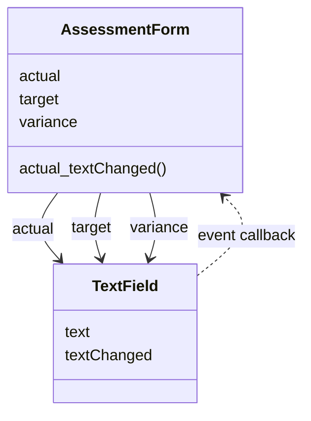

図2: Forms and Controls のクラス図。

テキストフィールドは text changed イベントを宣言する。フォームが初期化中に画面を組み立てるとき、フォームはそのイベントを購読し、自分自身のメソッド、ここでは `actual_textChanged` に結び付ける。

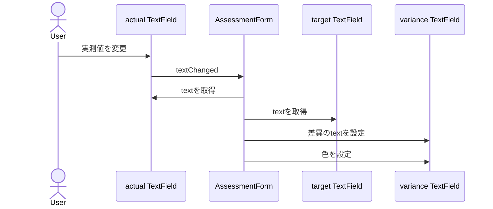

図3: Forms and Controls で実測値を変更するシーケンス図。

ユーザーが実測値を変更すると、テキストフィールドコントロールはイベントを発生させ、フレームワークのバインディングの魔法によって `actual_textChanged` が実行される。このメソッドは実測値と目標値のテキストフィールドからテキストを取得し、引き算を行い、その値を差異フィールドに入れる。また、その値をどの色で表示すべきかも判断し、テキスト色を適切に調整する。

このアーキテクチャは、いくつかの要点にまとめられる。

- 開発者は、汎用コントロールを使うアプリケーション固有のフォームを書く。
- フォームは、その上にあるコントロールのレイアウトを記述する。
- フォームはコントロールを観察し、コントロールが発生させる興味深いイベントに反応するハンドラメソッドを持つ。
- 単純なデータ編集はデータバインディングで処理される。
- 複雑な変更は、フォームのイベントハンドリングメソッドで行われる。

### Model View Controller

UI開発でおそらく最も広く引用されるパターンは Model View Controller、つまり MVC である。そして、それは最も誤引用されるものでもある。私は、MVC と説明されているものを見て、実際にはそれとまったく違うものだった回数を数えきれないほど経験してきた。率直に言って、その理由の多くは、古典的 MVC の一部が今日のリッチクライアントにはあまり意味をなさないことにある。しかし、まずはその起源を見てみよう。

MVC を見るときには、これが本格的な UI 作業を大きな規模で行おうとした最初期の試みのひとつだったことを覚えておくことが重要である。1970年代には、グラフィカルユーザーインターフェースは決して一般的ではなかった。私が先に説明した Forms and Controls モデルは MVC の後に現れた。先に説明したのは、よい意味でも悪い意味でも、それがより単純だからである。

ここでも、Smalltalk-80 の MVC を評価例を使って説明する。ただし、これを行うために Smalltalk-80 の実際の詳細から少し自由に扱っていることに注意してほしい。まず、それはモノクロのシステムだった。

MVC の中心にあり、後のフレームワークに最も大きな影響を与えた考えが、私が Separated Presentation と呼ぶものだ。Separated Presentation の背後にある考えは、現実世界についての私たちの認識をモデル化するドメインオブジェクトと、画面上に見える GUI 要素であるプレゼンテーションオブジェクトとのあいだに、明確な分割を作ることである。

ドメインオブジェクトは完全に自己完結していて、プレゼンテーションへの参照なしに動作すべきである。また、複数のプレゼンテーションを、場合によっては同時にサポートできるべきである。このアプローチは Unix 文化の重要な一部でもあり、今日でも多くのアプリケーションをグラフィカルインターフェースとコマンドラインインターフェースの両方から操作できるようにしている。

MVC では、ドメイン要素はモデルと呼ばれる。モデルオブジェクトは UI について完全に無知である。評価 UI の例について議論を始めるため、モデルを測定値として扱い、その上に興味深いすべてのデータのフィールドを持たせることにしよう。（すぐに見るように、リストボックスの存在によって「何がモデルなのか」という問題はかなり複雑になるが、しばらくはそのリストボックスを無視する。）

MVC では、Forms and Controls で使った Record Set の考えではなく、通常のオブジェクトからなる Domain Model を想定している。これは設計の背後にある一般的な前提を反映している。Forms and Controls は、多くの人がリレーショナルデータベースのデータを簡単に操作したいと考えていることを前提にしていた。MVC は、通常の Smalltalk オブジェクトを操作していることを前提にしている。

MVC のプレゼンテーション部分は、残る2つの要素、ビューとコントローラから作られる。コントローラの仕事は、ユーザーの入力を受け取り、それに対して何をすべきかを判断することである。

ここで強調しておきたいのは、ビューとコントローラが1つずつだけあるわけではないということだ。画面の各要素、各コントロール、そして画面全体に対して、ビューとコントローラのペアがある。したがって、ユーザー入力への反応の最初の部分は、どこが編集されたのかを見つけるために、さまざまなコントローラが協調することになる。この場合は実測値のテキストフィールドなので、そのテキストフィールドコントローラが次に起こることを処理する。

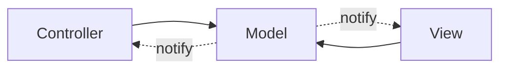

図4: モデル、ビュー、コントローラの本質的な依存関係。実際にはビューとコントローラは互いに直接リンクしているが、開発者は通常その事実を主には使わないため、本質的と呼んでいる。

後の環境と同じように、Smalltalk は再利用できる汎用 UI コンポーネントが必要だと理解していた。この場合のコンポーネントはビューとコントローラのペアになる。両方とも汎用クラスなので、アプリケーション固有の振る舞いに差し込まれる必要があった。画面全体を表し、下位レベルのコントロールのレイアウトを定義する assessment view があり、その意味では Forms and Controls のフォームに似ている。

しかしフォームとは異なり、MVC の assessment controller には、下位レベルのコンポーネントに対するイベントハンドラはない。

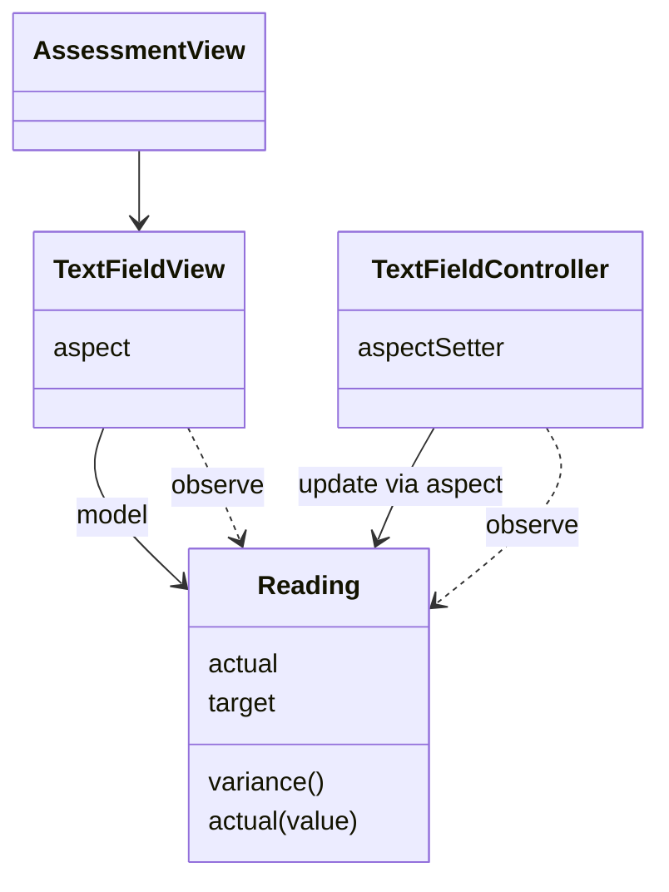

図5: アイスクリーム監視表示を MVC 版にしたときのクラス。

テキストフィールドの構成は、そのモデルである測定値へのリンクを与え、テキストが変わったときにどのメソッドを呼び出すかを伝えることで行われる。画面が初期化されるとき、これは `#actual:` に設定される（先頭の `#` は Smalltalk におけるシンボル、つまり interned string を示す）。テキストフィールドコントローラは、そのメソッドを測定値に対してリフレクションで呼び出し、変更を行う。

本質的には、これは Data Binding で起こる仕組みと同じである。コントロールは背後にあるオブジェクト、つまり行に結び付けられ、自分が操作するメソッド、つまり列を教えられる。

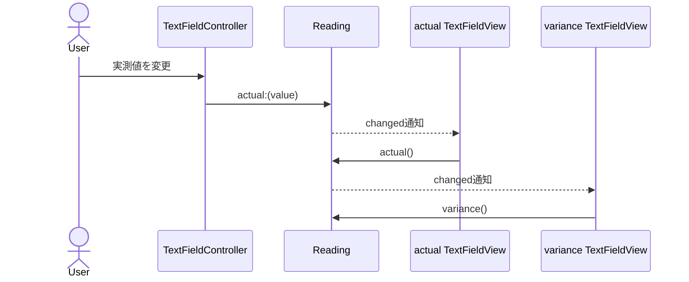

図6: MVC で実測値を変更する。

したがって、低レベルのウィジェットを観察する全体オブジェクトは存在しない。代わりに、低レベルのウィジェットがモデルを観察し、モデル自身が、フォームなら行っていた多くの判断を処理する。この例で差異を計算する場合、それを置く自然な場所は測定値オブジェクト自身である。

MVC には Observer が登場する。実際、それは MVC に帰される考えのひとつである。この場合、すべてのビューとコントローラがモデルを観察する。モデルが変わると、ビューが反応する。この例では、実測値のテキストフィールドビューが、測定値オブジェクトが変わったことを通知され、そのテキストフィールドの aspect として定義されたメソッド、この場合は `#actual` を呼び出し、その結果を値として設定する。（色についても似たことを行うが、これは独自の問題を呼び起こす。そこには後で戻る。）

テキストフィールドコントローラがビュー内の値を直接設定していないことに気づくだろう。コントローラはモデルを更新し、その後は Observer の仕組みに更新を任せている。これは、フォームがコントロールを更新し、データバインディングに背後のレコードセット更新を任せる Forms and Controls のアプローチとはかなり異なる。私はこの2つのスタイルを、Flow Synchronization と Observer Synchronization というパターンとして説明している。

これら2つのパターンは、画面状態とセッション状態の同期を起動する方法の代替案を説明している。Forms and Controls は、アプリケーションの流れが、更新を必要とするさまざまなコントロールを直接操作することで同期を行う。MVC は、モデルを更新し、そのモデルを観察しているビューを Observer 関係に頼って更新する。

Flow Synchronization は、データバインディングが存在しない場合にはさらに明白である。アプリケーションが同期を自分で行う必要があるなら、通常は画面を開くときや保存ボタンを押すときなど、アプリケーションの流れの重要な地点で行われる。

Observer Synchronization の帰結のひとつは、ユーザーが特定のウィジェットを操作したとき、他のどのウィジェットを変更する必要があるかについて、コントローラが非常に無知でいられることだ。フォームは画面状態全体が変更後も一貫しているように物事を把握しておかなければならず、複雑な画面ではそれがかなり込み入る。一方、Observer Synchronization のコントローラは、それを無視できる。

この有用な無知は、同じモデルオブジェクトを見ている複数の画面が開かれている場合に特に便利になる。古典的な MVC の例は、データを表すスプレッドシートのような画面と、そのデータを表す2つほどの異なるグラフが別ウィンドウで開かれているものだった。スプレッドシートウィンドウは、他にどのウィンドウが開かれているかを知る必要がない。モデルを変更するだけで、Observer Synchronization が残りを処理する。

Flow Synchronization であれば、どの他ウィンドウが開いているかを知り、それらに再表示を伝える何らかの方法が必要になる。

Observer Synchronization はよいものだが、欠点もある。Observer Synchronization の問題は、Observer パターンそのものの中心的問題である。コードを読んでも何が起きているのか分からないのだ。Smalltalk-80 のいくつかの画面がどのように動くのかを理解しようとしたとき、私はこのことを非常に強く思い知らされた。コードを読むことである程度までは進めたが、Observer の仕組みが動き出すと、何が起きているのかを見る唯一の方法はデバッガとトレース文だった。

Observer による振る舞いは、暗黙的な振る舞いであるため、理解もデバッグも難しい。

同期に対する異なるアプローチはシーケンス図を見ると特に目立つが、最も重要で、最も影響力が大きい違いは、MVC が Separated Presentation を使っていることだ。実測値と目標値の差異を計算することはドメインの振る舞いであり、UI とは関係がない。その結果、Separated Presentation に従えば、これをシステムのドメイン層に置くべきだということになる。測定値オブジェクトはまさにそれを表している。

測定値オブジェクトを見ると、差異の機能はユーザーインターフェースという概念なしに完全に意味をなす。

しかしここから、いくつかの複雑さを見始められる。MVC 理論の邪魔になる厄介な点を、私は2つほど飛ばしてきた。最初の問題領域は、差異の色を設定することだ。値をどの色で表示するかはドメインの一部ではないので、これは本来ドメインオブジェクトには収まらない。これに対処する最初の一歩は、ロジックの一部がドメインロジックであることに気づくことだ。

ここで行っているのは、差異についての質的な判断である。5%を超えて上回るならよい、10%を超えて下回るなら悪い、それ以外は通常、と呼べるだろう。この評価を行うことは確かにドメインの言葉である。一方、それを色へ対応付け、差異フィールドを変更することはビューのロジックである。問題は、このビューのロジックをどこに置くかにある。それは標準のテキストフィールドの一部ではない。

初期の Smalltalk 開発者たちはこの種の問題に直面し、いくつかの解決策を考えた。上に示した解決策は汚いものだ。動かすためにドメインの純粋さをいくらか妥協する。私も時折、不純なことをするのは認めるが、それを習慣にしないようにはしている。

Forms and Controls とほぼ同じこともできる。評価画面ビューが差異フィールドビューを観察し、差異フィールドが変わったときに評価画面が反応して差異フィールドの文字色を設定するのだ。ここでの問題には、Observer の仕組みをさらに使うことが含まれる。Observer は使えば使うほど複雑さが指数関数的に増していく。また、さまざまなビュー間に追加の結合も生まれる。

私が好む方法は、新しい種類の UI コントロールを作ることだ。本質的に必要なのは、ドメインに質的な値を問い合わせ、それを内部の値と色の表と比較し、それに応じてフォント色を設定する UI コントロールである。その表と、ドメインオブジェクトに問い合わせるメッセージの両方は、評価ビューが自身を組み立てるときに設定する。監視するフィールドの aspect を設定するのと同じである。

このアプローチは、テキストフィールドを簡単にサブクラス化して追加の振る舞いを足せるなら、非常にうまく機能する。これは明らかに、コンポーネントがサブクラス化を可能にするようどれだけよく設計されているかに依存する。Smalltalk ではそれがとても簡単だった。他の環境ではもっと難しいことがある。

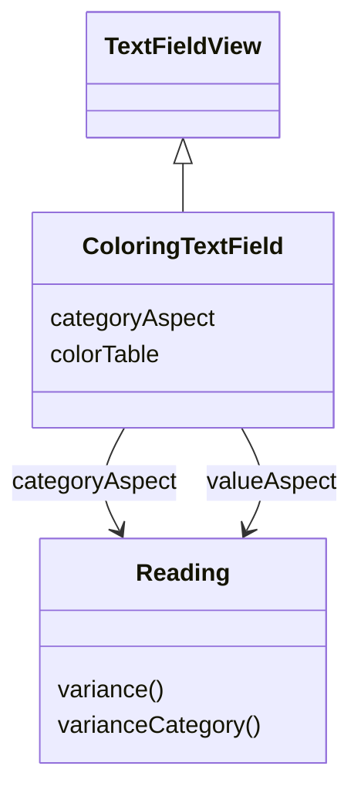

図7: 色を判断できるように構成された、特別なテキストフィールドサブクラスを使う。

最後の道は、新しい種類のモデルオブジェクトを作ることだ。これは画面を中心にしたものだが、それでもウィジェットからは独立している。画面のためのモデルになる。測定値オブジェクト上のメソッドと同じものは単に測定値へ委譲するが、文字色のように UI にだけ関係する振る舞いを支えるメソッドを追加する。

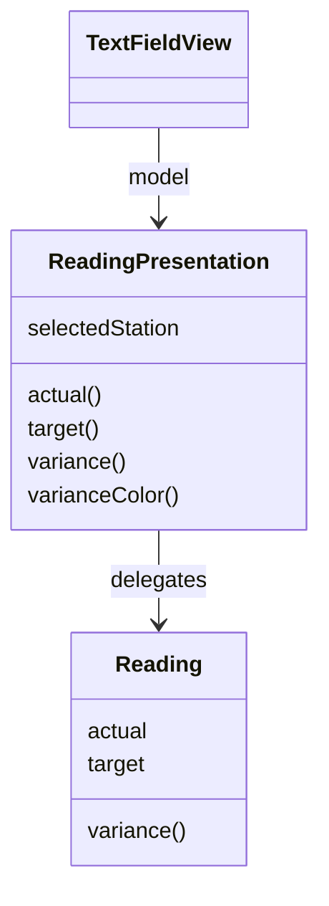

図8: ビューロジックを扱うために中間の Presentation Model を使う。

この最後の選択肢は多くの場合にうまく働く。そして後で見るように、Smalltalk 開発者たちがたどる一般的な道になった。私はこれを Presentation Model と呼ぶ。なぜなら、それは実際にはプレゼンテーション層のために設計された、その一部であるモデルだからだ。（これは MVVM、つまり Model-View-ViewModel としても知られている。）

Presentation Model は、もうひとつのプレゼンテーションロジックの問題、つまりプレゼンテーション状態にもよく機能する。基本的な MVC の考え方は、ビューのすべての状態をモデルの状態から導けると仮定している。この場合、リストボックスでどのステーションが選択されているかをどのように判断するのだろうか。Presentation Model は、この種の状態を置く場所を与えることで、この問題を解決してくれる。

データが変更された場合だけ有効になる保存ボタンがある場合にも、似た問題が起こる。それもモデルそのものではなく、モデルとの相互作用についての状態である。

ここで MVC の要点をまとめよう。

- プレゼンテーション（ビューとコントローラ）とドメイン（モデル）のあいだを強く分離する。これが Separated Presentation である。
- GUI ウィジェットを、ユーザー刺激に反応するコントローラと、モデルの状態を表示するビューに分割する。コントローラとビューは、（ほとんどの場合）直接ではなくモデルを通じて通信すべきである。
- 複数のウィジェットが直接通信せずに更新できるよう、ビュー（およびコントローラ）がモデルを観察する。これが Observer Synchronization である。

### VisualWorks Application Model

上で述べたように、Smalltalk-80 の MVC は非常に影響力があり、優れた特徴も持っていたが、欠点もあった。Smalltalk が1980年代から1990年代にかけて発展するにつれ、これによって古典的 MVC モデルにはいくつかの重要な変形が生まれた。実際、ビューとコントローラの分離を MVC の本質的な部分と考えるなら、MVC はほとんど消えたと言ってもよいかもしれない。名前はそれを示唆しているのだから。

MVC の中で明らかに機能したのは、Separated Presentation と Observer Synchronization だった。そのため、Smalltalk が発展してもこれらは残った。実際、多くの人にとってこれらこそが MVC の重要な要素だった。

この時期、Smalltalk は断片化もした。Smalltalk の基本的な考え、（最小限の）言語定義を含む部分は同じままだったが、異なるライブラリを持つ複数の Smalltalk が発展していった。UI の観点では、いくつかのライブラリがネイティブウィジェット、つまり Forms and Controls スタイルで使われるコントロールを使い始めたことが重要だった。

Smalltalk はもともと Xerox PARC の研究所で開発され、Xerox PARC は Smalltalk を販売・開発するために別会社 ParcPlace をスピンアウトした。ParcPlace Smalltalk は VisualWorks と呼ばれ、クロスプラットフォームシステムであることを重視した。Java よりずっと前に、Windows で書かれた Smalltalk プログラムを Solaris ですぐに動かせた。その結果、VisualWorks はネイティブウィジェットを使わず、GUI を完全に Smalltalk 内に保っていた。

MVC の議論の最後で、私は MVC のいくつかの問題、特にビューロジックとビュー状態をどう扱うかについて述べた。VisualWorks はこれに対処するため、Application Model と呼ばれる構成要素を導入してフレームワークを洗練させた。これは Presentation Model へ近づく構成要素である。Presentation Model のようなものを使う考えは VisualWorks にとって新しいものではなかった。もともとの Smalltalk-80 のコードブラウザは非常によく似ていた。しかし VisualWorks Application Model は、それをフレームワークに完全に組み込んだ。

この種の Smalltalk の重要な要素は、プロパティをオブジェクトに変えるという考え方だった。プロパティを持つオブジェクトについての通常の考えでは、Person オブジェクトが name や address といったプロパティを持つと考える。これらのプロパティはフィールドかもしれないし、別の何かかもしれない。プロパティにアクセスするための標準的な規約が通常ある。Java なら `temp = aPerson.getName()` や `aPerson.setName("martin")` となるし、C# なら `temp = aPerson.name` や `aPerson.name = "martin"` となる。

Property Object は、プロパティが実際の値をラップしたオブジェクトを返すことでこれを変える。VisualWorks で name を求めると、ラッピングオブジェクトが返ってくる。そして実際の値は、そのラッピングオブジェクトに value を問い合わせることで得る。したがって、人の名前へのアクセスは `temp = aPerson name value` や `aPerson name value: 'martin'` になる。

Property Object は、ウィジェットとモデルの対応付けを少し容易にする。ウィジェットに、対応するプロパティを得るためにどのメッセージを送るべきかを伝えるだけでよい。ウィジェットは、適切な値へ `value` と `value:` を使ってアクセスすることを知っている。VisualWorks の Property Object では、`onChangeSend: aMessage to: anObserver` というメッセージで Observer を設定することもできる。

VisualWorks に property object という名前のクラスが実際に見つかるわけではない。代わりに、`value`、`value:`、`onChangeSend:` のプロトコルに従ういくつかのクラスがあった。最も単純なのは ValueHolder で、これは単に値を含む。ここでの議論により関係するのは AspectAdaptor である。AspectAdaptor は、別のオブジェクトのプロパティを完全にラップする Property Object を可能にした。この方法なら、Person オブジェクト上のプロパティをラップする Property Object を PersonUI クラス上に、次のようなコードで定義できる。

```smalltalk
adaptor := AspectAdaptor subject: person
adaptor forAspect: #name
adaptor onChangeSend: #redisplay to: self
```

では、Application Model がこの継続例にどう当てはまるかを見てみよう。

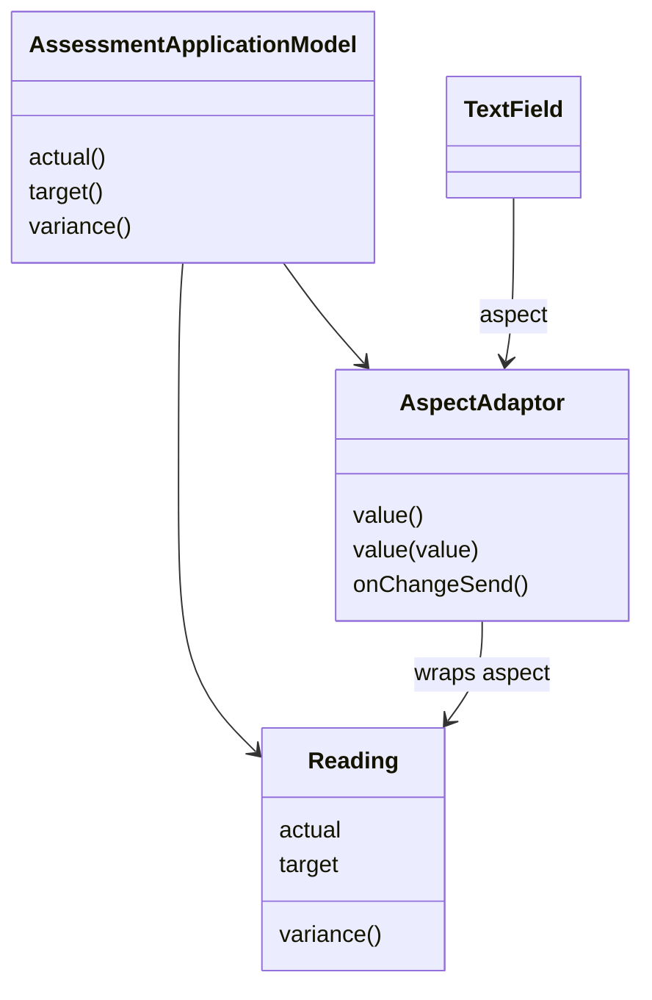

図9: 継続例における VisualWorks Application Model のクラス図。

Application Model を使う場合と古典的 MVC との主な違いは、ドメインモデルクラス（Reading）とウィジェットのあいだに中間クラス、つまり Application Model クラスが入ることだ。ウィジェットはドメインオブジェクトへ直接アクセスしない。ウィジェットのモデルは Application Model である。ウィジェットはいまもビューとコントローラに分かれているが、新しいウィジェットを作っているのでないかぎり、その区別は重要ではない。

UI を組み立てるときは UI painter の中で行い、その painter の中で各ウィジェットに aspect を設定する。aspect は、Property Object を返す Application Model 上のメソッドに対応する。

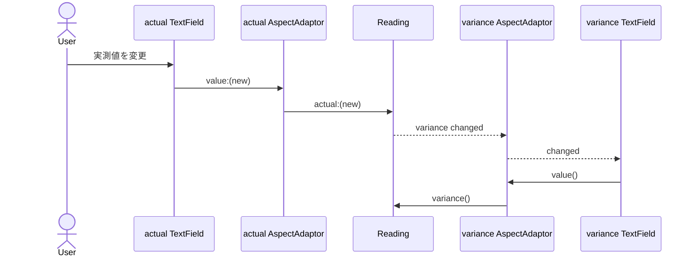

図10: 実測値を更新すると差異テキストが更新される様子を示すシーケンス図。

図10は、基本的な更新シーケンスがどのように働くかを示している。テキストフィールドの値を変更すると、そのフィールドは Application Model 内の Property Object の値を更新する。その更新は背後のドメインオブジェクトへ伝わり、実測値を更新する。

この時点で Observer 関係が動き出す。実測値の更新によって、測定値が変更されたことを示すように設定する必要がある。これを行うには、実測値の変更メソッドの中に、測定値オブジェクトが変更されたこと、特に variance aspect が変更されたことを示す呼び出しを置く。variance の AspectAdaptor を設定するとき、その adaptor に reader を観察させるのは簡単である。そのため adaptor は更新メッセージを拾い、それを自分のテキストフィールドへ転送する。

そのテキストフィールドは、再び AspectAdaptor を通じて新しい値の取得を開始する。

このように Application Model と Property Object を使うと、多くのコードを書かずに更新を配線できる。また、細粒度の同期もサポートする（私はそれがよいことだとは思っていない）。

Application Model によって、UI に固有の振る舞いと状態を本物のドメインロジックから分離できる。したがって、先ほど触れた問題のひとつ、リスト内で現在選択されている項目を保持することは、ドメインモデルのリストをラップし、現在選択されている項目も保存する特定の種類の AspectAdaptor を使うことで解決できる。

しかし、これらすべての制約は、より複雑な振る舞いには特別なウィジェットと Property Object を構築する必要があることだ。例として、提供されているオブジェクト群には、差異の文字色を差異の度合いへ結び付ける方法がない。Application Model とドメインモデルを分離することで、判断を正しい形で分けることはできる。しかし、AspectAdaptor を観察するウィジェットを使うには、いくつか新しいクラスを作る必要がある。

しばしばこれは手間がかかりすぎると見なされた。そのため、図11のように Application Model がウィジェットへ直接アクセスできるようにすると、この種のことをより容易にできた。

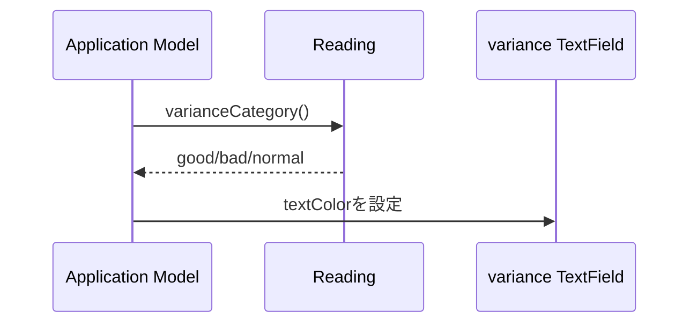

図11: Application Model がウィジェットを直接操作して色を更新する。

このようにウィジェットを直接更新することは Presentation Model の一部ではない。そのため、VisualWorks Application Model は真の Presentation Model ではない。ウィジェットを直接操作する必要性は、多くの人から少し汚い回避策と見なされ、Model-View-Presenter アプローチの発展を助けた。

Application Model の要点は次のとおりである。

- MVC に従い、Separated Presentation と Observer Synchronization を使った。
- プレゼンテーションロジックと状態の置き場として、中間の Application Model を導入した。これは Presentation Model への部分的な発展である。
- ウィジェットはドメインオブジェクトを直接観察せず、代わりに Application Model を観察する。
- さまざまな層の接続を助け、Observer による細粒度の同期を支えるために、Property Object を広く使った。
- Application Model がウィジェットを操作することはデフォルトの振る舞いではなかったが、複雑な場合には一般的に行われていた。

### Model-View-Presenter (MVP)

MVP は、1990年代に IBM で最初に現れ、Taligent でより目に見える形になったアーキテクチャである。最もよく参照されるのは Potel の論文を通じてである。この考えは Dolphin Smalltalk の開発者たちによってさらに普及し、説明された。これから見るように、この2つの説明は完全にはかみ合っていないが、その背後にある基本的な考えは広く使われるようになった。

MVP に近づくには、UI に関する2つの考え方の流れのあいだにある大きな不一致について考えるのが役に立つ。片方には、UI 設計の主流だった Forms and Controls アーキテクチャがある。もう片方には、MVC とその派生がある。Forms and Controls モデルは、理解しやすく、再利用可能なウィジェットとアプリケーション固有のコードをうまく分離する設計を提供する。

それに欠けていて、MVC が非常に強く持っているものが Separated Presentation であり、さらに Domain Model を使ってプログラミングする文脈である。私は MVP を、これらの流れを結び付け、それぞれのよいところを取り込もうとする一歩として見ている。

Potel の最初の要素は、ビューをウィジェットの構造として扱うことだ。このウィジェットは Forms and Controls モデルのコントロールに対応し、ビューとコントローラの分離を取り除く。MVP のビューは、これらのウィジェットの構造である。そこには、ウィジェットがユーザー操作にどう反応するかを説明する振る舞いは含まれない。

ユーザーの行為への能動的な反応は、別の Presenter オブジェクトに置かれる。ユーザージェスチャに対する基本的なハンドラは依然としてウィジェット内に存在するが、これらのハンドラは単に制御を Presenter に渡すだけである。

その後 Presenter は、そのイベントにどう反応するかを決める。Potel はこの相互作用を主にモデルへのアクションとして論じており、それを command と selection の仕組みによって行う。ここで強調しておくと有用なのは、モデルへのすべての編集を command にパッケージするアプローチである。これは undo/redo の振る舞いを提供するためのよい基盤になる。

Presenter がモデルを更新すると、ビューは MVC が使うのと同じ Observer Synchronization アプローチで更新される。

Dolphin の説明も似ている。ここでも主な類似点は Presenter の存在である。Dolphin の説明には、Presenter が command と selection を通じてモデルに作用する構造はない。また、Presenter がビューを直接操作することについて明示的に議論されている。

Potel は Presenter がこれをすべきかどうかについて語っていない。しかし Dolphin にとって、この能力は、Application Model で差異フィールドの文字に色を付けるのが面倒になるような欠点を克服するうえで不可欠だった。

MVP についての考え方のバリエーションのひとつは、Presenter がビュー内のウィジェットをどの程度制御するかである。一方には、すべてのビューロジックをビューに任せ、Presenter がモデルをどう描画するかの判断に関与しない場合がある。これは Potel が示唆するスタイルである。

Bower と McGlashan の方向性は、私が Supervising Controller と呼ぶものだった。ビューは宣言的に記述できるビューロジックのかなりの部分を扱い、Presenter はより複雑な場合を処理するために登場する。

さらに進んで、ウィジェットのすべての操作を Presenter に行わせることもできる。このスタイルを私は Passive View と呼ぶ。これは MVP のもともとの説明には含まれていないが、人々がテスト容易性の問題を探るにつれて発展した。私は後でこのスタイルについて話すが、これは MVP の一種である。

これまでの議論と MVP を対比する前に、ここで扱う2つの MVP 論文のどちらも対比を行っていることに触れておくべきだ。ただし、私とまったく同じ解釈ではない。Potel は MVC のコントローラを全体的な調整役として含意しているが、私はそうは見ていない。Dolphin は MVC の問題について多く語っているが、彼らが MVC と呼んでいるのは、私が説明した古典的 MVC ではなく VisualWorks Application Model の設計である（私は彼らを責めない。古典的 MVC について情報を得るのは、今はもちろん当時でさえ簡単ではなかった）。

では、いくつか対比してみよう。

- Forms and Controls: MVP にはモデルがあり、Presenter はこのモデルを操作し、Observer Synchronization がビューを更新することが期待されている。ウィジェットへの直接アクセスも許されているが、それはモデルを使うことに加えるものであり、第一の選択肢ではない。
- MVC: MVP は Supervising Controller を使ってモデルを操作する。ウィジェットはユーザージェスチャを Supervising Controller に引き渡す。ウィジェットはビューとコントローラに分かれていない。Presenter は、ユーザージェスチャの最初の処理を持たないコントローラのようなものだと考えられる。しかし、Presenter は通常ウィジェットレベルではなくフォームレベルにあることにも注意が必要である。これはおそらく、さらに大きな違いである。
- Application Model: ビューは Application Model に対して行うのと同じように、イベントを Presenter へ引き渡す。しかしビューはドメインモデルから自分自身を直接更新するかもしれず、Presenter は Presentation Model としては振る舞わない。さらに Presenter は、Observer Synchronization に収まらない振る舞いについて、ウィジェットへ直接アクセスしてよい。

MVP の Presenter と MVC の Controller には明らかな類似があり、Presenter は MVC Controller のゆるい形である。そのため、多くの設計は MVP スタイルに従いながら、Presenter の同義語として controller を使うことになる。ユーザー入力を扱うことについて話しているときには、一般に controller という言葉を使うのは妥当だという議論もある。

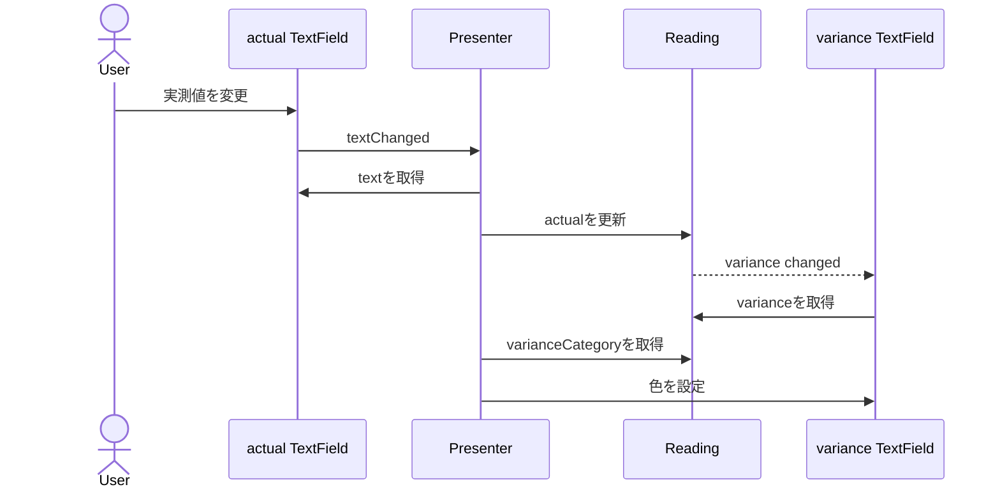

図12: MVP における実測値更新のシーケンス図。

アイスクリーム監視の MVP（Supervising Controller）版を見てみよう（図12）。これは Forms and Controls 版とかなり似た形で始まる。実測値テキストフィールドは、テキストが変更されるとイベントを発生させる。Presenter はこのイベントを聞き、そのフィールドの新しい値を取得する。この時点で Presenter は測定値ドメインオブジェクトを更新し、それを差異フィールドが観察して自分のテキストを更新する。

最後の部分は差異フィールドの色設定で、これは Presenter が行う。Presenter は測定値からカテゴリを取得し、差異フィールドの色を更新する。

MVP の要点は次のとおりである。

- ユーザージェスチャは、ウィジェットから Supervising Controller へ引き渡される。
- Presenter は Domain Model の変更を調整する。
- MVP の異なるバリエーションは、ビュー更新を異なる形で扱う。Observer Synchronization を使うものから、Presenter がすべての更新を行うものまであり、その中間にも多くの選択肢がある。

### Humble View

ここ数年、自己テストするコードを書くことが強い流行になっている。ファッションセンスについて聞く相手として私は最も不向きだが、この動きにはすっかり浸かっている。私の同僚の多くは、xUnit フレームワーク、自動回帰テスト、Test-Driven Development、Continuous Integration、そして似たような流行語の大ファンである。

人々が自己テストするコードについて話すと、ユーザーインターフェースはすぐに問題として顔を出す。多くの人は、GUI のテストが難しいものから不可能なものまでのどこかにあると感じている。その主な理由は、UI が UI 環境全体に強く結合しており、切り離して小さな単位でテストするのが難しいからだ。

このテストの難しさは、時に誇張される。テストコード内でウィジェットを作成し、それを操作することで、驚くほど遠くまで進めることはよくある。しかし、それが不可能な場合もある。重要な相互作用を見落としたり、スレッドの問題があったり、テストの実行が遅すぎたりする。

その結果、テストしにくいオブジェクト内の振る舞いを最小化するように UI を設計する、継続的な動きが生まれた。Michael Feathers はこのアプローチを「The Humble Dialog Box」で簡潔にまとめた。Gerard Meszaros はこの考えを Humble Object の考えへ一般化した。テストが難しいオブジェクトには、最小限の振る舞いだけを持たせるべきだ、というものだ。そうすれば、それをテストスイートに含められない場合でも、検出されない失敗の可能性を最小にできる。

「The Humble Dialog Box」の論文は Presenter を使っているが、もともとの MVP よりもずっと深い形で使っている。Presenter はユーザーイベントにどう反応するかを決めるだけではない。UI ウィジェットへデータを投入すること自体も扱う。その結果、ウィジェットはもはやモデルを見ることも、見る必要もない。ウィジェットは Presenter に操作される Passive View になる。

UI を humble にする方法はこれだけではない。別のアプローチは Presentation Model を使うことだ。ただし、その場合はウィジェットにもう少し振る舞いが必要になる。ウィジェットが自分自身を Presentation Model へどのように対応付けるかを知るだけの振る舞いである。

両方のアプローチの鍵は、Presenter をテストする、または Presentation Model をテストすることで、テストしにくいウィジェットに触れずに UI のリスクの大半をテストできることにある。

Presentation Model では、実際の判断をすべて Presentation Model に行わせることでこれを実現する。すべてのユーザーイベントと表示ロジックは Presentation Model へルーティングされる。そのため、ウィジェットが行う必要があるのは、自分自身を Presentation Model のプロパティへ対応付けることだけである。そうすれば、ウィジェットが存在しなくても Presentation Model の振る舞いの大半をテストできる。残る唯一のリスクは、ウィジェットの対応付けにある。

これが単純であるなら、それをテストしないままでも受け入れられる。この場合、画面は Passive View アプローチほど humble ではないが、その差は小さい。

Passive View は、対応付けさえ存在しないほどウィジェットを完全に humble にするため、Presentation Model に残る小さなリスクさえ取り除く。しかしその代償として、テスト実行中に画面をまねる Test Double が必要になる。これは構築しなければならない追加の仕組みである。

Supervising Controller にも似たトレードオフがある。ビューに単純な対応付けを行わせると多少のリスクは導入されるが、Presentation Model と同じように、単純な対応付けを宣言的に指定できるという利点がある。

Supervising Controller の対応付けは、Presentation Model より小さくなる傾向がある。複雑な更新でさえ Presentation Model では Presentation Model によって決定され、それを対応付ける必要がある。一方、Supervising Controller は、複雑な場合には対応付けを介さずにウィジェットを操作するからである。

### さらに読むもの

これらの考えをさらに発展させた最近の記事については、私の bliki を見てほしい。

### 謝辞

Vassili Bykov は、Hobbes のコピーを快く提供してくれた。これは彼による Smalltalk-80 version 2（1980年代初頭のもの）の実装で、現代の VisualWorks 上で動作する。これにより、Model-View-Controller の生きた例を得ることができ、それがどのように動作し、デフォルトイメージでどのように使われていたかについての詳細な疑問に答えるうえで非常に役立った。当時、多くの人は仮想マシンを使うことを非実用的だと考えていた。

Ubuntu 上で動く VMware 仮想マシン内の Windows XP 上で動く VisualWorks 仮想マシン上で動く VisualWorks で書かれた仮想マシン内で、私が Smalltalk-80 を動かしているのを見たら、昔の私たちは何を思っただろうか。

### 重要な改訂

2006年7月18日: 開発版サイトで初公開。
