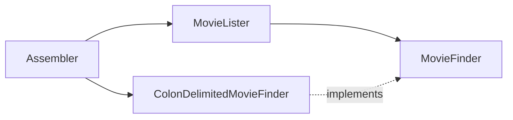

# Inversion of Control Containers and the Dependency Injection pattern

## 要約

依存性注入は、オブジェクトが必要な依存先を自分で作るのではなく、外部から渡してもらう設計です。
これにより、依存関係を差し替えやすくし、テストや構成変更をしやすくできます。

制御の反転コンテナは、この依存関係の生成や接続を管理する仕組みです。
読むときは、コンテナの便利さよりも、依存関係をコードの内部に閉じ込めないという設計原則に注目すると理解しやすいです。

## 読むときの観点

- 依存先を作る責務と、使う責務を分ける。
- Service Locator と Dependency Injection の違いを見る。
- テスト容易性は設計の副産物として捉える。
- コンテナ導入そのものを目的にしない。

## 原文の翻訳

Javaコミュニティでは、さまざまなプロジェクトから来たコンポーネントをまとめ、ひとつのまとまりあるアプリケーションに組み立てるための、軽量コンテナが急速に広まっている。これらのコンテナの根底には、配線を行うための共通したパターンがある。彼らはそれを、かなり一般的な名前である「Inversion of Control」と呼んでいる。この記事では、このパターンがどのように働くのかを、より具体的な名前である **Dependency Injection** として掘り下げ、代替案である Service Locator と比較する。

どちらを選ぶかよりも、**構成と利用を分離する**という原則のほうが重要だ。

Javaのエンタープライズ世界で面白いことのひとつは、主流のJ2EE技術に代わるものを作ろうとする活動が非常に多く、その多くがオープンソースで起きていることだ。この動きの多くは、主流のJ2EE世界にある重厚な複雑さへの反応だが、同時に多くは代替案を探り、創造的なアイデアを生み出す活動でもある。

よく出てくる問題は、異なる要素をどう配線するかだ。ほとんど互いを知らない別々のチームが作った、あるWebコントローラのアーキテクチャと、別のデータベースインターフェースのバックエンドを、どう組み合わせるのか。いくつものフレームワークがこの問題に取り組んできたし、そのうちのいくつかは、さまざまな層のコンポーネントを組み立てる汎用的な機能を提供する方向に広がっている。

これらはしばしば軽量コンテナと呼ばれる。例としては、PicoContainerやSpringがある。

こうしたコンテナの根底には、興味深い設計原則がいくつもある。それらは、特定のコンテナだけでなく、Javaプラットフォームそのものを越えて通用するものだ。ここでは、そのような原則のいくつかを探り始めたい。例はJavaで示すが、私の文章の多くと同じように、その原則はほかのオブジェクト指向環境、特に.NETにも同じように当てはまる。

### コンポーネントとサービス

要素を配線するという話題に入ると、ほとんどすぐに、serviceとcomponentという用語をめぐる厄介な問題に巻き込まれる。これらの定義については、長くて互いに矛盾する記事をいくらでも見つけられる。ここでは、過負荷気味のこれらの用語について、私が現在どのように使っているかを示しておく。

私がcomponentという言葉で意味しているのは、あるアプリケーションから、**変更せずに使われることを意図したソフトウェアのかたまり**だ。そのアプリケーションは、コンポーネントを書いた人たちの管理下にはない。「変更せずに」とは、利用するアプリケーションがコンポーネントのソースコードを変更しないという意味であり、コンポーネントの作者が許した形で拡張して振る舞いを変えることまでは含めてよい。

serviceは、外部のアプリケーションから使われるという点でcomponentに似ている。主な違いは、componentはローカルで使われるものだと私は考えていることだ。jarファイル、assembly、dll、ソースのimportのようなものを思い浮かべるとよい。serviceは、同期か非同期かを問わず、何らかのリモートインターフェースを通じて使われる。たとえばWebサービス、メッセージングシステム、RPC、ソケットなどだ。

この記事では主にserviceという言葉を使うが、同じ論理の多くはローカルコンポーネントにも適用できる。実際、リモートサービスへ簡単にアクセスするには、何らかのローカルコンポーネントフレームワークが必要になることがよくある。ただ、「component or service」と書くのも読むのも面倒だし、いまはserviceのほうがずっと流行している。

### 素朴な例

この話をもう少し具体的にするために、ここでは一貫して使う例を用いる。私の例はいつもそうだが、これは非常に単純化された例だ。現実味がないほど小さいが、実例の泥沼にはまらずに何が起きているかを思い描くには十分だと期待している。

この例では、ある監督が監督した映画の一覧を返すコンポーネントを書いている。この驚くほど有用な機能は、ひとつのメソッドで実装されている。

```java
class MovieLister...
      public Movie[] moviesDirectedBy(String arg) {
          List allMovies = finder.findAll();
          for (Iterator it = allMovies.iterator(); it.hasNext();) {
              Movie movie = (Movie) it.next();
              if (!movie.getDirector().equals(arg)) it.remove();
          }
          return (Movie[]) allMovies.toArray(new Movie[allMovies.size()]);
      }
```

この機能の実装は極端に素朴だ。finderオブジェクトに、それが知っているすべての映画を返すよう依頼する。そのうえで、そのリストを探して、特定の監督による映画だけを返す。この素朴さそのものは直さない。この記事の本当の論点を支える足場にすぎないからだ。

この記事の本当の論点は、このfinderオブジェクト、より正確にはlisterオブジェクトを特定のfinderオブジェクトにどう接続するかである。これが興味深いのは、私のすばらしい`moviesDirectedBy`メソッドを、映画がどのように保存されているかから完全に独立させたいからだ。したがって、このメソッドが参照するのはfinderだけであり、finderが知っているべきことは`findAll`メソッドに応答する方法だけである。これをはっきりさせるために、finderのインターフェースを定義できる。

```java
public interface MovieFinder {
    List findAll();
}
```

ここまでは非常によく分離されている。しかし、どこかの時点で、実際に映画を取り出す具象クラスを用意しなければならない。この例では、そのコードをlisterクラスのコンストラクタに置く。

```java
class MovieLister...

      private MovieFinder finder;
      public MovieLister() {
        finder = new ColonDelimitedMovieFinder("movies1.txt");
      }
```

実装クラスの名前は、映画の一覧をコロン区切りのテキストファイルから得ていることに由来する。詳細は省く。要点は、何らかの実装が存在するということだけだからだ。

このクラスを自分だけで使うなら、これで何の問題もない。だが、友人たちがこのすばらしい機能に圧倒され、私のプログラムのコピーを欲しがったらどうなるだろう。彼らも映画リストを`movies1.txt`という名前のコロン区切りテキストファイルに保存しているなら、すべてはうまくいく。映画ファイルの名前が違うだけなら、そのファイル名をpropertiesファイルに置くのも簡単だ。

しかし、映画リストの保存形式がまったく違ったらどうだろう。SQLデータベース、XMLファイル、Webサービス、あるいは別形式のテキストファイルかもしれない。この場合、そのデータを取得するために別のクラスが必要になる。`MovieFinder`インターフェースを定義しているので、これは`moviesDirectedBy`メソッドを変えることにはならない。それでも、正しいfinder実装のインスタンスをどこかで配置する方法が必要だ。


図1: listerクラス内で単純に生成した場合の依存関係

図1は、この状況における依存関係を示している。`MovieLister`クラスは、`MovieFinder`インターフェースと、その実装の両方に依存している。できればインターフェースだけに依存させたい。しかし、その場合、実際に使うインスタンスをどう作ればよいのだろうか。

私の本『Patterns of Enterprise Application Architecture』では、この状況をPluginとして説明した。finderの実装クラスは、コンパイル時にはプログラムに結びつけられていない。友人たちが何を使うのか、私にはわからないからだ。代わりに、listerがどの実装でも動作し、その実装があとから、私の手を離れたところで差し込まれるようにしたい。問題は、listerクラスが実装クラスを知らないまま、それでも作業を行うためのインスタンスと会話できるように、その結びつきをどう作るかである。

これを実際のシステムに広げると、このようなserviceやcomponentが何十個もあるかもしれない。それぞれの場合に、インターフェースを通じて会話することで、それらのコンポーネント利用を抽象化できる。コンポーネントがインターフェースを意識して設計されていないなら、adapterを使えばよい。しかし、このシステムをさまざまな形でデプロイしたいなら、serviceとのやりとりを扱うためにpluginを使い、デプロイごとに異なる実装を使えるようにする必要がある。

したがって中核的な問題は、これらのpluginをどうアプリケーションへ組み立てるかである。これは新しい世代の軽量コンテナが直面している主な問題のひとつであり、どれも例外なくInversion of Controlを使ってこれを行っている。

### Inversion of Control

これらのコンテナが、自分たちは「Inversion of Control」を実装しているからとても有用なのだ、と語るとき、私はかなり困惑する。Inversion of Controlはフレームワークに共通する性質であり、軽量コンテナが制御の反転を使っているから特別だと言うのは、私の車は車輪があるから特別だと言うようなものだ。

問うべきなのは、**どの側面の制御を反転しているのか**だ。私が最初にInversion of Controlに出会ったのは、ユーザーインターフェースの主制御の文脈だった。初期のユーザーインターフェースは、アプリケーションプログラムによって制御されていた。「名前を入力」「住所を入力」のようなコマンド列があり、プログラムがプロンプトを駆動し、それぞれの応答を受け取っていた。

グラフィカルUI、あるいは画面ベースのUIでは、UIフレームワークがこのメインループを持ち、プログラム側は画面上のさまざまなフィールドに対するイベントハンドラを提供する。プログラムの主制御は反転され、自分の側からフレームワークの側へ移った。

この新しい世代のコンテナにおける反転は、plugin実装をどう探すかに関わる。私の素朴な例では、listerがfinder実装を直接インスタンス化して探していた。これではfinderをpluginにできない。これらのコンテナが使うアプローチは、pluginを利用する側が何らかの規約に従うようにし、それによって別のassemblerモジュールが実装をlisterに注入できるようにすることだ。

その結果、このパターンにはもっと具体的な名前が必要だと私は考える。Inversion of Controlという言葉は一般的すぎるため、人々を混乱させる。そのため、多くのIoC支持者との議論を経て、私たちはDependency Injectionという名前に落ち着いた。

まず依存性注入のいくつかの形を説明する。ただし、ここで指摘しておきたいのは、アプリケーションクラスからplugin実装への依存を取り除く方法は、これだけではないということだ。この目的に使えるもうひとつのパターンがService Locatorであり、Dependency Injectionの説明を終えたあとで取り上げる。

### Dependency Injectionの形

Dependency Injectionの基本的な考え方は、**assemblerという別のオブジェクト**を用意し、それがlisterクラスのフィールドにfinderインターフェースの適切な実装を設定する、というものだ。結果として依存関係は図2のようになる。



図2: Dependency Injectorの依存関係

依存性注入には主に3つのスタイルがある。ここでは、Constructor Injection、Setter Injection、Interface Injectionという名前を使う。Inversion of Controlをめぐる現在の議論でこの話題を読むと、type 1 IoC（interface injection）、type 2 IoC（setter injection）、type 3 IoC（constructor injection）と呼ばれているのを見かけるだろう。数字の名前はかなり覚えにくいので、私はここで使っている名前を採用している。

#### PicoContainerによるConstructor Injection

まず、PicoContainerという軽量コンテナを使って、この注入がどのように行われるかを示す。ここから始める主な理由は、Thoughtworksの私の同僚の何人かがPicoContainerの開発に非常に積極的に関わっているからだ。いわば企業的な身内びいきである。

PicoContainerは、finder実装をlisterクラスにどう注入するかを、コンストラクタを使って決める。これが機能するには、movie listerクラスが、注入してほしいものをすべて含むコンストラクタを宣言している必要がある。

```java
class MovieLister...

      public MovieLister(MovieFinder finder) {
          this.finder = finder;
      }
```

finder自体もpico containerによって管理されるため、テキストファイルのファイル名もコンテナによって注入される。

```java
class ColonMovieFinder...

      public ColonMovieFinder(String filename) {
          this.filename = filename;
      }
```

次にpico containerへ、各インターフェースにどの実装クラスを対応させるか、またfinderにどの文字列を注入するかを伝える必要がある。

```java
private MutablePicoContainer configureContainer() {
    MutablePicoContainer pico = new DefaultPicoContainer();
    Parameter[] finderParams =  {new ConstantParameter("movies1.txt")};
    pico.registerComponentImplementation(MovieFinder.class, ColonMovieFinder.class, finderParams);
    pico.registerComponentImplementation(MovieLister.class);
    return pico;
}
```

この構成コードは、通常は別のクラスに置かれる。この例では、私のlisterを使う友人それぞれが、自分のセットアップクラスに適切な構成コードを書くことになるだろう。もちろん、この種の構成情報を別の設定ファイルに持たせるのも一般的だ。設定ファイルを読み、コンテナを適切に設定するクラスを書くこともできる。

PicoContainer自体はこの機能を持たないが、NanoContainerという密接に関連したプロジェクトがあり、XML設定ファイルを使えるようにする適切なラッパーを提供している。そのようなnano containerはXMLを解析し、その下にあるpico containerを構成する。このプロジェクトの哲学は、設定ファイル形式を根底の仕組みから分離することにある。

コンテナを使うには、次のようなコードを書く。

```java
public void testWithPico() {
    MutablePicoContainer pico = configureContainer();
    MovieLister lister = (MovieLister) pico.getComponentInstance(MovieLister.class);
    Movie[] movies = lister.moviesDirectedBy("Sergio Leone");
    assertEquals("Once Upon a Time in the West", movies[0].getTitle());
}
```

この例ではconstructor injectionを使ったが、PicoContainerはsetter injectionもサポートしている。ただし開発者たちはconstructor injectionを好んでいる。

#### SpringによるSetter Injection

Spring frameworkは、エンタープライズJava開発のための幅広いフレームワークだ。トランザクション、永続化フレームワーク、Webアプリケーション開発、JDBCのための抽象レイヤーを含んでいる。PicoContainerと同じくconstructor injectionとsetter injectionの両方をサポートしているが、開発者たちはsetter injectionを好む傾向にある。そのため、この例にふさわしい選択肢になる。

movie listerが注入を受け入れられるように、そのserviceのための設定メソッドを定義する。

```java
class MovieLister...

      private MovieFinder finder;
    public void setFinder(MovieFinder finder) {
      this.finder = finder;
    }
```

同じように、ファイル名のsetterを定義する。

```java
class ColonMovieFinder...

      public void setFilename(String filename) {
          this.filename = filename;
      }
```

3つ目の手順は、ファイルのための構成を設定することだ。SpringはXMLファイルによる構成もコードによる構成もサポートしているが、通常想定されているやり方はXMLである。

```xml
<beans>
    <bean id="MovieLister" class="spring.MovieLister">
        <property name="finder">
            <ref local="MovieFinder"/>
        </property>
    </bean>
    <bean id="MovieFinder" class="spring.ColonMovieFinder">
        <property name="filename">
            <value>movies1.txt</value>
        </property>
    </bean>
</beans>
```

テストは次のようになる。

```java
public void testWithSpring() throws Exception {
    ApplicationContext ctx = new FileSystemXmlApplicationContext("spring.xml");
    MovieLister lister = (MovieLister) ctx.getBean("MovieLister");
    Movie[] movies = lister.moviesDirectedBy("Sergio Leone");
    assertEquals("Once Upon a Time in the West", movies[0].getTitle());
}
```

#### Interface Injection

3つ目の注入技法は、注入のためのインターフェースを定義して使うことだ。Avalonは、この技法を一部で使っているフレームワークの例である。これについてはあとでもう少し触れるが、ここでは簡単なサンプルコードで使ってみる。

この技法では、まず注入を行うために使うインターフェースを定義する。これは、オブジェクトにmovie finderを注入するためのインターフェースだ。

```java
public interface InjectFinder {
    void injectFinder(MovieFinder finder);
}
```

このインターフェースは、`MovieFinder`インターフェースを提供する人が定義することになる。listerのようにfinderを使いたいクラスは、このインターフェースを実装する必要がある。

```java
class MovieLister implements InjectFinder

      public void injectFinder(MovieFinder finder) {
          this.finder = finder;
      }
```

finder実装にファイル名を注入するためにも、同様の方法を使う。

```java
public interface InjectFinderFilename {
    void injectFilename (String filename);
}
```

```java
class ColonMovieFinder implements MovieFinder, InjectFinderFilename...

      public void injectFilename(String filename) {
          this.filename = filename;
      }
```

次に、いつものように、実装を配線するための構成コードが必要になる。簡単にするため、ここではコードで行う。

```java
class Tester...

      private Container container;
       private void configureContainer() {
         container = new Container();
         registerComponents();
         registerInjectors();
         container.start();
      }
```

この構成には2つの段階がある。lookup keyを通じてコンポーネントを登録するところは、ほかの例とよく似ている。

```java
class Tester...
      private void registerComponents() {
        container.registerComponent("MovieLister", MovieLister.class);
        container.registerComponent("MovieFinder", ColonMovieFinder.class);
      }
```

新しい手順は、依存するコンポーネントを注入するinjectorを登録することだ。それぞれの注入インターフェースには、依存オブジェクトを注入するためのコードが必要になる。ここでは、injectorオブジェクトをコンテナに登録することでこれを行う。それぞれのinjectorオブジェクトはinjectorインターフェースを実装する。

```java
class Tester...
      private void registerInjectors() {
        container.registerInjector(InjectFinder.class, container.lookup("MovieFinder"));
        container.registerInjector(InjectFinderFilename.class, new FinderFilenameInjector());
      }

public interface Injector {
  public void inject(Object target);

}
```

依存される側がこのコンテナ向けに書かれたクラスなら、ここでmovie finderに対して行っているように、コンポーネント自身にinjectorインターフェースを実装させるのが自然だ。文字列のような汎用クラスの場合には、構成コードの内側にinner classを使う。

```java
class ColonMovieFinder implements Injector...

      public void inject(Object target) {
        ((InjectFinder) target).injectFinder(this);
      }

class Tester...
      public static class FinderFilenameInjector implements Injector {
        public void inject(Object target) {
          ((InjectFinderFilename)target).injectFilename("movies1.txt");
        }
        }
```

テストではコンテナを使う。

```java
class Tester...
      public void testIface() {
        configureContainer();
        MovieLister lister = (MovieLister)container.lookup("MovieLister");
        Movie[] movies = lister.moviesDirectedBy("Sergio Leone");
        assertEquals("Once Upon a Time in the West", movies[0].getTitle());
      }
```

コンテナは、宣言された注入インターフェースを使って依存関係を把握し、injectorを使って正しい依存先を注入する。ここで私が作った具体的なコンテナ実装は、この技法にとって重要ではないし、笑われるだけなので示さない。

### Service Locatorを使う

Dependency Injectorの主要な利点は、`MovieLister`クラスが具体的な`MovieFinder`実装に対して持っている依存を取り除くことだ。これにより、私はlisterを友人たちに渡せるし、彼らは自分たちの環境に合った実装を差し込める。注入はこの依存を断ち切る唯一の方法ではない。もうひとつの方法はservice locatorを使うことだ。

service locatorの基本的な考え方は、アプリケーションが必要とし得るすべてのserviceを取得する方法を知っているオブジェクトを持つことである。したがって、このアプリケーションのservice locatorには、必要になったときにmovie finderを返すメソッドがあることになる。もちろん、これは負担を少し移すだけであり、locatorをlisterへ渡す必要は残る。その結果、依存関係は図3のようになる。


図3: Service Locatorの依存関係

ここでは、`ServiceLocator`をsingleton Registryとして使う。listerはインスタンス化されるときに、それを使ってfinderを取得できる。

```java
class MovieLister...

      MovieFinder finder = ServiceLocator.movieFinder();

class ServiceLocator...

      public static MovieFinder movieFinder() {
          return soleInstance.movieFinder;
      }
      private static ServiceLocator soleInstance;
      private MovieFinder movieFinder;
```

注入のアプローチと同じく、service locatorを構成する必要がある。ここではコードで行っているが、設定ファイルから適切なデータを読む仕組みを使うのも難しくない。

```java
class Tester...

      private void configure() {
          ServiceLocator.load(new ServiceLocator(new ColonMovieFinder("movies1.txt")));
      }

class ServiceLocator...

      public static void load(ServiceLocator arg) {
          soleInstance = arg;
      }
      public ServiceLocator(MovieFinder movieFinder) {
          this.movieFinder = movieFinder;
      }
```

テストコードは次のとおりだ。

```java
class Tester...

      public void testSimple() {
          configure();
          MovieLister lister = new MovieLister();
          Movie[] movies = lister.moviesDirectedBy("Sergio Leone");
          assertEquals("Once Upon a Time in the West", movies[0].getTitle());
      }
```

この種のservice locatorは、実装を差し替えられないためテストできず、悪いものだ、という不満を私はよく聞く。たしかに、まずく設計すればそのような問題に陥ることはできる。しかし、そうしなければならないわけではない。この場合、service locatorのインスタンスは単なるデータ保持オブジェクトだ。serviceのテスト実装を使ってlocatorを簡単に作れる。

もっと洗練されたlocatorでは、service locatorをサブクラス化し、そのサブクラスをregistryのクラス変数に渡すこともできる。staticメソッドを、インスタンス変数へ直接アクセスするのではなく、インスタンス上のメソッドを呼ぶように変えられる。thread-specific storageを使って、スレッド固有のlocatorを提供することもできる。これらはすべて、service locatorのクライアントを変えずに実現できる。

このことを考えるひとつの方法は、service locatorはsingletonではなくregistryだと見ることだ。singletonはregistryを実装する簡単な方法を提供するが、その実装上の判断は容易に変更できる。

#### Locatorに分離されたインターフェースを使う

上の単純なアプローチの問題のひとつは、`MovieLister`がservice locatorクラス全体に依存していることだ。実際にはひとつのserviceしか使っていないにもかかわらずである。これはrole interfaceを使うことで減らせる。完全なservice locatorインターフェースを使う代わりに、listerは自分が必要とする部分だけのインターフェースを宣言できる。

この状況では、listerの提供者は、finderを取得するために必要なlocatorインターフェースも提供することになる。

```java
public interface MovieFinderLocator {
    public MovieFinder movieFinder();
```

そしてlocatorは、finderへのアクセスを提供するために、このインターフェースを実装する必要がある。

```java
MovieFinderLocator locator = ServiceLocator.locator();
MovieFinder finder = locator.movieFinder();
public static ServiceLocator locator() {
     return soleInstance;
 }
 public MovieFinder movieFinder() {
     return movieFinder;
 }
 private static ServiceLocator soleInstance;
 private MovieFinder movieFinder;
```

インターフェースを使いたいので、もはやstaticメソッドを通じてserviceへ直接アクセスするだけでは済まないことに気づくだろう。クラスを使ってlocatorインスタンスを取得し、そのインスタンスを使って必要なものを得る必要がある。

#### 動的なService Locator

上の例はstaticだった。つまり、service locatorクラスには、必要なserviceごとにメソッドがあった。やり方はこれだけではない。必要なserviceを何でも格納でき、実行時に選択できるdynamic service locatorを作ることもできる。

この場合、service locatorはserviceごとのフィールドの代わりにmapを使い、serviceの取得とロードのための汎用メソッドを提供する。

```java
class ServiceLocator...
      private static ServiceLocator soleInstance;
      public static void load(ServiceLocator arg) {
          soleInstance = arg;
      }
      private Map services = new HashMap();
      public static Object getService(String key){
          return soleInstance.services.get(key);
      }
      public void loadService (String key, Object service) {
          services.put(key, service);
      }
```

構成では、適切なkeyでserviceをロードする。

```java
class Tester...
      private void configure() {
          ServiceLocator locator = new ServiceLocator();
          locator.loadService("MovieFinder", new ColonMovieFinder("movies1.txt"));
          ServiceLocator.load(locator);
      }
```

serviceを使うときは、同じkey文字列を使う。

```java
class MovieLister...

      MovieFinder finder = (MovieFinder) ServiceLocator.getService("MovieFinder");
```

全体として、私はこのアプローチを好まない。確かに柔軟ではあるが、あまり明示的ではない。serviceに到達する方法を知る唯一の手段がテキストのkeyになってしまう。私は明示的なメソッドのほうを好む。インターフェース定義を見ることで、それらがどこにあるかを見つけやすいからだ。

#### Avalonでlocatorとinjectionの両方を使う

Dependency Injectionとservice locatorは、必ずしも互いに排他的な概念ではない。両方を一緒に使う良い例がAvalonフレームワークだ。Avalonはservice locatorを使うが、componentにlocatorの場所を伝えるためにinjectionを使う。

Berin Loritschが、Avalonを使ったこの一貫例の簡単な版を送ってくれた。

```java
public class MyMovieLister implements MovieLister, Serviceable {
    private MovieFinder finder;
    public void service( ServiceManager manager ) throws ServiceException {
        finder = (MovieFinder)manager.lookup("finder");
    }
```

`service`メソッドはinterface injectionの例であり、containerが`MyMovieLister`にservice managerを注入できるようにしている。service managerはservice locatorの例だ。この例では、listerはmanagerをフィールドに保存しない。代わりに、ただちにそれを使ってfinderをlookupし、そのfinderを保存する。

### どの選択肢を使うか決める

ここまでは、これらのパターンとその変種を私がどのように見ているかを説明することに集中してきた。ここからは、どれをいつ使うべきかを考えるために、それぞれの長所と短所について話し始める。

#### Service LocatorとDependency Injection

根本的な選択は、Service LocatorとDependency Injectionの間にある。最初に言えるのは、どちらの実装も、素朴な例に欠けていた基本的な分離を提供するということだ。どちらの場合でも、アプリケーションコードはserviceインターフェースの具象実装から独立する。2つのパターンの重要な違いは、その実装がアプリケーションクラスへどのように提供されるかにある。

service locatorでは、アプリケーションクラスがlocatorにメッセージを送り、明示的にそれを求める。injectionでは明示的な要求はなく、serviceがアプリケーションクラスの中に現れる。ここに制御の反転がある。

Inversion of Controlはフレームワークに共通する特徴だが、代償もある。理解しにくくなりがちで、デバッグしようとすると問題を引き起こすことがある。そのため、全体として私は、必要でない限り避けたいと考えている。悪いものだと言っているのではない。ただ、より率直な代替案を上回る理由を、自分で示す必要があると思うのだ。

重要な違いは、Service Locatorではserviceを使うすべての利用者がlocatorに依存することだ。locatorはほかの実装への依存を隠せるが、**locatorそのものは見えていなければならない**。したがって、locatorとinjectorのどちらを選ぶかは、その依存が問題になるかどうかにかかっている。

dependency injectionを使うと、componentの依存関係を見やすくできる。dependency injectorでは、constructorのような注入機構を見るだけで依存関係がわかる。service locatorでは、locatorへの呼び出しをソースコードから探さなければならない。参照検索機能を持つ現代的なIDEならこれは楽になるが、それでもconstructorや設定メソッドを見るほど簡単ではない。

この点の多くは、serviceの利用者の性質に左右される。serviceを使うさまざまなクラスを持つアプリケーションを構築しているなら、アプリケーションクラスからlocatorへの依存は大きな問題ではない。私の例のようにMovie Listerを友人たちへ渡すなら、service locatorはかなりうまく機能する。彼らがする必要があるのは、何らかの構成コードか設定ファイルを通じて、locatorを構成し、正しいservice実装を接続することだけだ。

この種のシナリオでは、injectorによる反転が特に説得力のあるものを提供しているとは私は思わない。

違いが出るのは、listerが、ほかの人々が書いているアプリケーションへ私が提供するcomponentである場合だ。この場合、顧客たちが使うservice locatorのAPIについて、私はあまり知らない。顧客ごとに互換性のないservice locatorを持っているかもしれない。この一部は、分離されたインターフェースを使うことで回避できる。

それぞれの顧客は、私のインターフェースを自分たちのlocatorに合わせるadapterを書ける。しかし、いずれにせよ、私固有のインターフェースをlookupするために、最初のlocatorを見なければならない。そしてadapterが現れた時点で、locatorへ直接接続する単純さは薄れ始める。

injectorを使う場合、componentからinjectorへの依存はない。そのためcomponentは、いったん構成されたあとは、injectorから追加のserviceを取得できない。

dependency injectionを好む理由として、人々がよく挙げるのはテストが簡単になることだ。ここでの要点は、テストを行うには、実際のservice実装をstubやmockに簡単に置き換えられなければならない、ということだ。しかし実際には、この点でdependency injectionとservice locatorの間に違いはない。どちらもstub化に非常に適している。この見方は、service locatorを簡単に差し替えられるようにする努力をしていないプロジェクトから来ているのではないかと私は疑っている。

ここで継続的なテストが役に立つ。テストのためにserviceを簡単にstub化できないなら、それは設計に深刻な問題があることを示している。

もちろん、テストの問題は、JavaのEJBフレームワークのような非常に侵入的なcomponent環境では悪化する。私の見方では、この種のフレームワークはアプリケーションコードへの影響を最小化すべきであり、とくに編集から実行までのサイクルを遅くすることはすべきではない。重厚なcomponentをpluginで置き換えられるようにすることは、このプロセスを大いに助ける。これはTest Driven Developmentのような実践にとって重要だ。

したがって主要な問題は、書き手の管理外にあるアプリケーションで使われることを期待したコードを書く人々にある。このような場合、Service Locatorについての最小限の仮定でさえ問題になる。

#### Constructor InjectionとSetter Injection

serviceを組み合わせるには、物事を配線するための何らかの規約が常に必要になる。injectionの利点は主に、非常に単純な規約しか要求しないことだ。少なくともconstructor injectionとsetter injectionではそうである。component側で奇妙なことをする必要はなく、injectorがすべてを構成するのもかなり素直だ。

interface injectionは、すべてを整理するために多くのインターフェースを書かなければならないので、より侵入的である。Avalonのアプローチのように、containerが必要とする少数のインターフェースであれば、それほど悪くはない。しかしcomponentと依存関係を組み立てるためには多くの作業が必要になる。そのため、現在の軽量コンテナ群はsetter injectionとconstructor injectionを採用している。

setter injectionとconstructor injectionの選択は興味深い。これはオブジェクト指向プログラミングにおける、より一般的な問題を映しているからだ。フィールドはconstructorで埋めるべきか、それともsetterで埋めるべきか、という問題である。

オブジェクトについての私の長年の基本姿勢は、できる限り、**構築時点で有効なオブジェクトを作ること**だ。この助言は、Kent Beckの『Smalltalk Best Practice Patterns』にあるConstructor MethodとConstructor Parameter Methodにさかのぼる。引数を持つconstructorは、有効なオブジェクトを作るとはどういうことかを、明らかな場所ではっきり示してくれる。やり方が複数あるなら、その異なる組み合わせを示す複数のconstructorを作ればよい。

constructorで初期化するもうひとつの利点は、setterを提供しないだけで、不変であるべきフィールドを明確に隠せることだ。これは重要だと思う。何かが変わるべきでないなら、setterが存在しないことがそのことを非常によく伝える。初期化にsetterを使うと、これは厄介になり得る。実際、このような状況では、私は通常のsetting規約を避けたい。`initFoo`のようなメソッドのほうがよい。それが誕生時にだけ行うべきものだと強調できるからだ。

しかし、どんな状況にも例外はある。constructorの引数が多いと、特にkeyword parameterのない言語では見苦しくなる。長いconstructorはしばしば、分割すべき責務過多のオブジェクトの兆候であることは事実だが、それが必要になる場合もある。

有効なオブジェクトを構築する方法が複数ある場合、それをconstructorだけで示すのは難しいことがある。constructorは引数の数と型でしか違いを表せないからだ。このようなときにFactory Methodが登場する。Factory Methodはprivate constructorとsetterの組み合わせを使って仕事を実装できる。component assemblyにおける古典的なFactory Methodの問題は、それらが通常staticメソッドと見なされることであり、interface上にはstaticメソッドを持てないことだ。

factory classを作ることはできるが、そうするとそれ自体が別のserviceインスタンスになる。factory serviceはしばしば良い戦術だが、それでもここで述べている技法のいずれかを使ってfactoryをインスタンス化しなければならない。

文字列のような単純な引数がある場合も、constructorには弱点がある。setter injectionなら、それぞれのsetterに名前を付けて、その文字列が何をするものか示せる。constructorでは位置に頼るだけなので、追いにくくなる。

複数のconstructorと継承がある場合、物事はとくに扱いにくくなることがある。すべてを初期化するには、各superclass constructorへ転送するconstructorを用意しながら、自分自身の引数も追加しなければならない。これはconstructorのさらなる爆発につながり得る。

こうした不利な点にもかかわらず、私の好みはconstructor injectionから始めることだ。ただし、上で述べた問題が実際に問題になり始めたら、すぐsetter injectionへ切り替える用意をしておく。

この問題は、フレームワークの一部としてdependency injectorを提供するさまざまなチームの間で、多くの議論を引き起こしてきた。しかし、これらのフレームワークを作る人々の多くは、どちらかへの好みはあるとしても、両方の仕組みをサポートすることが重要だと理解しているようだ。

#### コードか設定ファイルか

別の問題だが、しばしば混同されるものとして、serviceを配線するのに設定ファイルを使うべきか、API上のコードを使うべきかという問題がある。多くの場所へデプロイされる可能性が高いアプリケーションの多くでは、通常、独立した設定ファイルが最も理にかなっている。ほとんどの場合これはXMLファイルになり、それには意味がある。しかし、アセンブリを行うのにプログラムコードを使うほうが簡単な場合もある。ひとつの例は、デプロイ上の変化があまりない単純なアプリケーションだ。

この場合、少しのコードのほうが、独立したXMLファイルより明確になり得る。

対照的なのは、アセンブリがかなり複雑で、条件付きの手順を含む場合だ。プログラミング言語に近づき始めると、XMLは破綻し始める。明確なプログラムを書くための構文をすべて持った本物の言語を使うほうがよい。そこで、アセンブリを行うbuilder classを書く。別々のbuilderシナリオがあるなら、複数のbuilder classを用意し、単純な設定ファイルでそれらを選べる。

人々は設定ファイルを定義したがりすぎることが多い、と私はよく思う。プログラミング言語は、率直で強力な構成メカニズムになることが多い。現代的な言語なら、大きなシステムのpluginを組み立てるために使える小さなassemblerを簡単にコンパイルできる。コンパイルが面倒なら、うまく機能するスクリプト言語もある。

設定ファイルはプログラミング言語を使うべきではない、とよく言われる。非プログラマが編集する必要があるからだという。しかし、これはどれほど頻繁に起こるのだろう。複雑なサーバーサイドアプリケーションのトランザクション分離レベルを、非プログラマが変更することを本当に期待しているのだろうか。言語ではない設定ファイルがうまく機能するのは、それが単純である範囲に限られる。複雑になったなら、適切なプログラミング言語を使うことを考える時期だ。

現在のJava世界で見られることのひとつは、設定ファイルの不協和音だ。各componentが独自の設定ファイルを持ち、それがほかのものとは異なっている。こうしたcomponentを12個使うと、同期を取り続けるべき設定ファイルが簡単に12個になる。

ここでの私の助言は、**すべての構成をプログラム上のインターフェースで簡単に行える方法**を常に提供し、そのうえで独立した設定ファイルを任意の機能として扱うことだ。設定ファイル処理は、プログラム上のインターフェースを使うように簡単に構築できる。componentを書いているなら、プログラム上のインターフェースを使うか、あなたの設定ファイル形式を使うか、自分独自の設定ファイル形式を書いてそれをプログラム上のインターフェースへ結びつけるかは、利用者に委ねればよい。

#### 構成と利用を分離する

このすべてにおける重要な問題は、**serviceの構成を、その利用から分離すること**を確実にすることだ。実際、これはインターフェースと実装の分離と並ぶ、基本的な設計原則である。単一のオブジェクト指向プログラムの中でも、条件ロジックがどのクラスをインスタンス化するかを決め、その後の評価は重複した条件コードではなくポリモーフィズムを通じて行われる、という形でこれを見ることができる。

この分離が単一のコードベース内で有用なら、componentやserviceのような外部要素を使うときには、特に重要になる。最初の問いは、実装クラスの選択を特定のデプロイまで遅らせたいかどうかだ。そうしたいなら、何らかのplugin実装を使う必要がある。

pluginを使うなら、pluginのassemblyをアプリケーションの残りの部分から分離して行うことが不可欠だ。そうすれば、デプロイごとに異なる構成を簡単に差し替えられる。これをどう実現するかは二次的な問題である。この構成メカニズムは、service locatorを構成してもよいし、injectionを使ってオブジェクトを直接構成してもよい。

### さらにいくつかの論点

この記事では、Dependency InjectionとService Locatorを使ったservice構成の基本的な問題に集中してきた。これに関わる話題はほかにもいくつかあり、注意に値するが、まだ掘り下げる時間が取れていない。特にlife-cycle behaviorの問題がある。componentの中には、停止や開始のような明確なlife-cycle eventを持つものがある。もうひとつの論点は、これらのコンテナでaspect-orientedの考え方を使うことへの関心が高まっていることだ。

この記事では今のところこの題材を扱っていないが、この記事を拡張するか、別の記事を書くかして、さらに書きたいと思っている。

これらの考えについては、軽量コンテナに関するWebサイトを見ることで、さらに多くを知ることができる。PicoContainerやSpringのWebサイトからたどっていくと、これらの問題についてのより多くの議論や、さらに進んだ論点の入口に出会えるだろう。

### まとめ

現在の軽量コンテナの急速な広まりには、service assemblyのやり方について共通した根底のパターンがある。それがdependency injector patternだ。Dependency Injectionは、Service Locatorに対する有用な代替案である。アプリケーションクラスを構築する場合、この2つはおおむね同等だが、私はService Locatorのほうが、より率直な振る舞いのため、わずかに優位だと思う。しかし、複数のアプリケーションで使われるクラスを構築しているなら、Dependency Injectionのほうがよい選択になる。

Dependency Injectionを使うなら、いくつものスタイルから選べる。私は、特定の問題にぶつからない限りconstructor injectionに従うことを勧める。そのアプローチで問題が出た場合にはsetter injectionへ切り替える。コンテナを構築する、あるいは入手するなら、constructor injectionとsetter injectionの両方をサポートしているものを探すとよい。

Service LocatorとDependency Injectionのどちらを選ぶかは、アプリケーション内でserviceを利用することからserviceの構成を分離するという原則ほど重要ではない。
