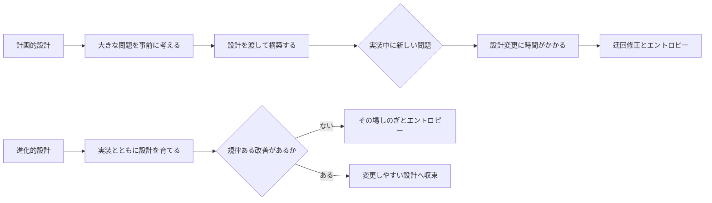
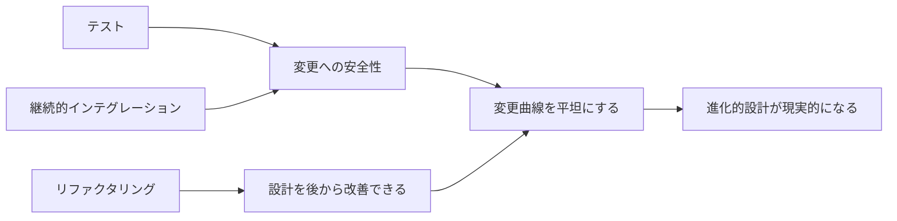

# Is Design Dead?

## 要約

アジャイル開発では、事前にすべてを設計するやり方よりも、動くソフトウェアから学びながら設計を育てる姿勢が重視されます。
しかし、それは設計が不要になったという意味ではありません。

設計を固定された最初の工程としてではなく、継続的な判断と改善の活動として捉えることがこの記事の読みどころです。
設計書を書くかどうかではなく、変更に耐える構造をどう作るかを考える入口になります。

## 読むときの観点

- 事前設計と進化的設計の違いを整理する。
- 設計を工程ではなく、継続する意思決定として見る。
- YAGNIと無設計を混同しない。
- リファクタリングが設計活動の一部であることに注目する。

## 原文の翻訳

Extreme Programming に少し触れただけの多くの人には、XP がソフトウェア設計の死を求めているように見える。多くの設計活動が「Big Up Front Design」として揶揄されるだけでなく、UML、柔軟なフレームワーク、さらにはパターンのような設計技法まで、軽視されたり、まったく無視されたりしているように見えるからだ。しかし実際には、XP には多くの設計が含まれている。ただし、それは既存のソフトウェアプロセスとは異なるやり方で行われる。

XP は、進化的設計という考えをよみがえらせた。進化を現実的な設計戦略にするためのプラクティスを備えているからだ。同時に、設計者には新しい課題とスキルも求められる。単純な設計をどう行うか、設計をきれいに保つためにリファクタリングをどう使うか、そして進化的なスタイルの中でパターンをどう使うかを学ばなければならない。

この論文は、XP 2000 カンファレンスでの基調講演のために書かれ、当初の形はその会議録の一部として発表された。

### 目次

- 計画的設計と進化的設計
- XP を可能にするプラクティス
- 単純さの価値
- そもそも単純さとは何か
- リファクタリングは YAGNI に反するのか
- パターンと XP
- アーキテクチャを育てる
- UML と XP
- メタファについて
- 大きくなったらアーキテクトになりたいか
- 可逆性
- 設計への意思
- リファクタリングで後から入れるのが難しいもの
- 設計は起きているのか
- では、設計は死んだのか

Extreme Programming、すなわち XP は、ソフトウェア開発に関する多くの一般的な前提に異議を唱える。その中でも特に議論を呼ぶのが、大きな事前設計にかなりの労力をかけることを退け、より進化的なアプローチを好む点だ。批判者から見れば、これは「コードを書いて直す」開発への逆戻りであり、たいていはハッキングとして軽蔑される。支持者から見ても、UML のような設計技法、原則、パターンの拒否として受け取られることが多い。設計のことは心配しなくてよい。コードの声に耳を傾けていれば、よい設計は自然に現れる、というわけだ。

私はこの議論の中心にいる。私のキャリアの多くは、UML とその前身にあたる図式的な設計言語、そしてパターンに関わってきた。実際、私は UML とパターンの両方について本を書いている。では、私が XP を受け入れたということは、これらの主題について書いてきたことをすべて撤回し、そうした反革命的な考えを頭から洗い流すという意味なのだろうか。

劇的な緊張感の中で皆さんを宙づりにしておくつもりはない。短い答えは「ノー」だ。長い答えが、この論文の残りである。

### 計画的設計と進化的設計

この論文では、ソフトウェア開発において設計が行われる二つのスタイルを説明する。おそらく最も一般的なのは進化的設計だ。基本的に、進化的設計とは、システムが実装されるにつれてシステムの設計が育っていくという意味である。設計はプログラミングプロセスの一部であり、プログラムが進化するにつれて設計も変化する。

一般的な用法における進化的設計は、災厄である。設計は、その場しのぎの戦術的判断を積み重ねたものになり、それぞれの判断がコードを変更しにくくしていく。多くの意味で、これは設計ではないと言ってよいし、たいていはまずい設計につながる。Kent が言うように、設計は、長期にわたってソフトウェアを容易に変更し続けられるようにするためにある。設計が劣化すれば、効果的に変更する能力も劣化する。

そこにあるのは、ソフトウェアエントロピーの状態だ。時間がたつにつれ、設計はどんどん悪くなる。これはソフトウェアを変更しにくくするだけではない。バグが生まれやすくなり、見つけにくくなり、安全に取り除くことも難しくなる。これが「コードを書いて直す」悪夢であり、プロジェクトが進むにつれて、バグ修正のコストが指数関数的に高くなっていく。

計画的設計はこれへの対抗策であり、他の工学分野から生まれた考えを含んでいる。犬小屋を作りたいなら、木材を集めて大まかな形を作るだけでもよい。しかし高層ビルを建てたいなら、そんなやり方はできない。半分まで建つ前に崩れてしまうだろう。そこで、ボストン中心部にある、私の妻が働いているようなエンジニアリングオフィスで作られる工学図面から始める。彼女は設計を行いながら、問題を洗い出す。その一部は数学的な分析によってだが、大部分は建築基準を使うことによってだ。建築基準とは、何がうまくいくかという経験と、その背後にある多少の数学に基づいて、構造物をどう設計するかを定めた規則である。設計が終わると、彼女のエンジニアリング会社は、その設計を実際に建設する別の会社へ渡すことができる。

ソフトウェアにおける計画的設計も、同じように機能するはずだ。設計者は大きな問題を前もって考え抜く。彼らはコードを書く必要がない。ソフトウェアを作っているのではなく、設計しているからだ。だから UML のような設計技法を使い、プログラミングの細部の一部から離れて、より抽象的なレベルで作業できる。設計が終われば、それを別のグループ、場合によっては別会社に渡して構築させることができる。

設計者はより大きなスケールで考えているので、ソフトウェアエントロピーにつながる一連の戦術的判断を避けられる。プログラマは設計の指示に従うことができ、その設計に従うかぎり、よく構築されたシステムを得られる。

計画的設計のアプローチは 1970 年代から存在し、多くの人が使ってきた。これは「コードを書いて直す」式の進化的設計より、多くの点で優れている。しかし欠点もある。第一の欠点は、プログラミングの中で対処しなければならないすべての問題を、事前に考え抜くことは不可能だという点だ。したがって、プログラミング中に設計へ疑問を投げかける事柄を見つけるのは避けられない。

では、設計者がすでに作業を終えて別のプロジェクトへ移っていたら、何が起きるだろうか。プログラマは設計を迂回してコードを書き始め、エントロピーが入り込む。設計者がいなくなっていないとしても、設計上の問題を整理し、図面を変更し、それからコードを直すには時間がかかる。たいていはもっと早い修正方法があり、時間の圧力もある。だから、またエントロピーが生まれる。

さらに、文化的な問題もしばしば存在する。設計者はスキルと経験によって設計者になるが、設計に忙しすぎて、もはやコードを書く時間をあまり持てない。しかしソフトウェア開発の道具と素材は急速に変化する。コードを書かなくなると、この技術的な変化の中で起きる変化を見逃すだけでなく、コードを書く人たちからの尊敬も失う。

作る人と設計する人の緊張関係は建築にもあるが、ソフトウェアではより強い。なぜなら重要な違いがあるからだ。建築では、設計する人と作る人のスキルにはより明確な分離がある。しかしソフトウェアでは、それほど明確ではない。高度な設計環境で働くプログラマは、誰であれ非常に熟練している必要がある。日々の開発プラットフォームの現実について設計者の知識が薄いときには、とりわけ設計者の設計に疑問を投げかけられるだけのスキルが必要だ。

もちろん、これらの問題は解決できるかもしれない。人間的な緊張を扱えるかもしれない。ほとんどの問題に対処できるほど熟練した設計者を育て、図面を変更できるだけの規律あるプロセスを持てるかもしれない。それでも、もう一つ問題がある。要求の変化だ。私が出会うソフトウェアプロジェクトで頭痛の種となる最大の問題は、要求の変化である。

要求の変化に対処する一つの方法は、要求が変わったときに簡単に変更できるよう、設計に柔軟性を組み込むことだ。しかしそのためには、どのような変化を予期しているのかについて洞察が必要になる。変動しやすい領域に対処するよう設計を計画することはできるし、それは予見された要求変更には役立つ。しかし予見されていない変更には役立たない。むしろ害になることもある。

つまり、変動しやすい領域を切り分けられるほど要求をよく理解していなければならない。そして私の観察では、これは非常に難しい。

これらの要求問題の一部は、要求を十分明確に理解していないことに由来する。そのため、多くの人は要求工学プロセスに注目し、よりよい要求を得ることで、後から設計を変更する必要を防ごうとする。しかし、この方向ですら治療法にはならないかもしれない。予見できない要求変更の多くは、ビジネスの変化によって起きる。要求工学プロセスをどれほど慎重にしても、そうした変化は防げない。

こうして見ると、計画的設計は不可能に思える。確かに大きな課題だ。しかし私は、一般に「コードを書いて直す」形で行われる進化的設計より計画的設計が悪い、と言うつもりはない。実際、私は「コードを書いて直す」より計画的設計を好む。ただし計画的設計の問題を認識しており、新しい方向を探している。

### XP を可能にするプラクティス

XP は多くの理由で議論を呼ぶが、その中でも重要な警告灯の一つは、XP が計画的設計ではなく進化的設計を主張することだ。すでに見たように、その場しのぎの設計判断とソフトウェアエントロピーのために、進化的設計がうまくいくはずはない。

この議論の中心にあるのが、ソフトウェア変更曲線である。変更曲線は、プロジェクトが進むにつれて変更コストが指数関数的に高くなると言う。変更曲線は、たいていはフェーズの言葉で表される。「分析段階なら 1 ドルで済む変更が、本番環境で直すには何千ドルもかかる」といった具合だ。これは皮肉なことでもある。多くのプロジェクトはいまだに分析フェーズを持たない場当たり的なプロセスで動いているが、それでも指数関数的な増加は存在するからだ。

指数関数的な変更曲線は、進化的設計が成り立ち得ないことを意味する。同時に、計画的設計が慎重に行われなければならない理由も示している。計画的設計での誤りも、同じ指数関数的な増加に直面するからだ。

XP の根本的な前提は、進化的設計が機能する程度まで変更曲線を平坦にできる、というものだ。この平坦化は XP によって可能になり、XP によって活用される。これは XP のプラクティス同士が結びついていることの一部である。具体的には、変更曲線を平坦にするプラクティスを行わずに、平坦になった曲線を利用するプラクティスだけを行うことはできない。これが XP をめぐる論争のよくある原因だ。多くの人は、それを可能にする部分を理解せず、活用する部分だけを批判する。

批判はしばしば、批判者自身の経験から来ている。彼らは、活用するプラクティスを機能させるための基礎となるプラクティスを実践せず、その結果として痛い目に遭った。そして XP を見ると、その火傷を思い出す。

それを可能にするプラクティスには多くの要素がある。中心にあるのは、テストと継続的インテグレーションのプラクティスだ。テストが提供する安全性がなければ、XP の残りの部分は不可能だろう。継続的インテグレーションは、チームの同期を保つために必要であり、変更しても他の人の作業と統合できるかを心配せずに済むようにする。この二つを合わせると、変更曲線に大きな影響を与えられる。Thoughtworks で私はこのことをあらためて思い出した。

テストと継続的インテグレーションを導入したことで、開発作業には明らかな改善が見られた。大きな改善を得るにはすべてのプラクティスが必要だという XP の主張に、真剣な疑問を投げかけるには十分なほどだった。

リファクタリングにも同じような効果がある。XP が勧める規律あるやり方でコードをリファクタリングする人は、より緩く、場当たり的な再構成を行う場合に比べ、自分たちの有効性に大きな違いを見いだす。Kent に正しいリファクタリングを教わった後の私の経験も、まさにそうだった。結局、そのような強い変化がなければ、私はリファクタリングについて一冊の本を書く気にはならなかっただろう。

Jim Highsmith は、XP についての優れた要約の中で、天秤の比喩を使っている。片方の皿には計画的設計があり、もう片方にはリファクタリングがある。より伝統的なアプローチでは、後から考えを変えられないという前提があるため、計画的設計が支配的になる。変更コストが下がるにつれて、設計のより多くをリファクタリングとして後から行えるようになる。計画的設計が完全になくなるわけではないが、使える二つの設計アプローチの間に新しいバランスが生まれる。

私にとって、リファクタリング以前の設計は、片手だけで設計していたように感じられる。

継続的インテグレーション、テスト、リファクタリングというこれらのプラクティスは、進化的設計をもっともらしいものにする新しい環境を提供する。しかし、まだ私たちが解明できていないことが一つある。それはバランスの位置だ。外からの印象とは違い、XP は単にテストし、コードを書き、リファクタリングするだけではないと私は確信している。コードを書く前に設計する余地はある。その一部はコードがまったく存在しない段階で行われるし、多くは特定のタスクのコーディングに入る前のイテレーションの中で行われる。

しかし、事前設計とリファクタリングの間には、新しいバランスがある。

### 単純さの価値

XP における最大級の合い言葉に、「機能し得る最も単純なことをせよ」と「それは必要にならない」、すなわち YAGNI がある。どちらも XP の Simple Design プラクティスの現れである。

YAGNI は通常、明日必要になる機能でしか使われないコードを今日追加してはならない、という形で説明される。表面上は単純に聞こえる。問題は、フレームワーク、再利用可能コンポーネント、柔軟な設計のようなものに出てくる。そうしたものは作るのが複雑だ。後でそのコストを取り戻せると期待して、前もって余分なコストを払うことになる。この、事前に柔軟性を作り込むという考えは、効果的なソフトウェア設計の重要な一部と見なされている。

しかし XP の助言は、その機能を必要とする最初のケースのために、柔軟なコンポーネントやフレームワークを作るな、というものだ。そうした構造は、必要になったときに育てればよい。今日、加算は扱うが乗算は扱わない Money クラスが必要なら、Money クラスには加算だけを作り込む。次のイテレーションで乗算が必要になると確信していて、それを簡単に実装する方法が分かっていて、すぐにできると思っていても、私はそれを次のイテレーションまで残しておく。

この理由の一つは経済的なものだ。明日必要になる機能でしか使われない作業を今日行うなら、その分、このイテレーションで完了すべき機能に使う労力が失われる。リリース計画は、今何に取り組む必要があるかを示している。将来のものに取り組むことは、開発者と顧客との合意に反する。このイテレーションのストーリーが完了しないリスクがある。

たとえこのイテレーションのストーリーにリスクがないとしても、どの追加作業を行うべきかは顧客が決めることであり、それでも乗算は含まれないかもしれない。

この経済的な抑止力には、私たちが正しくできないかもしれないという可能性も加わる。その機能がどう動くかについてどれほど確信していても、私たちは間違えることがある。特に、詳細な要求がまだないならなおさらだ。間違った解決策に早く取り組むことは、正しい解決策に早く取り組むことより、さらに無駄が大きい。そして XP の専門家たちは一般に、私たちは正しいより間違っている可能性の方がずっと高いと考えている。私もその感覚に同意する。

単純な設計を求める第二の理由は、複雑な設計は単純な設計より理解しにくいということだ。したがって、複雑さが加わることで、システムのどんな修正も難しくなる。これは、より複雑な設計が追加されてから、それが実際に必要になるまでの期間にコストを加える。

この助言は、多くの人にはナンセンスに聞こえる。そして、そう考えるのは正しい。ただし、それは XP を可能にするプラクティスがない通常の開発世界を想像している場合に限る。計画的設計と進化的設計のバランスが変わったとき、YAGNI はよいプラクティスになる。そのときに限って、だ。

まとめよう。将来のイテレーションまで必要にならない新しい能力を追加するために労力を使いたくはない。そして、たとえ追加コストがゼロであっても、それを追加したくはない。入れるのにコストがかからなくても、修正コストを増やすからだ。ただし、このようにふるまうことが理にかなうのは、XP、あるいは変更コストを下げる類似の技法を使っている場合だけである。

### そもそも単純さとは何か

私たちは、コードをできるだけ単純にしたい。それ自体は反論しにくいだろう。複雑でありたい人などいるだろうか。しかし当然ながら、これは「何が単純なのか」という問いを招く。

Kent は XP Explained の中で、単純なシステムの四つの基準を示している。重要な順に並べると、次のようになる。

- すべてのテストを通る
- 重複がない
- 意図をすべて明らかにしている
- クラスやメソッドの数が最小である

すべてのテストを通る、という基準はかなり単純だ。重複がない、というのもかなり分かりやすい。ただし、多くの開発者はそれをどう達成するかについて手引きを必要とする。やっかいなのは、意図を明らかにするという点だ。それはいったい何を意味するのだろうか。

ここでの基本的な価値は、コードの明瞭さである。XP は、読みやすいコードに高い価値を置く。XP では「賢いコード」は悪口だ。しかし、ある人にとって意図を明らかにするコードが、別の人には賢すぎるコードに見えることもある。

Josh Kerievsky は XP 2000 の論文で、このよい例を示している。彼は、最も公開されている XP コードかもしれない JUnit を取り上げた。JUnit は、テストケースに任意の機能を追加するためにデコレータを使っている。たとえば並行性の同期やバッチセットアップコードなどだ。こうしたコードをデコレータに分離することで、一般的なコードは、そうしない場合より明瞭になる。

しかし、結果としてできたコードが本当に単純なのかは自問しなければならない。私にとっては単純だ。私は Decorator パターンに慣れているからだ。しかし慣れていない多くの人にとっては、かなり複雑である。同じように、JUnit は pluggable methods を使っているが、私が見るかぎり、ほとんどの人は最初、それをまったく明瞭ではないと感じる。では、JUnit の設計は経験豊かな設計者にはより単純で、経験の少ない人にはより複雑だ、と結論づけられるのだろうか。

XP の「Once and Only Once」や Pragmatic Programmer の DRY、つまり Don't Repeat Yourself による重複排除への注目は、明白でありながら素晴らしく強力なよい助言の一つだと思う。それに従うだけでも、かなり遠くまで行ける。しかし、それがすべてではない。単純さを見つけることは、なお複雑なことなのだ。

最近、私は過剰設計だったかもしれないものに関わった。それはリファクタリングされ、柔軟性の一部が取り除かれた。しかし開発者の一人が言ったように、「設計しすぎたものをリファクタリングする方が、設計のないものをリファクタリングするより簡単」なのだ。必要より少し単純にしておくのが最善だが、少し複雑すぎたとしても惨事ではない。

この話全体について私が聞いた最良の助言は、Uncle Bob、つまり Robert Martin からのものだった。彼の助言は、最も単純な設計が何かにこだわりすぎるな、というものだった。結局のところ、後でリファクタリングできるし、すべきだし、実際にそうすることになる。最終的には、すぐに最も単純なものが何かを知っていることより、**リファクタリングする意思**の方がはるかに重要である。

### リファクタリングは YAGNI に反するのか

この話題は最近 XP メーリングリストで出たものであり、XP における設計の役割を見る上で取り上げる価値がある。

基本的に、この問いは、リファクタリングには時間がかかるが機能は追加しない、という点から始まる。YAGNI の要点が、未来ではなく現在のために設計すべきだということなら、これは違反なのだろうか。

YAGNI の要点は、現在のストーリーに必要のない複雑さを追加しない、ということだ。これは単純な設計のプラクティスの一部である。設計をできるだけ単純に保つにはリファクタリングが必要であり、より単純にできると気づいたらいつでもリファクタリングすべきである。

単純な設計は、XP のプラクティスを活用するものであると同時に、それを可能にするプラクティスでもある。テスト、継続的インテグレーション、リファクタリングがあって初めて、単純な設計を効果的に実践できる。しかし同時に、設計を単純に保つことは、変更曲線を平坦に保つために不可欠だ。不要な複雑さは、組み込んだ複雑な柔軟性によって予想した方向を除き、あらゆる方向の変更を難しくする。しかし人は予測が得意ではない。だから単純さを目指すのが最善なのだ。

とはいえ、人は最初から最も単純なものを得られるわけではない。そのため、目標に近づくにはリファクタリングが必要になる。

### パターンと XP

JUnit の例は、必然的にパターンの話へ私を導く。パターンと XP の関係は興味深く、よくある質問でもある。Joshua Kerievsky は、XP ではパターンが十分に強調されていないと論じており、その主張は雄弁なので、ここで繰り返すつもりはない。しかし、多くの人にとってパターンは XP と対立しているように見える、という点は心に留めておく価値がある。

この議論の核心は、パターンがしばしば使われすぎるという点だ。世の中には、GOF を初めて読んだばかりで、32 行のコードに 16 個のパターンを詰め込む伝説的プログラマがあふれている。ある晩、とてもよいシングルモルトに後押しされながら、Kent と一緒に「Not Design Patterns: 23 cheap tricks」という論文の案を検討していたのを覚えている。私たちは、Strategy の代わりに if 文を使う、といったことを考えていた。

その冗談には意味があった。パターンはしばしば使われすぎる。しかし、それでパターンが悪い考えになるわけではない。問題は、どう使うかである。

一つの理論は、単純な設計の力がパターンへ導いてくれる、というものだ。多くのリファクタリングは明示的にそうするし、そうでなくても、単純な設計の規則に従えば、すでにパターンを知らなくてもパターンにたどり着くという考えだ。これは本当かもしれない。しかし、それは本当に最善のやり方だろうか。自分ですべて発明し直すよりも、だいたいどこへ向かっているのかを知り、その問題を進む助けになる本を持っている方がよいに決まっている。

私は今でも、パターンの気配を感じると必ず GOF に手を伸ばす。私にとって効果的な設計とは、パターンの代価を支払う価値があるかを知る必要がある、ということだ。それ自体が一つのスキルである。同様に Joshua が示唆するように、私たちはパターンへ徐々に入っていく方法にも、もっと慣れる必要がある。この点で、XP はパターンの使い方を、一部の人々の使い方とは異なるものとして扱う。しかし、パターンの価値を取り除くわけではまったくない。

ただ、いくつかのメーリングリストを読んでいると、多くの人が XP はパターンを抑制していると見ている、というはっきりした感覚を受ける。XP の提唱者の多くが、パターン運動の指導者でもあったという皮肉があるにもかかわらず、だ。これは、彼らがパターンを超えたものを見たからなのだろうか。それとも、パターンが彼らの思考に深く埋め込まれていて、もはやそれに気づかなくなっているからなのだろうか。他の人についての答えは分からない。しかし私にとって、パターンはいまなお決定的に重要である。

XP は開発のプロセスかもしれない。しかしパターンは、設計知識の背骨であり、どのプロセスを使っていても価値のある知識である。プロセスが異なれば、パターンの使い方も異なるかもしれない。XP は、必要になるまでパターンを使わないこと、そして単純な実装からパターンへ進化していくことの両方を強調する。しかしパターンは、習得すべき重要な知識であり続ける。

パターンを使う XP 実践者への私の助言は、次のとおりだ。

- パターンを学ぶことに時間を投資する。
- いつパターンを適用するかに集中する。早すぎてはいけない。
- まず最も単純な形でパターンを実装し、その後で複雑さを加える方法に集中する。
- パターンを入れた後で、その価値に見合っていないと気づいたなら、再び取り除くことを恐れない。

XP は、パターンの学習をもっと強調すべきだと思う。それを XP のプラクティスにどう組み込むかは分からないが、Kent なら方法を考え出せるだろうと確信している。

### アーキテクチャを育てる

ソフトウェアアーキテクチャとは何を意味するのだろうか。私にとってアーキテクチャという語は、システムの中核要素、変更が難しい部分という概念を伝える。残りのものがその上に築かれなければならない土台である。

進化的設計を使っているとき、アーキテクチャはどのような役割を果たすのだろうか。XP の批判者は、ここでも XP はアーキテクチャを無視していると言う。XP の道筋は、すばやくコードに入り、リファクタリングがすべての設計問題を解決してくれると信じることだ、というのだ。興味深いことに、彼らは正しい。そして、それは弱点かもしれない。確かに、最も攻撃的な XP 実践者である Kent Beck、Ron Jeffries、Bob Martin は、事前のアーキテクチャ設計を避けることに、ますます力を注いでいる。

本当に必要だと分かるまでデータベースを入れない。まずファイルで作業し、後のイテレーションでデータベースをリファクタリングして入れる。

私の同僚 Neal Ford は、進化的設計の技法について、IBM developerWorks の 15 本の記事シリーズでより深く掘り下げている。彼は O'Reilly 向けに、アジャイルエンジニアリングプラクティスのワークショップ動画にも取り組んでいる。

私は臆病な XP 実践者として知られており、その立場から異議を唱えなければならない。幅広い出発点となるアーキテクチャには役割があると思う。たとえば、アプリケーションをどうレイヤ化するか、データベースが必要ならそれとどう相互作用するか、Web サーバを扱うためにどんなアプローチを取るかを早めに述べるようなことだ。

本質的に、これらの領域の多くは、私たちが長年にわたって学んできたパターンだと思う。パターンに関する知識が増えるにつれ、それらをどう使うかについて、妥当な最初の見立てを持てるはずだ。しかし重要な違いは、こうした初期のアーキテクチャ判断が石に刻まれたものだとは期待されていないことだ。むしろチームは、初期判断が誤っているかもしれないことを知っており、それを直す勇気を持つべきなのである。

あるプロジェクトが、デプロイ直前になって EJB はもう不要だと判断し、システムから取り除いたという話を聞いたことがある。それはかなり大きなリファクタリングで、遅い段階で行われた。しかし XP を可能にするプラクティスによって、それは可能だっただけでなく、行う価値があるものになった。

逆方向ならどうだっただろうか。EJB を使わないと決めた場合、後から追加する方が難しかっただろうか。だとすれば、EJB なしで試し、不足していると分かるまでは、決して EJB から始めるべきではないのだろうか。これは多くの要因が絡む問いだ。複雑なコンポーネントなしで作業すれば、確かに単純さは増し、物事は速く進む。しかし、ときにはそのようなものを後から入れるより、取り除く方が簡単な場合もある。

だから私の助言は、まず可能性の高いアーキテクチャを評価することから始めよ、というものだ。複数ユーザーが扱う大量のデータが見えるなら、初日からデータベースを使えばよい。複雑なビジネスロジックが見えるなら、ドメインモデルを入れればよい。ただし YAGNI の神々に敬意を払い、迷ったときは単純さの側に倒す。また、アーキテクチャの一部が何の価値も加えていないと分かったら、すぐにアーキテクチャを単純化する準備をしておくことだ。

### UML と XP

XP への私の関与について受ける質問の中で、最も大きなものの一つは UML との関係をめぐるものだ。この二つは相容れないのではないか、という質問である。

相容れない点はいくつかある。確かに XP は図を大幅に軽視する。公式な立場は「有用なら使う」というものに近いが、「本物の XP 実践者は図を描かない」という強い含みがある。これは、Kent のような人々が図にまったく慣れていないことによって強化されている。実際、私は Kent が何らかの固定記法でソフトウェア図を自発的に描くのを見たことがない。

この問題は二つの別々の原因から来ていると思う。一つは、ソフトウェア図が役に立つと感じる人もいれば、そうでない人もいるという事実だ。危険なのは、役に立つと思う人が、そう思わない人もそうすべきだと考え、その逆もまた起きることだ。そうではなく、図を使う人もいれば使わない人もいる、と受け入れるべきである。

もう一つの問題は、ソフトウェア図が重厚なプロセスと結びつきがちだということだ。そうしたプロセスは、役に立たず、実際には害になることもある図を描くのに多くの時間を費やす。だから私は、XP の専門家たちからよく出てくる「どうしても必要なら使えばいい、弱虫め」というメッセージではなく、図をうまく使い、落とし穴を避ける方法を助言すべきだと思う。

では、図をうまく使うための私の助言を述べよう。

まず、何のために図を描いているのかを意識することだ。主要な価値はコミュニケーションである。効果的なコミュニケーションとは、重要なものを選び、重要でないものを省くことを意味する。この選択性こそが、UML をうまく使う鍵である。すべてのクラスを描かない。重要なものだけを描く。各クラスについて、すべての属性や操作を示さない。重要なものだけを示す。すべてのユースケースやシナリオについてシーケンス図を描かない。重要なものだけを、ということだ。

図の一般的な使い方における共通の問題は、人々が図を包括的にしようとすることだ。包括的な情報の最良の源はコードである。コードはコードと同期させておくのが最も簡単だからだ。図においては、包括性は理解可能性の敵である。

図のよくある用途の一つは、コーディングを始める前に設計を探ることだ。XP ではそのような活動が違法であるかのような印象を受けることが多いが、それは違う。難しいタスクがあるときは、まず集まって短い設計セッションを行う価値がある、と多くの人が言っている。ただし、そのようなセッションを行うときは次のようにする。

- 短く保つ。
- すべての詳細を扱おうとしない。重要なものだけにする。
- その結果の設計を、最終設計ではなくスケッチとして扱う。

最後の点は、少し広げる価値がある。事前設計を行うと、設計のいくつかの側面が間違っていたことに必ず気づく。そしてそれはコーディングして初めて分かる。設計をその後で変更するなら、それは問題ではない。問題は、人々が設計は完了したと考え、コーディングを通じて得た知識を設計へ戻さないときに起きる。

設計を変更することは、必ずしも図を変更することを意味しない。設計を理解するために図を描き、その後で捨てることは完全に妥当である。図を描くことが役に立ったなら、それだけで価値がある。図が永続的な成果物になる必要はない。**最良の UML 図は成果物ではない**。

多くの XP 実践者は CRC カードを使う。これは UML と対立しない。私は CRC と UML を常に混ぜて使っており、その場の仕事に最も役立つ技法を使っている。

UML 図のもう一つの用途は、継続的なドキュメントである。通常の形では、これは CASE ツール上に置かれたモデルだ。このドキュメントを保つことで、人々がシステムで作業する助けになる、という考えである。実際には、ほとんど役に立たないことが多い。

- 図を最新に保つには時間がかかりすぎるため、コードと同期しなくなる。
- CASE ツールや分厚いバインダーの中に隠れているため、誰も見ない。

したがって、継続的なドキュメントについての助言は、これらの観察された問題から導かれる。

- 目立った苦痛なしに最新に保てる図だけを使う。
- 誰もが簡単に見られる場所に図を置く。私は壁に貼るのが好きだ。単純な変更なら、壁のコピーをペンで編集するよう促す。
- 人々がそれを使っているかに注意を払う。使っていないなら捨てる。

UML を使う最後の側面は、あるグループから別のグループへ引き継ぐような、引き継ぎ状況でのドキュメントである。ここでの XP の要点は、ドキュメント作成は他のものと同じユーザーストーリーであり、そのビジネス価値は顧客によって決められるということだ。ここでも UML は有用である。ただし、コミュニケーションを助けるために図が選択的であるなら、だ。詳細情報の保管場所はコードであり、図は重要な問題を要約し、強調するものだということを忘れてはいけない。

### メタファについて

よし、公の場で言ってしまおう。私はいまだに、このメタファというもののコツをつかめていない。C3 プロジェクトでそれがうまく機能するのを見たし、本当にうまくいっていた。しかし、それがどうやって行われるのか、ましてやどう説明すればよいのか、私には分かっているという意味ではない。

XP のメタファのプラクティスは、Ward Cunningham の「名前の体系」というアプローチに基づいている。要点は、ドメインについて話すための語彙として機能する、よく知られた名前の集合を作り出すことだ。この名前の体系は、システム内のクラスやメソッドに名前を付ける方法へ影響する。

私は、ドメインの概念モデルを作ることで名前の体系を作ってきた。ドメインエキスパートと一緒に、UML またはその前身を使ってそうしてきた。これを行うときには注意が必要だと分かった。最小限で単純な記法の集合にとどめる必要があり、技術的な問題がモデルへ入り込まないよう守らなければならない。しかしそれができれば、ドメインエキスパートが理解し、開発者とコミュニケーションするために使えるドメイン語彙を作るのに役立つことが分かった。

そのモデルはクラス設計と完全には一致しないが、ドメイン全体に共通語彙を与えるには十分である。

この語彙が、給与計算を工場の組み立てラインに変えた C3 のメタファのように、比喩的なものであってはならない理由は見当たらない。しかし、名前の体系をドメインの語彙に基づかせることが、なぜそんなに悪い考えなのかも分からない。名前の体系を得るうえで私にとってうまく機能する技法を捨てる気にもならない。

人々はしばしば、システムには少なくとも何らかの概略設計が必要だという理由で XP を批判する。XP 実践者はよく「それがメタファだ」と答える。しかし、私はまだメタファが説得力ある形で説明されるのを見たとは思っていない。これは XP における本当の穴であり、XP 実践者たちが整理しなければならないものだ。

### 大きくなったらアーキテクトになりたいか

この 10 年ほど、「ソフトウェアアーキテクト」という言葉が一般的になってきた。私にとって個人的には使いにくい言葉である。私の妻は構造エンジニアだ。エンジニアとアーキテクトの関係は、なかなか興味深い。私のお気に入りは「アーキテクトは三つの B に役立つ。bulbs、bushes、birds、つまり電球、植え込み、鳥だ」というものだ。これは、アーキテクトがきれいな図面をたくさん作るが、それが実際に立つことを保証しなければならないのはエンジニアだ、という考えである。

その結果、私はソフトウェアアーキテクトという言葉を避けてきた。自分の妻ですら私を専門家として尊重してくれないなら、他の誰に期待できるというのだろう。

ソフトウェアでは、アーキテクトという言葉は多くのことを意味する。ソフトウェアでは、どんな言葉も多くのことを意味するものだ。一般的には、しかし、それはある種の重みを伝える。「私は単なるプログラマではない。アーキテクトだ」というように。これは「私はもうアーキテクトだ。プログラミングをするには偉くなりすぎた」と訳せるかもしれない。すると問いは、技術的リーダーシップを発揮したいとき、日常的なプログラミング作業から自分を切り離すべきなのか、というものになる。

この問いは大きな感情を生む。アーキテクトとしての役割がもうないかもしれないという考えに、人々が非常に怒るのを見てきた。「XP には経験あるアーキテクトの居場所がない」という叫びを、私はよく耳にする。

設計そのものの役割と同じように、XP が経験や優れた設計スキルを評価しないわけではないと思う。実際、XP の提唱者の多く、Kent Beck、Bob Martin、そしてもちろん Ward Cunningham は、私が設計とは何かについて多くを学んだ相手である。しかしそれは、多くの人が技術的リーダーシップと見なす役割から、彼らの役割が変わることを意味する。

例として、Thoughtworks の技術リーダーの一人、Dave Rice を挙げよう。Dave はいくつものライフサイクルを経験しており、50 人規模のプロジェクトで非公式な技術リードの役割を担っていた。彼のリーダーとしての役割は、すべてのプログラマと多くの時間を過ごすことを意味する。助けが必要なプログラマがいれば一緒に作業し、誰が助けを必要としているかを見て回る。重要な兆候は、彼がどこに座っているかだ。長年の Thoughtworks 社員として、彼は好きなオフィスをほぼ何でも選べた。

彼はしばらく、リリースマネージャの Cara とオフィスを共有していた。しかしここ数カ月で、プログラマが働くオープンな場所へ移った。XP が好むオープンな「war room」スタイルの場所である。これは彼にとって重要だった。そこにいることで、何が起きているかが見え、必要なところでいつでも手を貸せるからだ。

XP を知っている人なら、私が XP の明示的な役割である Coach を説明していると分かるだろう。実際、XP が言葉で行ういくつかの遊びの一つは、主要な技術的人物を Coach と呼ぶことだ。その意味は明確である。XP における技術的リーダーシップは、プログラマに教え、彼らが判断するのを助けることで示される。それは優れた技術スキルだけでなく、優れた対人スキルも必要とする役割だ。XP 2000 で Jack Bolles は、孤独な名人の居場所は今やほとんどない、とコメントした。

協働と教育が成功の鍵である。

あるカンファレンスディナーで、Dave と私は XP に声高に反対する人と話した。私たちが自分たちのやっていることを話し合うと、アプローチの類似性はかなり際立っていた。私たちは皆、適応的で反復的な開発を好んでいた。テストも重要だった。だから、彼の反対がなぜあれほど激しいのか、不思議に思った。すると彼が、「私が最後に望むのは、プログラマたちがリファクタリングしたり、設計をいじり回したりすることだ」という趣旨の発言をした。これですべてが明らかになった。

概念上の溝は、その後 Dave が私に言った言葉でさらに明確になった。「彼が自分のプログラマを信頼していないなら、なぜ雇うんだろう」。XP において、経験ある開発者ができる最も重要なことは、自分のスキルをできるだけ多く、より若い開発者へ渡すことだ。重要な判断をすべて下すアーキテクトの代わりに、重要な判断を下せるよう開発者を教えるコーチがいる。

Ward Cunningham が指摘したように、それによって彼は自分のスキルを増幅し、孤独な英雄ができる以上のものをプロジェクトに加えるのである。

### 可逆性

XP 2002 で Enrico Zaninotto は、アジャイル手法とリーン生産方式の結びつきについて論じる興味深い講演を行った。彼の見方では、両方のアプローチの重要な側面の一つは、プロセスにおける不可逆性を減らすことで複雑さに取り組む点にあった。

この見方では、複雑さの主な源の一つは、判断の不可逆性である。判断を簡単に変えられるなら、最初から正しく判断する重要性は下がる。それによって人生はずっと単純になる。進化的設計にとっての帰結は、設計者が自分たちの判断における不可逆性をどう避けるかを考える必要がある、ということだ。

今すぐ正しい判断を下そうとするのではなく、判断を後まで延期する方法、つまりもっと情報が得られるまで待つ方法を探す。あるいは、後で大きな困難なしに取り消せるような形で判断する方法を探す。

この可逆性を支えるという決意は、アジャイル手法がソースコード管理システムと、すべてをそのようなシステムに入れることを非常に重視する理由の一つである。これは、特に長く生きる判断について可逆性を保証するものではない。しかし、たとえめったに使われないとしても、チームに自信を与える土台を提供する。

可逆性を考えて設計することは、誤りを素早く表面化させるプロセスも意味する。反復開発の価値の一つは、短い反復によって、顧客が成長するシステムを見られることだ。要求に誤りがあれば、修正コストが法外になる前に見つけて直せる。この同じ素早い発見は設計にとっても重要である。つまり、問題になりそうな領域がどんな問題を生むかを素早く試せるよう、物事を組み立てなければならない。

また、実際の変更を今行わないとしても、将来の変更がどれほど難しいかを見るための実験には価値がある。事実上、システムのブランチ上で捨てるためのプロトタイプを作るのだ。いくつかのチームは、将来の変更を早い段階でプロトタイプモードで試し、それがどれほど難しいかを見たと報告している。

### 設計への意思

この記事では多くの技術的プラクティスに集中してきたが、置き去りにされやすいものが一つある。人間的な側面である。

進化的設計が機能するには、それを収束へ向かわせる力が必要だ。この力は人からしか来ない。チームの誰かが、設計品質を高く保つという決意を持っていなければならない。

この意思は全員から来る必要はない。もちろん、全員にあればうれしい。しかし通常は、チームの一人か二人が設計を全体として保つ責任を担う。これは、たいてい「アーキテクト」という言葉の下に置かれる仕事の一つである。

この責任は、コードベースを常に見張り、どこかが散らかってきていないかを確認し、問題が制御不能になる前に素早く行動して直すことを意味する。設計の守り手が自分で直す必要はない。しかし、誰かによって直されることを確実にしなければならない。

**設計への意思の欠如**は、進化的設計が失敗する大きな理由であるように見える。人々がこの記事で話してきたことに詳しくても、その意思がなければ設計は起こらない。

### リファクタリングで後から入れるのが難しいもの

すべての設計判断をリファクタリングで扱えるのだろうか。それとも、あまりに広範に影響するため、後から追加するのが難しい問題があるのだろうか。現時点での XP の正統的な立場は、必要になればすべては簡単に追加できるので、YAGNI は常に適用される、というものだ。私は例外があるのではないかと思っている。後から追加することが議論を呼ぶもののよい例は国際化である。これは後から追加するのが非常に苦痛なので、最初から始めるべきものなのだろうか。

そのようなカテゴリーに入るものがあることは、十分想像できる。しかし現実には、まだデータがほとんどない。国際化のようなものを後から追加しなければならないとき、その作業にどれほど労力がかかるかは強く意識する。一方で、それが実際に必要になる前から毎週毎週入れて保守していたら、実際にどれほどの労力がかかったかはあまり意識しない。

また、自分たちがそれを間違っていた可能性が十分あり、そのため結局リファクタリングが必要になったかもしれない、という事実もあまり意識しない。

YAGNI の正当化の一部は、こうした潜在的な必要性の多くが、結局必要にならない、あるいは少なくとも予想した形では必要にならないという点にある。それをしなければ、かなりの労力を節約できる。単純な解決策を実際に必要なものへリファクタリングするための労力は必要になるが、そのリファクタリングは、疑わしい機能をすべて構築するより少ない作業で済む可能性が高い。

この話で心に留めるべきもう一つの問題は、本当にそれをどう行うか知っているのか、ということだ。国際化を何度も行ったことがあるなら、採用すべきパターンを知っているだろう。その場合、正しく行える可能性は高い。その立場にいるなら、予測的な構造を追加することは、その問題に不慣れな場合より望ましいだろう。だから私の助言は、やり方を知っているなら、今行うコストと後で行うコストを判断できる立場にいる、というものだ。

しかし、以前にそれを行ったことがないなら、コストを十分に評価できないだけでなく、うまく行える可能性も低い。その場合は、後から追加すべきだ。そのとき追加して苦痛を感じたとしても、早く追加していた場合よりよい位置にいる可能性が高い。チームはより経験を積み、ドメインをよりよく知り、要求をよりよく理解している。この立場では、後知恵で「どれほど簡単だったか」を振り返りがちだ。しかし、早く追加することは思っているよりずっと難しかったかもしれない。

Thoughtworks で進化的設計の旅を始めたとき、私たちはデータベースを進化的な形で設計できるのかという問いにすぐ直面した。Pramod Sadalage の努力のおかげで、それが明らかに可能であることを発見し、その知識はそれ以来ずっと役立っている。詳しくは、これらの技法を世に紹介した記事を私のサイトで読める。

これはストーリーの順序づけの問題にもつながる。Planning XP で、Kent と私は意見の違いを公然と示した。Kent は、ビジネス価値だけをストーリーの順序を決める要因にすることに賛成している。最初は反対していた Ron Jeffries も、今ではこれに同意している。私はまだ確信していない。ビジネス価値と技術的リスクのバランスだと考えている。この考え方なら、リスクを軽減するため、少なくともいくらかの国際化を早めに入れる方向へ私を動かすだろう。

ただしこれは、国際化が最初のリリースに必要だった場合に限る。できるだけ早くリリースに到達することは決定的に重要である。最初のリリースに必要でないなら、追加の複雑さはすべてその後で行う価値がある。出荷され、動いているコードの力は非常に大きい。顧客の注意を集中させ、信頼性を育て、学習の巨大な源になる。その日付を近づけるために、できることはすべて行うべきだ。

最初のリリース後に何かを追加する方が労力がかかるとしても、早くリリースする方がよい。

どんな新しい技法でも、その支持者が境界条件に自信を持てないのは自然なことだ。ほとんどの XP 実践者は、ある問題について進化的設計は不可能だと言われたことがあり、その後で実際には可能だと発見している。そうした「不可能」な状況を克服した経験は、そのような状況はすべて乗り越えられるという自信につながる。

もちろん、そのような一般化はできない。しかし XP コミュニティが境界にぶつかって失敗するまでは、その境界がどこにあるのかは決して確かではない。他の人が見る潜在的な境界を越えようと試みるのは正しいことだ。

Jim Shore の最近の記事では、国際化を含むいくつかの状況について、潜在的な境界が結局は障壁ではなかった例が論じられている。

### 設計は起きているのか

進化的設計の難しさの一つは、設計が実際に起きているかどうかを見分けるのが非常に難しいことだ。設計をプログラミングと混ぜ合わせることの危険は、プログラミングが設計なしに起こり得る点にある。これは、進化的設計が発散し、失敗する状況である。

開発チームにいるなら、コードベースの品質によって設計が起きているかどうかを感じ取る。コードベースがより複雑になり、扱いにくくなっているなら、十分な設計が行われていない。しかし残念ながら、これは主観的な見方である。設計品質について客観的な見方を与えてくれる信頼できるメトリクスはない。

この可視性の欠如が技術者にとって難しいなら、チームの非技術メンバーにとってはさらに不安なものだ。マネージャや顧客であるあなたは、ソフトウェアがよく設計されているかをどう見分けられるだろうか。それはあなたにとって重要だ。設計の悪いソフトウェアは、将来の修正コストを高くするからだ。簡単な答えはないが、いくつかのヒントはある。

- 技術者の話を聞く。変更の難しさについて不満を言っているなら、その不満を真剣に受け止め、物事を直す時間を与える。
- どれだけのコードが捨てられているかに目を向ける。健全なリファクタリングを行うプロジェクトは、悪いコードを着実に削除していく。何も削除されていないなら、ほぼ間違いなく十分なリファクタリングが行われていない兆候であり、それは設計の劣化につながる。ただし、どんなメトリクスも乱用され得る。主観的であっても、優れた技術者の意見はどんなメトリクスにも優先する。

### では、設計は死んだのか

決してそうではない。しかし設計の性質は変わった。XP における設計は、次のスキルを求める。

- コードをできるだけ明瞭で単純に保ちたいという絶え間ない欲求。
- 必要を見つけたときに自信を持って改善できるリファクタリングスキル。
- パターンに関する十分な知識。解決策だけでなく、いつ使うべきか、どのようにそこへ進化していくかを理解すること。
- 将来の変更を意識して設計すること。今下す判断は将来変更されなければならないと知っていること。
- 設計を理解する必要のある人々へ、それをどう伝えるかを知っていること。コード、図、そして何より会話を使うこと。

これは恐るべきスキルの集合だ。しかし、優れた設計者であることは、いつでも難しいことだった。少なくとも私にとって、XP がそれを本当に簡単にしてくれるわけではない。しかし XP は、効果的な設計について考える新しい方法を与えてくれると思う。進化的設計を、再びもっともらしい戦略にしたからだ。そして私は進化の大ファンである。そうでなければ、私は何になっていたか分からない。

### 謝辞

この数年の間に、私は多くの優れた人々から多くの優れた考えを拾い、盗んできた。その大半は記憶の薄暗がりに消えている。しかし Joshua Kerievsky からよい考えをつまみ取ったことは覚えている。Fred George と Ron Jeffries から多くの有益なコメントをもらったことも覚えている。Ward と Kent から優れた考えがどれほど次々に出てくるかも、忘れられない。

質問してくれる人、誤字を見つけてくれる人には、いつも感謝している。謝辞のリストを保つことについて私は怠慢だったが、その中には Craig Jones、Nigel Thorne、Sven Gorts、Hilary Nelson、Terry Camerlengo が含まれている。

### さらに読む

ソフトウェア設計に対する私のアプローチについて述べた記事をさらに読むには、私の Web サイトにあるソフトウェア設計のガイドページを参照してほしい。そこには、データベースの進化的設計やサービス契約インターフェイスなど、進化的設計の重要な側面に触れる記事が含まれている。

進化的設計の技法について詳しくは、Neal Ford の developerWorks シリーズと動画ワークショップを参照してほしい。

### 重要な改訂

2004 年 5 月: 「設計への意思」「可逆性」「設計は起きているのか」の各セクションを追加。

2001 年 2 月: アーキテクチャを育てること、アーキテクトの役割、リファクタリングで後から追加するのが難しいものに関するセクションを追加して記事を更新。

2000 年 7 月: 元の記事を XP 2000 に提出し、martinfowler.com に掲載。
