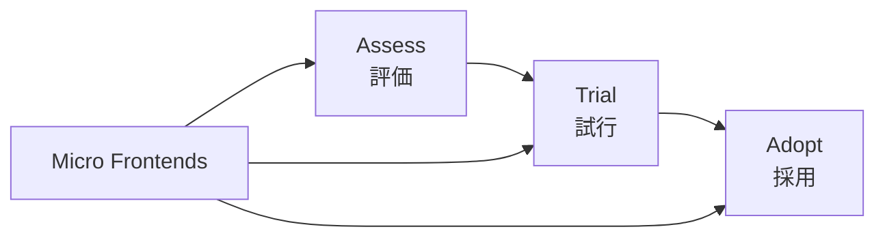
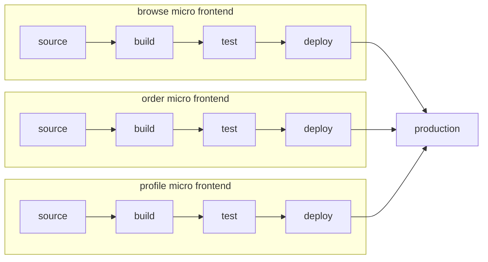
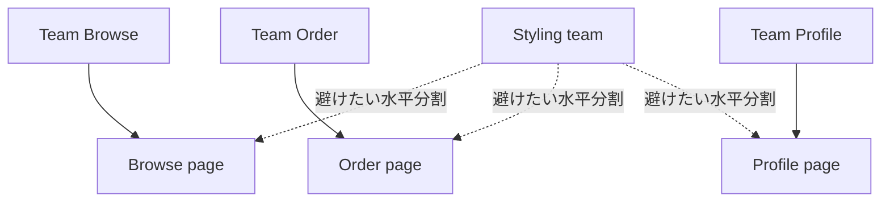
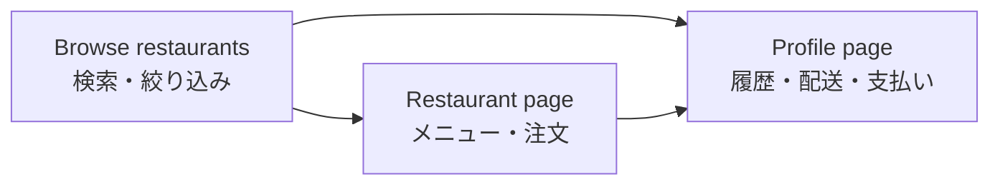
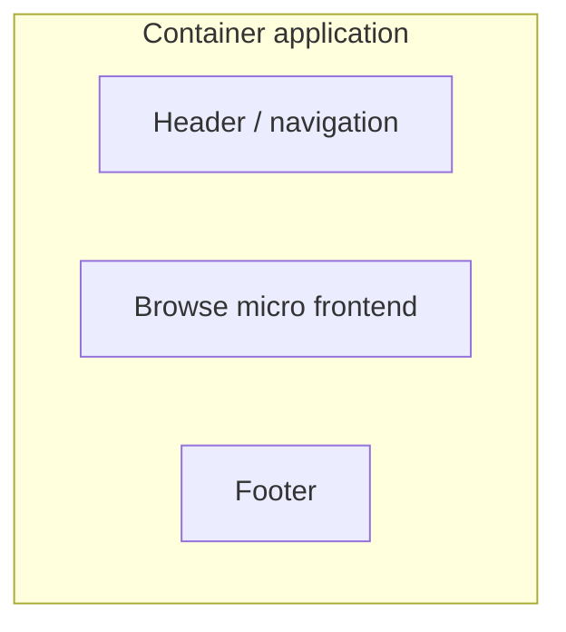
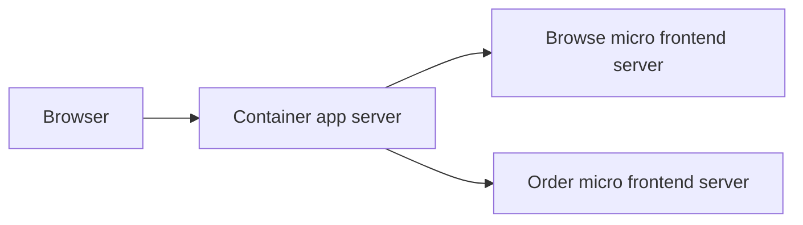
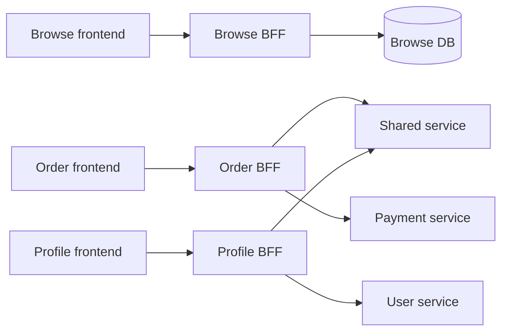
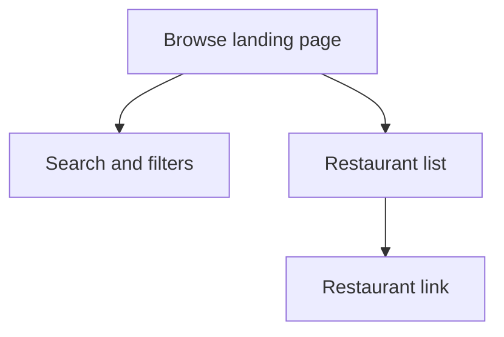
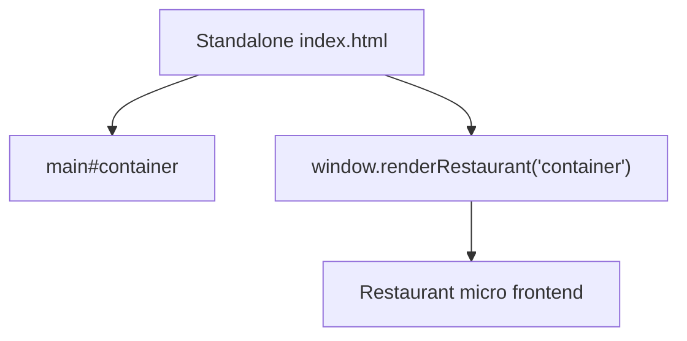
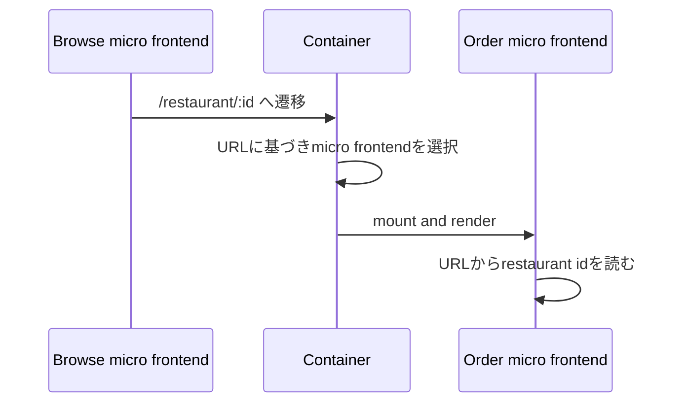

# Micro Frontends

## 要約

マイクロフロントエンドは、フロントエンドを複数の小さなアプリケーションへ分け、それぞれを独立したチームが開発・リリースできるようにする考え方です。
バックエンドのマイクロサービスと同じく、境界の切り方、統合方法、ユーザー体験の一貫性が設計上の焦点になります。

導入すると、チームごとの独立性を高められますが、デザインシステム、共通ライブラリ、ルーティング、認証、パフォーマンスなどの調整コストも増えます。
単一のSPAがつらくなってきたときの選択肢として、何を分け、何を共有するかを考える材料になります。

## 読むときの観点

- UIの分割単位を、画面部品ではなくプロダクト領域から考える。
- 独立リリースとユーザー体験の一貫性を両立できるかを見る。
- 共通基盤を増やしすぎると、独立性を失う点に注意する。
- 技術選択の自由が、本当にチームの速度に効くかを考える。

## 原文の翻訳

良いフロントエンド開発は難しい。多くのチームが大きく複雑なプロダクトで同時に作業できるよう、フロントエンド開発をスケールさせるのはさらに難しい。この記事では、フロントエンドのモノリスを、より小さく扱いやすい多数の部品へ分割する近年の流れと、このアーキテクチャがフロントエンドコードに携わるチームの有効性と効率をどう高めるかを説明する。

さまざまな利点とコストを取り上げるだけでなく、利用できる実装上の選択肢を概観し、この手法を示す完全なサンプルアプリケーションを詳しく見ていく。

近年、マイクロサービスは急速に広まり、多くの組織が、大規模なモノリシックバックエンドの限界を避けるためにこのアーキテクチャスタイルを使っている。サーバーサイドソフトウェアをこのスタイルで構築することについては多く書かれてきたが、今も多くの企業は**モノリシックなフロントエンドコードベース**に苦しんでいる。

たとえば、プログレッシブまたはレスポンシブなWebアプリケーションを作りたいのに、既存コードへそれらの機能を統合し始める簡単な場所が見つからないかもしれない。新しいJavaScriptの言語機能、あるいはJavaScriptへコンパイルできる数多くの言語のどれかを使い始めたいのに、必要なビルドツールを既存のビルドプロセスへ組み込めないかもしれない。

あるいは、複数のチームが単一のプロダクトで同時に作業できるよう開発をスケールさせたいだけかもしれない。しかし既存のモノリスにある結合と複雑さのために、誰もが互いの足を踏んでしまう。これらはすべて現実の問題であり、顧客へ高品質な体験を効率よく届ける能力に悪影響を及ぼしうる。

最近では、複雑で現代的なWeb開発に必要な全体アーキテクチャや組織構造へ、以前より多くの注意が向けられている。とりわけ、フロントエンドモノリスを、独立して開発・テスト・デプロイできる小さく単純な塊へ分解しながら、顧客からは1つのまとまりあるプロダクトに見せるためのパターンが現れてきている。この手法をマイクロフロントエンドと呼び、次のように定義する。

> 独立してデリバリー可能なフロントエンドアプリケーションを、より大きな全体へ合成するアーキテクチャスタイル。

Thoughtworks Technology Radarの2016年11月号では、マイクロフロントエンドを、組織が「評価」すべき技法として掲載した。その後「試行」へ、最後には「採用」へ昇格した。つまり、意味がある場面では使うべき、実証済みのアプローチだと見ている。



図1: マイクロフロントエンドはTech Radarに何度か登場してきた。

マイクロフロントエンドから得られる主な利点として、私たちは次のようなものを見てきた。

- より小さく、凝集度が高く、保守しやすいコードベース。
- 疎結合で自律したチームによる、よりスケールしやすい組織。
- フロントエンドの一部を、以前よりも段階的にアップグレード、更新、場合によっては書き換えられる能力。

これらの目立つ利点が、マイクロサービスの提供する利点の一部と同じであることは偶然ではない。

もちろん、ソフトウェアアーキテクチャにただ飯はない。あらゆるものにはコストが伴う。マイクロフロントエンドの実装によっては依存関係の重複が発生し、ユーザーがダウンロードしなければならないバイト数が増えることがある。加えて、チームの自律性が大きく高まることで、チームの働き方が断片化する可能性もある。それでも、これらのリスクは管理可能であり、マイクロフロントエンドの利点はしばしばコストを上回ると私たちは考えている。

### 利点

マイクロフロントエンドを特定の技術的アプローチや実装詳細で定義するのではなく、ここでは、そこから現れる性質と、それがもたらす利点に重点を置く。

#### 段階的なアップグレード

多くの組織にとって、ここがマイクロフロントエンドの旅の始まりになる。古く大きなフロントエンドモノリスは、昔の技術スタックや、納期のプレッシャーのもとで書かれたコードによって足を引っ張られており、全面的な書き換えが魅力的に見えるところまで来ている。

全面書き換えの危険を避けるため、私たちは古いアプリケーションを一気に捨てるよりも、少しずつ絞め殺すように置き換えたい。その間も、モノリスに押しつぶされずに、顧客へ新機能を届け続ける。

これはしばしばマイクロフロントエンドアーキテクチャへ向かう。あるチームが、古い世界にほとんど手を入れずに機能を本番まで届ける経験をすると、ほかのチームも新しい世界へ参加したくなる。既存コードはなお保守しなければならず、場合によってはそこへ新機能を追加し続けるのが理にかなうこともある。しかし、いまや選択肢が存在する。

ここでの最終的な姿は、プロダクトの個々の部分についてケースバイケースの判断を下し、アーキテクチャ、依存関係、ユーザー体験を段階的にアップグレードできる自由を得ることだ。主要フレームワークに大きな破壊的変更があっても、世界を止めてすべてを一度にアップグレードする必要はない。各マイクロフロントエンドは、意味があるタイミングでアップグレードできる。

新しい技術や新しいインタラクションのあり方を試したいときも、以前より**隔離された形で実験**できる。

#### 単純で疎結合なコードベース

個々のマイクロフロントエンドのソースコードは、定義上、単一のモノリシックなフロントエンドのソースコードよりずっと小さくなる。これらの小さなコードベースは、開発者にとって単純で扱いやすい傾向がある。特に、本来互いを知るべきではないコンポーネント間の、意図せず不適切な結合から生じる複雑さを避けられる。アプリケーションの境界づけられたコンテキストの周囲に太い線を引くことで、そうした偶発的な結合が生まれにくくなる。

もちろん、「マイクロフロントエンドにしよう」という単一の高レベルなアーキテクチャ判断は、昔ながらのクリーンコードの代わりにはならない。私たちは、自分たちのコードについて考えたり、その品質へ努力を払ったりする責任を免れようとしているわけではない。むしろ、悪い判断を難しくし、良い判断を容易にすることで、成功へ落ちやすい穴を自分たちの前に作ろうとしている。

たとえば、境界づけられたコンテキストをまたいでドメインモデルを共有することは難しくなるため、開発者はそれをしにくくなる。同様に、マイクロフロントエンドは、アプリケーションの異なる部分の間でデータやイベントがどう流れるかについて、明示的かつ意図的になるよう促す。これは本来、いずれにしてもやるべきことだった。

#### 独立したデプロイ

マイクロサービスと同じく、マイクロフロントエンドでは**独立してデプロイできること**が重要である。これにより、個々のデプロイの範囲が狭まり、それに伴ってリスクも下がる。フロントエンドコードがどのように、どこでホストされているかに関係なく、各マイクロフロントエンドは独自の継続的デリバリーパイプラインを持つべきだ。そのパイプラインは、ビルド、テスト、デプロイを本番まで実行する。ほかのコードベースやパイプラインの現在の状態をほとんど気にせずに、各マイクロフロントエンドをデプロイできなければならない。

古いモノリスが固定された手作業の四半期リリースサイクルに乗っていても、隣のチームが未完成または壊れた機能をmasterブランチへ押し込んでいても、関係ないはずだ。あるマイクロフロントエンドが本番へ行ける状態なら、そうできるべきであり、その判断はそれを作り保守するチームに委ねられるべきだ。



図2: 各マイクロフロントエンドは独立して本番へデプロイされる。

#### 自律したチーム

コードベースとリリースサイクルの両方を疎結合にすることの高次の利点として、プロダクトの一部をアイデア段階から本番、その後まで所有する、完全に独立したチームへかなり近づける。チームは顧客へ価値を届けるために必要なものをすべて完全に所有でき、それによって素早く効果的に動ける。これを機能させるには、チームを技術能力ではなく、ビジネス機能の縦のスライスを中心に編成する必要がある。

その簡単な方法は、エンドユーザーに見えるものに基づいてプロダクトを切り分けることだ。つまり、各マイクロフロントエンドがアプリケーションの単一ページをカプセル化し、単一チームがエンドツーエンドで所有する。これにより、スタイリング、フォーム、バリデーションのような技術的または「水平」な関心ごとを中心にチームを作るよりも、チームの仕事の凝集度が高くなる。



図3: 各アプリケーションは単一チームが所有するべきである。

#### 要するに

要するに、マイクロフロントエンドとは、大きく恐ろしいものを、より小さく管理しやすい部品に切り分け、その間の依存関係を明示することだ。私たちの技術選択、コードベース、チーム、リリースプロセスは、過度な調整なしに、それぞれ独立して動作し進化できるべきである。

### 例

顧客が食事の配達を注文できるWebサイトを想像してみよう。表面上はかなり単純な概念だが、うまく作ろうとすると驚くほど多くの詳細がある。

- 顧客がレストランを閲覧し、検索できるランディングページが必要だ。レストランは、価格、料理の種類、顧客が以前に注文したものなど、さまざまな属性で検索・絞り込みできるべきである。
- 各レストランには独自のページが必要だ。そこではメニュー項目を表示し、割引、セットメニュー、特別なリクエストを含め、顧客が食べたいものを選べるようにする。
- 顧客にはプロフィールページが必要だ。注文履歴を見たり、配送を追跡したり、支払いオプションをカスタマイズしたりできる。



図4: 食事配達サイトには、そこそこ複雑なページが複数ありうる。

各ページには十分な複雑さがあり、それぞれに専任チームを置くことを容易に正当化できる。そして各チームは、ほかのすべてのチームとの衝突や調整を気にせず、自分たちのページで独立して作業できるべきだ。コードを開発、テスト、デプロイ、保守できるべきである。一方、顧客からは、単一で途切れのないWebサイトに見えなければならない。

この記事の残りでは、サンプルコードやシナリオが必要なところで、このサンプルアプリケーションを使っていく。

### 統合アプローチ

上の定義はかなり緩いため、マイクロフロントエンドと呼んでも妥当なアプローチは数多くある。このセクションではいくつかの例を示し、それぞれのトレードオフを議論する。すべてのアプローチに共通して、かなり自然に現れるアーキテクチャがある。一般に、アプリケーションの各ページに1つのマイクロフロントエンドがあり、単一のコンテナアプリケーションがある。コンテナアプリケーションは次の役割を担う。

- ヘッダーやフッターのような共通ページ要素をレンダリングする。
- 認証やナビゲーションのような横断的関心ごとに対応する。
- さまざまなマイクロフロントエンドをページ上にまとめ、各マイクロフロントエンドへ、いつどこに自分をレンダリングすべきかを伝える。



図5: 多くの場合、ページの視覚的構造からアーキテクチャを導ける。

#### サーバーサイドテンプレート合成

まず、フロントエンド開発としては明らかに目新しくないアプローチから始める。複数のテンプレートまたはフラグメントから、サーバー上でHTMLをレンダリングする方法だ。共通のページ要素を含む `index.html` があり、サーバーサイドインクルードを使って、フラグメントHTMLファイルからページ固有のコンテンツを差し込む。

```html
<html lang="en" dir="ltr">
  <head>
    <meta charset="utf-8">
    <title>Feed me</title>
  </head>
  <body>
    <h1>Feed me</h1>
    <!--# include file="$PAGE.html" -->
  </body>
</html>
```

このファイルはNginxで配信し、リクエストされたURLに照合して `$PAGE` 変数を設定する。

```nginx
server {
    listen 8080;
    server_name localhost;

    root /usr/share/nginx/html;
    index index.html;
    ssi on;
    # / を /browse へリダイレクトする
    rewrite ^/$ http://localhost:8080/browse redirect;

    # URLに基づいて挿入するHTMLフラグメントを決める
    location /browse {
      set $PAGE 'browse';
    }
    location /order {
      set $PAGE 'order';
    }
    location /profile {
      set $PAGE 'profile'
    }

    # すべてのlocationはindex.htmlを通してレンダリングする
    error_page 404 /index.html;
}
```

これはかなり標準的なサーバーサイド合成である。それでもこれをマイクロフロントエンドと呼んで差し支えない理由は、各部品が独立したチームによってデリバリー可能な、自己完結したドメイン概念を表すようにコードを分割しているからだ。ここでは、それらのさまざまなHTMLファイルがどのようにWebサーバーへ到達するかは示していない。しかし前提として、それぞれが独自のデプロイパイプラインを持ち、あるページの変更を、ほかのページに影響させたり意識したりせずにデプロイできる。

さらに独立性を高めるなら、各マイクロフロントエンドのレンダリングと配信を担当するサーバーを別々に置き、その前面に、ほかのサーバーへリクエストを送る1台のサーバーを置くこともできる。レスポンスを注意深くキャッシュすれば、レイテンシに影響を与えずに実現できる。



図6: これらのサーバーはそれぞれ独立してビルド・デプロイできる。

この例が示すように、マイクロフロントエンドは必ずしも新しい技法ではなく、複雑である必要もない。設計判断がコードベースとチームの自律性へどう影響するかに注意していれば、技術スタックに関係なく、同じ利点の多くを達成できる。

#### ビルド時統合

時々見かけるアプローチの1つは、各マイクロフロントエンドをパッケージとして公開し、コンテナアプリケーションがそれらすべてをライブラリ依存関係として取り込む方法だ。サンプルアプリケーションにおけるコンテナの `package.json` は、次のようになるかもしれない。

```json
{
  "name": "@feed-me/container",
  "version": "1.0.0",
  "description": "A food delivery web app",
  "dependencies": {
    "@feed-me/browse-restaurants": "^1.2.3",
    "@feed-me/order-food": "^4.5.6",
    "@feed-me/user-profile": "^7.8.9"
  }
}
```

最初は、この方法は理にかなっているように見える。通常どおり、デプロイ可能な単一のJavaScriptバンドルを生成し、さまざまなアプリケーションに共通する依存関係を重複排除できるからだ。しかしこのアプローチでは、プロダクトのどれか1つの部分への変更をリリースするために、すべてのマイクロフロントエンドを再コンパイルしてリリースしなければならない。

マイクロサービスと同じく、私たちはこのような足並みをそろえたリリースプロセスによって十分な痛みを見てきた。そのため、マイクロフロントエンドでこの種のアプローチを採ることには強く反対する。

独立して開発・テストできる個別のコードベースへアプリケーションを分割する苦労をしたのだから、リリース段階でその結合を再導入するべきではない。マイクロフロントエンドは**ビルド時ではなく実行時に統合する**方法を見つけるべきである。

#### iframeによる実行時統合

ブラウザー内でアプリケーションを合成するもっとも単純な方法の1つは、控えめな存在であるiframeだ。iframeはその性質上、独立したサブページからページを構築しやすくする。また、スタイルやグローバル変数が互いに干渉しないという点で、かなりの隔離も提供する。

```html
<html>
  <head>
    <title>Feed me!</title>
  </head>
  <body>
    <h1>Welcome to Feed me!</h1>
    <iframe id="micro-frontend-container"></iframe>

    <script type="text/javascript">
      const microFrontendsByRoute = {
        '/': 'https://browse.example.com/index.html',
        '/order-food': 'https://order.example.com/index.html',
        '/user-profile': 'https://profile.example.com/index.html',
      };
      const iframe = document.getElementById('micro-frontend-container');
      iframe.src = microFrontendsByRoute[window.location.pathname];
    </script>
  </body>
</html>
```

サーバーサイドインクルードの選択肢と同じく、iframeからページを構築するのは新しい技法ではなく、それほどわくわくするものには見えないかもしれない。しかし先に挙げたマイクロフロントエンドの主要な利点を振り返ると、アプリケーションの切り分け方とチーム構造に注意していれば、iframeはおおむね要件を満たす。

私たちは、iframeを選ぶことへの強い抵抗をよく目にする。その抵抗の一部は、iframeが少し「気持ち悪い」という直感に由来しているようにも見えるが、人々がiframeを避けるもっともな理由もある。前述の容易な隔離は、ほかの選択肢より柔軟性を低くしがちだ。

アプリケーションの異なる部分どうしの統合を構築するのが難しくなることがある。そのため、ルーティング、履歴、ディープリンクはより複雑になり、ページを完全にレスポンシブにするうえでも追加の課題が生まれる。

#### JavaScriptによる実行時統合

次に説明するアプローチは、おそらくもっとも柔軟であり、チームがもっとも頻繁に採用しているのを私たちが見ている方法だ。各マイクロフロントエンドは `<script>` タグでページに取り込まれ、ロード時にエントリーポイントとしてグローバル関数を公開する。コンテナアプリケーションは、どのマイクロフロントエンドをマウントすべきかを判断し、対応する関数を呼び出して、いつどこにレンダリングすべきかを伝える。

```html
<html>
  <head>
    <title>Feed me!</title>
  </head>
  <body>
    <h1>Welcome to Feed me!</h1>

    <!-- これらのscriptは即座には何もレンダリングしない -->
    <!-- 代わりにエントリーポイント関数をwindowへ取り付ける -->
    <script src="https://browse.example.com/bundle.js"></script>
    <script src="https://order.example.com/bundle.js"></script>
    <script src="https://profile.example.com/bundle.js"></script>

    <div id="micro-frontend-root"></div>
    <script type="text/javascript">
      // これらのグローバル関数は上のscriptによってwindowへ取り付けられる
      const microFrontendsByRoute = {
        '/': window.renderBrowseRestaurants,
        '/order-food': window.renderOrderFood,
        '/user-profile': window.renderUserProfile,
      };
      const renderFunction = microFrontendsByRoute[window.location.pathname];
      // エントリーポイント関数を決めたので、
      // どの要素にレンダリングすべきかをIDで渡して呼び出す
      renderFunction('micro-frontend-root');
    </script>
  </body>
</html>
```

上の例は明らかに原始的だが、基本的な技法を示している。ビルド時統合とは異なり、各 `bundle.js` ファイルを独立してデプロイできる。またiframeとは異なり、マイクロフロントエンドどうしの統合を好きなように構築できる完全な柔軟性がある。たとえば、必要になったときだけ各JavaScriptバンドルをダウンロードしたり、マイクロフロントエンドをレンダリングするときにデータを出し入れしたりするなど、上のコードをさまざまに拡張できる。

このアプローチの柔軟性と独立デプロイ可能性の組み合わせにより、これは私たちのデフォルトの選択肢であり、実際の現場でももっとも頻繁に見てきたものになっている。後ほど、完全なサンプルに入るときにさらに詳しく掘り下げる。

#### Web Componentsによる実行時統合

前のアプローチの変形として、各マイクロフロントエンドが、コンテナから呼び出されるグローバル関数を定義する代わりに、コンテナがインスタンス化するHTMLカスタム要素を定義する方法がある。

```html
<html>
  <head>
    <title>Feed me!</title>
  </head>
  <body>
    <h1>Welcome to Feed me!</h1>
    <!-- これらのscriptは即座には何もレンダリングしない -->
    <!-- 代わりにそれぞれがカスタム要素の型を定義する -->
    <script src="https://browse.example.com/bundle.js"></script>
    <script src="https://order.example.com/bundle.js"></script>
    <script src="https://profile.example.com/bundle.js"></script>

    <div id="micro-frontend-root"></div>
    <script type="text/javascript">
      // これらの要素型は上のscriptによって定義される
      const webComponentsByRoute = {
        '/': 'micro-frontend-browse-restaurants',
        '/order-food': 'micro-frontend-order-food',
        '/user-profile': 'micro-frontend-user-profile',
      };
      const webComponentType = webComponentsByRoute[window.location.pathname];
      // 適切なWeb Componentのカスタム要素型を決めたので、
      // そのインスタンスを作成してdocumentへ取り付ける
      const root = document.getElementById('micro-frontend-root');
      const webComponent = document.createElement(webComponentType);
      root.appendChild(webComponent);
    </script>
  </body>
</html>
```

最終的な結果は前の例とかなり似ている。主な違いは、「Web Componentのやり方」で物事を進めることを選んでいる点だ。Web Component仕様が好きで、ブラウザーが提供する機能を使うという考え方が好きなら、これは良い選択肢である。コンテナアプリケーションとマイクロフロントエンドの間のインターフェイスを自分で定義したいなら、前の例のほうが好みに合うかもしれない。

### スタイリング

CSSという言語は本質的にグローバルで、継承し、カスケードする。伝統的にはモジュールシステム、名前空間、カプセル化がなかった。いくつかの機能は現在存在するが、ブラウザーサポートはしばしば不足している。マイクロフロントエンドの環境では、これらの問題の多くが悪化する。

たとえば、あるチームのマイクロフロントエンドに `h2 { color: black; }` というスタイルシートがあり、別のチームのものに `h2 { color: blue; }` があり、両方のセレクターが同じページに取り込まれたら、誰かががっかりすることになる。これは新しい問題ではないが、これらのセレクターが異なるチームによって異なる時期に書かれ、コードがおそらく別々のリポジトリに分かれているため、発見しにくいという点で悪化している。

長年にわたり、CSSをより管理しやすくするためのアプローチが数多く考案されてきた。セレクターが意図した場所にだけ適用されるよう、BEMのような厳格な命名規約を使う人もいる。開発者の規律だけに頼りたくない人は、SASSのようなプリプロセッサを使う。SASSのセレクターのネストは、名前空間の一種として利用できる。

より新しいアプローチは、CSS ModulesやさまざまなCSS-in-JSライブラリを使って、すべてのスタイルをプログラム的に適用する方法だ。これにより、スタイルが開発者の意図した場所にだけ直接適用されることを保証できる。よりプラットフォーム寄りのアプローチとしては、shadow DOMもスタイルの隔離を提供する。

選ぶアプローチ自体は、それほど重要ではない。重要なのは、開発者が互いに独立してスタイルを書けること、そしてそれらを単一のアプリケーションへ合成したときに自分のコードが予測可能に振る舞うと確信できることを保証する方法を見つけることだ。

### 共有コンポーネントライブラリ

マイクロフロントエンド全体で視覚的一貫性が重要であることは、すでに述べた。そのための1つのアプローチが、共有され再利用可能なUIコンポーネントのライブラリを開発することだ。一般に、これは良い考えだと私たちは信じている。ただし、うまくやるのは難しい。このようなライブラリを作る主な利点は、コード再利用による労力削減と視覚的一貫性である。さらに、コンポーネントライブラリは生きたスタイルガイドとして機能し、開発者とデザイナーが協力するためのすばらしい場にもなりうる。

間違いやすいことの1つは、あまりに早く、あまりに多くのコンポーネントを作ってしまうことだ。すべてのアプリケーションで必要になる共通のビジュアルをすべて備えた「Foundation Platform」を作りたくなる。しかし経験上、コンポーネントのAPIがどうあるべきかは、実際の利用がない段階で推測するのは難しく、不可能なことさえある。その結果、コンポーネントの初期段階で多くの churn が生じる。

そのため私たちは、最初は多少の重複が生じても、チームが必要に応じて自分たちのコードベース内に独自のコンポーネントを作ることを好む。パターンが自然に現れるのを許し、コンポーネントのAPIが明らかになった時点で、重複コードを共有ライブラリへ収穫すれば、実証済みのものを持てると確信できる。

共有のもっとも明らかな候補は、アイコン、ラベル、ボタンのような「ダム」な視覚プリミティブである。かなりの量のUIロジックを含む、より複雑なコンポーネントも共有できる。たとえば、自動補完付きのドロップダウン検索フィールドや、ソート・絞り込み・ページング可能なテーブルなどだ。ただし、共有コンポーネントにはUIロジックだけを含め、**ビジネスロジックやドメインロジックを含めない**よう注意する必要がある。

ドメインロジックを共有ライブラリへ入れると、アプリケーション間に高い結合が生まれ、変更が難しくなる。たとえば通常、`ProductTable` を共有しようとするべきではない。そこには「product」とは正確に何で、どう振る舞うべきかについて、さまざまな仮定が含まれるだろう。このようなドメインモデリングやビジネスロジックは、共有ライブラリではなく、マイクロフロントエンドのアプリケーションコードに属する。

共有内部ライブラリには、その所有権とガバナンスをめぐる厄介な問いがある。共有資産なのだから「全員」が所有すると言うモデルもあるが、実際にはそれはたいてい、誰も所有していないことを意味する。すぐに、明確な規約や技術的ビジョンを持たない、不整合なコードの寄せ集めになりうる。

反対の極端として、共有ライブラリの開発が完全に中央集権化されていると、コンポーネントを作る人と、それを使う人の間に大きな断絶が生まれる。私たちが見てきた最良のモデルは、誰もがライブラリへ貢献できるが、その貢献の品質、一貫性、妥当性を保証する責任を持つ管理者、つまり個人またはチームがいる形だ。

共有ライブラリを維持する仕事には、強い技術力だけでなく、多くのチームにまたがる協働を育てるための対人スキルも必要になる。

### アプリケーション間通信

マイクロフロントエンドに関するもっとも一般的な質問の1つは、どうやって互いに会話させるかである。一般に私たちは、できる限り通信を少なくすることを推奨している。多くの場合、それはそもそも避けようとしている不適切な結合を再導入してしまうからだ。

とはいえ、ある程度のアプリケーション間通信はしばしば必要になる。カスタムイベントを使えば、マイクロフロントエンドは間接的に通信できる。これは直接結合を最小化する良い方法だが、マイクロフロントエンド間に存在する契約を特定し、強制することは難しくなる。

別の方法として、Reactのモデルのようにコールバックとデータを下方向へ渡すこと、ここではコンテナアプリケーションからマイクロフロントエンドへ渡すことも、契約をより明示的にする良い解決策である。3つ目の選択肢は、アドレスバーを通信メカニズムとして使うことだ。これは後ほどさらに詳しく見る。

reduxを使っている場合、通常のアプローチは、アプリケーション全体に対して単一のグローバルな共有ストアを持つことだ。しかし各マイクロフロントエンドが自己完結したアプリケーションであるべきなら、それぞれが独自のreduxストアを持つのが理にかなう。reduxのドキュメントでも、「より大きなアプリケーション内のコンポーネントとしてReduxアプリを隔離する」ことを、複数ストアを持つ妥当な理由として挙げている。

どのアプローチを選んでも、マイクロフロントエンドにはメッセージやイベントを互いに送る形で通信させ、共有状態を避けたい。マイクロサービス間でデータベースを共有するのと同じく、データ構造やドメインモデルを共有した瞬間に大量の結合が生まれ、変更はきわめて難しくなる。

スタイリングと同様に、ここでもうまく機能しうるアプローチはいくつかある。もっとも重要なのは、どのような結合を導入しているのか、その契約を時間とともにどう維持するのかを、長く深く考えることだ。マイクロサービス間の統合と同じく、異なるアプリケーションやチームをまたぐ調整されたアップグレードプロセスなしに、統合へ破壊的変更を加えることはできない。

また、統合が壊れていないことを自動的にどう検証するかも考えるべきである。機能テストは1つのアプローチだが、実装と保守のコストがあるため、私たちは書く機能テストの数を制限することを好む。別の方法として、何らかのConsumer-Driven Contractを実装し、すべてをブラウザーで統合して実行しなくても、各マイクロフロントエンドがほかのマイクロフロントエンドに何を要求するかを指定できるようにしてもよい。

### バックエンド通信

フロントエンドアプリケーションに独立して取り組む別々のチームがあるなら、バックエンド開発はどうなるだろうか。私たちは、ビジュアルコードからAPI開発、データベース、インフラコードまで、自分たちのアプリケーション開発を所有するフルスタックチームの価値を強く信じている。ここで役立つパターンの1つがBFFパターンである。各フロントエンドアプリケーションには、そのフロントエンドのニーズにだけ応えることを目的とした対応するバックエンドがある。

BFFパターンはもともと、各フロントエンドチャネル、つまりWebやモバイルなどに専用バックエンドを持つことを意味していたかもしれない。しかしそれは、各マイクロフロントエンドに対するバックエンドという意味へ容易に拡張できる。

ここには考慮すべき変数が多い。BFFは独自のビジネスロジックとデータベースを持って自己完結しているかもしれないし、下流サービスの単なるアグリゲーターかもしれない。下流サービスがある場合、マイクロフロントエンドとそのBFFを所有するチームが、その一部のサービスも所有するのが理にかなう場合もあれば、そうでない場合もある。マイクロフロントエンドが話すAPIが1つだけで、そのAPIがかなり安定しているなら、BFFを構築する価値はあまりないかもしれない。

ここでの指針は、特定のマイクロフロントエンドを作るチームが、自分たちのためにほかのチームが何かを作るのを待つ必要があってはならない、ということだ。したがって、マイクロフロントエンドへ追加される新機能が毎回バックエンド変更も必要とするなら、同じチームが所有するBFFの強い根拠になる。



図7: フロントエンドとバックエンドの関係を構造化する方法は数多くある。

もう1つのよくある質問は、マイクロフロントエンドアプリケーションのユーザーをサーバーに対してどのように認証・認可するべきか、である。明らかに、顧客は一度だけ認証すればよいはずだ。そのため認証は通常、コンテナアプリケーションが所有すべき横断的関心ごとのカテゴリにしっかり入る。コンテナにはおそらく何らかのログインフォームがあり、それを通じて何らかのトークンを取得する。

そのトークンはコンテナが所有し、初期化時に各マイクロフロントエンドへ注入できる。最後に、マイクロフロントエンドはサーバーへ送るあらゆるリクエストにそのトークンを添付し、サーバーは必要な検証を行う。

### テスト

テストに関しては、モノリシックフロントエンドとマイクロフロントエンドの間に大きな違いは見ていない。一般に、モノリシックフロントエンドのテストに使っているどんな戦略も、個々のマイクロフロントエンド全体で再現できる。つまり、各マイクロフロントエンドは、コードの品質と正しさを保証する独自の包括的な自動テストスイートを持つべきだ。

明らかな隙間は、さまざまなマイクロフロントエンドとコンテナアプリケーションの統合テストである。これは、SeleniumやCypressのような好みの機能テストまたはエンドツーエンドテストツールで実施できる。ただし、やりすぎてはいけない。機能テストは、テストピラミッドのより低いレベルでテストできない側面だけをカバーすべきだ。

つまり、低レベルのビジネスロジックやレンダリングロジックはユニットテストでカバーし、機能テストはページが正しく組み立てられていることを検証するためだけに使う。たとえば、特定のURLで完全に統合されたアプリケーションを読み込み、関連するマイクロフロントエンドのハードコードされたタイトルがページ上に存在することをアサートする、といった具合だ。

マイクロフロントエンドをまたぐユーザージャーニーがあるなら、それを機能テストでカバーしてもよい。ただし機能テストは、フロントエンドの統合を検証することに集中させる。各マイクロフロントエンド内部のビジネスロジックは、すでにユニットテストでカバーされているべきである。

前述のとおり、Consumer-Driven Contractは、統合環境や機能テストの不安定さを避けながら、マイクロフロントエンド間で発生する相互作用を直接指定するのに役立つ。

### 例の詳細

この記事の残りの大部分では、サンプルアプリケーションを実装する1つの方法だけを詳しく説明する。おもに、コンテナアプリケーションとマイクロフロントエンドがJavaScriptを使ってどのように統合されるかに焦点を当てる。そこがおそらく、もっとも興味深く複雑な部分だからだ。最終結果は `https://demo.microfrontends.com` でライブにデプロイされており、完全なソースコードはGitHubで見ることができる。



図8: 完全なマイクロフロントエンドデモアプリケーションの「browse」ランディングページ。

このデモはすべてReact.jsで構築されているため、このアーキテクチャをReactが独占しているわけではない、と明確にしておく価値がある。マイクロフロントエンドは、多くの異なるツールやフレームワークで実装できる。ここでReactを選んだのは、その人気と私たち自身の慣れのためである。

#### コンテナ

顧客にとってのエントリーポイントなので、コンテナから始めよう。その `package.json` から何を学べるか見てみる。

```json
{
  "name": "@micro-frontends-demo/container",
  "description": "Entry point and container for a micro frontends demo",
  "scripts": {
    "start": "PORT=3000 react-app-rewired start",
    "build": "react-app-rewired build",
    "test": "react-app-rewired test"
  },
  "dependencies": {
    "react": "^16.4.0",
    "react-dom": "^16.4.0",
    "react-router-dom": "^4.2.2",
    "react-scripts": "^2.1.8"
  },
  "devDependencies": {
    "enzyme": "^3.3.0",
    "enzyme-adapter-react-16": "^1.1.1",
    "jest-enzyme": "^6.0.2",
    "react-app-rewire-micro-frontends": "^0.0.1",
    "react-app-rewired": "^2.1.1"
  },
  "config-overrides-path": "node_modules/react-app-rewire-micro-frontends"
}
```

`react-scripts` のバージョン1では、複数のアプリケーションが単一ページ上で衝突せずに共存できた。しかしバージョン2では、2つ以上のアプリケーションが同じページ上で自分をレンダリングしようとするとエラーを起こすwebpack機能が使われている。そのため `react-app-rewired` を使って、`react-scripts` 内部のwebpack設定の一部を上書きしている。これによりエラーを修正しつつ、ビルドツールの管理を `react-scripts` に任せ続けられる。

`react` と `react-scripts` への依存から、これはcreate-react-appで作られたReact.jsアプリケーションだと結論づけられる。より興味深いのは、そこにないものだ。最終アプリケーションを形作るために合成するマイクロフロントエンドについて、言及が一切ない。もしそれらをここでライブラリ依存関係として指定したら、前述のとおりリリースサイクルに問題のある結合を生みがちな、ビルド時統合の道を進むことになる。

マイクロフロントエンドをどう選んで表示するかを見るため、`App.js` を見てみよう。React Routerを使い、現在のURLを定義済みのルート一覧と照合し、対応するコンポーネントをレンダリングする。

```jsx
<Switch>
  <Route exact path="/" component={Browse} />
  <Route exact path="/restaurant/:id" component={Restaurant} />
  <Route exact path="/random" render={Random} />
</Switch>
```

`Random` コンポーネントはそれほど面白くない。ランダムに選んだレストランURLへページをリダイレクトするだけだ。`Browse` と `Restaurant` コンポーネントは次のようになっている。

```jsx
const Browse = ({ history }) => (
  <MicroFrontend history={history} name="Browse" host={browseHost} />
);
const Restaurant = ({ history }) => (
  <MicroFrontend history={history} name="Restaurant" host={restaurantHost} />
);
```

どちらの場合も、`MicroFrontend` コンポーネントをレンダリングする。後ほど重要になるhistoryオブジェクトのほか、アプリケーションの一意な名前と、そのバンドルをダウンロードできるホストを指定する。この設定駆動のURLは、ローカル実行時には `http://localhost:3001` のようなものになり、本番では `https://browse.demo.microfrontends.com` のようなものになる。

`App.js` でマイクロフロントエンドを選んだので、次はそれを `MicroFrontend.js` でレンダリングする。これは単なるReactコンポーネントである。

```jsx
class MicroFrontend extends React.Component {
  render() {
    return <main id={`${this.props.name}-container`} />;
  }
}
```

これはクラス全体ではない。すぐにほかのメソッドも見る。

レンダリング時に行うことは、マイクロフロントエンドごとに一意なIDを持つコンテナ要素をページへ置くことだけだ。ここが、マイクロフロントエンドへ自分をレンダリングするよう伝える場所になる。マイクロフロントエンドをダウンロードしてマウントするトリガーとして、Reactの `componentDidMount` を使う。

`componentDidMount` はReactコンポーネントのライフサイクルメソッドで、コンポーネントのインスタンスが初めてDOMへ「マウント」された直後にフレームワークから呼び出される。

```jsx
class MicroFrontend…

  componentDidMount() {
    const { name, host } = this.props;
    const scriptId = `micro-frontend-script-${name}`;

    if (document.getElementById(scriptId)) {
      this.renderMicroFrontend();
      return;
    }
    fetch(`${host}/asset-manifest.json`)
      .then(res => res.json())
      .then(manifest => {
        const script = document.createElement('script');
        script.id = scriptId;
        script.src = `${host}${manifest['main.js']}`;
        script.onload = this.renderMicroFrontend;
        document.head.appendChild(script);
      });
  }
```

スクリプトのURLはasset manifestファイルから取得しなければならない。`react-scripts` は、キャッシュをしやすくするために、ファイル名にハッシュを含むコンパイル済みJavaScriptファイルを出力するからだ。

まず、一意なIDを持つ該当スクリプトがすでにダウンロードされているか確認する。ダウンロード済みなら、すぐにレンダリングできる。そうでなければ、適切なホストから `asset-manifest.json` ファイルを取得し、メインスクリプトアセットの完全なURLを調べる。スクリプトのURLを設定したら、残るのはそれをdocumentへ取り付け、マイクロフロントエンドをレンダリングする `onload` ハンドラーを設定することだけだ。

```jsx
class MicroFrontend…

  renderMicroFrontend = () => {
    const { name, history } = this.props;

    window[`render${name}`](`${name}-container`, history);
    // 例: window.renderBrowse('browse-container', history);
  };
```

上のコードでは、`window.renderBrowse` のような名前のグローバル関数を呼び出している。この関数は、先ほどダウンロードしたスクリプトによって置かれたものだ。そこへ、マイクロフロントエンドが自分をレンダリングすべき `<main>` 要素のIDと、すぐ説明する `history` オブジェクトを渡す。このグローバル関数のシグネチャが、コンテナアプリケーションとマイクロフロントエンドの間の重要な契約である。

ここは、あらゆる通信や統合が発生する場所である。そのため、かなり軽量に保つことで、保守しやすくなり、将来新しいマイクロフロントエンドを追加しやすくなる。このコードの変更を必要とすることをしたくなったら、それがコードベースの結合や契約の保守にとって何を意味するのかを、長く深く考えるべきだ。

最後の1つはクリーンアップの処理である。`MicroFrontend` コンポーネントがアンマウントされる、つまりDOMから取り除かれるとき、関連するマイクロフロントエンドもアンマウントしたい。その目的のために、各マイクロフロントエンドには対応するグローバル関数が定義されており、適切なReactライフサイクルメソッドからそれを呼び出す。

```jsx
class MicroFrontend…

  componentWillUnmount() {
    const { name } = this.props;

    window[`unmount${name}`](`${name}-container`);
  }
```

コンテナが自分自身のコンテンツとして直接レンダリングするのは、サイトのトップレベルのヘッダーとナビゲーションバーだけである。これらはすべてのページで一定だからだ。これらの要素のCSSは、ヘッダー内の要素だけをスタイルするよう注意深く書かれている。そのため、マイクロフロントエンド内のスタイリングコードと衝突しないはずだ。

これでコンテナアプリケーションは終わりである。かなり初歩的ではあるが、実行時にマイクロフロントエンドを動的にダウンロードし、それらを単一ページ上でまとまりあるものへ接着するシェルができた。これらのマイクロフロントエンドは、ほかのマイクロフロントエンドやコンテナ自体を一切変更せずに、本番まで独立してデプロイできる。

#### マイクロフロントエンド

この話を続ける自然な場所は、何度も触れてきたグローバルなレンダー関数である。アプリケーションのホームページは、絞り込み可能なレストラン一覧で、そのエントリーポイントは次のようになっている。

```jsx
import React from 'react';
import ReactDOM from 'react-dom';
import App from './App';
import registerServiceWorker from './registerServiceWorker';

window.renderBrowse = (containerId, history) => {
  ReactDOM.render(<App history={history} />, document.getElementById(containerId));
  registerServiceWorker();
};

window.unmountBrowse = containerId => {
  ReactDOM.unmountComponentAtNode(document.getElementById(containerId));
};
```

通常のReact.jsアプリケーションでは、`ReactDOM.render` の呼び出しはトップレベルスコープにある。つまり、このスクリプトファイルがロードされるとすぐに、ハードコードされたDOM要素へレンダリングを始める。このアプリケーションでは、いつ、どこへレンダリングするかの両方を制御できる必要がある。そのため、DOM要素のIDをパラメーターとして受け取る関数で包み、その関数をグローバルな `window` オブジェクトへ取り付ける。

クリーンアップに使われる、対応するアンマウント関数も確認できる。

この関数が、マイクロフロントエンドをコンテナアプリケーション全体へ統合するときにどう呼び出されるかはすでに見た。しかしここでの最大の成功条件の1つは、マイクロフロントエンドを独立して開発・実行できることだ。したがって、各マイクロフロントエンドは独自の `index.html` も持っており、インラインスクリプトによって、コンテナの外で「スタンドアロン」モードとしてアプリケーションをレンダリングする。

```html
<html lang="en">
  <head>
    <title>Restaurant order</title>
  </head>
  <body>
    <main id="container"></main>
    <script type="text/javascript">
      window.onload = () => {
        window.renderRestaurant('container');
      };
    </script>
  </body>
</html>
```



図9: 各マイクロフロントエンドは、コンテナの外でスタンドアロンアプリケーションとして実行できる。

ここから先、マイクロフロントエンドはほとんど普通のReactアプリである。「browse」アプリケーションはバックエンドからレストラン一覧を取得し、レストランの検索と絞り込みのための `<input>` 要素を提供し、特定のレストランへ移動するReact Routerの `<Link>` 要素をレンダリングする。その時点で、2つ目の「order」マイクロフロントエンドへ切り替わる。このマイクロフロントエンドは、単一のレストランとそのメニューをレンダリングする。



図10: これらのマイクロフロントエンドは、直接ではなくルート変更だけを通じて相互作用する。

マイクロフロントエンドについて最後に述べておく価値があるのは、どちらもすべてのスタイリングに `styled-components` を使っていることだ。このCSS-in-JSライブラリにより、スタイルを特定のコンポーネントへ結びつけやすくなる。そのため、あるマイクロフロントエンドのスタイルが漏れ出して、コンテナや別のマイクロフロントエンドに影響することはないと保証できる。

#### ルーティングによるアプリケーション間通信

アプリケーション間通信は最小限に保つべきだと前に述べた。この例で必要なのは、閲覧ページがレストランページへ、どのレストランをロードすべきかを伝えることだけだ。ここでは、クライアントサイドルーティングを使ってこの問題を解決する方法を見る。

ここに関係する3つのReactアプリケーションはすべて、宣言的ルーティングのためにReact Routerを使っている。ただし、初期化の仕方は少し異なる。コンテナアプリケーションでは `<BrowserRouter>` を作成する。これは内部で `history` オブジェクトをインスタンス化する。これが、これまで軽く流してきた同じ `history` オブジェクトである。このオブジェクトを使ってクライアントサイド履歴を操作し、複数のReact Routerを結びつけることもできる。

マイクロフロントエンド内では、Routerを次のように初期化する。

```jsx
<Router history={this.props.history}>
```

この場合、React Routerに別のhistoryオブジェクトをインスタンス化させるのではなく、コンテナアプリケーションから渡されたインスタンスを提供する。これで、すべての `<Router>` インスタンスが接続される。つまり、どれかで発生したルート変更は、すべてに反映される。これにより、URLを通じて、あるマイクロフロントエンドから別のマイクロフロントエンドへ「パラメーター」を渡す簡単な方法が得られる。たとえばbrowseマイクロフロントエンドには次のようなリンクがある。

```jsx
<Link to={`/restaurant/${restaurant.id}`}>
```

このリンクがクリックされると、コンテナ内のルートが更新される。コンテナは新しいURLを見て、restaurantマイクロフロントエンドをマウントしてレンダリングすべきだと判断する。そのマイクロフロントエンド自身のルーティングロジックは、URLからレストランIDを抽出し、適切な情報をレンダリングする。

この例の流れが、控えめなURLの柔軟性と力を示していることを願う。共有やブックマークに便利であるだけでなく、この特定のアーキテクチャでは、マイクロフロントエンド間で意図を伝える有用な方法になりうる。この目的でページURLを使うことは、多くの条件を満たしている。

- 構造が、よく定義されたオープン標準である。
- ページ上のどのコードからもグローバルにアクセスできる。
- サイズに制限があるため、少量のデータだけを送るよう促される。
- ユーザーに見えるため、ドメインを忠実にモデル化した構造にするよう促される。
- 命令的ではなく宣言的である。つまり「これをしてください」ではなく、「私たちはここにいる」である。
- マイクロフロントエンドどうしを間接的に通信させ、互いを直接知ったり依存したりしないよう強制する。

マイクロフロントエンド間の通信方法としてルーティングを使うとき、選んだルートは契約を構成する。この場合、レストランは `/restaurant/:restaurantId` で見られる、という考えを固定している。そして、そのルートを参照するすべてのアプリケーションを更新せずに変更することはできない。この契約の重要性を考えると、その契約が守られていることをチェックする自動テストを持つべきである。

#### 共通コンテンツ

私たちはチームとマイクロフロントエンドをできる限り独立させたいが、共通にすべきものもある。先ほど、共有コンポーネントライブラリがマイクロフロントエンド間の一貫性に役立つことを書いた。しかし、この小さなデモではコンポーネントライブラリはやりすぎだ。そこで代わりに、画像、JSONデータ、CSSを含む小さな共通コンテンツ用リポジトリを持ち、それをネットワーク越しにすべてのマイクロフロントエンドへ配信している。

マイクロフロントエンド間で共有することを選べるものがもう1つある。ライブラリ依存関係だ。すぐ後で説明するように、依存関係の重複はマイクロフロントエンドの一般的な欠点である。これらの依存関係をアプリケーション間で共有することには、それ自体の難しさが伴う。それでも、このデモアプリケーションでは、それをどう実現できるかについて話す価値がある。

最初のステップは、どの依存関係を共有するかを選ぶことだ。コンパイル済みコードを簡単に分析したところ、バンドルの約50%が `react` と `react-dom` によるものだった。サイズに加え、この2つのライブラリはもっとも「中核的」な依存関係でもある。そのため、すべてのマイクロフロントエンドがそれらを抽出する恩恵を受けられるとわかる。

最後に、これらは安定した成熟したライブラリであり、通常は2つのメジャーバージョンをまたいで破壊的変更を導入する。そのため、アプリケーション横断のアップグレード作業はそれほど難しくないはずだ。

実際の抽出については、webpack設定でライブラリを `externals` としてマークするだけでよい。これは先ほど説明したものと似たrewiringで実現できる。

```js
module.exports = (config, env) => {
  config.externals = {
    react: 'React',
    'react-dom': 'ReactDOM'
  }
  return config;
};
```

次に、各 `index.html` ファイルへいくつかの `script` タグを追加し、共有コンテンツサーバーから2つのライブラリを取得する。

```html
<body>
  <noscript>
    You need to enable JavaScript to run this app.
  </noscript>
  <div id="root"></div>
  <script src="%REACT_APP_CONTENT_HOST%/react.prod-16.8.6.min.js"></script>
  <script src="%REACT_APP_CONTENT_HOST%/react-dom.prod-16.8.6.min.js"></script>
</body>
```

チーム間でコードを共有することは、常にうまく行うのが難しい。私たちは、本当に共通にしたいもの、かつ複数の場所で同時に変更したいものだけを共有するよう保証する必要がある。しかし、何を共有し、何を共有しないかに注意すれば、得られる実利は確かにある。

#### インフラストラクチャ

このアプリケーションはAWS上でホストされている。コアインフラストラクチャ、つまりS3バケット、CloudFrontディストリビューション、ドメイン、証明書などは、Terraformコードの中央集権的なリポジトリを使って一括でプロビジョニングされる。その後、各マイクロフロントエンドは独自のソースリポジトリと、Travis CI上の独自の継続的デプロイパイプラインを持つ。このパイプラインが、静的アセットをビルド、テストし、それらのS3バケットへデプロイする。

これは、中央集権的なインフラ管理の便利さと、独立デプロイ可能性の柔軟性のバランスを取っている。

各マイクロフロントエンド、そしてコンテナが、それぞれ独自のバケットを持つことに注目してほしい。これは、そこに何を入れるかについて自由に振る舞えることを意味する。別のチームやアプリケーションによるオブジェクト名の衝突や、アクセス管理ルールの競合を心配する必要がない。

### 欠点

この記事の冒頭で、どんなアーキテクチャにもあるように、マイクロフロントエンドにもトレードオフがあると述べた。これまでに挙げた利点にはコストが伴う。ここではそれを取り上げる。

#### ペイロードサイズ

独立してビルドされたJavaScriptバンドルは、共通依存関係の重複を引き起こし、エンドユーザーへネットワーク越しに送らなければならないバイト数を増やすことがある。たとえば、すべてのマイクロフロントエンドがReactの独自コピーを含んでいるなら、顧客にReactをn回ダウンロードさせていることになる。

ページ性能とユーザーエンゲージメントまたはコンバージョンの間には直接の関係があり、世界の多くの地域は、高度に発達した都市の人々が慣れているものよりずっと遅いインターネットインフラで動いている。そのため、ダウンロードサイズを気にする理由はたくさんある。

この問題は簡単には解決できない。チームが自律的に働けるようアプリケーションを独立してコンパイルさせたいという願いと、共通依存関係を共有できるようにアプリケーションを構築したいという願いの間には、本質的な緊張がある。1つのアプローチは、デモアプリケーションで説明したように、コンパイル済みバンドルから共通依存関係を外部化することだ。しかしこの道に進んだ瞬間、マイクロフロントエンドへいくらかのビルド時結合を再導入したことになる。

そこには、「私たちは全員、これらの依存関係のこの正確なバージョンを使わなければならない」という暗黙の契約が生まれる。依存関係に破壊的変更があれば、大きな調整されたアップグレード作業と、一回限りの足並みをそろえたリリースイベントが必要になるかもしれない。これは、そもそもマイクロフロントエンドで避けようとしていたものすべてである。

この本質的な緊張は難しいものだが、悪い知らせばかりではない。第一に、依存関係の重複について何もしないことを選んだとしても、個々のページは、単一のモノリシックフロントエンドとして構築した場合より速く読み込まれる可能性がある。理由は、各ページを独立してコンパイルすることで、事実上、独自のコード分割を実装しているからだ。

古典的なモノリスでは、アプリケーション内のどのページが読み込まれても、すべてのページのソースコードと依存関係を一度にダウンロードすることが多い。独立して構築することで、単一ページのロードでは、そのページのソースと依存関係だけをダウンロードする。これにより初回ページロードは速くなるかもしれないが、ユーザーが各ページで同じ依存関係を再ダウンロードさせられるため、その後のナビゲーションは遅くなるかもしれない。

不要な依存関係でマイクロフロントエンドを膨らませないよう規律を保てるなら、あるいはユーザーが一般にアプリケーション内の1、2ページだけに留まるとわかっているなら、依存関係が重複していても、性能面で純増を達成できるかもしれない。

前の段落には「かもしれない」がたくさんある。これは、あらゆるアプリケーションが常に固有の性能特性を持つという事実を浮き彫りにしている。特定の変更が性能へどんな影響を与えるかを確実に知りたいなら、理想的には本番で、現実世界の計測を行うことに代わるものはない。

私たちは、JavaScriptの数キロバイト増を悩み抜いたチームが、その一方で何メガバイトもの高解像度画像をダウンロードしたり、非常に遅いデータベースに対して高コストなクエリを実行したりするのを見てきた。したがって、あらゆるアーキテクチャ判断の性能影響を考慮することは重要だが、本当のボトルネックがどこにあるかを把握していることを確認してほしい。

#### 環境差異

ほかのチームが開発しているすべてのマイクロフロントエンドについて考える必要なしに、単一のマイクロフロントエンドを開発できるべきである。場合によっては、本番で収容するコンテナアプリケーションの中ではなく、空白ページ上の「スタンドアロン」モードでマイクロフロントエンドを実行できるかもしれない。

これにより開発はかなり単純になる。特に、実際のコンテナが複雑なレガシーコードベースである場合はそうだ。古い世界から新しい世界へ段階的に移行するためにマイクロフロントエンドを使っているときには、これはよくある。しかし、本番とはかなり異なる環境で開発することにはリスクが伴う。開発時のコンテナが本番のものと異なる振る舞いをするなら、マイクロフロントエンドは本番へデプロイしたときに壊れたり、異なる振る舞いをしたりするかもしれない。

特に懸念されるのは、コンテナやほかのマイクロフロントエンドによって持ち込まれる可能性のあるグローバルスタイルである。

ここでの解決策は、環境差異を心配しなければならないほかの状況とそれほど変わらない。ローカルで、本番らしくない環境で開発しているなら、マイクロフロントエンドを定期的に本番に近い環境へ統合・デプロイする必要がある。そして、統合の問題をできる限り早く捕まえるため、その環境で手動および自動のテストを行うべきだ。

これで問題が完全に解決するわけではない。しかし最終的には、これも秤にかけなければならないトレードオフである。単純化された開発環境による生産性向上は、統合問題のリスクに見合うだろうか。その答えはプロジェクトによって異なる。

#### 運用とガバナンスの複雑さ

最後の欠点は、マイクロサービスと直接対応するものだ。より分散されたアーキテクチャとして、マイクロフロントエンドは必然的に管理すべきものを増やす。より多くのリポジトリ、より多くのツール、より多くのビルド・デプロイパイプライン、より多くのサーバー、より多くのドメインなどである。したがって、このようなアーキテクチャを採用する前に、検討すべき問いがいくつかある。

- 追加で必要になるインフラを現実的にプロビジョニングし管理できるだけの自動化があるか。
- フロントエンドの開発、テスト、リリースプロセスは、多数のアプリケーションへスケールするか。
- ツールや開発プラクティスに関する判断が、より分散化され、制御しにくくなることを受け入れられるか。
- 多数の独立したフロントエンドコードベース全体で、最低限の品質、一貫性、ガバナンスをどう保証するか。

これらの話題だけで、おそらく別の記事をまるごと書けるだろう。ここで私たちが伝えたい主な点は、マイクロフロントエンドを選ぶとき、定義上、1つの大きなものではなく、多数の小さなものを作ることを選んでいるということだ。そのようなアプローチを混沌を生まずに採用するために必要な、技術的・組織的成熟度を持っているかどうかを考えるべきである。

### 結論

フロントエンドコードベースが年々複雑になり続けるにつれて、よりスケーラブルなアーキテクチャの必要性が増している。私たちは、技術的なものとドメイン上のものの間に適切な結合度と凝集度を確立する、明確な境界を引ける必要がある。独立した自律的なチーム全体で、ソフトウェアデリバリーをスケールできなければならない。

唯一のアプローチからはほど遠いが、私たちはマイクロフロントエンドがこれらの利点をもたらす現実世界の事例を多く見てきた。また、この技法をレガシーコードベースにも新しいコードベースにも、時間をかけて段階的に適用できた。マイクロフロントエンドがあなたやあなたの組織にとって正しいアプローチであるかどうかは別として、これが、フロントエンドエンジニアリングとアーキテクチャを、それにふさわしい真剣さで扱う流れの一部になることを願っている。
