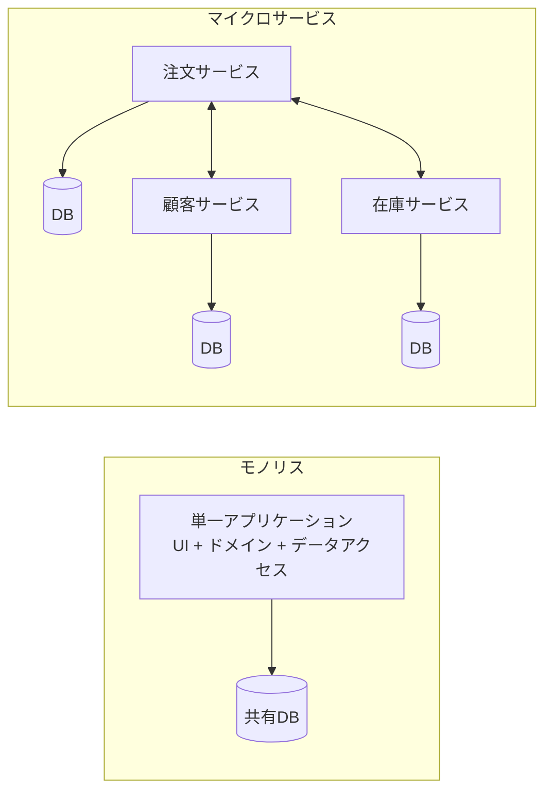
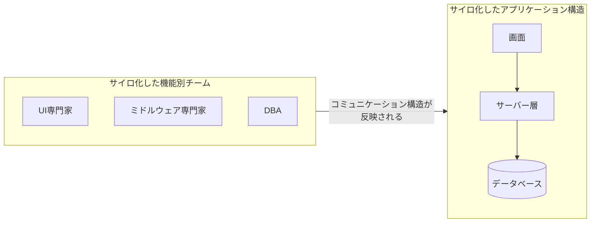
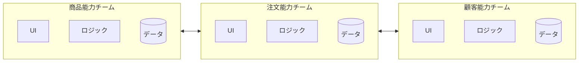
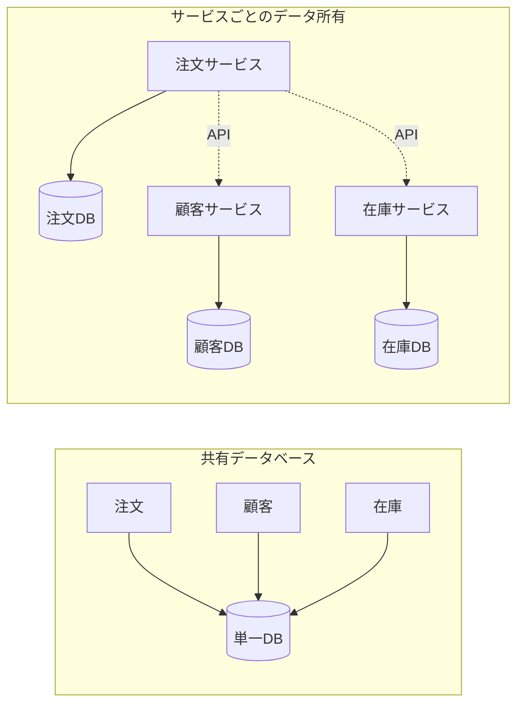
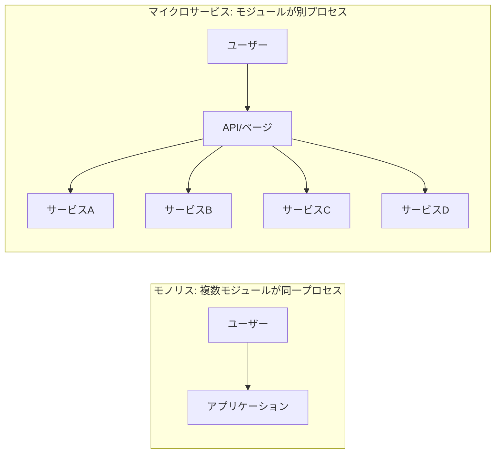

# Microservices

## 要約

マイクロサービスは、アプリケーションを小さなサービスの集まりとして構成し、それぞれを独立して開発・デプロイできるようにするアーキテクチャスタイルです。
重要なのは、単にサービスを細かく分けることではなく、ビジネス能力、チームの自律性、データ所有、運用責任を合わせて考えることです。

この考え方は、変更の独立性や技術選択の柔軟性を高める一方で、分散システムとしての複雑さを引き受けます。
10年目のエンジニアが読むなら、サービス分割の魅力だけでなく、運用、監視、データ整合性、チーム構造まで含めて読むのがよさそうです。

## 読むときの観点

- サービス境界は技術都合ではなく、ビジネス能力に沿って決める。
- 独立デプロイの価値と、分散システムの複雑さをセットで考える。
- データベース共有を避ける理由を、チームの自律性から捉える。
- マイクロサービス化は目的ではなく、組織と変更頻度に合う選択肢として見る。

## 原文の翻訳

### この新しいアーキテクチャ用語の定義

「Microservice Architecture」という用語は、ここ数年で、ソフトウェアアプリケーションを独立してデプロイ可能なサービス群として設計する特定の方法を表すために現れました。
このアーキテクチャスタイルに厳密な定義はありませんが、ビジネス能力を中心にした組織化、自動デプロイ、エンドポイント側の知性、言語とデータに関する分散化された制御といった共通の特徴があります。

「マイクロサービス」は、ソフトウェアアーキテクチャの混み合った通りに現れた、またひとつの新語です。
私たちの自然な反応は、そうした言葉を軽蔑まじりに通り過ぎることかもしれません。
しかしこの用語は、私たちがますます魅力を感じているソフトウェアシステムのスタイルを表しています。
この数年で、私たちは多くのプロジェクトがこのスタイルを使うのを見てきました。
これまでの結果は好ましいもので、私たちの同僚の多くにとっては、エンタープライズアプリケーションを作る際の標準的なスタイルになりつつあります。
残念ながら、マイクロサービススタイルとは何か、どう実践すればよいのかを概説する情報はまだ多くありません。

簡潔に言えば、マイクロサービスアーキテクチャスタイルは、ひとつのアプリケーションを小さなサービスの集まりとして開発する方法です。
それぞれのサービスは独自のプロセスで動作し、多くの場合はHTTPリソースAPIのような軽量な仕組みで通信します。
これらのサービスはビジネス能力を中心に構築され、完全に自動化されたデプロイ機構によって独立してデプロイできます。
サービス群に対する中央集権的な管理は最小限にとどめられ、サービスは異なるプログラミング言語で書かれていても、異なるデータストレージ技術を使っていてもかまいません。

マイクロサービススタイルを説明するには、まずモノリシックなスタイルと比較するのが役に立ちます。
モノリシックアプリケーションは、単一の単位として構築されます。
エンタープライズアプリケーションは、しばしば3つの主要部分から作られます。
ユーザーのマシン上のブラウザで動くHTMLページとJavaScriptからなるクライアント側ユーザーインターフェース、多数のテーブルを共通の、たいていはリレーショナルなデータベース管理システムに格納するデータベース、そしてサーバー側アプリケーションです。

サーバー側アプリケーションはHTTPリクエストを扱い、ドメインロジックを実行し、データベースからデータを取得・更新し、ブラウザに送るHTMLビューを選択して埋めます。
このサーバー側アプリケーションがモノリス、つまり**単一の論理的な実行単位**です。
システムに変更を加える場合は、サーバー側アプリケーションの新しいバージョンをビルドしてデプロイする必要があります。

このようなモノリシックサーバーは、そうしたシステムを構築する自然なやり方です。
リクエストを処理するすべてのロジックが単一プロセスで動くため、アプリケーションをクラス、関数、名前空間に分けるために、言語が備える基本機能を利用できます。
注意深く扱えば、開発者のラップトップ上でアプリケーションを実行・テストできますし、デプロイメントパイプラインを使って、変更がきちんとテストされ本番環境へデプロイされるようにもできます。
ロードバランサーの背後で複数インスタンスを動かすことで、モノリスを水平スケールさせることもできます。

モノリシックアプリケーションは成功しえます。
しかし、とりわけ多くのアプリケーションがクラウドへデプロイされるようになるにつれ、人々はモノリスへの不満を強めています。
変更サイクルが結びついてしまうのです。
アプリケーションのごく小さな部分への変更でも、モノリス全体の再ビルドと再デプロイが必要になります。
時間が経つにつれ、良いモジュール構造を保つのは難しくなりがちです。
本来ならひとつのモジュールだけに影響するはずの変更を、そのモジュール内にとどめることが難しくなります。
スケーリングも、より多くのリソースを必要とする部分だけではなく、アプリケーション全体をスケールさせることになります。

図1: モノリスとマイクロサービス

こうした不満が、マイクロサービスアーキテクチャスタイルにつながりました。
つまり、アプリケーションをサービスの集まりとして構築するのです。
サービスは独立してデプロイ・スケールできるだけでなく、それぞれが堅いモジュール境界を提供します。
サービスごとに異なるプログラミング言語で書くことさえできます。
また、異なるチームが管理することもできます。

私たちは、マイクロサービススタイルがまったく新しいもの、あるいは革新的なものだとは主張しません。
その根は少なくともUnixの設計原則までさかのぼります。
しかし、マイクロサービスアーキテクチャを検討する人はまだ十分ではなく、多くのソフトウェア開発はこのスタイルを使ったほうがよくなる、と私たちは考えています。

### マイクロサービスアーキテクチャの特徴

マイクロサービスアーキテクチャスタイルについて、形式的な定義があるとは言えません。
しかし、そのラベルに当てはまるアーキテクチャに共通して見られる特徴を説明することはできます。
共通特徴を並べる定義なら何でもそうですが、すべてのマイクロサービスアーキテクチャがすべての特徴を備えているわけではありません。
それでも、たいていのマイクロサービスアーキテクチャは、たいていの特徴を示すと私たちは期待しています。

私たち著者は、このかなりゆるやかなコミュニティの能動的なメンバーではありますが、ここでの意図は、私たち自身の仕事と、私たちが知るチームの似た取り組みの中で見ているものを説明することです。
特に、従うべき定義を定めようとしているわけではありません。

#### サービスによるコンポーネント化

私たちがソフトウェア業界に関わっているあいだずっと、物理世界でものを組み立てるように、コンポーネントを差し込んでシステムを作りたいという願望がありました。
この20年ほどで、ほとんどの言語プラットフォームに含まれる共通ライブラリの大きな集積により、かなりの進歩がありました。

コンポーネントについて話すとき、何をもってコンポーネントとするのかという難しい定義にぶつかります。
私たちの定義では、コンポーネントとは**独立して置き換え、アップグレードできるソフトウェアの単位**です。

マイクロサービスアーキテクチャもライブラリを使います。
しかし自分たちのソフトウェアをコンポーネント化する主な方法は、サービスへ分解することです。
ライブラリはプログラムにリンクされ、インメモリの関数呼び出しで呼ばれるコンポーネントだと定義します。
一方、サービスはプロセス外のコンポーネントであり、Webサービスリクエストやリモートプロシージャコールのような仕組みで通信します。
これは多くのオブジェクト指向プログラムにおけるサービスオブジェクトとは別の概念です。

ライブラリではなくサービスをコンポーネントとして使う主な理由のひとつは、サービスが独立してデプロイできることです。
単一プロセス内の複数ライブラリからなるアプリケーションでは、どれかひとつのコンポーネントへの変更が、アプリケーション全体の再デプロイにつながります。
しかし、そのアプリケーションが複数のサービスに分解されていれば、多くの場合、単一サービスへの変更はそのサービスだけの再デプロイで済むと期待できます。
これは絶対ではありません。
サービスインターフェースを変える変更では調整が必要になることもあります。
しかし、良いマイクロサービスアーキテクチャの狙いは、凝集度の高いサービス境界と、サービス契約の進化メカニズムによって、そうした調整を最小化することです。

サービスをコンポーネントとして使うことのもうひとつの結果は、コンポーネントインターフェースがより明示的になることです。
多くの言語には、明示的なPublished Interfaceを定義するための良い仕組みがありません。
しばしば、ドキュメントと規律だけが、クライアントによるコンポーネントのカプセル化破壊を防いでいます。
その結果、コンポーネント間が過度に密結合になることがあります。
サービスは、明示的なリモート呼び出しの仕組みを使うため、この問題を避けやすくします。

もちろん、このようにサービスを使うことには欠点もあります。
リモート呼び出しはプロセス内呼び出しより高価です。
したがって、リモートAPIはより粗粒度にする必要があり、使いにくくなることがよくあります。
コンポーネント間の責務配分を変える必要がある場合、プロセス境界をまたいだ振る舞いの移動はより難しくなります。

第一近似として、サービスはランタイムプロセスに対応すると考えられます。
ただし、それはあくまで第一近似です。
サービスは、常に一緒に開発・デプロイされる複数のプロセスから構成されることがあります。
たとえば、アプリケーションプロセスと、そのサービスだけが使うデータベースです。

#### ビジネス能力を中心に組織する

大きなアプリケーションを分割しようとすると、管理側はしばしば技術レイヤに注目します。
その結果、UIチーム、サーバー側ロジックチーム、データベースチームができます。
チームがこの線に沿って分けられると、単純な変更であっても、チーム横断のプロジェクトとなり、時間と予算承認が必要になることがあります。
賢いチームはこれに適応し、悪い選択肢のうちましな方を選びます。
つまり、自分たちがアクセスできるアプリケーションのどこかにロジックを押し込むのです。
言い換えれば、あらゆる場所にロジックが散らばります。

これはConwayの法則が働いている例です。

> システムを設計する組織は、その組織のコミュニケーション構造の写しとなる設計を生み出す。
>
> Melvin Conway, 1968

図2: Conwayの法則が働く様子

マイクロサービスの分割方法は異なります。
サービスをビジネス能力を中心に組織します。
このようなサービスは、そのビジネス領域に必要なソフトウェアを広いスタックで実装します。
ユーザーインターフェース、永続化ストレージ、外部連携も含みます。
その結果、チームはクロスファンクショナルになります。
ユーザーエクスペリエンス、データベース、プロジェクト管理など、開発に必要な幅広いスキルを含むのです。

図3: サービス境界はチーム境界によって強化される

##### マイクロサービスはどれくらいの大きさか

「マイクロサービス」はこのアーキテクチャスタイルの一般的な名前になりました。
しかし、その名前はサービスの大きさに不幸なほど注目を集め、「マイクロ」とは何を意味するのかという議論を招きます。
マイクロサービス実践者との会話では、サービスの大きさには幅があることがわかります。
報告された中で大きい方のサイズは、AmazonのTwo Pizza Teamの考え方、つまりチーム全員が2枚のピザで食べられる程度に従うもので、せいぜい12人ほどという意味です。
小さい方では、6人ほどのチームが6つほどのサービスを支える構成も見ています。

この幅の中に、12人に1サービスという大きさと1人に1サービスという大きさを同じマイクロサービスというラベルでまとめるべきでないほど大きな違いがあるのか、という問いが生まれます。
現時点では、それらを一緒に扱う方がよいと私たちは考えています。
ただし、このスタイルの探求が進むにつれて考えが変わる可能性は十分にあります。

このように組織されている企業のひとつがcomparethemarket.comです。
クロスファンクショナルなチームが各プロダクトの構築と運用に責任を持ち、各プロダクトはいくつもの個別サービスに分割され、メッセージバスを介して通信しています。

大規模なモノリシックアプリケーションも、ビジネス能力を中心にモジュール化することは常に可能です。
ただし、それが一般的なケースではありません。
もちろん、大きなチームがモノリシックアプリケーションを構築するなら、ビジネス線に沿って自分たちを分けるよう強く勧めます。
ここで私たちが見てきた主な問題は、そうしたチームがあまりにも多くのコンテキストを中心に組織されがちなことです。
モノリスが多くのモジュール境界をまたぐと、チームの個々のメンバーがそれらを短期記憶に収めることが難しくなります。
加えて、モジュール境界を守るには多大な規律が必要です。
サービスコンポーネントに求められる、より明示的な分離は、チーム境界を明確に保ちやすくします。

#### プロジェクトではなくプロダクト

私たちが見るアプリケーション開発の取り組みの多くは、プロジェクトモデルを使っています。
その目的は、あるソフトウェア片を納品することです。
納品されるとソフトウェアは完成したとみなされ、保守組織に引き渡され、構築したプロジェクトチームは解散します。

マイクロサービスの支持者はこのモデルを避ける傾向があります。
代わりに、チームはプロダクトをそのライフタイム全体にわたって所有すべきだ、という考えを好みます。
よくある着想源は、Amazonの「you build, you run it」という考え方です。
開発チームが本番環境のソフトウェアに対して全面的な責任を負います。
これにより、開発者は自分たちのソフトウェアが本番でどう振る舞うかに日々触れるようになります。
少なくともサポート負担の一部を引き受ける必要があるため、ユーザーとの接点も増えます。

プロダクトという考え方は、ビジネス能力との結びつきにも関係します。
ソフトウェアを「完成させるべき機能の集合」として見るのではありません。
継続的な関係として捉え、「ソフトウェアは、ユーザーがビジネス能力を高めるのにどう役立てるか」を問い続けます。

同じアプローチをモノリシックアプリケーションで取れない理由はありません。
ただし、サービスの粒度が小さいことで、サービス開発者とユーザーとの個人的な関係を作りやすくなることがあります。

#### 賢いエンドポイントと単純なパイプ

異なるプロセス間の通信構造を作るとき、通信機構そのものに相当な知性を置くことを強調する製品やアプローチを数多く見てきました。
その好例がEnterprise Service Bus、つまりESBです。
ESB製品はしばしば、メッセージルーティング、コレオグラフィ、変換、ビジネスルール適用のための高度な機能を含みます。

##### マイクロサービスとSOA

マイクロサービスについて話すとき、これは10年前に見たService Oriented Architecture、つまりSOAにすぎないのではないか、という質問をよく受けます。
この指摘には妥当な点があります。
マイクロサービススタイルは、SOAの支持者の一部が好んできたものに非常によく似ているからです。

しかし問題は、SOAがあまりにも多くの異なる意味を持つことです。
そして私たちが「SOA」と呼ばれるものに出会うとき、その大半はここで説明しているスタイルとは大きく異なります。
多くの場合、モノリシックアプリケーションを統合するために使われるESBへの注目が原因です。

特に私たちは、サービス指向の失敗した実装をあまりにも多く見てきました。
複雑さをESBの中へ隠そうとする傾向、何百万もの費用をかけながら価値を生まない複数年の取り組み、変化を能動的に妨げる中央集権的なガバナンスモデルなどです。
そのため、こうした問題の先にあるものを見るのが難しいことがあります。

もちろん、マイクロサービスコミュニティで使われている多くの技法は、大規模組織でサービスを統合してきた開発者の経験から育ってきました。
Tolerant Readerパターンはその一例です。
Webを使おうとする努力も貢献しています。
単純なプロトコルを使うことも、こうした経験から来た別のアプローチです。
これは、率直に言って息をのむほど複雑になった中央標準への反動です。
自分のオントロジーを管理するためにオントロジーが必要になるなら、深刻な問題の中にいるとわかります。

SOAのこの一般的な現れ方のために、マイクロサービス支持者の中にはSOAというラベルを完全に拒む人もいます。
一方で、マイクロサービスをSOAの一形態、つまり正しく実践されたサービス指向とみなす人もいます。
いずれにせよ、SOAがこれほど異なる意味を持つ以上、このアーキテクチャスタイルをより明確に定義する用語には価値があります。

マイクロサービスコミュニティは別のアプローチを好みます。
すなわち、賢いエンドポイントと単純なパイプです。
マイクロサービスで構築されたアプリケーションは、できるだけ疎結合で凝集度が高いことを目指します。
サービスは自分自身のドメインロジックを所有し、古典的なUnixの意味でフィルターのように振る舞います。
リクエストを受け取り、適切にロジックを適用し、レスポンスを生成するのです。
それらはWS-ChoreographyやBPELのような複雑なプロトコルや中央ツールによるオーケストレーションではなく、単純なREST風プロトコルを使ってコレオグラフされます。

最もよく使われる2つのプロトコルは、リソースAPIを伴うHTTPリクエスト・レスポンスと、軽量メッセージングです。
前者を最もよく表す言葉は、Ian Robinsonの「Webの背後にいるのではなく、Webそのものであれ」というものです。
マイクロサービスチームは、World Wide Web、そしてかなりの程度Unixが築かれている原則とプロトコルを使います。
よく使われるリソースは、開発者や運用担当者の手間をほとんどかけずにキャッシュできます。

一般に使われる第2のアプローチは、軽量なメッセージバス上のメッセージングです。
選ばれるインフラストラクチャはたいてい単純です。
ここでいう単純とは、メッセージルーターとしてだけ振る舞うという意味です。
RabbitMQやZeroMQのような単純な実装は、信頼できる非同期の通信基盤を提供する以上のことはあまりしません。
知性は引き続き、メッセージを生成・消費するエンドポイント、つまりサービスの中にあります。

モノリスでは、コンポーネントはプロセス内で実行され、メソッド呼び出しや関数呼び出しで通信します。
モノリスをマイクロサービスへ変える際の最大の問題は、通信パターンを変えることにあります。
インメモリのメソッド呼び出しを単純にRPCへ置き換えると、細かすぎる通信になり、性能が出ません。
代わりに、細粒度の通信を**より粗粒度なアプローチ**へ置き換える必要があります。

#### 分散化されたガバナンス

中央集権的なガバナンスの結果のひとつは、単一の技術プラットフォームへ標準化しがちなことです。
経験から言えば、このアプローチは窮屈です。
すべての問題が釘ではなく、すべての解決策がハンマーでもありません。
私たちは、仕事に合った道具を使うことを好みます。
モノリシックアプリケーションでもある程度は異なる言語を活用できますが、それはそれほど一般的ではありません。

モノリスのコンポーネントをサービスへ分けると、各サービスを構築する際に選択肢が生まれます。
単純なレポートページを立ち上げるのにNode.jsを使いたいですか。
どうぞ。
特に厄介なほぼリアルタイムのコンポーネントにC++を使いたいですか。
構いません。
あるコンポーネントの読み取り振る舞いにより適した別の種類のデータベースへ入れ替えたいですか。
作り直すための技術はあります。
もちろん、できるからといってやるべきだという意味ではありません。
しかし、このようにシステムを分割しておけば、その選択肢を持てます。

マイクロサービスを構築するチームは、標準についても別のアプローチを好みます。
どこかの紙に書かれた定義済み標準群を使うよりも、同じような問題に直面している他の開発者が使える有用なツールを作る、という考え方を好むのです。
こうしたツールは通常、実装から収穫され、より広いグループと共有されます。
ときには、ただし必ずしもそれだけではありませんが、社内オープンソースモデルが使われます。
gitとGitHubが事実上のバージョン管理システムとして選ばれるようになった今、オープンソースの実践は社内でもますます一般的になっています。

Netflixは、この哲学に従う組織の良い例です。
有用で、何より実戦で鍛えられたコードをライブラリとして共有すると、他の開発者が似た問題を似た方法で解くことを促せます。
それでも、必要なら別のアプローチを選ぶ余地は残ります。
共有ライブラリは、データストレージ、プロセス間通信、そして後で述べるインフラストラクチャ自動化のような共通問題に焦点を当てる傾向があります。

##### 多くの言語、多くの選択肢

JVMプラットフォームの成長は、共通プラットフォーム内で複数言語を混ぜる最新の例にすぎません。
何十年もの間、より高レベルな抽象化を活用するために高水準言語へシェルアウトすることは一般的でした。
同様に、性能に敏感なコードを書くために低レベル言語へ降りることもありました。
しかし、多くのモノリスはそこまでの性能最適化を必要としませんし、DSLや高レベル抽象化もそれほど一般的ではありません。
これは私たちにとって残念なことです。
代わりに、モノリスは通常単一言語であり、使う技術の数を制限しがちです。

マイクロサービスコミュニティにとって、オーバーヘッドは特に魅力のないものです。
だからといって、このコミュニティがサービス契約を重視していないわけではありません。
まったく逆です。
サービス契約はむしろはるかに多くなりがちです。
ただ、それらの契約を管理する方法として別のやり方を見ているのです。
Tolerant ReaderやConsumer-Driven Contractsのようなパターンは、マイクロサービスにしばしば適用されます。
これらはサービス契約が独立して進化する助けになります。

Consumer-Driven Contractsをビルドの一部として実行すると、自信が高まり、サービスが機能しているかどうかについて素早いフィードバックが得られます。
実際にオーストラリアのあるチームは、新しいサービスのビルドをConsumer-Driven Contractsで駆動しています。
彼らは、サービスの契約を定義できる単純なツールを使っています。
その契約は、新しいサービスのコードが書かれる前に、自動ビルドの一部になります。
その後、サービスはその契約を満たすところまでだけ構築されます。
これは、新しいソフトウェアを作るときにYAGNIのジレンマを避ける優雅なアプローチです。
こうした技法と、それを取り巻いて成長しつつあるツール群は、サービス間の時間的結合を減らすことで、中央集権的な契約管理の必要性を制限します。

分散化されたガバナンスの極点は、Amazonによって広められた「build it / run it」の精神かもしれません。
チームは、自分たちが作るソフトウェアのあらゆる側面に責任を負います。
24時間365日の運用も含まれます。
このレベルの責任移譲は決して標準ではありません。
しかし、責任を開発チームへ押し出す企業はますます増えています。
Netflixもこの精神を採用している組織です。
毎晩午前3時にポケベルで起こされることは、コードを書くときに品質へ集中する強力な動機になるでしょう。
これらの考え方は、従来の中央集権的なガバナンスモデルからは、あり得る限り遠いものです。

#### 分散化されたデータ管理

データ管理の分散化は、いくつかの異なる形で現れます。
最も抽象的なレベルでは、世界の概念モデルがシステムごとに異なることを意味します。
これは、大企業内で統合を行うときによくある問題です。
顧客に対する営業の見方は、サポートの見方と異なります。
営業の見方では顧客と呼ばれるものの一部が、サポートの見方にはまったく現れないかもしれません。
現れる場合でも、異なる属性を持つかもしれませんし、さらに厄介なことに、共通する属性が微妙に異なる意味を持つかもしれません。

##### 実戦で鍛えられた標準と、強制された標準

マイクロサービスチームが、エンタープライズアーキテクチャグループによって定められる硬直した強制標準を避けがちな一方で、HTTP、ATOM、その他のmicroformatsのようなオープン標準は喜んで使い、時にはその利用を熱心に勧めるというのは、少し二分法めいたところがあります。

重要な違いは、標準がどのように開発され、どのように強制されるかです。
IETFのようなグループが管理する標準は、広い世界で複数の実稼働実装が存在するようになって初めて標準になります。
そしてそれらは、成功したオープンソースプロジェクトから育つこともよくあります。
こうした標準は、最近のプログラミング経験がほとんどないグループによって開発されたり、ベンダーの影響を強く受けすぎたりする企業内の多くの標準とは、まったく別世界のものです。

この問題はアプリケーション間で一般的ですが、アプリケーション内でも起こりえます。
特に、そのアプリケーションが別々のコンポーネントに分けられている場合です。
このことを考える有用な方法が、ドメイン駆動設計におけるBounded Contextの考え方です。
DDDは複雑なドメインを複数のBounded Contextへ分割し、それらの関係を地図化します。
このプロセスはモノリシックアーキテクチャにもマイクロサービスアーキテクチャにも役立ちます。
しかし、サービス境界とコンテキスト境界には自然な相関があります。
それが分離を明確にし、ビジネス能力のセクションで述べたように、その分離を強化する助けになります。

概念モデルについての判断を分散化するだけでなく、マイクロサービスはデータストレージの判断も分散化します。
モノリシックアプリケーションは永続データのために単一の論理データベースを好みます。
一方で、企業は複数のアプリケーションにまたがる単一データベースを好むことがよくあります。
そうした判断の多くは、ライセンスに関するベンダーの商業モデルによって動かされています。
マイクロサービスは、各サービスに自分自身のデータベースを管理させることを好みます。
それは同じデータベース技術の別インスタンスでも、完全に異なるデータベースシステムでもかまいません。
このアプローチはPolyglot Persistenceと呼ばれます。
Polyglot Persistenceはモノリスでも使えますが、マイクロサービスでより頻繁に見られます。

図4: 分散化されたデータ管理

マイクロサービスにまたがってデータへの責任を分散すると、更新の管理に影響が出ます。
更新を扱う一般的なアプローチは、複数リソースを更新するときの一貫性を保証するためにトランザクションを使うことでした。
このアプローチはモノリス内でよく使われます。

このようなトランザクション利用は一貫性に役立ちますが、強い時間的結合を強います。
これは複数サービスにまたがる場合には問題です。
分散トランザクションは実装が難しいことで悪名高く、その結果、マイクロサービスアーキテクチャはサービス間のトランザクションなしの協調を重視します。
その際、一貫性は結果整合性にすぎないかもしれないことを明示的に認め、問題は補償操作で扱います。

このように不整合を管理する選択は、多くの開発チームにとって新しい課題です。
しかし、それはしばしばビジネスの実践に合っています。
ビジネスは需要へ素早く応えるために、ある程度の不整合を扱うことがよくあります。
その一方で、誤りに対処するための何らかの取り消しプロセスを持ちます。
より強い一貫性によって失われるビジネスのコストよりも、誤りを修正するコストの方が小さい限り、このトレードオフには価値があります。

#### インフラストラクチャ自動化

インフラストラクチャ自動化の技法は、この数年で大きく進化しました。
特にクラウドとAWSの進化により、マイクロサービスを構築・デプロイ・運用する際の運用上の複雑さは下がりました。

マイクロサービスで構築されるプロダクトやシステムの多くは、Continuous Deliveryと、その前身であるContinuous Integrationについて豊富な経験を持つチームによって作られています。
このようにソフトウェアを構築するチームは、インフラストラクチャ自動化技法を広く使います。
これは以下のビルドパイプラインに示されています。

図5: 基本的なビルドパイプライン

この記事はContinuous Deliveryについての記事ではないので、ここでは重要な特徴を2つだけ取り上げます。
ソフトウェアが動作しているという確信をできるだけ高めたいので、多数の自動テストを実行します。
動作するソフトウェアをパイプラインの「上」へ昇格させるとは、新しい各環境へのデプロイを自動化するという意味です。

##### 正しいことを簡単にできるようにする

Continuous Deliveryとデプロイの結果として自動化が進むと、開発者と運用担当者を助ける有用なツールが作られる、という副作用を私たちは見てきました。
アーティファクトを作るツール、コードベースを管理するツール、単純なサービスを立ち上げるツール、標準的な監視やロギングを追加するツールは、今ではかなり一般的です。
Web上で最も良い例は、おそらくNetflixの一連のオープンソースツールでしょう。
他にも、私たちが広く使ってきたDropwizardなどがあります。

モノリシックアプリケーションも、こうした環境を通じてビルドされ、テストされ、送り出されます。
モノリスの本番への道筋を自動化することに投資してしまえば、さらに多くのアプリケーションをデプロイすることは、それほど恐ろしいものではなくなることがわかります。
CDの目的のひとつはデプロイを退屈なものにすることだ、という点を思い出してください。
したがって、アプリケーションが1つであれ3つであれ、それが退屈なままである限り問題ではありません。

チームが広範なインフラストラクチャ自動化を使っているのを私たちが見るもうひとつの領域は、本番環境でマイクロサービスを管理するときです。
上では、デプロイが退屈である限り、モノリスとマイクロサービスの間に大きな違いはないと主張しました。
しかし、それぞれの運用風景ははっきり異なることがあります。

図6: モジュールのデプロイ形態はしばしば異なる

#### 障害を前提に設計する

サービスをコンポーネントとして使うことの帰結として、アプリケーションはサービス障害に耐えられるよう設計される必要があります。
どのサービス呼び出しも、提供側が利用不能であるために失敗しえます。
クライアントはそれにできるだけ優雅に応答しなければなりません。
これはモノリシック設計と比べた不利な点です。
対応のために追加の複雑さを導入するからです。
その結果、マイクロサービスチームは、サービス障害がユーザー体験にどう影響するかを常に考えます。
NetflixのSimian Armyは、アプリケーションの回復力と監視の両方をテストするため、勤務時間中にサービスやデータセンターの障害さえ発生させます。

##### Circuit Breakerと本番対応コード

Circuit Breakerは『Release It!』に登場し、BulkheadやTimeoutなどのパターンと並んでいます。
これらのパターンを組み合わせて実装することは、通信するアプリケーションを構築するときに極めて重要です。
Netflixのブログ記事は、それらをどう適用しているかを非常にうまく説明しています。

この種の本番環境での自動テストは、たいていの運用グループに休暇の前触れのような震えを与えるでしょう。
これは、モノリシックなアーキテクチャスタイルが高度な監視セットアップを持てないという意味ではありません。
ただ、私たちの経験ではそれほど一般的ではないというだけです。

サービスはいつでも失敗しえるため、障害を素早く検出し、可能なら自動的にサービスを復旧できることが重要です。
マイクロサービスアプリケーションは、アプリケーションのリアルタイム監視を非常に重視します。
アーキテクチャ上の要素、たとえばデータベースが秒あたり何リクエスト受けているかを確認するだけでなく、ビジネスに関係するメトリクス、たとえば1分あたり何件の注文を受けているかも確認します。
セマンティック監視は、何かがおかしくなっていることを早期に警告し、開発チームが追跡して調査するきっかけを提供できます。

これはマイクロサービスアーキテクチャでは特に重要です。
マイクロサービスではコレオグラフィとイベントコラボレーションを好むため、創発的な振る舞いが生じるからです。
多くの論者は偶然生まれる創発の価値を称賛しますが、実際には創発的な振る舞いが悪いものになることもあります。
悪い創発的振る舞いを素早く見つけて修正できるようにするには、監視が不可欠です。

##### 同期呼び出しは有害と考える

サービス間に複数の同期呼び出しがあると、ダウンタイムの乗算効果に出会います。
簡単に言えば、システムのダウンタイムが個々のコンポーネントのダウンタイムの積になってしまう状況です。
ここで選択を迫られます。
呼び出しを非同期にするか、ダウンタイムを管理するかです。
www.guardian.co.ukでは、新しいプラットフォームに単純なルールを実装しました。
ユーザーリクエストあたり同期呼び出しは1つです。
Netflixでは、プラットフォームAPIの再設計により、APIの構造そのものへ非同期性を組み込んでいます。

モノリスもマイクロサービスと同じくらい透明に作ることができます。
実際、そうすべきです。
違いは、異なるプロセスで動くサービスが切断されたときには、それを絶対に知る必要があるということです。
同じプロセス内のライブラリでは、この種の透明性はそこまで役に立たないことが多いでしょう。

マイクロサービスチームは、個々のサービスごとに高度な監視とロギングのセットアップがあることを期待します。
たとえば、稼働・停止状態を示すダッシュボードや、運用およびビジネスに関係する各種メトリクスです。
Circuit Breakerの状態、現在のスループット、レイテンシの詳細も、現場でよく目にする例です。

#### 進化的設計

マイクロサービスの実践者は、たいてい進化的設計の背景を持っています。
そしてサービス分解を、アプリケーション開発者が変更の速度を落とさずにアプリケーションの変更を制御するための、さらなる道具と見ています。
変更制御は、必ずしも変更を減らすことを意味しません。
適切な姿勢と道具があれば、ソフトウェアに対して頻繁で素早く、よく制御された変更を加えられます。

ソフトウェアシステムをコンポーネントへ分けようとするときはいつでも、部品をどう分けるかを決めなければなりません。
アプリケーションを切り分ける原則は何か、という問いです。
コンポーネントの重要な性質は、独立して置き換え、アップグレードできるという概念です。
これは、協力相手に影響を与えずにコンポーネントを書き直せると想像できる地点を探すことを意味します。
実際、多くのマイクロサービスグループはこの考えをさらに進め、長期的には多くのサービスが進化するよりも廃棄されることを明示的に期待しています。

GuardianのWebサイトは、モノリスとして設計・構築されたものの、マイクロサービスの方向へ進化しているアプリケーションの良い例です。
モノリスはいまでもWebサイトの中核ですが、新機能はモノリスのAPIを使うマイクロサービスを構築して追加することを好んでいます。
このアプローチは、スポーツイベントを扱う特設ページのように、本質的に一時的な機能に特に便利です。
Webサイトのそうした部分は、高速開発向けの言語を使って素早く組み立てられ、イベントが終われば取り除けます。
金融機関でも似たアプローチを見てきました。
市場機会に合わせて新しいサービスを追加し、数か月後、あるいは数週間後に廃棄するのです。

この置き換え可能性の重視は、モジュール設計におけるより一般的な原則の特別な場合です。
つまり、変更のパターンによってモジュール性を駆動するという原則です。
同時に変わるものは、同じモジュールに置きたいものです。
めったに変わらないシステムの部分は、現在頻繁に変化している部分とは別のサービスにあるべきです。
2つのサービスを何度も一緒に変更していることに気づいたなら、それはそれらを統合すべき兆候です。

コンポーネントをサービスに入れることは、より細かなリリース計画の機会を加えます。
モノリスでは、どんな変更もアプリケーション全体の完全なビルドとデプロイを必要とします。
しかしマイクロサービスでは、変更したサービスだけを再デプロイすれば済みます。
これにより、リリースプロセスを単純化し、速められます。
欠点は、あるサービスへの変更がその利用者を壊さないか気にしなければならないことです。
従来の統合アプローチは、バージョニングによってこの問題に対処しようとします。
しかしマイクロサービスの世界では、バージョニングは最後の手段としてのみ使うことが好まれます。
提供側の変更に対してサービスをできるだけ寛容に設計すれば、多くのバージョニングを避けられます。

### マイクロサービスは未来か

この記事を書いた主な目的は、マイクロサービスの主要な考え方と原則を説明することです。
時間を割いてそうしていることから明らかなように、私たちはマイクロサービスアーキテクチャスタイルが重要な考え方であり、エンタープライズアプリケーションに対して真剣に検討する価値があると考えています。
私たちは最近、このスタイルを使っていくつかのシステムを構築しました。
また、このアプローチを使い、好んでいる人々のことも知っています。

##### Microservice Trade-Offs

多くの開発チームは、マイクロサービスアーキテクチャスタイルがモノリシックアーキテクチャより優れたアプローチだと感じています。
しかし他のチームは、それを生産性を吸い取る重荷だと感じています。
どんなアーキテクチャスタイルでもそうですが、マイクロサービスにはコストと利益があります。
賢明な選択をするには、それらを理解し、自分たち固有の文脈へ当てはめなければなりません。

私たちが知る限り、このアーキテクチャスタイルを何らかの形で先駆的に実践している組織には、Amazon、Netflix、The Guardian、UK Government Digital Service、realestate.com.au、Forward、comparethemarket.comがあります。
2013年のカンファレンス界隈は、Travis CIを含め、マイクロサービスに分類できるものへ移行しつつある企業の例でいっぱいでした。
さらに、私たちならマイクロサービスに分類するものを、ずっと以前から実践している組織もたくさんあります。
ただし彼らはその名前を使っていませんでした。
多くの場合、それはSOAと呼ばれていました。
すでに述べたように、SOAには互いに矛盾する多くの形があります。

しかし、こうした肯定的な経験にもかかわらず、私たちはマイクロサービスがソフトウェアアーキテクチャの未来の方向だと確信している、と主張しているわけではありません。
これまでの経験はモノリシックアプリケーションと比べて好ましいものですが、十分な判断を下せるほどの時間はまだ経っていないことを意識しています。

アーキテクチャ上の判断の真の結果は、多くの場合、その判断から数年経って初めて明らかになります。
私たちは、優秀なチームがモジュール性を強く望んでモノリシックアーキテクチャを構築したものの、年月とともにそれが劣化していったプロジェクトを見てきました。
多くの人は、マイクロサービスならそうした劣化は起こりにくいと信じています。
サービス境界が明示的で、場当たり的に回避しにくいからです。
しかし、十分に古くなったシステムを十分な数だけ見るまでは、マイクロサービスアーキテクチャがどのように成熟するかを本当に評価することはできません。

マイクロサービスがうまく成熟しないと予想できる理由も確かにあります。
コンポーネント化の取り組みでは、成功はソフトウェアがコンポーネントにどれだけうまく収まるかに依存します。
コンポーネント境界がどこにあるべきかを正確に見極めるのは難しいものです。
進化的設計は、境界を正しく見つけることの難しさを認識し、それゆえ境界をリファクタリングしやすくすることの重要性を認めます。
しかしコンポーネントがリモート通信を伴うサービスである場合、リファクタリングはプロセス内ライブラリよりはるかに難しくなります。
サービス境界を越えてコードを移動するのは困難です。
インターフェース変更は参加者間で調整しなければならず、後方互換性の層を追加する必要があり、テストも複雑になります。

私たちの同僚であるSam Newmanは、2014年の大半を、マイクロサービス構築の経験をまとめる本の執筆に費やしました。
このトピックをより深く掘り下げたいなら、それが次の一歩になるでしょう。

別の問題は、コンポーネントがきれいに合成されない場合、複雑さをコンポーネント内部からコンポーネント間の接続へ移しているだけだということです。
これは単に複雑さを移動するだけではありません。
より明示的でなく、制御しにくい場所へ複雑さを移します。
小さく単純なコンポーネントの内部を見ていると物事が良くなったように思いやすいのですが、サービス間の混乱した接続を見落としてしまいます。

最後に、チームの技量という要因があります。
新しい技法は、より技量の高いチームに採用されがちです。
しかし、より技量の高いチームにとって有効な技法が、技量の低いチームにも機能するとは限りません。
技量の低いチームが乱雑なモノリシックアーキテクチャを作る例はたくさん見てきました。
しかし、この種の混乱がマイクロサービスで起きたときに何が起こるかを見るには、時間が必要です。
良くないチームは常に良くないシステムを作ります。
その場合にマイクロサービスが混乱を減らすのか、悪化させるのかを見分けるのは非常に難しいことです。

私たちが聞いた妥当な議論のひとつは、マイクロサービスアーキテクチャから始めるべきではない、というものです。
代わりにモノリスから始め、モジュール性を保ち、そのモノリスが問題になってからマイクロサービスへ分割するのです。
ただし、この助言も理想的ではありません。
良いプロセス内インターフェースは、通常、良いサービスインターフェースではないからです。

したがって、私たちは慎重な楽観とともにこの記事を書いています。
これまでのところ、マイクロサービススタイルについて、それが歩む価値のある道になりうると感じるだけのものを見てきました。
最終的にどこへたどり着くかを確実に言うことはできません。
しかしソフトウェア開発の難しさのひとつは、いま手元にある不完全な情報にもとづいてしか判断できないことです。

### 脚注

1. 「microservice」という用語は、2011年5月にヴェネツィア近郊で開かれたソフトウェアアーキテクトのワークショップで議論されました。参加者たちが最近探求していた共通のアーキテクチャスタイルを表すための言葉でした。2012年5月、同じグループは「microservices」が最も適切な名前だと決めました。Jamesは2012年3月、クラクフの33rd Degreeで、これらの考えの一部を「Microservices - Java, the Unix Way」というケーススタディとして発表しました。Fred Georgeも同じころに発表しています。NetflixのAdrian Cockcroftは、このアプローチを「fine grained SOA」と表現し、この記事で触れたJoe Walnes、Daniel Terhorst-North、Evan Botcher、Graham Tackleyらと同じく、Webスケールでこのスタイルを先駆的に進めていました。
2. モノリスという用語は、Unixコミュニティで以前から使われています。大きくなりすぎたシステムを表す言葉として『The Art of Unix Programming』に登場します。
3. 私たち自身を含む多くのオブジェクト指向設計者は、Domain-Driven Designの意味で、エンティティに結びついていない重要なプロセスを実行するオブジェクトをサービスオブジェクトと呼びます。これはこの記事で使っている「サービス」とは別の概念です。残念ながらserviceという語には両方の意味があり、私たちはその多義性と付き合わなければなりません。
4. 私たちはアプリケーションを、コードベース、機能の集合、資金のまとまりを結びつける社会的構築物だと考えています。
5. Jim Webberの、ESBは「Erroneous Spaghetti Box」の略だという発言には触れずにいられません。
6. Netflixはこのつながりを明示しており、最近まで自分たちのアーキテクチャスタイルをfine-grained SOAと呼んでいました。
7. 極端なスケールでは、組織はしばしばprotobufsのようなバイナリプロトコルへ移行します。これらを使うシステムも、賢いエンドポイントと単純なパイプという特徴を示します。ただし、スケールのために透明性を差し出すことになります。ほとんどのWebプロパティ、そして圧倒的大多数のエンタープライズは、このトレードオフをする必要はありません。透明性は大きな勝利になりえます。
8. モノリスが単一言語だと主張するのは、私たちの少し不誠実なところです。今日のWebでシステムを作るには、おそらくJavaScript、XHTML、CSS、選んだサーバー側言語、SQL、ORM方言を知る必要があります。ほとんど単一言語ではありませんが、私たちの言いたいことはわかるでしょう。
9. YAGNI、つまり「You Aren't Going To Need It」はXPの原則であり、必要だとわかるまでは機能を追加しないよう促す言葉です。
10. Adrian Cockcroftは2013年11月のFlowconで行った優れたプレゼンテーションの中で、「developer self-service」と「Developers run what they wrote」にはっきり触れています。
11. ここでも私たちは少し不誠実です。より多くのサービスを、より複雑なトポロジでデプロイすることは、単一モノリスをデプロイするより明らかに難しいことです。幸い、パターンはこの複雑さを減らします。ただし、ツールへの投資はなお必須です。
12. 実際、Daniel Terhorst-NorthはこのスタイルをマイクロサービスではなくReplaceable Component Architectureと呼んでいます。これは私たちが重視する特徴の一部だけを語っているように見えるため、私たちは後者の用語を好みます。
13. Kent Beckは『Implementation Patterns』の中で、これを自身の設計原則のひとつとして強調しています。
14. そしてSOAも、この歴史の根では到底ありません。世紀の初めにSOAという用語が現れたとき、人々が「私たちはこれを何年もやってきた」と言っていたことを覚えています。ひとつの議論は、このスタイルの根が、エンタープライズコンピューティングの最初期にCOBOLプログラムがデータファイルを介して通信していたやり方にあるというものです。別の方向では、マイクロサービスはErlangのプログラミングモデルと同じものを、エンタープライズアプリケーションの文脈に適用したものだとも言えるでしょう。

### 参考文献

これは網羅的なリストではありませんが、実践者が着想を得たり、この記事で説明したものと似た哲学を支持したりしている情報源がいくつかあります。

ブログとオンライン記事:

- Clemens VastersのMicrosoftクラウドに関するブログ
- David Morgantiniのブログにある、このトピックへの入門
- Herokuの12 factor apps
- UK Government Digital Serviceの設計原則
- Jimmy Nilssonのブログと、Cloud Chunk Computingに関するInfoQの記事
- Alistair CockburnによるHexagonal architectures

書籍:

- Release It!
- REST in Practice
- Web API Design (free ebook), Brian Mulloy, Apigee
- Enterprise Integration Patterns
- The Art of Unix Programming
- Growing Object-Oriented Software, Guided by Tests
- The Modern Firm: Organizational Design for Performance and Growth
- Continuous Delivery: Reliable Software Releases through Build, Test, and Deployment Automation
- Domain-Driven Design: Tackling Complexity in the Heart of Software

プレゼンテーション:

- Architecture without Architects, Erik Doernenburg
- Does my bus look big in this?, Jim Webber and Martin Fowler, QCon 2008
- Guerilla SOA, Jim Webber, 2006
- Patterns of Effective Delivery, Daniel Terhorst-North, 2011
- Adrian CockcroftのSlideShareチャンネル
- Hydras and Hypermedia, Ian Robinson, JavaZone 2010
- Justice will take a million intricate moves, Leonard Richardson, QCon 2008
- Java, the UNIX way, James Lewis, JavaZone 2012
- Micro services architecture, Fred George, YOW! 2012
- Democratising attention data at guardian.co.uk, Graham Tackley, GOTO Aarhus 2013
- Functional Reactive Programming with RxJava, Ben Christensen, GOTO Aarhus 2013（登録が必要）
- Breaking the Monolith, Stefan Tilkov, 2012年5月

論文:

- L. Lamport, “The Implementation of Reliable Distributed Multiprocess Systems”, 1978
- L. Lamport, R. Shostak, M. Pease, “The Byzantine Generals Problem”, 1982
- R. T. Fielding, “Architectural Styles and the Design of Network-based Software Architectures”, 2000
- E. A. Brewer, “Towards Robust Distributed Systems”, 2000
- E. Brewer, “CAP Twelve Years Later: How the 'Rules' Have Changed”, 2012

### さらに読む

上のリストは、私たちが2014年初めにこの記事を最初に書いたときに使った参考文献を捉えたものです。
より新しい情報源の一覧については、Microservice Resource Guideを見てください。

### 主な改訂

- 2014年3月25日: 「マイクロサービスは未来か」の最終回を追加。
- 2014年3月24日: 進化的設計のセクションを追加。
- 2014年3月19日: インフラストラクチャ自動化と障害を前提にした設計のセクションを追加。
- 2014年3月18日: 分散化されたデータのセクションを追加。
- 2014年3月17日: 分散化されたガバナンスのセクションを追加。
- 2014年3月14日: 賢いエンドポイントと単純なパイプのセクションを追加。
- 2014年3月13日: プロジェクトではなくプロダクトのセクションを追加。
- 2014年3月12日: ビジネス能力を中心に組織するセクションを追加。
- 2014年3月10日: 最初の分割版を公開。
