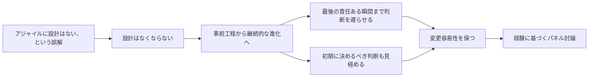

# Modifiability: Or is there Design in Agility

## 要約

アジャイル開発における設計は、最初に大きく固めるものではなく、変更容易性を保つために継続して行う活動として捉えられます。設計判断はできるだけ責任を持って遅らせる一方で、プロジェクトの初期に決めなければならないこともあります。

このページはInfoQのプレゼンテーション動画として公開されており、公開ページから取得できるテキストは概要と発表要旨に限られます。全文のトランスクリプトは確認できないため、ここでは取得できた公開テキストの範囲を翻訳し、動画本編の内容を推測で補完しません。

## 読むときの観点

- 変更容易性を設計品質のひとつとして扱う。
- アジャイルと設計を対立させない。
- どの設計判断を遅らせ、どの判断を初期に行うべきかを見る。
- パネル参加者の経験知が、設計の考え方にどう反映されているかを見る。

## 原文の翻訳

### InfoQ公開ページの概要

多くの人は、アジャイル手法とは設計が存在しないことだと思い込んでいます。しかし、アジャイルなプロジェクトでも設計は行われています。ただしその位置づけは、事前にまとめて行う段階から、継続的に進化していく活動へと移ります。設計判断は、**最後の責任ある瞬間**まで残しておくべきです。一方で、プロジェクトの開始時点で決めなければならない設計判断もあります。Martin Fowler氏は、アジャイルの文脈における設計をめぐるパネル討論を通じて、このテーマを掘り下げます。

### 発表者紹介

Martin Fowler氏は、オブジェクト指向技術、リファクタリング、パターン、アジャイル手法、ドメインモデリング、UML、Extreme Programmingの先駆者です。これらの分野のいくつかについて、5冊の書籍を執筆しています。Fowler氏の関心はエンタープライズソフトウェアの設計にあり、良い設計とは何か、そして良い設計にたどり着くためにどのようなプラクティスが必要かを探っています。

### 会議について

QConは、コミュニティによって、コミュニティのために組織されるカンファレンスです。その結果として、コミュニティにとって重要なテーマについて第一線のリーダーから学べるよう、内容の質に大きな注意と投資が向けられたカンファレンス体験が生まれています。QConは、技術リード、アーキテクト、プロジェクトマネージャにとって関心の高い、技術的な深さとエンタープライズへの焦点を備えるように設計されています。

### QCon 2007の発表要旨

多くの人は、アジャイル手法とは設計がないことだと思い込んでいます。「速く進みたいなら、とにかくコードを書き始めればよい」というわけです。しかし、アジャイル手法を支持する人の多くは、設計に大きな注意を払うことも支持しています。アジャイルなプロジェクトでも設計は行われますが、それは事前工程から、継続的な進化へと移ります。設計判断は最後の責任ある瞬間まで残すべきですが、プロジェクトの開始時点で行わなければならない設計判断もあります。

こうした微妙な点を探るために、Fowler氏はThoughtWorksのアーキテクト数名を率いて、アジャイルの文脈における設計について議論します。そこでは、彼らが長年にわたって開発作業を率いる中で学んできた経験が引き出されます。登壇したアーキテクトは、Ian Cartwright氏、Erik Doernenberg氏、David Farley氏、Fred George氏、Dan North氏です。

### Martin Fowler氏サイトでの紹介

QCon London 2007の主催者は、Fowler氏にアーキテクチャの変更容易性についてのセッションを依頼しました。Fowler氏は、自分の話を聞くよりも、自分が普段そのアイデアを再構成して紹介しているThoughtWorksのアーキテクトたちの話を聞くほうが、聴衆にとってよいのではないかと考えました。そのアーキテクトたちは、Dave Farley氏、Ian Cartwright氏、Fred George氏、Erik Doernenberg氏、Daniel Terhorst-North氏です。InfoQは、そのセッションの動画を公開しました。

## 図解

## 対応範囲と未対応

このページでは、取得できた公開テキストのうち、InfoQプレゼンテーションページの概要、発表者紹介、会議説明、および補助的に確認できたQCon 2007の発表要旨とMartin Fowler氏サイトの紹介文を日本語に翻訳しました。

InfoQページには動画本編が掲載されていますが、確認時点でページ内にトランスクリプト、字幕テキスト、スライド本文、またはダウンロード可能なテキスト原稿は見当たりませんでした。そのため、58分21秒の動画本編については全文翻訳していません。動画の内容を推測で補うと原文にない意味を足すことになるため、未対応としています。
