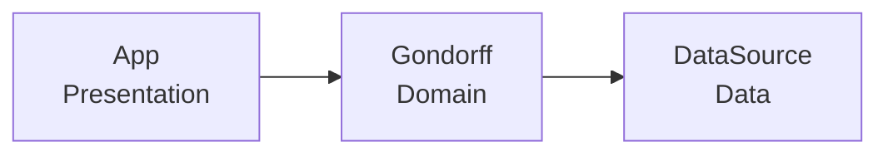
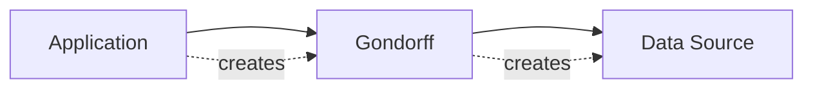
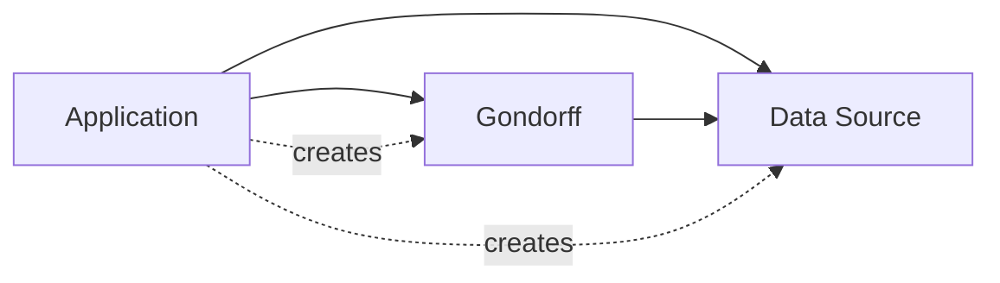
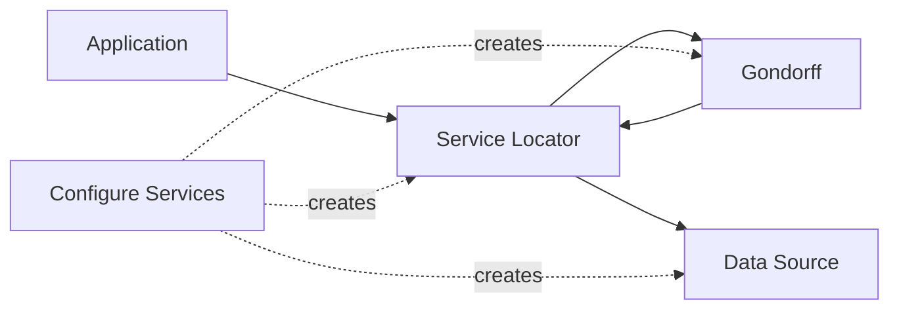
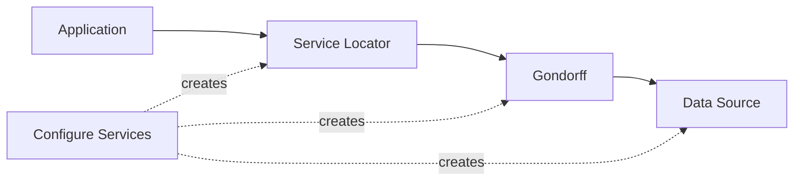

# Refactoring Module Dependencies

## 要約

プログラムが大きくなるにつれて、変更しやすさを保つにはモジュール分割が重要になります。
しかし、単に分けるだけでは不十分で、モジュール同士の依存関係をどう向けるかが設計上の大きな問題になります。

このページの原文では、小さなプログラムを題材に、プレゼンテーション、ドメイン、データの層へ分けながら依存関係を整理していきます。
その過程で、Service Locator や Dependency Injection といったパターンを使い、モジュール間の結合を弱める考え方が説明されています。

特に学びやすい点は、依存関係の向きを変えることが単なるコード整理ではなく、変更容易性やテスト容易性に直結する設計判断だと分かるところです。
アプリケーションアーキテクチャ、API設計、リファクタリングをつなげて学ぶ最初の題材として扱いやすい記事です。

## 読むときの観点

- モジュール分割は、責務だけでなく依存関係の向きも含めて考える。
- 層を分けても、上位層と下位層が強く結びつくと変更しづらさは残る。
- Service Locator と Dependency Injection は、依存先の取得方法を変えるための選択肢として比較できる。
- Java と JavaScript の違いよりも、依存関係を整理する考え方に注目する。

## 原文の翻訳

プログラムが数百行を超えて大きくなると、それをどうモジュールに分けるかを考える必要が出てきます。少なくとも、小さなファイルにしておけば編集作業は管理しやすくなります。しかし、より重要なのは、変更を加えるためにプログラム全体を頭に入れておかなくてもよいように、プログラムを分割することです。

よく設計されたモジュール構造では、大きなプログラムに小さな変更を加えるとき、理解すべき範囲をその一部に限れるはずです。ときには小さな変更がモジュールを横断することもありますが、たいていはひとつのモジュールとその隣接部分だけを理解すれば済みます。

プログラムをモジュールへ分けるときにもっとも難しいのは、モジュール境界をどこに置くかを決めることです。これに従えばよいという簡単な指針はありません。実際、よいモジュール境界がどのようなものかを理解しようとすることは、私の仕事人生における大きなテーマのひとつです。よい境界を引くうえでおそらくもっとも重要なのは、自分が加える変更に注意を払い、**一緒に変わるコードが同じ、または近くのモジュールに置かれるようにリファクタリングする**ことです。

そのうえで、さまざまな部分が互いにどう関係するかを切り分けるための機構があります。もっとも単純な場合は、クライアントモジュールが供給側モジュールを呼び出します。しかし、クライアントと供給側の構成はしばしば絡まり合います。クライアントプログラムに、供給側がどのように組み合わされているかをあまり多く知らせたくない場合があるからです。

この問題を、ひとつのコード片を取り上げ、それをどのように分割できるかを見ながら探っていきます。実際にはこれを二度行います。Java と JavaScript という二つの言語を使います。名前は似ていますが、モジュール化に使える手段という点ではまったく異なる言語です。

### 出発点

まず、売上データの高度な分析を行うスタートアップから始めます。この会社には Gondorff number という価値ある指標があり、製品の売上を予測するうえで非常に有用です。彼らの Web アプリケーションは、ある会社の売上データを受け取り、それを高度なアルゴリズムへ投入し、製品とその Gondorff number の簡単な表を出力します。

初期状態のコードはすべてひとつのファイルに入っています。順に見ていきます。最初は HTML で表を出力するコードです。

app.js

```javascript
  function emitGondorff(products) {
    function line(product) {
      return [
        `  <tr>`,
        `    <td>${product}</td>`,
        `    <td>${gondorffNumber(product).toFixed(2)}</td>`,
        `  </tr>`].join('\n');
    }
    return encodeForHtml(`<table>\n${products.map(line).join('\n')}\n</table>`);
  }
```

出力側のインデント要求とソースコード側のインデントが一致しないため、ここでは複数行文字列を使っていません。

これは世界でもっとも洗練された UI ではありません。シングルページだレスポンシブだという世界では、実に平凡なものです。この例で重要なのは、UI がさまざまな箇所で `gondorffNumber` 関数を呼び出す必要があるという点だけです。

#### 補足: JavaScript のスタイル

この例では JavaScript の ES6 標準を使います。ES6 は、古いバージョンの JavaScript に比べて多くの有用な利点を提供します。また、ここではクラスを使わない JavaScript のスタイルを使います。主な理由は、Java との対比がよりはっきり見えるからです。

これは、私が JavaScript でクラスを使うのが嫌いだという意味ではありません。私は使います。ただ、クラスを避けることで、これらのパターンがクラスなしではどう現れるかを示しやすくなります。

次に Gondorff number の計算へ移ります。

app.js

```javascript
  function gondorffNumber(product) {
    return salesDataFor(product, gondorffEpoch(product), hookerExpiry())
        .find(r => r.date.match(/01$/))
        .quantity * Math.PI
      ;
  }
  function gondorffEpoch(product) {
    const countingBase = recordCounts(baselineRange(product));
    return deriveEpoch(countingBase);
  }
```

```javascript
  function baselineRange(product){
    // redacted
  }
  function deriveEpoch(countingBase) {
    // redacted
  }
  function hookerExpiry() {
    // redacted
  }
```

これが百万ドル級のアルゴリズムには見えないかもしれませんが、ありがたいことに、このコードで重要なのはそこではありません。重要なのは、Gondorff number を計算するこのロジックが、売上データソースから基本的なデータを返すだけの二つの関数、`salesDataFor` と `recordCounts` を必要としていることです。これらのデータソース関数は特に洗練されたものではなく、CSV ファイルから得たデータをフィルタリングしているだけです。

app.js

```javascript
  function salesDataFor(product, start, end) {
    return salesData()
      .filter(r =>
        (r.product === product)
        && (new Date(r.date) >= start)
        && (new Date(r.date) < end)
      );
  }
  function recordCounts(start) {
    return salesData()
      .filter(r => new Date(r.date) >= start)
      .length
  }
  function salesData() {
    const data = readFileSync('sales.csv', {encoding: 'utf8'});
    return data
      .split('\n')
      .slice(1)
      .map(makeRecord)
      ;
  }
  function makeRecord(line) {
    const [product,date,quantityString,location] = line.split(/\s*,\s*/);
    const quantity =  parseInt(quantityString, 10);
    return { product, date, quantity, location };
  }
```

この議論に関する限り、これらの関数はまったく退屈なものです。完全性のために示しているだけです。重要なのは、これらが何らかのデータソースからデータを取り出し、単純なオブジェクトへ整え、コアのアルゴリズムコードに二種類の形で提供していることです。

この時点で Java 版もよく似ています。まず HTML 生成です。

class App...

```java
  public String emitGondorff(List<String> products) {
    List<String> result = new ArrayList<>();
    result.add("\n<table>");
    for (String p : products)
      result.add(String.format("  <tr><td>%s</td><td>%4.2f</td></tr>", p, gondorffNumber(p)));
    result.add("</table>");
    return HtmlUtils.encode(result.stream().collect(Collectors.joining("\n")));
  }
```

Gondorff のアルゴリズムです。

class App...

```java
  public double gondorffNumber(String product) {
    return salesDataFor(product, gondorffEpoch(product), hookerExpiry())
            .filter(r -> r.getDate().toString().matches(".*01$"))
            .findFirst()
            .get()
            .getQuantity() * Math.PI
            ;
  }
  private LocalDate gondorffEpoch(String product) {
    final long countingBase = recordCounts(baselineRange(product));
    return deriveEpoch(countingBase);
  }
```

```java
  private LocalDate baselineRange(String product) {
    //redacted
  }
  private LocalDate deriveEpoch(long base) {
    //redacted
  }
  private LocalDate hookerExpiry() {
    // yup, redacted too
  }
```

データソースコードの本体はあまり重要ではないので、メソッド宣言だけを示します。

class App

```java
  private Stream<SalesRecord> salesDataFor(String product, LocalDate start, LocalDate end) {
    // unimportant details
  }
  private long recordCounts(LocalDate start) {
    // unimportant details
  }
```

### Presentation-Domain-Data レイヤリング

モジュール境界を決めることは繊細で微妙な技だと先に述べましたが、多くの人が従う指針のひとつに Presentation-Domain-Data Layering があります。これはプレゼンテーションコード、つまり UI、ビジネスロジック、データアクセスを分けることです。この種の分割には十分な理由があります。この三つのカテゴリは、それぞれ異なる関心事について考える必要があり、しばしば作業を助けるフレームワークも異なります。さらに置換したいという欲求もあります。同じ中核ビジネスロジックを複数のプレゼンテーションから使ったり、ビジネスロジックが環境ごとに異なるデータソースを使ったりするためです。

そこでこの例では、この一般的な分割に従い、置換という理由も強調します。なんといっても、この Gondorff number は非常に価値のある指標なので、多くの人が使いたがるでしょう。だから、複数のアプリケーションから簡単に再利用できる単位としてパッケージ化したくなります。さらに、すべてのアプリケーションが売上データを CSV ファイルに保持しているわけではありません。データベースを使うものもあれば、リモートのマイクロサービスを使うものもあります。アプリケーション開発者が Gondorff のコードを受け取り、自分で書くか、さらに別の開発者から得るかした固有のデータソースへ差し込めるようにしたいのです。

しかし、このためのリファクタリングへ進む前に、Presentation-Domain-Data レイヤリングには限界もあることを強調しておく必要があります。モジュール化の一般則は、できるなら変更の影響をひとつのモジュールに閉じ込めたい、というものです。しかし、分離された Presentation-Domain-Data モジュールは、しばしば一緒に変更しなければなりません。単純にデータフィールドをひとつ追加するだけでも、通常は三つすべてを更新することになります。そのため私は、このアプローチをより小さな範囲で使うことを好みます。より大きなアプリケーションでは、高水準のモジュールは別の方針で開発される必要があります。特に、**Presentation-Domain-Data の層をチーム境界の土台にすべきではありません**。

### 分割を行う

モジュールへの分割は、プレゼンテーションを分離するところから始めます。JavaScript の場合、これはほとんどコードを新しいファイルへ切り貼りするだけです。

gondorff.es6

```javascript
  export default function gondorffNumber …
  function gondorffEpoch(product) {…
  function baselineRange(product){…
  function deriveEpoch(countingBase) { …
  function hookerExpiry() { …
  function salesDataFor(product, start, end) { …
  function recordCounts(start) { …
  function salesData() { …
  function makeRecord(line) { …
```

#### 補足: ES6 Modules

私は ECMAScript 6 の一部であるモジュール機能を使っています。これは、この記事を書いている時点で仕様が固まりつつあったものです。これらの機能の動作を理解するうえで、Axel Rauschmayer の『Exploring ES6』がとても役に立ちました。

`export default` を使えば、`gondorffNumber` への参照をインポートでき、必要なのは import 文を追加することだけです。

app.es6

```javascript
  import gondorffNumber from './gondorff.es6'
```

Java 側でもほぼ同じくらい単純です。ここでも `emitGondorff` 以外をすべて新しいクラスへコピーします。

class Gondorff...

```java
  public double gondorffNumber(String product) { …
  private LocalDate gondorffEpoch(String product) { …
  private LocalDate baselineRange(String product) { …
  private LocalDate deriveEpoch(long base) { …
  private LocalDate hookerExpiry() { …

  Stream<SalesRecord> salesDataFor(String product, LocalDate start, LocalDate end) { …
  long recordCounts(LocalDate start) {…
  Stream<SalesRecord> salesData() { …
  private SalesRecord makeSalesRecord(String line) { …
```

元の `App` クラスでは、新しいクラスを新しいパッケージに入れない限り import は必要ありませんが、新しいクラスをインスタンス化する必要はあります。

class App...

```java
  public String emitGondorff(List<String> products) {
    List<String> result = new ArrayList<>();
    result.add("\n<table>");
    for (String p : products)
      result.add(String.format("  <tr><td>%s</td><td>%4.2f</td></tr>", p, new Gondorff().gondorffNumber(p)));
    result.add("</table>");
    return HtmlUtils.encode(result.stream().collect(Collectors.joining("\n")));
  }
```

次に、計算ロジックとデータレコードを提供するコードとの二つ目の分離を行います。

dataSource.es6...

```javascript
  export function salesDataFor(product, start, end) {
```

```javascript
  export function recordCounts(start) {
```

```javascript
  function salesData() { …
  function makeRecord(line) { …
```

先ほどの移動との違いは、`gondorff` ファイルがひとつではなく二つの関数をインポートする必要があることです。次の import でそれができ、ほかには何も変える必要がありません。

Gondorff.es6...

```javascript
  import {salesDataFor, recordCounts} from './dataSource.es6'
```

Java 版は前の場合とよく似ています。新しいクラスへ移動し、新しいオブジェクトとしてそのクラスをインスタンス化します。

class DataSource...

```java
  public Stream<SalesRecord> salesDataFor(String product, LocalDate start, LocalDate end) { …
  public long recordCounts(LocalDate start) {…
  Stream<SalesRecord> salesData() { …
  private SalesRecord makeSalesRecord(String line) { …
```

class Gondorff...

```java
  public double gondorffNumber(String product) {
    return new DataSource().salesDataFor(product, gondorffEpoch(product), hookerExpiry())
            .filter(r -> r.getDate().toString().matches(".*01$"))
            .findFirst()
            .get()
            .getQuantity() * Math.PI
            ;
  }
  private LocalDate gondorffEpoch(String product) {
    final long countingBase = new DataSource().recordCounts(baselineRange(product));
    return deriveEpoch(countingBase);
  }
```



このファイル分割は機械的な作業であり、それ自体はあまり面白くありません。しかし、面白いリファクタリングに到達する前の、必要な第一歩です。

### Linker Substitution

コードを複数のモジュールに分けることは役に立ちます。しかし、ここで本当に興味深い難しさは、Gondorff の計算を独立したコンポーネントとして配布したいという欲求にあります。現在の Gondorff の計算は、売上データが特定のパスにある CSV ファイルから来ると想定しています。データソースロジックを分離したことで、その点を変える余地はいくらか得られましたが、現在の仕組みは扱いづらく、ほかにも検討すべき選択肢があります。

では現在の仕組みは何でしょうか。本質的には、ここで Linker Substitution と呼ぶものです。「linker」という言葉は、C のようなコンパイル言語に由来する少し古い言い方です。そこではリンク段階が、別々にコンパイルされた単位をまたいでシンボルを解決します。JavaScript では、import コマンドがファイルを探すパスを操作することで、道徳的には同等のことを実現できます。

このアプリケーションを、売上記録を CSV ファイルに置かず、SQL データベースにクエリを投げる環境へ導入したいと想像してみましょう。これを動かすには、まず `salesDataFor` と `recordCounts` のエクスポート関数を持つ `CorporateDatabaseDataSource` ファイルを作成し、Gondorff ファイルが期待する形でデータを返すようにします。次に `DataSource` ファイルをこの新しいファイルで置き換えます。するとアプリケーションを実行したとき、置き換えられた `DataSource` ファイルに「リンク」されます。

何らかのパス検索機構にリンクを頼る多くの動的言語では、Linker Substitution は単純なコンポーネント置換にとってかなりよい技法です。先ほど行った単純なファイル分割以外、動かすために自分のコードへ何かをする必要はありません。ビルドスクリプトがあるなら、異なるデータソース環境向けのコードを、パス上の適切な場所へ別のファイルをコピーするだけでビルドできます。これは、プログラムを小さな部品へ分解しておく利点を示しています。元の作者が置換を想定していなくても、それらの部品を置換できるようになるからです。つまり、**予期していなかったカスタマイズ**が可能になります。

Java で Linker Substitution を行うのも、本質的には同じ作業です。`DataSource` を Gondorff とは別の jar ファイルにパッケージ化し、Gondorff の利用者に、適切なメソッドを持つ `DataSource` というクラスを作成してクラスパスへ置くよう指示する必要があります。

ただし Java では、私は追加でデータソースに Extract Interface を適用します。

```java
public interface DataSource {
  Stream<SalesRecord> salesDataFor(String product, LocalDate start, LocalDate end);
  long recordCounts(LocalDate start);
}
```

```java
public class CsvDataSource implements DataSource {
```

このような Required Interface を使うと、Gondorff がデータソースにどの関数を期待しているかが明示されるので有用です。

動的言語の弱点のひとつは、この明示性がないことです。別々に開発されたコンポーネントを組み合わせるとき、これは問題になることがあります。JavaScript のモジュールシステムはここでうまく機能します。モジュール依存を静的に定義するので、それらが明示され、静的にチェックできるからです。静的な宣言にはコストも利点もあります。最近の言語設計におけるよい発展のひとつは、言語を純粋に静的か動的かとして扱うのではなく、静的宣言に対してより細やかなアプローチを試みていることです。

Linker Substitution には、コンポーネント作者側の作業がほとんど不要で、予期していなかったカスタマイズに合っているという利点があります。しかし弱点もあります。Java のような環境では、扱いが面倒になりがちです。コードからは置換の仕組みが見えないので、コードベース内で置換を制御する機構がありません。

この、コード内に存在しないという性質の重要な帰結は、置換を動的には行えないということです。つまりプログラムを組み立てて実行したあとでは、データソースを変更できません。本番環境では通常これは大きな問題ではありません。データソースのホットスワップが有用な場合もありますが、少数派です。しかし、動的置換の価値はテストで現れます。テスト用の決まったデータを提供するために Test Double を使いたいことは非常によくあり、その場合、テストケースごとに異なる Double を差し込みたくなることが多いのです。

コードベース内でのより高い明示性と、テストのための動的置換という要求は、通常、別の代替案へ私たちを導きます。パス検索に頼るだけでなく、コンポーネントがどう結線されるかを明示的に指定できる選択肢です。

### 呼び出しごとにデータソースをパラメータとして渡す

異なるデータソースで Gondorff を呼び出せるようにしたいなら、明らかな方法のひとつは、呼び出すたびにデータソースをパラメータとして渡すことです。

まず Java 版でこれがどう見えるかを見てみましょう。`DataSource` インターフェイスを抽出したあとの、現在の Java 版から始めます。

class App...

```java
  public String emitGondorff(List<String> products) {
    List<String> result = new ArrayList<>();
    result.add("\n<table>");
    for (String p : products)
      result.add(String.format(
              "  <tr><td>%s</td><td>%4.2f</td></tr>",
              p,
              new Gondorff().gondorffNumber(p)
      ));
    result.add("</table>");
    return HtmlUtils.encode(result.stream().collect(Collectors.joining("\n")));
  }
```

class Gondorff...

```java
  public double gondorffNumber(String product) {
    return new CsvDataSource().salesDataFor(product, gondorffEpoch(product), hookerExpiry())
            .filter(r -> r.getDate().toString().matches(".*01$"))
            .findFirst()
            .get()
            .getQuantity() * Math.PI
            ;
  }
  private LocalDate gondorffEpoch(String product) {
    final long countingBase = new CsvDataSource().recordCounts(baselineRange(product));
    return deriveEpoch(countingBase);
  }
```

データソースをパラメータとして渡すと、結果のコードは次のようになります。

class App...

```java
  public String emitGondorff(List<String> products) {
    List<String> result = new ArrayList<>();
    result.add("\n<table>");
    for (String p : products)
      result.add(String.format(
              "  <tr><td>%s</td><td>%4.2f</td></tr>",
              p,
              new Gondorff().gondorffNumber(p, new CsvDataSource())
      ));
    result.add("</table>");
    return HtmlUtils.encode(result.stream().collect(Collectors.joining("\n")));
  }
```

class Gondorff...

```java
  public double gondorffNumber(String product, DataSource dataSource) {
    return dataSource.salesDataFor(product, gondorffEpoch(product, dataSource), hookerExpiry())
            .filter(r -> r.getDate().toString().matches(".*01$"))
            .findFirst()
            .get()
            .getQuantity() * Math.PI
            ;
  }
  private LocalDate gondorffEpoch(String product, DataSource dataSource) {
    final long countingBase = dataSource.recordCounts(baselineRange(product));
    return deriveEpoch(countingBase);
  }
```

このリファクタリングは、いくつかの小さなステップで行えます。

次に JavaScript 版です。ここでも現在の状態から見ていきます。

app.es6...

```javascript
  import gondorffNumber from './gondorff.es6'
```

```javascript
  function emitGondorff(products) {
    function line(product) {
      return [
        `  <tr>`,
        `    <td>${product}</td>`,
        `    <td>${gondorffNumber(product).toFixed(2)}</td>`,
        `  </tr>`].join('\n');
    }
    return encodeForHtml(`<table>\n${products.map(line).join('\n')}\n</table>`);
  }
```

Gondorff.es6...

```javascript
  import {salesDataFor, recordCounts} from './dataSource.es6'
```

```javascript
  export default function gondorffNumber(product) {
    return salesDataFor(product, gondorffEpoch(product), hookerExpiry())
        .find(r => r.date.match(/01$/))
        .quantity * Math.PI
      ;
  }
  function gondorffEpoch(product) {
    const countingBase = recordCounts(baselineRange(product));
    return deriveEpoch(countingBase);
  }
```

この場合、両方の関数をパラメータとして渡せます。

app.es6...

```javascript
  import gondorffNumber from './gondorff.es6'
  import * as dataSource from './dataSource.es6'
```

```javascript
  function emitGondorff(products) {
    function line(product) {
      return [
        `  <tr>`,
        `    <td>${product}</td>`,
        `    <td>${gondorffNumber(product, dataSource.salesDataFor, dataSource.recordCounts).toFixed(2)}</td>`,
        `  </tr>`].join('\n');
    }
    return encodeForHtml(`<table>\n${products.map(line).join('\n')}\n</table>`);
  }
```

Gondorff.es6...

```javascript
  import {salesDataFor, recordCounts} from './dataSource.es6'

  export default function gondorffNumber(product, salesDataFor, recordCounts) {
    return salesDataFor(product, gondorffEpoch(product, recordCounts), hookerExpiry())
        .find(r => r.date.match(/01$/))
        .quantity * Math.PI
      ;
  }
  function gondorffEpoch(product, recordCounts) {
    const countingBase = recordCounts(baselineRange(product));
    return deriveEpoch(countingBase);
  }
```

Java の例と同様に、まず `gondorffEpoch` に Add Parameter を適用してコンパイルとテストを行い、その後、それぞれの関数について `gondorffNumber` に同じことを行えます。

この状況では、私は `salesDataFor` と `recordCounts` の両方の関数を単一のデータソースオブジェクトに置き、そのオブジェクトを渡したくなるでしょう。要するに Introduce Parameter Object を使うということです。この記事ではそれをしません。主な理由は、第一級関数を操作する例として、そのほうがよいデモになるからです。しかし、Gondorff がデータソースからもっと多くの関数を使う必要があるなら、私はそうするでしょう。

#### データソースファイル名をパラメータ化する

さらに一歩進めて、データソースのファイル名をパラメータ化できます。Java 版では、データソースにファイル名用のフィールドを追加し、コンストラクタに Add Parameter を適用します。

class CsvDataSource...

```java
  private String filename;
  public CsvDataSource(String filename) {
    this.filename = filename;
  }
```

class App...

```java
  public String emitGondorff(List<String> products) {
    DataSource dataSource = new CsvDataSource("sales.csv");
    List<String> result = new ArrayList<>();
    result.add("\n<table>");
    for (String p : products)
      result.add(String.format(
              "  <tr><td>%s</td><td>%4.2f</td></tr>",
              p,
              new Gondorff().gondorffNumber(p, dataSource)
      ));
    result.add("</table>");
    return HtmlUtils.encode(result.stream().collect(Collectors.joining("\n")));
  }
```

JavaScript 版では、データソース上で必要とする関数に Add Parameter を使う必要があります。

dataSource.es6...

```javascript
  export function salesDataFor(product, start, end, filename) {
    return salesData(filename)
      .filter(r =>
      (r.product === product)
      && (new Date(r.date) >= start)
      && (new Date(r.date) < end)
    );
  }
  export function recordCounts(start, filename) {
    return salesData(filename)
      .filter(r => new Date(r.date) >= start)
      .length
  }
```

このままにしておくと、Gondorff の関数にファイル名パラメータを入れなければならなくなります。しかし本来、Gondorff はそのことを何も知る必要がありません。これは単純なアダプタを作ることで直せます。

dataSourceAdapter.es6...

```javascript
  import * as ds from './dataSource.es6'

  export default function(filename) {
    return {
      salesDataFor(product, start, end) {return ds.salesDataFor(product, start, end, filename)},
      recordCounts(start) {return ds.recordCounts(start, filename)}
    }
  }
```

アプリケーションコードは、データソースを Gondorff 関数へ渡すときにこのアダプタを使います。

app.es6...

```javascript
  import gondorffNumber from './gondorff.es6'
  import * as dataSource from './dataSource.es6'
  import createDataSource from './dataSourceAdapter.es6'
```

```javascript
  function emitGondorff(products) {
    function line(product) {
      const dataSource = createDataSource('sales.csv');
      return [
        `  <tr>`,
        `    <td>${product}</td>`,
        `    <td>${gondorffNumber(product, dataSource.salesDataFor, dataSource.recordCounts).toFixed(2)}</td>`,
        `  </tr>`].join('\n');
    }
    return encodeForHtml(`<table>\n${products.map(line).join('\n')}\n</table>`);
  }
```

#### パラメータ化のトレードオフ

Gondorff の各呼び出しでデータソースを渡すと、私が求めている動的置換が得られます。アプリケーション開発者としては、好きなデータソースを使えますし、必要なときにはスタブのデータソースを渡して簡単にテストできます。

しかし、このように呼び出しごとにパラメータを使うことには弱点もあります。第一に、Gondorff の中でデータソースを必要とする関数、またはデータソースを必要とする別の関数を呼ぶ関数すべてに、データソースまたはその関数をパラメータとして渡さなければなりません。その結果、データソースがあちこちをさまよう **tramp data** になってしまうことがあります。

より深刻な問題は、Gondorff を使うアプリケーションモジュールが出てくるたびに、データソースも作成して構成できるようにしなければならないことです。より複雑な構成では、これはすぐに乱雑になります。ある汎用コンポーネントが複数の必須コンポーネントを必要とし、それぞれがさらに独自の必須コンポーネント群を持っているような場合です。Gondorff を使うたびに、Gondorff オブジェクトをどう構成するかという知識をそこへ埋め込まなければなりません。これは重複であり、コードを複雑にして理解と利用を難しくします。

依存関係を見れば、これを視覚化できます。データソースをパラメータとして導入する前の依存関係は次のようになります。



データソースをパラメータとして渡すと、次のようになります。



これらの図では、利用依存と生成依存を区別しています。利用依存とは、クライアントモジュールが供給側で定義された関数を呼び出すことを意味します。Gondorff とデータソースの間には、常に利用依存があります。生成依存ははるかに密接な依存です。供給側モジュールを構成して生成するには、通常、そのモジュールについてより多くを知る必要があるからです。生成依存は利用依存を含意します。呼び出しごとにパラメータを使うと、Gondorff からの依存は生成依存から利用依存へ弱まりますが、あらゆるアプリケーションからの生成依存が導入されます。

生成依存の問題に加えて、もうひとつ問題があります。実際には、本番コードでデータソースを変えたいわけではないからです。Gondorff の各呼び出しでパラメータを渡すということは、呼び出しごとにパラメータを変えることを示唆します。しかしここでは、`gondorffNumber` を呼び出すたびに、いつもまったく同じデータソースを渡しています。このちぐはぐさは、六か月後の自分を混乱させがちです。

データソースの構成が常に同じなら、一度だけ設定し、それを使うたびに参照するのが理にかなっています。しかしそうするなら、Gondorff も一度だけ設定し、使いたいときには常に完全に構成済みの Gondorff を使えばよいでしょう。

そこで、呼び出しごとにパラメータを使う形を検討したところで、バージョン管理システムを使い、このセクションの最初の状態までハードリセットして、別の道を探ることにします。

### Singular Services

Gondorff と `dataSource` の両方にとって重要な性質は、どちらも singular service object として振る舞えることです。サービスオブジェクトは Evans Classification の一部で、データに焦点を当てるエンティティや値ではなく、活動を中心にしたオブジェクトを指します。私はサービスオブジェクトを単に「サービス」と呼ぶことがよくありますが、これは SOA におけるサービスとは異なります。ネットワーク越しにアクセスされるコンポーネントではないからです。関数型の世界では、サービスはしばしば単なる関数です。しかし、関数の集合をひとつのものとして扱いたい状況もあります。データソースがその例で、そこには二つの関数があり、私はそれらを単一のデータソースの一部と考えられます。

また、私は「singular」と言いました。これは、実行コンテキスト全体に対してそれがひとつだけであることが概念的に自然だという意味です。サービスは通常ステートレスなので、ひとつだけ存在するのが理にかなっています。あるものが実行コンテキスト内で singular であるなら、プログラム内でグローバルに参照してもよいということです。設定にコストがかかる場合や、操作しているリソースに並行性制約がある場合などには、それを singleton に強制したくなることさえあります。実行しているプロセス全体にひとつだけの場合もあれば、スレッド固有ストレージを使ってスレッドごとにひとつのような場合もあります。しかしどちらにせよ、私たちのコードから見れば、それはひとつだけです。

Gondorff 計算器とデータソースを singular service にすることを選ぶなら、アプリケーション起動時に一度だけ構成し、その後、利用時にそれらを参照するのが理にかなっています。

これにより、サービスの扱い方に分離が導入されます。**構成と利用の分離**です。この分離を行うために、このコードをリファクタリングする方法はいくつかあります。Service Locator パターンを導入するか、Dependency Injection パターンを導入するかです。まず Service Locator から始めます。

### Service Locator を導入する

Service Locator パターンの背後にある考え方は、コンポーネントがサービスを見つけるための singular な地点を用意することです。locator はサービスの Registry です。利用時には、クライアントがグローバルな検索で Registry を取得し、特定のサービスを Registry に問い合わせます。構成では、必要なすべてのサービスで locator を設定します。

これを導入するリファクタリングの最初のステップは、locator を作ることです。これはかなり単純な構造で、グローバルなレコードに少し毛が生えた程度です。そのため私の JavaScript 版は、いくつかの変数と単純な初期化関数だけです。

serviceLocator.es6...

```javascript
  export let salesDataFor;
  export let recordCounts;
  export let gondorffNumber;

  export function initialize(arg) {
    salesDataFor: arg.salesDataFor;
    recordCounts: arg.recordCounts;
    gondorffNumber = arg.gondorffNumber;
  }
```

`export let` は、ほかのモジュールへ変数を読み取り専用ビューとしてエクスポートします。

Java 版は、もちろん少し冗長になります。

class ServiceLocator...

```java
  private static ServiceLocator soleInstance;
  private DataSource dataSource;
  private Gondorff gondorff;

  public static DataSource dataSource() {
     return soleInstance.dataSource;
  }

  public static Gondorff gondorff() {
    return soleInstance.gondorff;
  }

  public static void initialize(ServiceLocator arg) {
    soleInstance = arg;
  }

  public ServiceLocator(DataSource dataSource, Gondorff gondorff) {
    this.dataSource = dataSource;
    this.gondorff = gondorff;
  }
```

この状況での私の好みは、静的メソッドのインターフェイスを提供することです。そうすれば locator のクライアントは、データがどこに保存されているかを知る必要がありません。一方で、データには singleton インスタンスを使うのが好きです。そのほうがテスト時の置換がしやすくなるからです。

どちらの場合も、Service Locator は属性の集合です。

#### JavaScript を locator を使うようにリファクタリングする

locator を定義したので、次のステップはサービスをそこへ移し始めることです。Gondorff から始めます。Service Locator を構成するため、小さな構成モジュールを書きます。

configureServices.es6...

```javascript
  import * as locator from './serviceLocator.es6';
  import gondorffImpl from './gondorff.es6';

  export default function() {
    locator.initialize({gondorffNumber: gondorffImpl});
  }
```

この関数がインポートされ、アプリケーション起動時に呼ばれるようにする必要があります。

some startup file...

```javascript
  import initializeServices from './configureServices.es6';
```

```javascript
  initializeServices();
```

記憶を新たにするため、先ほどの巻き戻し後の現在のアプリケーションコードを示します。

app.es6...

```javascript
  import gondorffNumber from './gondorff.es6'
```

```javascript
  function emitGondorff(products) {
    function line(product) {
      return [
        `  <tr>`,
        `    <td>${product}</td>`,
        `    <td>${gondorffNumber(product).toFixed(2)}</td>`,
        `  </tr>`].join('\n');
    }
    return encodeForHtml(`<table>\n${products.map(line).join('\n')}\n</table>`);
  }
```

Service Locator を使うには、import 文を調整するだけで済みます。

app.es6...

```javascript
  import gondorffNumber from './gondorff.es6'
  import {gondorffNumber} from './serviceLocator.es6';
```

この変更だけでテストを実行し、失敗していないことを確認できます。つまり「どこを壊したかを見つけるため」と言うよりは聞こえがよいですね。この変更ができたら、データソースにも同じような変更を行います。

configureServices.es6...

```javascript
  import * as locator from './serviceLocator.es6';
  import gondorffImpl from './gondorff.es6';
  import * as dataSource from './dataSource.es6' ;


  export default function() {
    locator.initialize({
      salesDataFor: dataSource.salesDataFor,
      recordCounts: dataSource.recordCounts,
      gondorffNumber: gondorffImpl
    });
  }
```

Gondorff.es6...

```javascript
  import {salesDataFor, recordCounts} from './serviceLocator.es6'
```

ファイル名をパラメータ化するには、先ほどと同じリファクタリングを使えます。今回は変更がサービス構成関数だけに影響します。

configureServices.es6...

```javascript
  import * as locator from './serviceLocator.es6';
  import gondorffImpl from './gondorff.es6';
  import * as dataSource from './dataSource.es6' ;
  import createDataSource from './dataSourceAdapter.es6'


  export default function() {
    const dataSource = createDataSource('sales.csv');
    locator.initialize({
      salesDataFor: dataSource.salesDataFor,
      recordCounts: dataSource.recordCounts,
      gondorffNumber: gondorffImpl
    });
  }
```

dataSourceAdapter.es6...

```javascript
  import * as ds from './dataSource.es6'

  export default function(filename) {
    return {
      salesDataFor(product, start, end) {return ds.salesDataFor(product, start, end, filename)},
      recordCounts(start) {return ds.recordCounts(start, filename)}
    }
  }
```

#### Java

Java の場合もほぼ同じです。Service Locator を設定する構成クラスを作ります。

class ServiceConfigurator...

```java
  public class ServiceConfigurator {
    public static void run() {
      ServiceLocator locator = new ServiceLocator(null, new Gondorff());
      ServiceLocator.initialize(locator);
    }
  }
```

そして、アプリケーション起動時のどこかでこれが呼ばれるようにします。

現在のアプリケーションコードは次のようになっています。

class App...

```java
  public String emitGondorff(List<String> products) {
    List<String> result = new ArrayList<>();
    result.add("\n<table>");
    for (String p : products)
      result.add(String.format(
              "  <tr><td>%s</td><td>%4.2f</td></tr>",
              p,
              new Gondorff().gondorffNumber(p)
      ));
    result.add("</table>");
    return HtmlUtils.encode(result.stream().collect(Collectors.joining("\n")));
  }
```

ここで locator を使って Gondorff オブジェクトを取得します。

class App...

```java
  public String emitGondorff(List<String> products) {
    List<String> result = new ArrayList<>();
    result.add("\n<table>");
    for (String p : products)
      result.add(String.format(
              "  <tr><td>%s</td><td>%4.2f</td></tr>",
              p,
              ServiceLocator.gondorff().gondorffNumber(p)
      ));
    result.add("</table>");
    return HtmlUtils.encode(result.stream().collect(Collectors.joining("\n")));
  }
```

データソースオブジェクトも組み込むため、まず locator に追加します。

class ServiceConfigurator...

```java
  public class ServiceConfigurator {
    public static void run() {
      ServiceLocator locator = new ServiceLocator(new CsvDataSource(), new Gondorff());
      ServiceLocator.initialize(locator);
    }
  }
```

現在の Gondorff オブジェクトは次のようになっています。

class Gondorff...

```java
  public double gondorffNumber(String product) {
    return new CsvDataSource().salesDataFor(product, gondorffEpoch(product), hookerExpiry())
            .filter(r -> r.getDate().toString().matches(".*01$"))
            .findFirst()
            .get()
            .getQuantity() * Math.PI
            ;
  }
  private LocalDate gondorffEpoch(String product) {
    final long countingBase = new CsvDataSource().recordCounts(baselineRange(product));
    return deriveEpoch(countingBase);
  }
```

Service Locator を使うと、次のように変わります。

class Gondorff...

```java
  public double gondorffNumber(String product) {
    return ServiceLocator.dataSource().salesDataFor(product, gondorffEpoch(product), hookerExpiry())
            .filter(r -> r.getDate().toString().matches(".*01$"))
            .findFirst()
            .get()
            .getQuantity() * Math.PI
            ;
  }
  private LocalDate gondorffEpoch(String product) {
    final long countingBase = ServiceLocator.dataSource().recordCounts(baselineRange(product));
    return deriveEpoch(countingBase);
  }
```

JavaScript の場合と同じく、ファイル名のパラメータ化はサービス構成コードを変えるだけです。

class ServiceConfigurator...

```java
  public class ServiceConfigurator {
    public static void run() {
      ServiceLocator locator = new ServiceLocator(new CsvDataSource("sales.csv"), new Gondorff());
      ServiceLocator.initialize(locator);
    }
  }
```

#### Service Locator を使うことの帰結

Service Locator を使う直接の効果は、三つのコンポーネント間の依存関係が変わることです。単純にコンポーネントを分割したあとの依存関係は、次のように見えます。


Service Locator を導入すると、主要モジュール間の生成依存がすべて取り除かれます。もちろんここでは、すべての生成依存を持つサービス構成モジュールを無視しています。



アプリケーションのカスタマイズがサービス構成関数によって行われていることに気づいた人もいるでしょう。これは、どんなカスタマイズも、先ほど離れたいと言った Linker Substitution の仕組みによって行われていることを意味します。ある程度はそのとおりです。しかし、サービス構成モジュールが明確に独立しているという事実により、柔軟性はかなり高まります。ライブラリ提供者は複数のデータソース実装を提供でき、クライアントは、設定ファイル、環境変数、コマンドライン変数などの構成パラメータに基づいて実行時にひとつを選ぶサービス構成モジュールを書けます。ここには、設定ファイルからパラメータを導入するリファクタリングの余地がありますが、それは別の日に回します。

Service Locator を使うことの特定の結果として、テストでサービスを簡単に置換できるようになります。Gondorff のデータソースにテストスタブを入れるなら、次のようにできます。

test...

```javascript
  it('can stub a data source', function() {
    const data = [
      {product: "p", date: "2015-07-01", quantity: 175}
    ];
    const newLocator = {
      recordCounts: () => 500,
      salesDataFor: () => data,
      gondorffNumber: serviceLocator.gondorffNumber
    };
    serviceLocator.initialize(newLocator);
    assert.closeTo(549.7787, serviceLocator.gondorffNumber("p"), 0.001);
  });
```

class Tester...

```java
  @Test
  public void can_stub_data_source() throws Exception {
    ServiceLocator.initialize(new ServiceLocator(new DataSourceStub(), ServiceLocator.gondorff()));
    assertEquals(549.7787, ServiceLocator.gondorff().gondorffNumber("p"), 0.001);
  }
  private class DataSourceStub implements DataSource {
    @Override
    public Stream<SalesRecord> salesDataFor(String product, LocalDate start, LocalDate end) {
      return Collections.singletonList(new SalesRecord("p", LocalDate.of(2015, 7, 1), 175)).stream();
    }
    @Override
    public long recordCounts(LocalDate start) {
      return 500;
    }
  }
```

### Split Phase

この記事に取り組んでいる間、私は Kent Beck を訪ねました。彼の自家製チーズをふるまわれたあと、会話はリファクタリングの話題に移りました。そこで彼は、十年前に認識していたものの、まともな文章の形にできていなかった重要なリファクタリングについて話してくれました。そのリファクタリングは、複雑な計算を二つのフェーズに分け、第一フェーズが何らかの中間結果データ構造を通じて第二フェーズへ結果を渡す、というものです。このパターンの大規模な例はコンパイラです。コンパイラは作業をトークン化、構文解析、コード生成といった多くのフェーズに分け、トークンストリームや parse tree のようなデータ構造が中間結果として働きます。

家に戻ってこの記事に再び取りかかったとき、このように Service Locator を導入することは Split Phase リファクタリングの一例だとすぐに気づきました。サービスオブジェクトの構成を独自のフェーズとして抽出し、Service Locator を中間結果として使うことで、configure-services フェーズの結果をプログラムの残りへ渡しているのです。

このように計算を別々のフェーズへ分けることは有用なリファクタリングです。各フェーズで異なる必要性について個別に考えられ、各フェーズの結果が中間結果として明確に示され、さらに中間結果を確認したり供給したりすることで各フェーズを独立してテストできるからです。このリファクタリングは、中間結果を不変のデータ構造として扱うと特によく機能します。そうすれば、前のフェーズで生成されたデータの変更挙動について考えなくても、後続フェーズのコードを扱えるという利点が得られます。

これを書いている時点では、Kent との会話からまだ一か月ほどしか経っていません。しかし、Split Phase という概念はリファクタリングに使ううえで強力だと感じています。多くのすぐれたパターンと同じく、そこには「当たり前」に感じられるところがあります。何十年も自分がやってきたことに名前を付けただけのように感じるのです。しかし、そのような名前は小さなものではありません。よく使う技法に名前を付けると、その技法についてほかの人と話しやすくなり、自分自身の考え方も変わります。無意識に行うときよりも、より中心的な役割を与え、より意識的に使えるようになるからです。

### Dependency Injection

Service Locator を使うことには、コンポーネントオブジェクトが Service Locator の仕組みを知る必要があるという弱点があります。Gondorff 計算器が、同じ Service Locator 機構を使うよく理解された範囲のアプリケーション内でだけ使われるなら、これは問題ではありません。しかし、それを売ってひと財産築きたいなら、その結合は問題です。熱心な買い手が全員 Service Locator を使っているとしても、全員が同じ API を使うとは考えにくいでしょう。私が必要としているのは、言語自体に組み込まれているもの以外の機構を必要とせずに、Gondorff をデータソースで構成する方法です。

この必要性が、Dependency Injection と呼ばれる別の構成形式につながりました。Dependency Injection は、特に Java の世界で、さまざまなフレームワークとともに盛んに宣伝されています。そうしたフレームワークが有用なこともありますが、基本的な考え方は実に単純です。この例を単純な実装へリファクタリングすることで説明します。

#### Java の例

考え方の中心は、Gondorff オブジェクトのようなコンポーネントを、依存コンポーネントを構成するための特別な規約やツールについて知らなくても書けるようにすることです。Java でこれを行う自然な方法は、Gondorff オブジェクトにデータソースを保持するフィールドを持たせることです。そのフィールドは、サービス構成によって通常のフィールドと同じ方法で埋められます。setter を使ってもよいし、構築時に渡してもよいでしょう。Gondorff オブジェクトは有用なことをするにはデータソースを必要とするので、私の通常のやり方ではコンストラクタに入れます。

class Gondorff...

```java
  private DataSource dataSource;

  public Gondorff(DataSource dataSource) {
    this.dataSource = dataSource;
  }
  private DataSource getDataSource() {
    return (dataSource != null) ? dataSource : ServiceLocator.dataSource();
  }
  public double gondorffNumber(String product) {
    return getDataSource().salesDataFor(product, gondorffEpoch(product), hookerExpiry())
            .filter(r -> r.getDate().toString().matches(".*01$"))
            .findFirst()
            .get()
            .getQuantity() * Math.PI
            ;
  }
  private LocalDate gondorffEpoch(String product) {
    final long countingBase = getDataSource().recordCounts(baselineRange(product));
    return deriveEpoch(countingBase);
  }
```

class ServiceConfigurator...

```java
  public class ServiceConfigurator {
    public static void run() {
      ServiceLocator locator = new ServiceLocator(new CsvDataSource("sales.csv"), new Gondorff(null));
      ServiceLocator.initialize(locator);
    }
  }
```

`getDataSource` というアクセサを入れることで、リファクタリングをより小さなステップで進められます。このコードは Service Locator による構成でも問題なく動きます。locator を設定するテストを、この新しい Dependency Injection 機構を使うテストへ徐々に置き換えられます。最初のリファクタリングでは、フィールドを追加して Add Parameter を適用するだけです。呼び出し元は最初、`null` 引数付きのコンストラクタを使えます。そしてひとつずつ、データソースを渡すようにして、それぞれの変更後にテストできます。もちろん、すべてのサービス構成を構成フェーズで行うので、通常は呼び出し元は多くありません。呼び出し元が増えるのは、テストでスタブ化している箇所です。

class ServiceConfigurator...

```java
  public class ServiceConfigurator {
    public static void run() {
      DataSource dataSource = new CsvDataSource("sales.csv");
      ServiceLocator locator = new ServiceLocator(dataSource, new Gondorff(dataSource));
      ServiceLocator.initialize(locator);
    }
  }
```

すべて終えたら、Gondorff オブジェクトから Service Locator への参照をすべて取り除けます。

class Gondorff...

```java
  private DataSource getDataSource() {
    return (dataSource != null) ? dataSource : ServiceLocator.dataSource();
    return dataSource;
  }
```

その気になれば `getDataSource` をインライン化することもできます。

#### JavaScript の例

JavaScript の例ではクラスを避けているので、追加のフレームワークなしに Gondorff 計算器へデータソース関数を渡す方法は、各呼び出しでそれらをパラメータとして渡すことです。

Gondorff.es6...

```javascript
  import {recordCounts} from './serviceLocator.es6'

  export default function gondorffNumber(product, salesDataFor, recordCounts) {
    return salesDataFor(product, gondorffEpoch(product, recordCounts), hookerExpiry())
        .find(r => r.date.match(/01$/))
        .quantity * Math.PI
      ;
  }
  function gondorffEpoch(product, recordCounts) {
    const countingBase = recordCounts(baselineRange(product));
    return deriveEpoch(countingBase);
  }
```

もちろんこのアプローチは先ほども行いました。しかし今回は、クライアントが呼び出しごとに設定を行う必要がないようにしなければなりません。これは、部分適用された Gondorff 関数をクライアントへ提供することで実現できます。

configureServices.es6...

```javascript
  import * as locator from './serviceLocator.es6';
  import gondorffImpl from './gondorff.es6';
  import createDataSource from './dataSourceAdapter.es6'


  export default function() {
    const dataSource = createDataSource('sales.csv');
    locator.initialize({
      salesDataFor: dataSource.salesDataFor,
      recordCounts: dataSource.recordCounts,
      gondorffNumber: (product) => gondorffImpl(product, dataSource.salesDataFor, dataSource.recordCounts)
    });
  }
```

#### 帰結

利用フェーズでの依存関係を見ると、図は次のようになります。



これと先ほどの Service Locator の利用との唯一の違いは、Gondorff と Service Locator の間の依存がもう存在しないことです。これこそが Dependency Injection を使う要点です。構成フェーズの依存関係は、同じ生成依存の集合です。

Gondorff から Service Locator への依存を取り除いたら、Service Locator からデータソースフィールドを完全に削除することもできます。ただし、Service Locator からデータソースを取得する必要のあるほかのクラスがない場合に限ります。Dependency Injection を使ってアプリケーションクラスへ Gondorff オブジェクトを提供することもできますが、アプリケーションクラスは共有されず、locator を使う不利益もないため、そこに大きな価値はありません。このように Service Locator パターンと Dependency Injection パターンが一緒に使われることはよくあります。Service Locator で最初のサービスを取得し、そのサービスのさらなる構成は Dependency Injection によって済ませる、という形です。Dependency Injection コンテナは、サービスを検索する仕組みを提供することで Service Locator として使われることもよくあります。

### 最後に

このリファクタリングのエピソードにおける重要なメッセージは、サービス構成のフェーズをサービス利用のフェーズから分けることです。これを実現するために Service Locator と Dependency Injection を具体的にどう使うかは、それほど本質的な問題ではなく、置かれている具体的な状況に依存します。その状況によっては、これらの依存関係を管理するためにパッケージ化されたフレームワークへ向かうかもしれませんし、単純なケースであれば自作で十分かもしれません。

### 脚注

1. これらの例は Babel を使って開発しました。当時の Babel には、エクスポートされた変数を再代入できてしまうバグがありました。ES6 の仕様では、エクスポートされた変数は読み取り専用ビューとしてエクスポートされることになっています。

2. Java 版の Service Locator は、型シグネチャ内で Gondorff とデータソースに言及しているため、それらへの依存を持っていると主張する人もいるかもしれません。ここではそれを数えないことにしています。locator は実際にはそれらのクラス上のメソッドを呼び出していないからです。型に関するいくつかの技で、こうした静的な型依存を取り除くこともできますが、おそらく治療のほうが病より悪いものになるでしょう。
