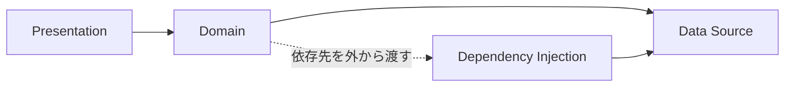

# Refactoring Module Dependencies

## 要約

プログラムが大きくなるにつれて、変更しやすさを保つにはモジュール分割が重要になります。
しかし、単に分けるだけでは不十分で、モジュール同士の依存関係をどう向けるかが設計上の大きな問題になります。

このページの原文では、小さなプログラムを題材に、プレゼンテーション、ドメイン、データの層へ分けながら依存関係を整理していきます。
その過程で、Service Locator や Dependency Injection といったパターンを使い、モジュール間の結合を弱める考え方が説明されています。

特に学びやすい点は、依存関係の向きを変えることが単なるコード整理ではなく、変更容易性やテスト容易性に直結する設計判断だと分かるところです。
アプリケーションアーキテクチャ、API設計、リファクタリングをつなげて学ぶ最初の題材として扱いやすい記事です。

## 読むときの観点

- モジュール分割は、責務だけでなく依存関係の向きも含めて考える。
- 層を分けても、上位層と下位層が強く結びつくと変更しづらさは残る。
- Service Locator と Dependency Injection は、依存先の取得方法を変えるための選択肢として比較できる。
- Java と JavaScript の違いよりも、依存関係を整理する考え方に注目する。

## 原文の翻訳

この記事は、モジュール間の依存関係を整理し、変更しやすい構造へリファクタリングする流れを説明します。単にファイルやクラスを分けるだけでは不十分で、**依存関係の向き**を整えなければ、変更の影響は広がり続けます。

原文では、プレゼンテーション、ドメイン、データソースのような関心を分けながら、どのモジュールがどのモジュールを知るべきかを検討します。ここで重要なのは、上位の方針やドメインロジックが、下位の詳細に引きずられないようにすることです。

Service Locator や Dependency Injection は、依存先をコード内部で直接作るのではなく、外から渡すための選択肢として扱われます。目的はパターン名を覚えることではなく、**依存先の決定をどこに置くか**を設計判断として扱えるようになることです。

### 概念図

draw.io で作成した図を使う場合は、`.drawio.svg` または `.png` としてエクスポートし、通常のMarkdown画像として配置します。
