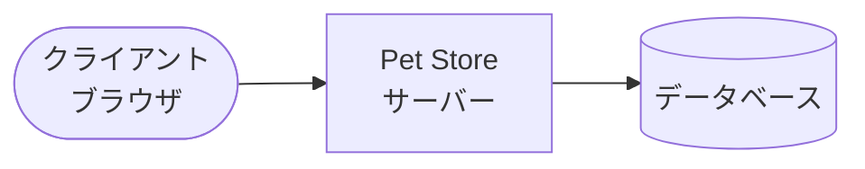
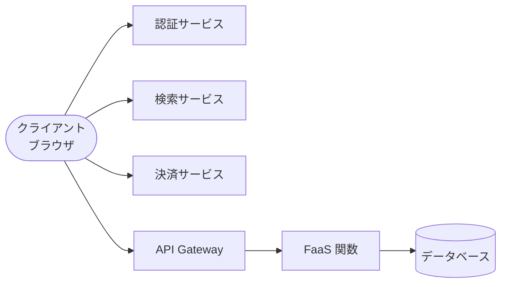
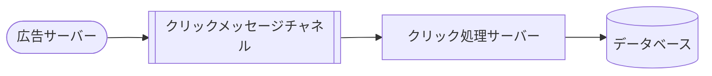
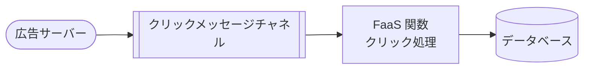

# Serverless Architectures

## 要約

サーバーレスアーキテクチャは、サードパーティの Backend as a Service (BaaS) と、Functions as a Service (FaaS) 上で動く短命な関数を組み合わせ、従来の「常時稼働する自前サーバー」の役割を小さくする設計です。サーバーが消えるわけではなく、**サーバー運用の責任境界が大きく変わる**点が重要です。

利点は、運用コスト、開発コスト、デプロイの手間、スケーリング管理を下げられる可能性にあります。一方で、ベンダーロックイン、監視とデバッグ、設定、テスト、セキュリティ、コールドスタートなど、成熟途上の実装上の難しさもあります。

読むときは、サーバーレスを単なるコスト削減策ではなく、チームの責任分担、アプリケーションの境界、フィードバックループを変えるアーキテクチャ上の選択として捉えると理解しやすくなります。

## 読むときの観点

- サーバーレスを「サーバーがない」ではなく「サーバー側の責任をどこへ移すか」として見る。
- BaaS と FaaS の違いを分けて考える。
- 関数分割、イベント駆動、状態管理がシステム全体の見通しに与える影響を見る。
- 運用負荷が減る一方で、監視、デバッグ、設定、セキュリティの難しさがどこへ移るかを確認する。
- 2018年時点の記事であるため、具体的な製品制約は現在の状況と照らし合わせて読む。

## 原文の翻訳

サーバーレスアーキテクチャとは、サードパーティの「Backend as a Service」(BaaS) サービスを取り入れる、あるいは「Functions as a Service」(FaaS) プラットフォーム上の管理された短命なコンテナで独自コードを実行する、そうしたアプリケーション設計のことです。これらの考え方や、シングルページアプリケーションのような関連する考え方を使うことで、この種のアーキテクチャは、従来の常時稼働するサーバーコンポーネントを必要とする場面を大きく減らします。サーバーレスアーキテクチャには、運用コスト、複雑さ、エンジニアリングのリードタイムを大きく下げられる可能性があります。その代償として、ベンダー依存が強まり、支援サービスがまだ比較的未成熟であることを受け入れる必要があります。

## サーバーレスとは何か

「サーバーレス」は多くの新しい概念と同じように、意味がぼんやりした単語です。まずは、この言葉をどう使うのかを定義しておきましょう。

サーバーレスは、主に二つの重なり合う領域を指します。

一つ目は、アプリケーションの一部または大部分を、クラウド上でホストされたサードパーティのサービスで置き換える形です。これらのサービスは、クライアントから直接呼び出されます。代表例は、モバイルアプリでよく見られる、Firebase のようなクラウドデータベースや認証サービスの利用です。このようなサービスは、以前は Mobile Backend as a Service と呼ばれ、現在はより広く BaaS と呼ばれます。

二つ目は、サーバー側のロジックの一部を、イベントによって起動されるステートレスな計算コンテナに移す形です。このコンテナは短時間だけ動き、利用者からは完全に管理されたものとして見えます。代表例は AWS Lambda です。この形は Functions as a Service、つまり FaaS と呼ばれます。

これら二つは別々に使うことも、一緒に使うこともできます。この記事では両方を扱いますが、特に後半では FaaS に重点を置きます。サーバーレスという言葉は人によって BaaS を指すことも FaaS を指すこともあるため、**どちらの意味で話しているのかを明確にすること**が大切です。

### 補足: 「サーバーレス」という言葉の起源

「サーバーレス」という用語は紛らわしいものです。この種のアプリケーションでも、どこかでサーバーハードウェアとサーバープロセスは動いています。通常のやり方との違いは、「サーバーレス」アプリケーションを作り支える組織が、そのハードウェアやプロセスの面倒を見ていないことです。その責任を誰か別の人たちに委ねています。

この言葉の初期の使用例は、2012年頃に現れたようです。その頃、Ken Fromm の記事などで使われていました。Badri Janakiraman は、同じ頃に継続的インテグレーションやソース管理システムを会社の自前サーバーではなくサービスとしてホストする文脈でも、この言葉を聞いたと言っています。ただし、この二つ目の用法は開発チームのインフラ、つまりソフトウェアチームが使う道具についてのものでした。現在サーバーレスと言うときに私たちが意味しがちな、開発チームが作る実際のプロダクトに外部サービスを組み込むという意味とは少し違います。

この用語は、2014年の AWS Lambda のローンチ後、2015年により一般的になりました。さらに2015年7月に Amazon API Gateway が登場した後、人気が高まりました。2015年10月には Amazon re:Invent で、AWS Lambda を使う PlayOn! Sports を指して「The Serverless Company using AWS Lambda」という講演がありました。2015年末にかけて、「Javascript Amazon Web Services (JAWS)」というオープンソースプロジェクトが Serverless Framework に改名したことも、この流れを後押ししました。

2016年半ばには、Serverless はこの領域を表す支配的な名前になっていました。Serverless Conference シリーズが生まれ、さまざまなサーバーレスベンダーが製品マーケティングから求人票に至るまでこの言葉を受け入れました。用語としての Serverless は定着したのです。

この記事では、主に FaaS に焦点を当てます。FaaS はサーバーレスの中でも新しく、多くの期待を集めている領域であるだけでなく、私たちが技術アーキテクチャを考える通常の方法と大きく異なるからです。

BaaS と FaaS は、リソース管理が不要になるといった運用上の性質で関連しており、頻繁に一緒に使われます。大手クラウドベンダーはいずれも、BaaS と FaaS の両方を含む「サーバーレスポートフォリオ」を持っています。Google の Firebase BaaS データベースは、Google Cloud Functions for Firebase によって明示的な FaaS サポートを持っています。

小さな会社でも、この二つの領域を結びつける動きがあります。Auth0 はユーザー管理の多くの側面を実装する BaaS 製品から始まり、その後、補完的な FaaS サービスである Webtask を作りました。同社はこの考えをさらに進め、ほかの SaaS や BaaS 企業が既存製品へ FaaS 能力を簡単に追加し、統一されたサーバーレス製品を作れるようにする Extend も提供しています。

## いくつかの例

説明を始めるにあたり、一般的なサーバー側アーキテクチャからサーバーレスアーキテクチャへどのように移れるかを、二つの例で見ていきます。一つは UI 駆動のアプリケーション、もう一つはメッセージ駆動のアプリケーションです。

### UI 駆動のアプリケーション

従来の三層クライアント指向システムを考えてみます。たとえばペット用品を扱うオンライン店舗です。ここでは、ブラウザ上のクライアント、サーバー、データベースがあります。サーバーは HTTP リクエストを受け、ビジネスロジックを実行し、データベースとやり取りし、レスポンスを返します。

このアーキテクチャをサーバーレス化する一つのやり方は、認証、検索、注文、決済などを、個別の外部サービスに分けていくことです。たとえばログインには BaaS の認証サービスを使い、購入には決済サービスを使い、検索にはクラウド検索サービスを使います。クライアントはそれらのサービスと直接やり取りし、必要な独自ロジックだけを FaaS 関数として実行します。

この形では、単一のサーバーアプリケーションが担っていた多くの責務が分散します。クライアントは以前より賢くなり、バックエンドは、外部サービスと小さな関数の組み合わせになります。これはサーバーがないという意味ではありません。サーバーは存在します。ただし、チームが直接管理するサーバーの量が減り、**管理責任がクラウドプロバイダーやサービス提供者へ移る**という意味です。

### メッセージ駆動のアプリケーション

二つ目の例は、広告クリックの処理です。従来は、広告サーバーがクリックイベントを受け取り、そのイベントをキューやメッセージチャネルに入れ、クリック処理サーバーがそれを読み取ってデータベースへ保存していました。

サーバーレス版では、メッセージチャネルの新しいイベントが FaaS 関数を起動します。クリック処理サーバーという常時稼働コンポーネントはなくなり、クリックごと、あるいはイベントのまとまりごとに関数が起動されます。

この変更は小さく見えますが、運用モデルには大きな違いがあります。以前は処理サーバーをプロビジョニングし、監視し、スケールさせる必要がありました。FaaS では、メッセージが来たときだけ実行基盤が関数を起動し、必要な数だけ並列に実行します。

### FaaS を分解してみる

FaaS は、単に小さな関数を書くというだけのものではありません。ここには、実行モデル、状態、起動時間、API Gateway、ツール、オープンソース実装など、いくつかの重要な性質があります。

FaaS 関数は通常、イベントに反応して実行されます。HTTP リクエスト、メッセージキューのイベント、ファイルのアップロード、データベース更新、スケジュールイベントなどがトリガーになります。関数は短時間だけ実行され、結果を返すか、別のサービスに副作用を起こして終了します。

#### 状態

FaaS 関数はステートレスであることが基本です。もちろん、実行中のメモリに一時的な状態を持つことはできます。しかし、次回同じ関数が呼ばれたときに同じ実行環境が使われるとは限りません。関数同士で共有したい状態は、データベース、オブジェクトストレージ、キャッシュ、メッセージングシステムなど外部サービスに置きます。

この制約は、従来のサーバーアプリケーションでよく使われるプロセス内キャッシュやセッション状態に影響します。FaaS では、状態の置き場所をより明示的に設計する必要があります。**サーバー内状態に頼らない設計**は、スケールしやすさの源泉である一方、設計と性能最適化の難しさにもなります。

#### 実行時間

FaaS 関数には、実行時間の上限があります。初期の AWS Lambda では短い上限があり、その後上限は伸びましたが、いずれにせよ長時間走り続ける処理には向きません。長い処理は分割したり、ワークフローサービスやキューを使ったり、従来型の処理基盤を併用したりする必要があります。

この制約は欠点であると同時に、設計上のシグナルでもあります。関数が長時間走るなら、その処理は FaaS に向いていないか、分割の仕方を見直すべきかもしれません。

#### 起動遅延とコールドスタート

FaaS の重要な話題にコールドスタートがあります。関数がしばらく使われていないと、プラットフォームは新しい実行環境を作る必要があります。この初回起動には追加の遅延が発生します。遅延は言語、依存ライブラリ、関数の大きさ、プラットフォームの状態に左右されます。

この遅延は、バックグラウンド処理では問題になりにくいことがあります。しかし、ユーザーが待っている HTTP リクエストの処理では体感品質に影響します。したがって、レイテンシに敏感な処理では、プラットフォームの性質を測定し、受け入れられる範囲かどうかを判断する必要があります。

#### API Gateway

HTTP 経由で FaaS 関数を呼び出す場合、多くのプラットフォームでは API Gateway のようなサービスを使います。API Gateway は、ルーティング、認証、レート制限、リクエスト変換、レスポンス変換などを担当します。

API Gateway は便利ですが、構成が複雑になりがちです。特に、Gateway 側に多くのロジックを入れすぎると、アプリケーションの振る舞いがコードと設定の間に散らばります。Gateway は強力な道具ですが、**アプリケーションロジックを見えにくくする場所にもなりうる**ことに注意が必要です。

#### ツール

FaaS のツールは、2018年時点ではまだ成熟途上です。ローカル実行、デプロイ、ログ収集、監視、バージョニング、権限設定などを扱うツールはありますが、従来のアプリケーションフレームワークや運用ツールほど安定した共通理解はまだありません。

この分野では、Serverless Framework、AWS SAM、クラウドベンダーの CLI や管理コンソールなどが使われます。ツール選びは、開発体験と運用体験の両方に大きく影響します。

#### オープンソース

FaaS はクラウドベンダーの提供するサービスだけではありません。オープンソースの FaaS 実装も登場しています。これらは、オンプレミスやプライベートクラウドで FaaS 風の開発モデルを使いたい組織にとって重要です。

ただし、FaaS の価値の多くは、単に関数を実行できることではなく、実行環境、スケーリング、イベント連携、ログ、監視、権限管理などが統合されていることにあります。オープンソース実装を使う場合は、その統合のどこを自分たちで担うのかを理解する必要があります。

### サーバーレスではないもの

「サーバーレス」という言葉は広く使われるようになったため、似ているが違うものとの比較も必要です。

#### PaaS との比較

Platform as a Service (PaaS) は、アプリケーションをデプロイすると基盤側がサーバーやランタイムを管理してくれる仕組みです。Heroku や Cloud Foundry などが代表例です。PaaS とサーバーレスは、どちらも運用負荷を下げる点で似ています。

違いは粒度と実行モデルです。PaaS では通常、アプリケーションプロセスが常時稼働します。FaaS では、イベントが来たときに関数が起動し、短時間で終了します。BaaS では、そもそもアプリケーションの一部機能を外部サービスに委ねます。

#### コンテナとの比較

コンテナは、アプリケーションと依存関係をまとめて実行するための仕組みです。Docker や Kubernetes は、アプリケーションの配布、実行、スケーリング、オーケストレーションを支援します。

FaaS の実行基盤の内部では、コンテナ技術が使われていることもあります。しかし、利用者の体験は異なります。コンテナを使う場合、チームは通常、イメージ、クラスタ、スケーリング、ネットワーク、デプロイの多くを考えます。FaaS では、それらの多くがプラットフォームの責務になります。したがって、コンテナとサーバーレスは競合するだけでなく、重なり合い、組み合わせて使われることもあります。

#### #NoOps

サーバーレスはしばしば #NoOps と関連づけられます。しかし、運用が不要になるわけではありません。サーバーのパッチ適用や OS 管理は減るかもしれませんが、監視、障害対応、容量やコストの把握、セキュリティ、デプロイ、ログ、アラート、インシデント対応は残ります。

むしろ、運用の焦点が変わると考えるべきです。従来のサーバー管理から、サービス間の契約、クラウド設定、可観測性、障害時の切り分けへと移ります。**NoOps ではなく DifferentOps** と見るのが現実的です。

#### Stored Procedures as a Service

FaaS を見ると、データベースのストアドプロシージャに似ていると思う人もいるでしょう。どちらも、アプリケーションコードの一部を外部の実行環境へ移します。しかし FaaS は、より汎用的なイベント、より広いクラウドサービス連携、より独立したデプロイ単位を持ちます。

とはいえ、過去のストアドプロシージャの経験から学ぶべき点はあります。ロジックが見えにくい場所へ散らばると、理解、テスト、バージョン管理が難しくなります。FaaS でも同じ罠を避ける必要があります。

## 利点

サーバーレスには、多くの魅力的な利点があります。ただし、それらは自動的に得られるものではありません。どの利点が本当に得られるかは、アプリケーションの性質、チームのスキル、プラットフォームの成熟度によって変わります。

### 運用コストの削減

サーバーレスのもっとも分かりやすい利点は、運用コストの削減です。BaaS では、認証、データ保存、検索、通知、決済などを専門サービスに任せられます。FaaS では、関数を実行するためのサーバーを自分で管理する必要がありません。

これは、単にインフラ料金が安くなるという話ではありません。OS パッチ、プロセス監視、クラスタ管理、キャパシティ計画、デプロイ基盤の保守など、チームが行っていた作業が減ります。とくに小さなチームでは、この効果は大きくなります。

ただし、運用作業がゼロになるわけではありません。クラウド設定、権限管理、ログ、アラート、障害対応、コスト管理は依然として必要です。サーバーレスは、**運用コストをなくすのではなく、別の種類の運用へ置き換える**ものです。

### BaaS: 開発コストの削減

BaaS は開発コストも下げます。よくある機能を自分たちで作らず、既存サービスを利用できるからです。たとえば、ユーザー管理、ログイン、パスワードリセット、ソーシャルログイン、リアルタイム同期、ファイル保存などは、多くのアプリケーションで共通しています。

これらを外部サービスに任せることで、チームは差別化につながる機能に集中できます。もちろん、BaaS の API やデータモデルにアプリケーションが縛られるため、将来の柔軟性とのトレードオフがあります。

### FaaS: スケーリングコスト

FaaS の料金モデルは、多くの場合、関数が実際に実行された回数や時間に基づきます。そのため、使用頻度が低い処理では、常時稼働サーバーより安くなることがあります。

#### 例: ときどきしか来ないリクエスト

たとえば、管理用の小さな処理や、月に数回だけ走るバッチ処理を考えます。従来なら、その処理のためにサーバーを常時動かすか、既存サーバーに相乗りさせる必要がありました。FaaS なら、処理が必要なときだけ課金されます。

これは、ピーク時の容量ではなく実際の使用量に近い形で支払えることを意味します。頻度が低い処理ほど、この利点は大きくなります。

#### 例: ばらつきの大きいトラフィック

アクセス量が大きく変動するシステムでも FaaS は有利になることがあります。従来のサーバーでは、ピークに備えて余裕を持った容量を用意する必要があります。FaaS では、イベント数に応じてプラットフォームが関数の並列実行数を増減させます。

このような負荷では、常時稼働サーバーの固定費より、使った分だけ支払う FaaS の方がコスト効率がよい場合があります。

#### コスト削減の一部は最適化から来る

一方で、FaaS のコスト削減は魔法ではありません。処理時間、メモリサイズ、呼び出し回数、外部サービス呼び出し、ログ量などが積み重なれば、費用は増えます。

また、関数を細かく分けすぎると、ネットワーク呼び出しやイベント連携が増え、性能とコストの両方に影響します。FaaS のコストを抑えるには、実行時間を短くし、不要な呼び出しを減らし、適切な粒度で関数を設計する必要があります。つまり、**最適化は依然として重要**です。

### 運用管理の容易さ

サーバーレスでは、サーバーやランタイムを直接管理する場面が減ります。関数をデプロイすれば、プラットフォームが実行環境を用意し、必要に応じてスケールさせます。これにより、チームはアプリケーションの振る舞いに集中しやすくなります。

#### インフラ費用を超えた FaaS のスケーリング利点

FaaS のスケーリング利点は、費用だけではありません。スケーリングのための作業そのものが減ります。従来なら、キューの深さを見てワーカー数を調整したり、ピークに備えて自動スケーリングを調整したりしていました。

FaaS では、イベント数が増えれば関数の同時実行数が増えます。もちろん制限やスロットリングはありますが、基本的なスケーリングモデルはプラットフォームに委ねられます。

#### パッケージングとデプロイの複雑さの削減

FaaS 関数は、従来のアプリケーションサーバーより小さな単位でデプロイされることが多くなります。小さな関数を独立してデプロイできれば、変更の影響範囲を小さくできます。

ただし、関数が増えると、逆にデプロイ単位の管理は難しくなります。複数の関数、API Gateway、権限、イベントソース、データベースを一貫してデプロイする仕組みが必要です。ここでもツールの成熟度が重要になります。

#### 市場投入までの時間と継続的な実験

サーバーレスの大きな価値は、新しいアプリケーションコンポーネントを素早く作り、ユーザーへ届けられることです。サーバーを用意し、デプロイ基盤を整え、運用手順を作る前に、小さな関数や BaaS を組み合わせて試せます。

これはリーンな開発の考え方と相性がよく、早くフィードバックを得る助けになります。サーバーレスによって、チームは実験を小さく始め、うまくいくものに投資しやすくなります。

### より環境にやさしいコンピューティングか

FaaS は、使われていないときにリソースを消費しにくいモデルです。常時稼働サーバーを低負荷で動かし続けるより、必要なときだけ計算資源を使う方が、全体として効率がよい可能性があります。

もちろん、これはプラットフォームの実装やデータセンター全体の利用効率に依存します。単純に「サーバーレスだから環境にやさしい」とは言えません。しかし、利用されていない容量を減らす方向に働くという点で、興味深い可能性があります。

## 欠点

サーバーレスには魅力がありますが、欠点も多くあります。いくつかはサーバーレスという考え方に内在するものであり、いくつかは現在の実装が未成熟であることから来ます。

### 内在的な欠点

#### ベンダーによる制御

サーバーレスでは、実行環境やサービスの大部分をベンダーに委ねます。これは、ベンダーが機能、制限、価格、障害対応、地域展開、セキュリティモデルを決めるということです。

この制御は利点でもあります。自分たちで管理しないからこそ運用負荷が下がります。しかし、重要な部分を他者に任せる以上、そのベンダーを信頼できるか、サービス変更に対応できるかを考える必要があります。

#### マルチテナンシーの問題

サーバーレスプラットフォームは多くの場合、複数の利用者が同じ基盤を共有します。これにより、隣の利用者の負荷やプラットフォーム内部の制御が、自分たちのアプリケーションに影響する可能性があります。

クラウドベンダーはこの問題を隠蔽しようとしますが、完全に消えるわけではありません。レイテンシのばらつき、コールドスタート、同時実行制限などとして現れることがあります。

#### ベンダーロックイン

BaaS でも FaaS でも、ベンダーロックインは重要な懸念です。BaaS ではデータモデルや API がサービス固有になります。FaaS ではイベント形式、権限モデル、デプロイ方法、監視方法、周辺サービスとの連携がベンダーごとに異なります。

ロックインを完全に避けようとすると、サーバーレスの利点を失うことがあります。重要なのは、ロックインを恐れて何もしないことではなく、**どの依存を受け入れる価値があるかを明示的に判断する**ことです。

#### セキュリティ上の懸念

サーバーレスでは、攻撃対象が変わります。サーバー管理の一部はベンダーに移りますが、権限設定、イベントソース、API Gateway、外部サービス連携、秘密情報の管理など、新しい注意点が増えます。

関数ごとに権限を細かく設定できることは利点です。しかし、関数数が増えると権限設定の複雑さも増します。過剰な権限を与えないこと、設定をコードとして管理すること、ログに秘密情報を出さないことなどが重要です。

#### クライアントプラットフォーム間でのロジック重複

BaaS を多用すると、以前はサーバー側にあったロジックがクライアント側へ移ることがあります。Web、iOS、Android など複数のクライアントがある場合、同じロジックを複数箇所に実装する危険があります。

この重複は、整合性の問題やバグを生みます。共通ロジックを FaaS に置く、API 層を残す、クライアント側の責務を慎重に決めるなどの設計が必要です。

#### サーバー最適化の喪失

従来のサーバーアプリケーションでは、プロセス内キャッシュ、接続プール、バッチ処理、リクエスト間の共有状態などで性能を最適化できます。FaaS では、これらが制限されます。

一部の実行環境はウォーム状態を再利用することがありますが、それを前提にしてはいけません。状態やキャッシュを外部化すると、ネットワーク呼び出しが増え、遅延とコストに影響します。

#### Serverless FaaS にはサーバー内状態がない

FaaS の関数は、呼び出しごとに独立したものとして考える必要があります。プロセス内の状態を信頼できないため、セッション、ワークフロー、キャッシュ、集計などは外部サービスに置く必要があります。

この制約はシンプルさを生む一方、状態を扱うアプリケーションでは設計を難しくします。FaaS を使うときは、状態をどこに置き、どの整合性を期待するのかを早い段階で決める必要があります。

### 実装上の欠点

#### 設定

サーバーレスアプリケーションでは、コードだけでなく大量の設定が重要になります。関数、イベントソース、権限、API Gateway、環境変数、データベース、キュー、監視、アラートなどが互いに関係します。

設定が手作業やコンソール操作に散らばると、再現性が失われます。したがって、Infrastructure as Code やデプロイツールを使い、設定をバージョン管理することが重要です。

#### 自分自身を DoS してしまう

FaaS は自動的にスケールするため、誤ったイベント連携や無限ループによって、大量の関数実行が発生することがあります。これは、コストの急増や下流サービスへの過負荷を引き起こします。

たとえば、関数がデータを保存し、その保存イベントが同じ関数を再び起動するような構成は危険です。レート制限、同時実行制限、アラート、テスト環境での検証が必要です。

#### 実行時間

先に述べた通り、FaaS には実行時間の制限があります。長い処理、ストリーミング、常時接続、重いバッチ処理などには向かない場合があります。

この制限はプラットフォームの進化で緩和されるかもしれませんが、FaaS の本質は短命な関数です。長時間処理を無理に FaaS 化するより、別の実行基盤を使う方がよいことがあります。

#### 起動遅延

コールドスタートは、実装上の大きな課題です。関数が頻繁に呼ばれていればウォームな実行環境が再利用されることがありますが、それは保証ではありません。

起動遅延は、ユーザー向け API、リアルタイム処理、レイテンシに厳しいサービスで問題になります。言語選択、依存関係の削減、関数の分割、ウォームアップ戦略などが対策になりますが、根本的にはプラットフォームの性質を理解して設計する必要があります。

#### テスト

FaaS のテストは、ユニットテストだけなら比較的簡単です。関数を通常の関数として呼び出し、入力と出力を検証できます。

難しいのは、イベントソース、権限、API Gateway、外部サービス、デプロイ設定を含む統合テストです。ローカル環境で完全に再現できない場合も多く、クラウド上のテスト環境が必要になります。サーバーレスでは、**コードとクラウド設定を一緒にテストする**意識が重要です。

#### デバッグ

FaaS のデバッグは従来のサーバーより難しいことがあります。ローカルでステップ実行できても、本番のイベント、権限、ネットワーク、レイテンシ、周辺サービスの状態は再現しにくいからです。

そのため、ログ、相関 ID、分散トレース、メトリクスが重要になります。障害時に何が起きたかを追えるよう、関数ごとのログだけでなく、システム全体の流れを見えるようにする必要があります。

#### デプロイ、パッケージング、バージョニング

関数が増えると、デプロイとバージョニングの問題が出てきます。どの関数がどのバージョンの API Gateway、どのキュー、どの権限設定と対応しているのかを管理する必要があります。

単一の関数だけを更新できることは利点ですが、関連する関数群を原子的に更新したい場面もあります。デプロイ戦略、ロールバック、環境分離、バージョン固定を設計しておく必要があります。

#### 発見

多くの関数があると、どの関数がどのイベントに反応し、どのサービスを呼び、どのデータを更新するのかを把握しにくくなります。これはシステム理解の問題です。

関数名、タグ、ドキュメント、アーキテクチャ図、デプロイ定義、観測ツールが重要になります。関数を小さくするだけでは、システムが理解しやすくなるとは限りません。

#### 監視と可観測性

サーバーレスでは、監視と可観測性が特に重要です。関数は短命で、多数のサービスをまたいで動きます。単一サーバーの CPU やメモリを見るだけでは不十分です。

必要なのは、リクエストやイベントがどこを通り、どこで遅くなり、どこで失敗したかを追えることです。ログ、メトリクス、トレース、アラート、ダッシュボードを組み合わせる必要があります。

#### API Gateway 定義と野心的すぎる API Gateway

API Gateway は便利ですが、過剰に使うと複雑になります。リクエスト変換、レスポンス変換、認証、認可、バリデーション、ルーティングなどを Gateway に詰め込みすぎると、動作の理解と変更が難しくなります。

Gateway は境界として有効ですが、アプリケーションの中心的なロジックを隠す場所にしてはいけません。どのロジックを Gateway に置き、どのロジックを関数やサービスに置くかを意識的に決める必要があります。

#### 運用の先送り

サーバーレスは、初期の運用作業を大きく減らします。そのため、監視、アラート、ログ、障害対応、セキュリティレビュー、コスト管理といった運用の設計を後回しにしがちです。

しかし、本番で使うならこれらは必ず必要になります。サーバーレスでは、最初に動くものを作るのは簡単でも、信頼できる本番システムにするには運用設計が必要です。

## サーバーレスの未来

サーバーレスはまだ若い分野です。2018年時点では、サービスもツールも実践パターンも成熟途上にあります。しかし、進化の速度は速く、今後多くの改善が期待できます。

### 欠点の緩和

#### ツール

ツールは今後も改善されるでしょう。ローカル開発、デプロイ、統合テスト、監視、トレース、権限管理、コスト管理など、サーバーレス特有の難しさを扱うツールが増えています。

よいツールは、サーバーレスの複雑さを隠すだけでなく、見えるようにもします。関数、イベント、サービス、権限の関係を理解しやすくすることが重要です。

#### 状態管理

状態管理も重要な発展領域です。FaaS はステートレスを基本としますが、現実のアプリケーションにはワークフロー、セッション、集計、長い処理があります。

Durable Functions のような仕組みや、イベントソーシング、ワークフローエンジン、状態付きサービスとの連携が、この問題を緩和します。FaaS の単純な関数モデルを超え、状態を扱いやすくする抽象化が増えるでしょう。

#### プラットフォームの改善

コールドスタート、実行時間制限、監視、デプロイ、権限設定など、現在の不便さの多くはプラットフォーム改善で緩和される可能性があります。たとえば、低レイテンシで常に利用できる関数インスタンスを一定数確保し、その分を支払うような仕組みも考えられます。

もちろん、欠点を埋めるだけでなく、新しい能力も増えるでしょう。サーバーレスの面白さは、基盤の進化がアプリケーション設計の選択肢を増やすところにもあります。

#### 教育

サーバーレスの内在的な欠点の多くは、教育によって緩和できます。こうしたプラットフォームを使う人は、自分たちのエコシステムの多くを一つまたは複数のアプリケーションベンダーにホストしてもらうことの意味を考える必要があります。あるベンダーが使えなくなったときに別ベンダーの並行解を考えるのか、部分障害のときにアプリケーションをどう劣化させるのか、といった問いです。

もう一つの教育領域は技術運用です。多くのチームでは以前よりシステム管理者が少なくなっており、サーバーレスはこの変化を加速させます。しかしシステム管理者は Unix マシンや Chef スクリプトを設定するだけではありません。サポート、ネットワーク、セキュリティなどの最前線にいることも多いのです。

真の DevOps 文化は、サーバーレスの世界でさらに重要になります。なぜなら、システム管理者以外の活動は依然として必要であり、それを開発者が担うことが増えるからです。多くの開発者や技術リーダーにとって、それらは自然に身につくものではありません。したがって、教育と運用担当者との密な協力が非常に重要です。

#### ベンダーの透明性と期待値の明確化

最後に、ベンダーは、利用者が自分たちのプラットフォームにどのような期待を持てるのかを、これまで以上に明確にする必要があります。私たちがホスティング能力の多くをベンダーに依存するようになるからです。

プラットフォーム移行は難しいですが、不可能ではありません。信頼できないベンダーは、顧客が別の場所へ移るのを見ることになるでしょう。

### パターンの出現

サーバーレスアーキテクチャをどのように、いつ使うべきかについての理解は、まだ初期段階です。今は多くのチームがさまざまなアイデアをサーバーレスプラットフォームに投げ込み、何がうまくいくかを試しています。先駆者たちに感謝です。推奨される実践パターンが見え始めており、この知識は今後さらに増えていくでしょう。

アプリケーションアーキテクチャのパターンも見え始めています。たとえば、FaaS 関数はどこまで大きくなると扱いにくくなるのか。FaaS 関数群を原子的にデプロイできるとして、そのグループ化のよい方法は何か。それは現在マイクロサービスにロジックをまとめる方法と近いのか、それともアーキテクチャの違いが別の方向へ導くのか。

特に興味深い議論は、サーバーレスアプリケーションアーキテクチャとイベント思考の関係です。イベントをどう表現し、どう流し、どう反応するかは、サーバーレスの設計で中心的なテーマになっています。

さらに進めると、FaaS と従来の常時稼働する永続的サーバーコンポーネントを組み合わせたハイブリッドアーキテクチャをどう作るべきでしょうか。既存のエコシステムに BaaS を導入するよい方法は何でしょうか。逆に、完全または大部分が BaaS のシステムで、より多くの独自サーバー側コードを使い始めるべき兆候は何でしょうか。

利用パターンも増えています。FaaS の標準的な例の一つはメディア変換です。たとえば、大きなメディアファイルが S3 バケットに保存されたら、自動的に処理を走らせ、小さい版を別のバケットに作るというものです。しかし現在では、データ処理パイプライン、高スケールな Web API、運用上の汎用的な「接着剤」コードとしてもサーバーレスが使われています。

最後に、ツールが改善するにつれて、運用パターンも見え始めています。FaaS、BaaS、従来サーバーを組み合わせたハイブリッドアーキテクチャでログを論理的にどう集約するか。FaaS 関数をどう効果的にデバッグするか。これらの答えや新しいパターンの多くはクラウドベンダー自身からも出てきており、この領域の活動は増えていくでしょう。

### グローバルに分散したアーキテクチャ

先ほどのペットストアの例では、単一の Pet Store サーバーが複数のサーバー側コンポーネントへ分かれ、一部のロジックはクライアントへ移りました。しかし根本的には、クライアント、または既知の場所にあるリモートサービスを中心にしたアーキテクチャでした。

サーバーレスの世界で今見え始めているのは、責任の配置がもっと曖昧になることです。例として、Amazon の Lambda@Edge があります。これは Amazon の CloudFront CDN の中で Lambda 関数を実行する方法です。Lambda@Edge では、Lambda 関数がグローバルに分散されます。エンジニアが一度アップロードすると、その関数は世界中の多数のデータセンターへデプロイされます。これは私たちが慣れている設計ではなく、多くの制約と能力を伴います。

さらに、Lambda 関数はデバイス上でも実行でき、機械学習モデルはモバイルクライアント上でも実行できます。気づけば、「クライアント側」と「サーバー側」の二分法はあまり意味を持たなくなります。実際には、人間のユーザーを中心に広がる、コンポーネントの局所性のスペクトルを見ることになります。サーバーレスは Regionless になっていくでしょう。

### 「FaaS 化」を超えて

私がこれまで見てきた FaaS の多くの使い方は、既存のコードや設計の考え方を「FaaS 化」すること、つまりステートレスな関数群に変換することが中心でした。これは強力ですが、今後は FaaS を基盤実装として使いながら、開発者には離散的な関数の集合として考えさせない抽象化や言語が増えていくと予想します。

たとえば、Google の Dataflow が内部で FaaS 実装を使っているかどうかは知りません。しかし、似たようなことをする製品やオープンソースプロジェクトを誰かが作り、FaaS を実装基盤にすることは想像できます。比較対象として Apache Spark のようなものがあります。Spark は大規模データ処理の道具であり、Amazon EMR や Hadoop のような基盤を使いながら、高レベルの抽象化を提供します。

### テスト

サーバーレスシステムの統合テストと受け入れテストには、まだ取り組むべきことが多いと思います。ただし、その多くは、より従来型の方法で開発されたクラウドネイティブなマイクロサービスシステムと同じ課題でもあります。

ここでの急進的な考え方の一つは、本番でのテストや、監視駆動開発のようなアイデアを受け入れることです。コードが基本的なユニットテストを通過したら、トラフィックの一部にデプロイし、前のバージョンと比べてどうかを見るのです。これは先に述べたトラフィックシフトの道具と組み合わせられます。すべての文脈で使えるわけではありませんが、多くのチームにとって驚くほど効果的な道具になりえます。

### ポータブルな実装

チームがサーバーレスを使いながら、特定のクラウドベンダーへの結びつきを弱める方法はいくつかあります。

#### ベンダー実装の上に抽象化を置く

Serverless Framework は主にサーバーレスアプリケーションの運用作業を容易にするために存在しますが、どこに、どのようにデプロイするかについて、ある程度の中立性も提供します。たとえば、それぞれのプラットフォームの運用能力に応じて、AWS API Gateway + Lambda と Auth0 webtask の間を簡単に切り替えられれば便利でしょう。

難しい点は、標準化の考えなしに抽象的な FaaS コーディングインターフェースをモデル化することです。しかし、それこそが CNCF Serverless Working Group の CloudEvents で扱われている領域です。

もっとも、運用の複雑さが表に出てくると、複数プラットフォーム向けのデプロイ抽象化にどれほど価値があるかは疑問です。たとえば、あるクラウドでセキュリティを正しく扱う方法は、別のクラウドではほぼ確実に違います。

#### デプロイ可能な実装

サードパーティプロバイダーを使わずにサーバーレス技法を使うと言うと奇妙に聞こえるかもしれません。しかし、次のような状況を考えてみてください。

- 大規模な技術組織で、すべてのモバイルアプリ開発チームに Firebase のようなデータベース体験を提供したい。しかし、バックエンドには既存のデータベースアーキテクチャを使いたい。
- いくつかのプロジェクトでは FaaS 風のアーキテクチャを使いたいが、コンプライアンスや法務などの理由でアプリケーションはオンプレミスで動かす必要がある。

どちらの場合でも、ベンダーホスティングによる利点は得られないとしても、サーバーレスアプローチの多くの利点は残ります。ここには前例があります。Platform as a Service (PaaS) を考えてみてください。初期の人気ある PaaS は Heroku のようにクラウドベースでしたが、かなり早い段階で、人々は PaaS 環境を自分たちのシステム上で動かす利点を見出しました。いわゆるプライベート PaaS、たとえば Cloud Foundry です。

プライベート PaaS 実装と同じように、BaaS や FaaS の概念を実装したオープンソースや商用製品が人気になることは想像できます。特に Kubernetes のようなコンテナプラットフォームと統合されたものがそうです。

### コミュニティ

サーバーレスにはすでに十分な規模のコミュニティがあります。複数のカンファレンス、多くの都市でのミートアップ、さまざまなオンラインコミュニティがあります。この成長は今後も続くでしょう。Docker や Spring のようなコミュニティと似た流れになると思います。

## 結論

サーバーレスは、名前こそ紛らわしいものの、アプリケーションの一部として自分たちのサーバー側システムを動かす度合いを、通常より小さくするアーキテクチャのスタイルです。これを二つの技法で行います。一つは BaaS で、サードパーティのリモートアプリケーションサービスをアプリケーションのフロントエンドに密に統合します。もう一つは FaaS で、サーバー側コードを長時間稼働するコンポーネントから短命な関数インスタンスへ移します。

サーバーレスは、すべての問題に対して正しい方法ではありません。したがって、既存のすべてのアーキテクチャを置き換えると言う人には注意してください。今サーバーレスシステムに踏み込むなら、特に FaaS の領域では慎重であるべきです。スケーリングやデプロイ作業削減という宝はありますが、デバッグや監視という危険もすぐ近くに潜んでいます。

とはいえ、その宝を早々に退けるべきではありません。サーバーレスアーキテクチャには、運用コストと開発コストの削減、運用管理の容易化、環境負荷の低減など、重要な肯定的側面があります。しかし、もっとも重要な利点は、新しいアプリケーションコンポーネントを作るフィードバックループを短くできることだと思います。私はリーンなアプローチの大きな支持者です。なぜなら、早い段階でエンドユーザーの前に技術を置き、早期のフィードバックを得ることには大きな価値があると考えているからです。サーバーレスがもたらす市場投入までの時間短縮は、この考え方によく合っています。

サーバーレスサービスと、それをどう使うかについての私たちの理解は、今日、つまり2018年5月時点では、成熟度で言えば「少しぎこちない十代」の段階にあります。今後数年でこの分野には多くの進歩があるでしょう。そして、サーバーレスが私たちのアーキテクチャ上の道具箱にどう収まっていくのかを見るのは、とても興味深いことになるはずです。
